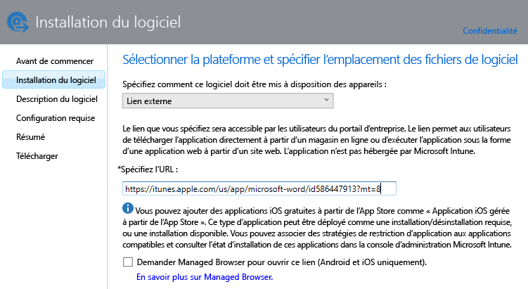
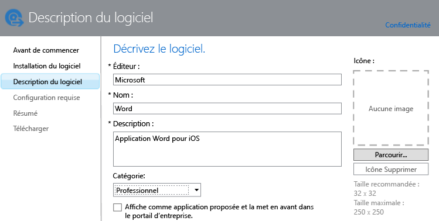

---
# required metadata

title: Ajouter des applications pour des appareils mobiles | Microsoft Intune
description:
keywords:
author: robstackmsft
manager: jeffgilb
ms.date: 04/28/2016
ms.topic: article
ms.prod:
ms.service: microsoft-intune
ms.technology:
ms.assetid: f5b1f1ae-f177-450a-9af9-936a02d052e3

# optional metadata

#ROBOTS:
#audience:
#ms.devlang:
ms.reviewer: jeffgilb
ms.suite: ems
#ms.tgt_pltfrm:
#ms.custom:

---

# Ajouter des applications pour des appareils mobiles dans Microsoft Intune

Cette rubrique montre comment ajouter des applications à Intune avant de les déployer.

> [!IMPORTANT]
> Les informations contenues dans cette rubrique vous aident à ajouter des applications que vous souhaitez déployer vers des appareils inscrits et des PC Windows inscrits. Si vous souhaitez ajouter des applications pour des PC Windows que vous gérez à l’aide du logiciel client Intune, consultez [Ajouter des applications pour des PC Windows dans Microsoft Intune](add-apps-for-windows-pcs-in-microsoft-intune.md).

## Ajouter l’application
Vous utilisez l’Éditeur de logiciel Microsoft Intune pour configurer les propriétés de l’application et, le cas échéant, effectuer son chargement vers votre espace de stockage cloud. Voici la procédure à suivre :

1.  Dans la [console d’administration Microsoft Intune](https://manage.microsoft.com), cliquez sur **Applications** &gt; **Ajouter des applications** pour démarrer l’Éditeur de logiciel Microsoft Intune.

    > [!TIP]Vous devez peut-être entrer votre nom d’utilisateur et votre mot de passe Intune avant le démarrage de l’éditeur.

2.  Dans la page **Installation du logiciel** de l’Éditeur de logiciel, choisissez l’une des options suivantes pour **Spécifier comment ce logiciel doit être mis à disposition des appareils** :
    - **Programme d’installation du logiciel**, pour les applications avec l’extension **.msi** ou **.exe**, spécifiez :
        - **Sélectionnez le type de fichier du programme d’installation du logiciel** : indique le type de logiciel à déployer. Par exemple, si vous souhaitez installer une application iOS, sélectionnez **Package d’application pour iOS (fichier &#42;.ipa)**.
        - **Spécifier l’emplacement des fichiers d’installation du logiciel**  : entrez l’emplacement des fichiers d’installation ou cliquez sur **Parcourir** pour sélectionner l’emplacement dans une liste.
        - **Inclure les autres fichiers et sous-dossiers du dossier** : pour le type de fichier **Windows Installer** uniquement. Certains logiciels qui utilisent Windows Installer requiert la prise en charge des fichiers qui se trouvent généralement dans le même dossier que les fichiers d'installation. Sélectionnez cette option si vous souhaitez également déployer ces fichiers. Ce type d'installation utilise une partie de votre espace de stockage cloud.

  -   **Lien externe**, pour les applications que vous souhaitez créer en spécifiant un lien vers un magasin d’applications, spécifiez :

        - **Spécifiez l’URL** : spécifiez l’URL de l’un des éléments suivants :
            - URL du magasin d’applications de l’application que vous souhaitez déployer. Par exemple, si vous souhaitez déployer l’application Bureau à distance Microsoft pour Android, spécifiez **https://play.google.com/store/apps/details?id=com.microsoft.rdc.android**. Pour rechercher l'URL de l'application, utilisez un moteur de recherche pour rechercher la page de l'App Store contenant l'application. Par exemple, pour trouver l’application Bureau à distance, vous pouvez rechercher **Bureau à distance Microsoft Android**.
            - Site web. Intune déploiera une icône de raccourci vers le site de l’appareil (clip web).
            - Application sur le web. Intune déploiera une icône de raccourci vers l’application sur l’appareil.
        - **Demander un navigateur géré pour ouvrir ce lien (Android et iOS uniquement)** : quand vous déployez un lien vers un site web ou une application web pour les utilisateurs, ils ne peuvent l’ouvrir que dans Intune Managed Browser, qui doit être installé sur leur appareil. Pour plus d’informations sur Managed Browser, consultez [Gérer l’accès à Internet à l’aide de stratégies Managed Browser avec Microsoft Intune](manage-internet-access-using-managed-browser-policies.md). Ce type d'installation n'utilise pas du tout votre espace de stockage cloud.

  -   **Application iOS gérée à partir de l’App Store**, pour les applications gratuites du magasin iTunes que vous souhaitez gérer avec des stratégies de gestion des applications mobiles, spécifiez :

        - **Spécifiez l’URL** : entrez l’URL de l’App Store de l’application que vous souhaitez déployer. Par exemple, si vous souhaitez déployer l’application Dossiers de travail Microsoft pour iOS, spécifiez **https://itunes.apple.com/us/app/work-folders/id950878067?mt=8**. Ce type d'installation n'utilise pas du tout votre espace de stockage cloud.

        Par exemple, si vous souhaitez déployer l’application Microsoft Word à partir du magasin iTunes vers des appareils, la page ressemble à ceci :
        
        

3.  Dans la page **Description du logiciel**, configurez ce qui suit :

    > [!TIP] Selon le type de programme d’installation que vous utilisez, certaines de ces valeurs ont peut-être été entrées automatiquement.

    - **Éditeur :** entrez le nom de l’éditeur de l’application.
    - **Nom** : entrez le nom de l’application tel qu’il sera affiché dans le portail d’entreprise. Assurez-vous que tous les noms d'application que vous utilisez sont uniques. Si le même nom d'application existe deux fois, seule l'une des applications sera proposée aux utilisateurs du portail d'entreprise.
    - **Description :** entrez la description de l’application. Ce libellé s'affichera dans le portail d'entreprise.
    - **URL des informations sur le logiciel** : disponible uniquement si vous avez sélectionné **Programme d’installation de logiciel**. Entrez éventuellement l’URL d’un site web qui contient des informations sur cette application. Cette URL s'affichera dans le portail d'entreprise.
    - **URL de confidentialité** : disponible uniquement si vous avez sélectionné **Programme d’installation de logiciel**. Entrez éventuellement l’URL d’un site web qui contient des informations de confidentialité sur cette application. Cette URL s'affichera dans le portail d'entreprise.
    - **Catégorie** : (facultatif) sélectionnez l’une des catégories d’applications intégrées. Cela permettra aux utilisateurs de trouver aisément l'application lorsqu'ils parcourront le portail d'entreprise.
    - **Affiche comme application proposée et la met en avant dans le portail d’entreprise** : afficher l’application en premier dans la page principale du portail d’entreprise quand les utilisateurs parcourent des applications.
    - **Icône** : (facultatif) chargez une icône qui sera associée à l’application. Il s'agit de l'icône qui s'affichera avec l'application lorsque les utilisateurs parcourront le portail d'entreprise.

        Dans cet exemple, vous avez configuré une description pour l’application Microsoft Word pour iOS :

        

4.  Dans la page **Configuration requise**, sélectionnez les exigences à respecter pour que l’installation de l’application puisse commencer sur un appareil. Par exemple, pour un package d'application pour iOS, vous pouvez sélectionner la version minimale d'iOS requise et le type d’appareil requis, tel qu'un iPhone ou un iPad.

    > [!TIP] La page **Configuration requise** n’est pas affichée pour tous les types d’applications.

5.  D’autres pages de l’Assistant s’affichent quand vous choisissez le type de fichier **Windows Installer**. Ce type de fichier est utilisé quand vous déployez des logiciels vers des PC exécutant Windows 10 ou version ultérieure qui sont inscrits sur Intune.

6.  Dans la page **Résumé**, passez en revue les informations que vous avez spécifiées. Quand vous êtes prêt, cliquez sur **Télécharger**.

7.  Cliquez sur **Fermer** pour terminer.

L’application s’affiche sur le nœud **Applications** de l’espace de travail **Applications**.

## Exemples

### Déploiement d’applications MSI sur les appareils Windows 10
Dans cette vidéo de quatre minutes, vous allez découvrir comment déployer des applications Microsoft Installer (msi) sur les appareils inscrits qui exécutent Windows 10.  

<iframe src="https://channel9.msdn.com/Series/How-to-Control-the-Uncontrolled/6--How-to-Deploy-MSI-Applications-to-Windows-10-Using-Intune-and-Mobile-Device-Management-MDM/player" width="640" height="360" allowFullScreen frameBorder="0"></iframe>

## Étapes suivantes

Une fois que vous avez créé une application, l’étape suivante consiste à la déployer. Pour en savoir plus, consultez [Déployer des applications dans Microsoft Intune](deploy-apps.md)

<!--HONumber=Jun16_HO1-->

