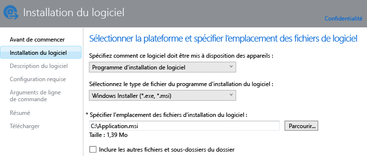

# Ajouter des applications pour des PC Windows dans Microsoft Intune

Cette rubrique montre comment ajouter des applications à Intune avant de les déployer.

> [!IMPORTANT]
> Cette rubrique vous aide à ajouter des applications pour des PC Windows que vous gérez à l’aide du logiciel client PC Intune. Si vous souhaitez ajouter des applications pour des PC Windows inscrits et d’autres appareils mobiles, consultez [Ajouter des applications pour des appareils mobiles dans Microsoft Intune](add-apps-for-mobile-devices-in-microsoft-intune.md).

## Ajouter l’application
Vous utilisez l’Éditeur de logiciel Microsoft Intune pour configurer les propriétés de l’application et la charger vers votre espace de stockage cloud. Voici la procédure à suivre :

1.  Dans la [console d’administration Microsoft Intune](https://manage.microsoft.com), sélectionnez **Applications** &gt; **Ajouter des applications** pour démarrer l’éditeur de logiciel Microsoft Intune.

    > [!TIP]
    > Vous devrez peut-être entrer votre nom d'utilisateur et votre mot de passe Intune avant le démarrage de l'éditeur.

2.  Dans la page **Installation du logiciel** de l’éditeur de logiciel, configurez les éléments suivants :

    **Spécifier comment ce logiciel doit être mis à disposition des appareils** : sélectionnez **Programme d’installation du logiciel**, puis spécifiez :

    - **Sélectionnez le type de fichier du programme d’installation du logiciel** : indique le type de logiciel à déployer. Pour un PC Windows, choisissez **Windows Installer**.
    - **Spécifier l’emplacement des fichiers d’installation du logiciel** : entrez l’emplacement des fichiers d’installation ou sélectionnez **Parcourir** pour sélectionner l’emplacement dans une liste.
    - **Inclure les autres fichiers et sous-dossiers du dossier** : certains logiciels qui utilisent Windows Installer nécessitent des fichiers de prise en charge qui se trouvent généralement dans le même dossier que les fichiers d’installation. Sélectionnez cette option si vous souhaitez également déployer ces fichiers de prise en charge.

    Par exemple, si vous souhaitez publier une application nommée Application.msi dans Intune, la page ressemble à ceci : 

   Ce type d'installation utilise une partie de votre espace de stockage cloud.

3.  Dans la page **Description du logiciel**, configurez ce qui suit :

    Selon le fichier de programme d'installation que vous utilisez, certaines de ces valeurs ont peut-être été entrées automatiquement ou peuvent ne pas apparaître.

    - **Éditeur :** entrez le nom de l’éditeur de l’application.
    - **Nom** : entrez le nom de l’application tel qu’il sera affiché dans le portail d’entreprise.  Assurez-vous que tous les noms d'application que vous utilisez sont uniques. Si le même nom d'application existe deux fois, seule l'une des applications sera proposée aux utilisateurs du portail d'entreprise.
    - **Description :** entrez la description de l’application. Ce libellé s'affichera dans le portail d'entreprise.
    - **URL des informations sur le logiciel** : (facultatif) entrez l’URL d’un site web qui contient des informations sur cette application. Cette URL s'affichera dans le portail d'entreprise.
    - **Informations sur la confidentialité** : (facultatif) entrez l’URL d’un site web qui contient des informations de confidentialité sur cette application. Cette URL s'affichera dans le portail d'entreprise.
    - **Catégorie** : (facultatif) sélectionnez l’une des catégories d’applications intégrées. Cela permettra aux utilisateurs de trouver aisément l'application lorsqu'ils parcourront le portail d'entreprise.
    - **Icône** : (facultatif) chargez une icône qui sera associée à l’application. Il s'agit de l'icône qui s'affichera avec l'application lorsque les utilisateurs parcourront le portail d'entreprise.

4.  Dans la page **Configuration requise**, sélectionnez les exigences à respecter pour que l’installation de l’application puisse commencer sur un appareil. **Architecture** : sélectionnez si cette application peut être installée sur un système d’exploitation 32 bits, 64 bits ou les deux. **Système d’exploitation** : sélectionnez le système d’exploitation minimal sur lequel cette application peut être installée..

5.  Dans la page **Règles de détection**, vous pouvez configurer des règles pour détecter si l’application que vous configurez est déjà installée sur un PC ou vous pouvez utiliser les règles de détection par défaut pour remplacer automatiquement toutes les versions précédemment installées de l’application. Cette option est pour Windows Installer (fichiers .exe uniquement).
6.  
    Les règles que vous pouvez configurer sont les suivantes :
    - **Le fichier existe** : spécifiez le chemin d’accès au fichier que vous souhaitez détecter. Vous pouvez effectuer une recherche sous **%ProgramFiles%** (c’est-à-dire dans **Program Files**\*&lt;chemin&gt;* et **Program Files (x86)**\*&lt;chemin&gt;*) sur le PC ou **%SystemDrive%** (la recherche s’effectue à partir du lecteur racine du PC, généralement C:)
    - **Le code de produit MSI existe déjà** : sélectionnez **Parcourir** pour choisir le fichier Windows Installer (msi) que vous voulez détecter. 
    - **Cette clé du Registre existe** : spécifiez la clé du Registre qui commence par **HKEY_LOCAL_MACHINE\**. La recherche peut porter sur les chemins du Registre 32 bits et 64 bits. Si la clé spécifiée existe dans les deux emplacements, la règle de détection est satisfaite.

    Si l'application répond à l'une des règles que vous avez configurées, elle ne sera pas installée.

7.  Pour le type de fichier **Windows Installer** uniquement (msi et exe) : dans la page **Arguments de ligne de commande**, indiquez si vous souhaitez fournir des arguments de ligne de commande facultatifs pour le programme d’installation. Par exemple, certains programmes d’installation peuvent prendre en charge l’argument **/q** pour effectuer une installation en mode silencieux sans intervention de l’utilisateur.

8.  Pour le type de fichier **Windows Installer** uniquement (exe uniquement) : dans la page **Codes de retour**, vous pouvez ajouter de nouveaux codes d’erreur qui sont interprétés par Intune quand l’application s’installe sur un PC Windows géré.
    Par défaut, Intune utilise des codes de retour standard pour signaler l’échec ou la réussite de l’installation d’un package d’application : **0** - Réussite ou **3010** - Réussite avec redémarrage. Vous pouvez aussi ajouter vos propres codes de retour à cette liste. Si vous spécifiez une liste de codes de retour et que l'installation de l'application renvoie un code qui ne figure pas dans la liste, il est interprété comme un échec.

9.  Dans la page **Résumé**, passez en revue les informations que vous avez spécifiées. Quand vous êtes prêt, sélectionnez **Télécharger**.

10. Sélectionnez **Fermer** pour terminer.

L’application s’affiche sur le nœud **Applications** de l’espace de travail **Applications**.

## Étapes suivantes

Une fois que vous avez créé une application, l’étape suivante consiste à la déployer. Pour en savoir plus, consultez [Déployer des applications dans Microsoft Intune](deploy-apps.md)

<!--HONumber=Jun16_HO4-->

