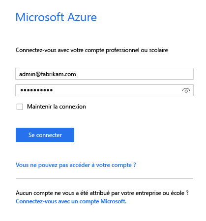
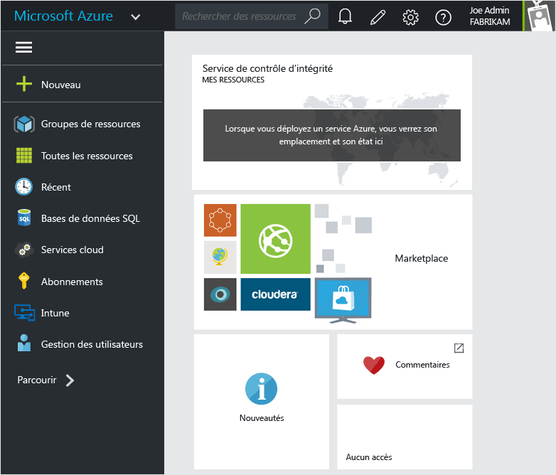
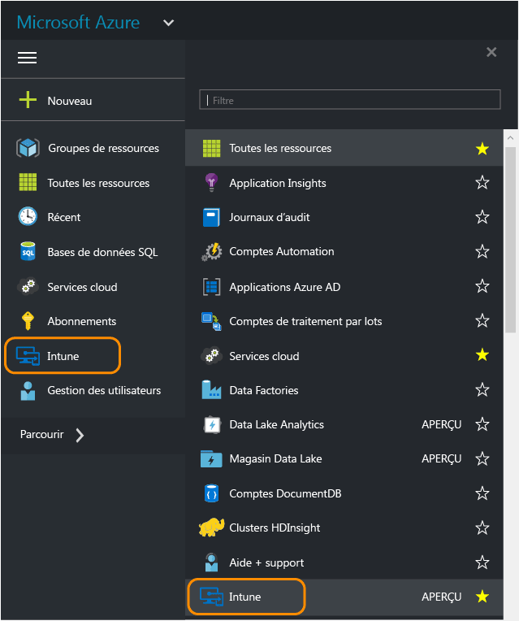
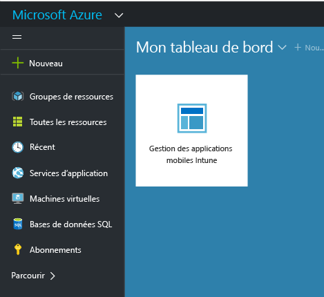

# Portail Azure pour les stratégies de gestion des applications mobiles Microsoft Intune
## Accès au portail Azure
Le **portail Azure** permet de créer et de gérer des stratégies de gestion des applications mobiles.

Il prend en charge la création de stratégies de gestion des applications mobiles pour :
- Les applications qui s’exécutent sur des appareils **inscrits et gérés par Intune**.
- Les applications qui s’exécutent sur des appareils qui ne sont inscrits dans **aucune** solution de gestion des appareils mobiles.
- Les applications qui s’exécutent sur des appareils qui sont **inscrits dans une solution de gestion des appareils mobiles tierce**.

Si vous utilisez actuellement la **console d’administration Intune** pour gérer vos appareils, vous pouvez créer une stratégie de gestion des applications mobiles qui prend en charge des applications pour les appareils inscrits dans Intune à l’aide de la [console d’administration Intune](configure-and-deploy-mobile-application-management-policies-in-the-microsoft-intune-console.md).
>[!IMPORTANT]
> La console d’administration Intune peut ne pas afficher tous les paramètres de stratégie de gestion des applications mobiles. Le portail Azure est la nouvelle console d’administration pour créer des stratégies de gestion des applications mobiles. Si vous créez ces stratégies à la fois dans la console d’administration Intune et le portail Azure, la stratégie dans le portail Azure est appliquée aux applications et déployée sur les utilisateurs.

## Se connecter au portail Azure et personnaliser la page de démarrage

1.  Accédez au [portail Azure](https://portal.azure.com) et connectez-vous avec vos informations d’identification [!INCLUDE[wit_nextref](../includes/wit_nextref_md.md)].

    

2.  Une fois que vous êtes connecté, le **Tableau de bord** apparaît. La page **Tableau de bord** comporte un ensemble de vignettes par défaut que vous pouvez supprimer et compléter par de nouvelles vignettes à des fins de personnalisation.

    

3.  Dans le menu **Parcourir**, recherchez **Intune**.

4.  Cliquez sur **Intune > Gestion des applications mobiles Intune > Paramètres**.

    

    > [!TIP]
    > Pour épingler un panneau sur la page de **démarrage** , vous pouvez utiliser l’option **épingler** du panneau.  Cliquez sur l’icône représentant une épingle dans le **panneau de gestion des applications mobiles Intune**, pour épingler l’application correspondante sur la page de **démarrage** .

    

    
## Étapes suivantes
[Préparez-vous à configurer des stratégies de gestion des applications mobiles](get-ready-to-configure-mobile-app-management-policies-with-microsoft-intune.md)

<!--HONumber=Jul16_HO1-->

