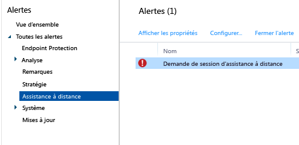

# Tâches courantes de gestion des PC Windows avec le client Microsoft Intune
Passez en revue les tâches de cette rubrique pour découvrir comment gérer vos ordinateurs qui exécutent le client Intune. Si vous n’avez pas encore installé le client sur vos ordinateurs, consultez [Installer le client de PC Windows avec Microsoft Intune](install-the-windows-pc-client-with-microsoft-intune.md).

## Utiliser des stratégies pour simplifier la gestion des PC
### Gérer le Pare-feu Windows
Les stratégies simplifient l'administration des paramètres du Pare-feu Windows sur les ordinateurs gérés. Pour plus d’informations, consultez [Protéger les PC Windows à l’aide de stratégies de Pare-feu Windows dans Microsoft Intune](help-protect-windows-pcs-using-windows-firewall-policies-in-microsoft-intune.md).

### Gérer Microsoft Intune Center
Microsoft Intune Center permet aux utilisateurs d’effectuer les opérations suivantes :

-   Obtenir des applications à partir du portail d'entreprise.

-   Rechercher des mises à jour.

-   Gérer Microsoft Intune Endpoint Protection.

<!--- -   Request remote assistance.--->

Microsoft Intune Center est installé sur tous les ordinateurs gérés. Vous pouvez configurer les paramètres suivants dans une stratégie Intune. Ceux-ci s’affichent pour les utilisateurs dans Microsoft Intune Center :

|Paramètre de stratégie|Détails|
|------------------|--------------------|
|**Nom**|Nom de l'administrateur responsable de la gestion de l'ordinateur.  Longueur maximale : 40 caractères|
|**Numéro de téléphone**|Numéro de téléphone de l'administrateur responsable de la gestion de l'ordinateur.  Longueur maximale : 20 caractères|
|**Adresse de messagerie**|Adresse e-mail de l'administrateur responsable de la gestion de l'ordinateur.  Longueur maximale : 40 caractères|
|**Nom du site web**|Nom de votre site web de support pour les utilisateurs.  Longueur maximale : 40 caractères|
|**URL du site web**|L'URL de votre site web de support.  Longueur maximale : 150 caractères|
|**Remarques**|Remarque affichée pour les utilisateurs.  Longueur maximale : 120 caractères|

### Gérer les paramètres des mises à jour logicielles
Utilisez des stratégies pour configurer les paramètres que les ordinateurs gérés utilisent pour rechercher et télécharger des mises à jour logicielles publiées par Microsoft et d'autres parties. Pour plus d’informations, consultez [Maintenir des PC Windows à jour avec les mises à jour logicielles dans Microsoft Intune](keep-windows-pcs-up-to-date-with-software-updates-in-microsoft-intune.md).

### Gérer les paramètres Endpoint Protection
Utilisez des stratégies pour configurer les paramètres Endpoint Protection à déployer ensuite sur les ordinateurs gérés. Cela inclut les planifications de l'analyse, les actions à entreprendre lorsqu'un programme malveillant est détecté et bien plus encore. Pour plus d’informations, consultez [Contribuer à la sécurisation des PC Windows avec Endpoint Protection pour Microsoft Intune](help-secure-windows-pcs-with-endpoint-protection-for-microsoft-intune.md).

## Afficher l'Inventaire matériel et logiciel
Intune recueille des informations détaillées sur le matériel et les logiciels des ordinateurs gérés. Utilisez les informations contenues dans les procédures suivantes pour apprendre à créer :

-   Un rapport qui répertorie les informations sur les capacités matérielles de vos ordinateurs.

-   Un rapport qui répertorie les logiciels installés sur chaque ordinateur.

-   Procédure d'actualisation d'un inventaire des ordinateurs pour vous assurer que les données du rapport sont récentes.

### Pour afficher les informations concernant vos ordinateurs

1.  Dans la [console d’administration Microsoft Intune](https://manage.microsoft.com/), choisissez **Rapports** &gt; **Rapports d’inventaire des ordinateurs**.

2.  Dans la page **Créer un rapport** , acceptez les valeurs par défaut ou personnalisez-les pour filtrer les résultats qui seront renvoyés par le rapport. Par exemple, vous pouvez sélectionner que seuls les ordinateurs qui exécutent Windows 8.1 s'afficheront dans le rapport.

3.  Choisissez **Afficher le rapport** pour ouvrir le **Rapport d’inventaire informatique** dans une nouvelle fenêtre.

    Vous pouvez trier le rapport en fonction des différentes colonnes, telles que le **Nom**, le **Type de châssis** ou le **Fabricant** en sélectionnant chaque en-tête de colonne.

### Pour afficher les logiciels installés sur vos ordinateurs

1.  Dans la [console d’administration Microsoft Intune](https://manage.microsoft.com/), choisissez **Rapports** &gt; **Rapports de logiciels détectés**.

2.  Dans la page **Créer un rapport** , acceptez les valeurs par défaut ou personnalisez-les pour filtrer les résultats qui seront renvoyés par le rapport. Par exemple, vous pouvez décider que seuls les logiciels publiés par Microsoft seront affichés dans le rapport.

3.  Choisissez **Afficher le rapport** pour ouvrir le **Rapport de logiciels détectés** dans une nouvelle fenêtre.

    Vous pouvez trier le rapport en fonction des différentes colonnes, telles que le **Nom**, l’**Éditeur** ou la **Catégorie** en sélectionnant chaque en-tête de colonne. Vous pouvez développer les mises à jour dans la liste pour afficher plus de détails (par exemple les ordinateurs sur lesquels elles sont installées) en choisissant la flèche directionnelle à côté de l’élément de liste.

### Pour actualiser les ressources de l'ordinateur pour vérifier qu'elles sont récentes

1.  Dans la [console d’administration Microsoft Intune](https://manage.microsoft.com/), choisissez **Groupes** &gt; **Tous les appareils** (ou un autre groupe qui contient l’ordinateur pour lequel vous souhaitez actualiser l’inventaire).

2.  Sélectionnez un ordinateur ou maintenez la touche **Ctrl** enfoncée pour sélectionner plusieurs ordinateurs.

3.  Dans la barre des tâches, choisissez **Tâches à distance** &gt; **Actualiser l’inventaire**.

4.  Pour afficher l’état des tâches, choisissez **Tâches à distance** dans le coin inférieur droit de la page.

    La boîte de dialogue **État de la tâche** affiche les tâches à distance en cours, l'état de la tâche, le nom de l'appareil et toutes les erreurs signalées et fournit un lien permettant de corriger ces informations.

## Redémarrer à distance un PC Windows

1.  Dans la [console d’administration Microsoft Intune](https://manage.microsoft.com/), choisissez **Groupes** &gt; **Tous les appareils** (ou un autre groupe qui contient l’ordinateur que vous voulez redémarrer).

2.  Sélectionnez un ou plusieurs ordinateurs, puis choisissez **Tâches à distance** &gt; **Redémarrer l’ordinateur**.

3.  Pour afficher l’état des tâches, choisissez **Tâches à distance** dans le coin inférieur droit de la page.

4.  Dans la boîte de dialogue **État de tâche** , passez en revue les tâches à distance en cours, l'état de la tâche, le nom d'appareil et les erreurs signalées.

## Mettre hors service un ordinateur

1.  Dans la [console d’administration Microsoft Intune](https://manage.microsoft.com/), choisissez **Groupes** &gt; **Tous les appareils** (ou un autre groupe qui contient l’ordinateur que vous voulez mettre hors service).

2.  Sélectionnez les appareils que vous souhaitez mettre hors service, puis choisissez **Mettre hors service/Réinitialiser**.

Pour réinscrire un ordinateur dans Intune, réinstallez le logiciel client sur l’ordinateur à l’aide des informations contenues dans la rubrique [Installer le client de PC Windows avec Microsoft Intune](install-the-windows-pc-client-with-microsoft-intune.md).

Si un ordinateur ne peut pas se connecter à Intune, un message s’affiche dans l’espace de travail **Tableau de bord**.

Lorsque vous mettez hors service un ordinateur :

-   Il est supprimé de l’inventaire Intune et la licence associée à l’ordinateur devient disponible pour une réutilisation.

-   Son état ne s’affiche plus dans la console Intune.

-   Intune supprime le logiciel client de l’ordinateur. Si l’ordinateur n’est pas connecté au service Intune, le logiciel client sera supprimé la prochaine fois qu’il se connectera.

-   Microsoft Intune Endpoint Protection est supprimé de l’ordinateur. Si l’ordinateur dispose d’une autre application de point de terminaison installée et qu’elle est désactivée, cette application peut être réactivée après la suppression de Microsoft Intune Endpoint Protection pour garantir la protection de vos ordinateurs.

-   Toutes les stratégies sont supprimées de l'ordinateur et les valeurs qui ont été définies par les stratégies vont être modifiées.

-   L’ordinateur ne reçoit plus les mises à jour de logiciels ou les mises à jour de définition des programmes malveillants à partir du service Intune.

-   Selon la façon dont ils sont configurés, les ordinateurs mis hors service peuvent continuer à recevoir des mises à jour à l'aide de Windows Server Update Services, Windows Update ou Microsoft Update.

    > [!IMPORTANT]
    > Si le logiciel client a été installé à l'aide d'un objet de stratégie de groupe, vous devez supprimer celui-ci pour pouvoir supprimer le logiciel client afin d'empêcher la réinstallation du logiciel.

    Si la désinstallation du client échoue, lisez [Résoudre les problèmes de protection de point de terminaison](/intune/troubleshoot/troubleshoot-endpoint-protection-in-microsoft-intune) pour obtenir une aide supplémentaire.

## Gérer la liaison utilisateur-appareil
Avant de pouvoir déployer des logiciels vers un utilisateur, vous devez lier l'utilisateur à un ordinateur. Vous pouvez associer un utilisateur à plusieurs ordinateurs, mais chaque ordinateur ne peut être lié qu'à un seul utilisateur. Les utilisateurs sont automatiquement liés à tous les ordinateurs qu’ils inscrivent dans Intune à l’aide du portail de l’entreprise.

### Pour lier un utilisateur à un ordinateur

1.  Dans la [console d’administration Microsoft Intune](https://manage.microsoft.com/), choisissez **Groupes** &gt; **Tous les appareils** (ou un autre groupe qui contient l’ordinateur que vous voulez lier à un utilisateur).

2.  Sélectionnez l’ordinateur que vous souhaitez lier à un utilisateur, puis choisissez **Lier un utilisateur**.

    La boîte de dialogue **Lier un utilisateur** affiche une liste des utilisateurs disponibles avec leur nom complet, leur ID utilisateur, ainsi que le nombre d'ordinateurs lié à chacun. Si un utilisateur est déjà lié à l'ordinateur sélectionné, son nom et ID utilisateur s'affichent sous **Utilisateur actuel**. Si l'ordinateur n'est lié à aucun utilisateur, **Aucun utilisateur** n'apparaît sous **Utilisateur actuel**.

3.  Effectuez l'une des opérations suivantes :

    -   Pour laisser l’ordinateur lié à son utilisateur actuel, le cas échéant, choisissez **Annuler**.

    -   Pour supprimer le lien vers l’utilisateur actuel, le cas échéant, choisissez **Supprimer le lien **&gt; **OK**.

    -   Pour relier l'ordinateur à un nouvel utilisateur, sélectionnez un utilisateur dans la liste **Tous les utilisateurs** . Vérifiez que les données utilisateur sont correctes, puis choisissez **OK**.

> [!TIP]
> Si vous souhaitez limiter la capacité des utilisateurs finaux à se lier à des ordinateurs, activez l’option **Limiter la capacité des utilisateurs à se lier à des ordinateurs** dans la stratégie **Paramètres de l’Agent Microsoft Intune**.

<!--- ## Request and provide remote assistance to Windows PCs that use the Intune client software

> [!IMPORTANT]
> You might not see the options to configure TeamViewer integration for remote assistance in the Intune admin console. This capability is not currently available to all customers, but will be rolling our more widely soon.
     

Microsoft Intune can use the [TeamViewer](https://www.teamviewer.com) software to let users of PCs that run the Intune client software get remote assistance help from you. When a user requests help from the Microsoft Intune Center, you are informed by an alert, can accept the request, and then provide assistance.
This functionality replaces the existing Windows Remote Assistance functionality in Intune.

### Before you start

Before you can begin to establish and respond to remote assistance requests, you must ensure the following prerequisites are in place:

- You must have [signed up for a TeamViewer account](https://login.teamviewer.com/LogOn#register) to log into the TeamViewer website.
- Windows PCs that you want to administer must be [managed by the Windows PC client](manage-windows-pcs-with-microsoft-intune.md)
- All Windows PC operating systems supported by Intune can be administered.

### Configure the TeamViewer Connector

1. In the [Microsoft Intune administration console](https://manage.microsoft.com), choose **Admin**.
2. In the **Admin** workspace, choose **TeamViewer**.
3. On the **TeamViewer** page, under **TeamViewer Connector**, choose **Enable**.
4. In the **Enable TeamViewer** dialog box, view, then **Accept** the license terms. If you don't already own a TeamViewer license, choose **Purchase a TeamViewer license**.
5. After the TeamViewer browser window opens, sign into the site with your TeamViewer credentials.
6. On the TeamViewer site, read, then accept the options to allow Intune to connect with TeamViewer.
7. In the Intune console, verify that the **TeamViewer Connector** item shows as **Enabled**.

### Open a remote assistance request (end user)

1. On a client Windows PC, open the **Microsoft Intune Center**.
2. Under **Remote Assistance**, choose **Request Remote Assistance**.
3. After you approve the request (see below), TeamViewer opens on the client. The user must accept any messages indicating that the web browser is trying to open the TeamViewer application.
4. The user sees a message asking if you can control their PC. They must accept this message to continue.
5. During the remote assistance session, the user sees a window that shows them you are connected. If they close this window, the remote session ends.

### Respond to a remote assistance request

1. When a user submits a remote assistance request, you can view it in the **Alerts** workspace, under **Monitoring** > **Remote Assistance**. For example:
> 

 If a request goes unanswered for more than 4 hours, it is removed.
2. To accept the request, choose **Approve request and launch Remote Assistance**.
3. In the **A New Remote Assistance Request is Pending** dialog box, choose **Accept the remote assistance request**. If it's not already installed, TeamViewer will install any necessary apps on your computer.
4. TeamViewer then notifies the end user that you want to take control of their PC. After the user has accepted the request, the TeamViewer windows opens, and you can control the PC. 
 
While in a remote assistance session, you can use all available TeamViewer commands to control the remote PC. For help with these commands, download the [Manual for remote control](http://www.teamviewer.com/en/support/documents/) from the TeamViewer website.

### Close the remote assistance session

From the **Actions** menu of the **TeamViewer** window, choose **End Session**.--->

<!--HONumber=Jun16_HO4-->

