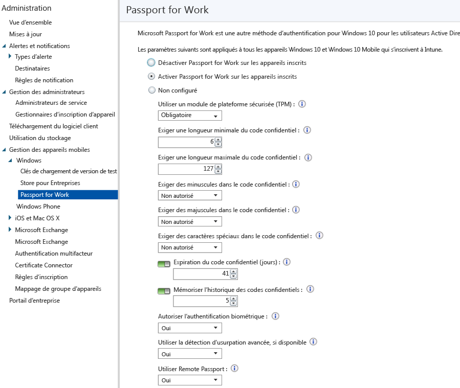

# Contrôler les paramètres de Microsoft Passport sur les appareils avec Microsoft Intune
Microsoft Intune s’intègre à Microsoft Passport for Work, une autre méthode de connexion qui utilise Active Directory ou un compte Azure Active Directory pour remplacer un mot de passe, une carte à puce ou une carte à puce virtuelle.

Microsoft Passport for Work vous permet d’utiliser un *mouvement utilisateur*, au lieu d’un mot de passe, pour vous connecter. Un mouvement utilisateur peut être un simple code confidentiel, une authentification biométrique telle que Windows Hello ou un appareil externe tel qu’un lecteur d’empreintes digitales.

>[!TIP]
>Microsoft Passport for Work est maintenant appelé Windows Hello Entreprise. La console Microsoft Intune ne reflète pas encore cette modification.

Intune s’intègre à Passport for Work de deux manières :

-   Vous pouvez utiliser la stratégie Intune pour contrôler les mouvements que les utilisateurs peuvent et ne peuvent pas utiliser pour se connecter.

-   Vous pouvez stocker des certificats d’authentification dans le fournisseur de stockage de clés de Passport for Work. Pour plus d’informations, consultez [Secure resource access with certificate profiles in Microsoft Intune](secure-resource-access-with-certificate-profiles.md) (Sécuriser l’accès aux ressources avec des profils de certificat dans Microsoft Intune).

## Créer une stratégie Passport for Work

1.  Dans la [console d’administration Microsoft Intune](https://manage.microsoft.com), sélectionnez **Administration** &gt; **Gestion des appareils mobiles** &gt; **Windows** &gt; **Passport for Work** pour ouvrir la page Passport for Work.

    

2.  Choisissez l’un des paramètres suivants :
    - **Désactiver Passport for Work sur les appareils inscrits**. Si vous ne souhaitez pas utiliser Passport for Work sur les appareils Windows 10, sélectionnez ce paramètre. Tous les autres paramètres affichés à l’écran cessent d’être disponibles.
    - **Activer Passport for Work sur les appareils inscrits**. Sélectionnez ce paramètre si vous souhaitez configurer les paramètres Passport for Work sur tous les appareils Windows 10.
    - **Not configuré**. Sélectionnez ce paramètre si vous ne souhaitez pas utiliser Intune pour contrôler les paramètres Passport for Work. Les paramètres existants de Passport for Work sur les appareils Windows 10 ne seront pas modifiés. Tous les autres paramètres affichés à l’écran sont indisponibles.
3.  Si vous avez sélectionné **Activer Passport for Work sur les appareils inscrits**, configurez les paramètres requis qui seront appliqués à tous les appareils Windows 10 et Windows 10 Mobile inscrits.
4.  Lorsque vous avez terminé, choisissez **Enregistrer**.

## Passport for Work : paramètres de code confidentiel

- **Exiger une longueur minimale du code confidentiel**/**Exiger une longueur maximale du code confidentiel**. Ce paramètre configure les appareils pour qu’ils utilisent les longueurs minimale et maximale de code confidentiel que vous spécifiez, afin d’optimiser la sécurisation de la connexion. Le code confidentiel par défaut comporte six caractères, mais vous pouvez appliquer une longueur minimale de quatre caractères. La longueur maximale du code confidentiel est de 127 caractères.
- **Exiger des minuscules dans le code confidentiel**/**Exiger des majuscules dans le code confidentiel**/**Exiger des caractères spéciaux dans le code confidentiel**. Vous pouvez appliquer un code confidentiel plus puissant en exigeant l’utilisation de majuscules, de minuscules et de caractères spéciaux dans ce code. Choisissez parmi :
    - **Autorisé**. Les utilisateurs peuvent utiliser le type de caractère dans leur code confidentiel, mais cela n’est pas obligatoire.
    - **Requis**. Les utilisateurs doivent inclure au moins l’un des types de caractères dans leur code confidentiel. Par exemple, il est courant d’exiger au moins une majuscule et un caractère spécial.
    - **Non autorisé** (par défaut). Les utilisateurs ne doivent pas utiliser ces types de caractères dans leur code confidentiel. (Il s’agit également du comportement appliqué si le paramètre n’est pas configuré.)
    > [!TIP]
    > Les caractères spéciaux sont les suivants : **! " # $ % &amp; ' ( ) &#42; + , - . / : ; &lt; = &gt; ? @ [ \ ] ^ _ &#96; { &#124; } ~**.
- **Expiration du code confidentiel (en jours)**. Nous vous conseillons de spécifier une période d’expiration pour un code confidentiel, après laquelle les utilisateurs finaux doivent le modifier. La valeur par défaut est 41 jours.
- **Conserver l’historique des codes confidentiels**. Limite la réutilisation des codes confidentiels précédemment utilisés. Par défaut, les 5 derniers codes confidentiels ne peuvent pas être réutilisés.

## Passport for Work : autres paramètres

- **Utiliser un module de plateforme sécurisée (TPM)**. Une puce TPM fournit une couche supplémentaire de sécurité des données. Choisissez l'une des valeurs suivantes :
    - **Requis** (par défaut). Seuls les appareils avec un module de plateforme sécurisée (TPM) accessible peuvent configurer Passport for Work.
    - **Préféré**. Les appareils tentent d’abord d’utiliser un module de plateforme sécurisée. Si ce n’est pas possible, ils peuvent utiliser le chiffrement logiciel.
- **Autoriser l’authentification biométrique**. Permet d’utiliser l’authentification biométrique, telle que la reconnaissance des visages ou les empreintes digitales, à la place d’un code confidentiel pour Passport for Work. Les utilisateurs doivent toujours configurer un code confidentiel professionnel en cas d’échec de l’authentification biométrique. Choisissez parmi :
    - **Oui**. Le logiciel Passport for Work autorise l’authentification biométrique.
    - **Non**. Le logiciel Passport for Work empêche l’authentification biométrique (pour tous les types de compte).
- **Utiliser la détection d’usurpation avancée, si disponible**. Détermine si les fonctionnalités d’anti-usurpation d’identité de Windows Hello sont utilisées sur les appareils qui les prennent en charge (par exemple, la détection d’une photo de visage au lieu d’un visage réel). Si cette option est définie sur **Oui**, Windows nécessite que tous les utilisateurs utilisent la détection d’usurpation pour les fonctions de reconnaissance faciale, si disponible.
- **Utiliser Remote Passport**. Si cette option est définie sur **Oui**, les utilisateurs peuvent utiliser un appareil Remote Passport comme appareil mobile pour l’authentification d’ordinateur du bureau. L’ordinateur de bureau doit être joint à Azure Active Directory, et l’appareil mobile doit être configuré avec un code confidentiel Passport for Work.

## Informations supplémentaires
Pour plus d’informations sur Microsoft Passport, consultez [le guide](https://technet.microsoft.com/library/mt589441.aspx) dans la documentation de Windows 10.

<!--HONumber=Aug16_HO1-->

