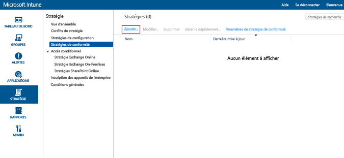

---
# required metadata

title: Créer une stratégie de conformité des appareils dans Microsoft Intune | Microsoft Intune
description:
keywords:
author: karthikaraman
manager: jeffgilb
ms.date: 04/28/2016
ms.topic: article
ms.prod:
ms.service: microsoft-intune
ms.technology:
ms.assetid: 5336dac0-a2cc-4cd4-8511-67e4f95bd700

# optional metadata

#ROBOTS:
#audience:
#ms.devlang:
ms.reviewer: chrisgre
ms.suite: ems
#ms.tgt_pltfrm:
#ms.custom:

---

# Créer une stratégie de conformité des appareils dans Microsoft Intune
Cette rubrique décrit les étapes que vous pouvez effectuer pour créer une stratégie de conformité qu’un appareil doit respecter pour être considéré comme conforme.

##  Étape 1 : ajouter une nouvelle stratégie
  Dans la [console d'administration Microsoft Intune](https://manage.microsoft.com), choisissez **Stratégie** &gt; **Stratégies de conformité** &gt; **Ajouter**.

  

##  Étape 2 : configurer les paramètres
Dans la page **Créer une stratégie**, activez les paramètres dont vous avez besoin :
  -   Paramètres de sécurité système tels que le mot de passe et le chiffrement
  -   Paramètres d’intégrité des appareils, par exemple si un appareil est jailbroken ou signalé comme sain par le service d’attestation de l’intégrité des appareils Windows.
  -   Paramètres de propriété des appareils, tels que la version minimale du système d’exploitation requise ou la version maximale du système d’exploitation autorisée.

##  Étape 3 : enregistrer la stratégie
Quand vous avez terminé, choisissez **Enregistrer la stratégie**.

Vous pourrez déployer la stratégie immédiatement après l’avoir enregistrée, ou la déployer ultérieurement. La nouvelle stratégie s’affiche sous le nœud **Stratégies de conformité** de l’espace de travail **Stratégie**.

## Paramètres de stratégie pris en charge
Le tableau suivant répertorie les paramètres de stratégie de conformité et les plateformes sur lesquelles ils sont pris en charge.

-------------
|Paramètre|iOS|Android|Windows|
|-----|----|-----|-----|
|Exiger un mot de passe pour déverrouiller des appareils mobiles|iOS 6 et versions ultérieures|Android 4.0 et versions ultérieures  Samsung KNOX Standard 4.0 et versions ultérieures|Windows Phone 8 et versions ultérieures|
|Autoriser les mots de passe simples|iOS 6 et versions ultérieures|Non prise en charge|Windows Phone 8 et versions ultérieures|
|Longueur minimale du mot de passe|iOS 6 et versions ultérieures| Android 4.0 et versions ultérieures Samsung KNOX Standard 4.0 et versions ultérieures| Windows Phone 8 et versions ultérieures Windows 8.1|
|Type de mot de passe requis|iOS 6 et versions ultérieures|Non disponible|Windows Phone 8 et versions ultérieures  Windows RT  Windows RT 8.1  Windows 8.1|
|Nombre minimal de jeux de caractères|iOS 6 et versions ultérieures|Non disponible|Windows Phone 8 et versions ultérieures  Windows RT  Windows RT 8.1  Windows 8.1|
|Qualité du mot de passe|Non disponible|Android 4.0 et versions ultérieures  Samsung KNOX Standard 4.0 et versions ultérieures|Non disponible|
|Minutes d'inactivité avant demande du mot de passe|iOS 6 et versions ultérieures|Android 4.0 et versions ultérieures Samsung KNOX Standard 4.0 et versions ultérieures|Windows Phone 8 et versions ultérieures Windows RT et Windows RT 8.1 Windows 8.1|
|Expiration du mot de passe (jours)|iOS 6 et versions ultérieures|Android 4.0 et versions ultérieures Samsung KNOX Standard 4.0 et versions ultérieures|Windows Phone 8 et versions ultérieures Windows RT et Windows RT 8.1 Windows 8.1|
|Mémoriser l'historique des mots de passe|iOS 6 et versions ultérieures|Android 4.0 et versions ultérieures Samsung KNOX Standard 4.0 et versions ultérieures|Windows Phone 8 et versions ultérieures Windows RT et Windows RT 8.1 Windows 8.1|
|Empêcher la réutilisation des mots de passe précédents|iOS 6 et versions ultérieures|Android 4.0 et versions ultérieures Samsung KNOX Standard 4.0 et versions ultérieures|Windows Phone 8 et versions ultérieures Windows RT et Windows RT 8.1 Windows 8.1|
|Exiger un mot de passe quand l'appareil quitte un état inactif| Non disponible| Non disponible|Windows 10 Mobile|
|Exiger le chiffrement sur l'appareil mobile|Non applicable|Android 4.0 et versions ultérieures Samsung KNOX Standard 4.0 et versions ultérieures|Windows Phone 8 et versions ultérieures  Windows 8.1|
|Exiger que les appareils soient signalés comme ne posant aucun problème d’intégrité| Non disponible| Non disponible|Windows  Windows 10 Mobile|
|L’appareil ne doit pas être jailbroken ou rooté|iOS 6 et versions ultérieures|Android 4.0 et versions ultérieures Samsung KNOX Standard 4.0 et versions ultérieures|Non disponible|
|Le compte de messagerie doit être géré par Intune|iOS 6 et versions ultérieures|Non disponible| Non disponible|
|Sélectionnez le profil de messagerie géré par Intune|iOS 6 et versions ultérieures|Non disponible| Non disponible|
|Système d’exploitation minimal requis|iOS 6 et versions ultérieures|Android 4.0 et versions ultérieures Samsung KNOX Standard 4.0 et versions ultérieures| Windows Phone 8 et versions ultérieures Windows 8.1|
|Version maximale autorisée du système d’exploitation|iOS 6 et versions ultérieures|Android 4.0 et versions ultérieures Samsung KNOX Standard 4.0 et versions ultérieures|Windows Phone 8 et versions ultérieures Windows 8.1|

Sélectionnez l’une des options suivantes pour en savoir plus sur les paramètres de compatibilité pris en charge sur chaque plateforme :
> [!div class="op_single_selector"]
- [Paramètres de stratégie de conformité pour les appareils iOS](ios-compliance-policy-settings-in-microsoft-intune.md)
- [Paramètres de stratégie de conformité pour les appareils Android](android-compliance-policy-settings-in-microsoft-intune.md)
- [Paramètres de stratégie de conformité pour les appareils Windows et Windows Phone ](windows-compliance-policy-settings-in-microsoft-intune.md)

## Étapes suivantes
[Déployer et surveiller une stratégie de conformité](deploy-and-monitor-a-device-compliance-policy-in-microsoft-intune.md)

### Voir aussi
[Introduction aux stratégies de conformité des appareils](introduction-to-device-compliance-policies-in-microsoft-intune.md)

<!--HONumber=Jun16_HO2-->

