# Créer et déployer des stratégies de gestion des applications mobiles à l’aide de Microsoft Intune
Les stratégies de gestion des applications mobiles (GAM) peuvent être appliquées à des applications qui s’exécutent sur des appareils gérés ou non par Intune. Pour obtenir une description plus détaillée du fonctionnement des stratégies et des scénarios de gestion des applications mobiles pris en charge par les stratégies de gestion des applications mobiles Intune, consultez la rubrique [Protéger les données d’application à l’aide des stratégies de gestion des applications mobiles](protect-app-data-using-mobile-app-management-policies-with-microsoft-intune.md).

Cette rubrique décrit le processus de création d’une stratégie GAM dans le **portail Azure**. Le portail Azure est la nouvelle console d’administration permettant de créer des stratégies de gestion des appareils mobiles (GAM) et nous vous recommandons d’utiliser ce portail pour créer de telles stratégies. Le portail Azure prend en charge les scénarios GAM suivants :
- Appareils inscrits dans Intune
- Appareils gérés par une solution de gestion des appareils mobiles tierce
- Appareils qui ne sont gérés par aucune solution de gestion des appareils mobiles (BYOD).

>[!IMPORTANT]
Considérez les points suivants si vous utilisez actuellement la **console d’administration Intune** pour gérer vos appareils :

> * Vous pouvez créer une stratégie GAM qui prend en charge des applications pour les appareils inscrits dans Intune à l’aide de la [console d’administration Intune](configure-and-deploy-mobile-application-management-policies-in-the-microsoft-intune-console.md).
> * Les stratégies de gestion des applications mobiles créées dans la console d’administration Intune ne peuvent pas être importées dans le portail Azure.  Les stratégies de gestion des applications mobiles doivent être recréées dans le portail Azure.

> * La console d’administration Intune peut ne pas afficher tous les paramètres de stratégie de gestion des applications mobiles. Le portail Azure est la nouvelle console d’administration pour créer des stratégies de gestion des applications mobiles.

> * Pour déployer des applications gérées, vous devez créer une stratégie GAM dans la console d’administration Intune. Dans ce cas, vous souhaiterez peut-être créer des stratégies GAM à la fois dans la console d’administration Intune et dans le portail Azure : dans la console d’administration Intune pour être sûr de pouvoir déployer des applications gérées, dans le portail Azure car c’est la nouvelle console d’administration qui contient tous les paramètres de stratégie GAM.

> * Si vous créez des stratégies GAM dans la console d’administration Intune et dans le portail Azure, la stratégie créée dans le portail Azure est appliquée aux applications.

Pour afficher la liste des paramètres de stratégie pris en charge pour les plateformes Android et iOS, sélectionnez l’un des éléments suivants :

> [!div class="op_single_selector"]
- [Stratégies iOS](ios-mam-policy-settings.md)
- [Stratégies Android](android-mam-policy-settings.md)

##  Créer une stratégie GAM
Avant de créer une stratégie GAM, passez en revue les informations relatives aux [conditions préalables et à la prise en charge](get-ready-to-configure-mobile-app-management-policies-with-microsoft-intune.md).
1.  Choisissez **Gestion des applications mobiles Intune &gt; Paramètres** pour ouvrir le panneau **Paramètres**.

    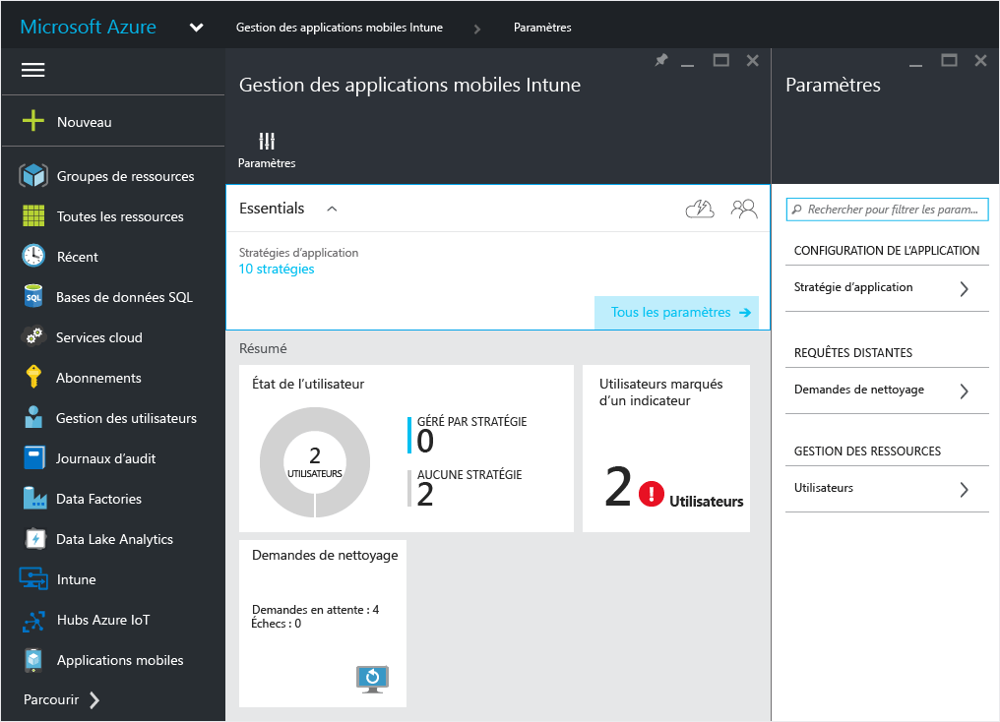

    > [!TIP]
    > Si c’est la première fois que vous utilisez le portail Azure, commencez par lire [Portail Azure pour les stratégies de gestion des applications mobiles Microsoft Intune](azure-portal-for-microsoft-intune-mam-policies.md) pour vous familiariser avec le portail.

2.  Dans le panneau **Paramètres**, choisissez **Stratégie d’application**.  Cette opération ouvre le panneau **Stratégie d’application** dans lequel vous allez créer des stratégies et modifier des stratégies existantes. Choisissez **Ajouter une stratégie**.

    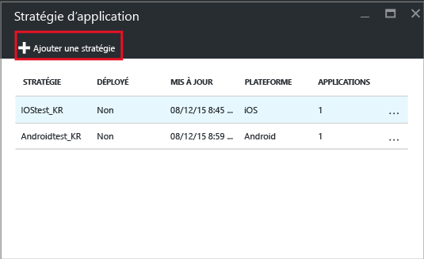

3.  Tapez un nom pour la stratégie, ajoutez une brève description et sélectionnez le type de plateforme de manière à créer une stratégie pour iOS ou Android.  Vous pouvez créer plusieurs stratégies pour chaque plateforme.

    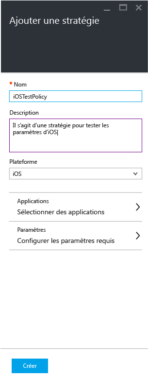

4.  Choisissez **Applications** pour ouvrir le panneau **Applications** qui contient la liste des applications disponibles. Dans cette liste, vous pouvez sélectionner une ou plusieurs applications à associer à la stratégie que vous créez. Une fois que vous avez sélectionné les applications, choisissez le bouton **Sélectionner** en bas du panneau **Applications** pour enregistrer votre sélection.

    > [!IMPORTANT]
    > Vous devez sélectionner au moins une application pour créer une stratégie.

5.  Dans le panneau **Ajouter une stratégie**, choisissez **Configurer les paramètres requis** pour ouvrir le panneau des paramètres de stratégie.

    Il existe deux catégories de paramètres de stratégie : **Réadressage des données** et **Accès**.  Les stratégies de réadressage des données sont applicables au déplacement des données vers l’intérieur et l’extérieur des applications, tandis que les stratégies d’accès déterminent comment l’utilisateur final accède aux applications dans un contexte de travail.
    Pour vous faciliter la prise en main, les paramètres de stratégie sont définis par défaut.  Il est inutile d’apporter des modifications si les valeurs par défaut répondent à vos besoins.

    > [!TIP]
    > Ces paramètres de stratégie sont appliqués uniquement quand vous utilisez des applications dans le contexte de travail.  Quand l’utilisateur final utilise l’application pour effectuer une tâche personnelle, il n’est pas affecté par ces stratégies.

    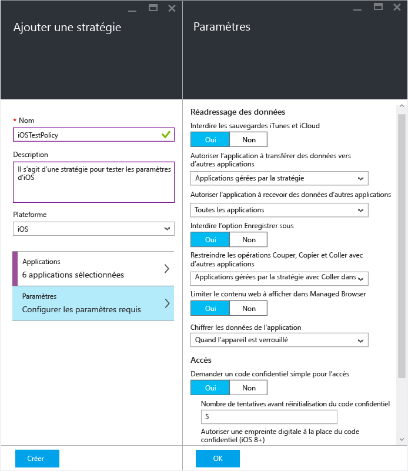

6.  Choisissez **OK** pour enregistrer cette configuration.  Vous êtes maintenant de retour dans le panneau **Ajouter une stratégie** . Choisissez **Créer** pour créer la stratégie et enregistrer vos paramètres.

    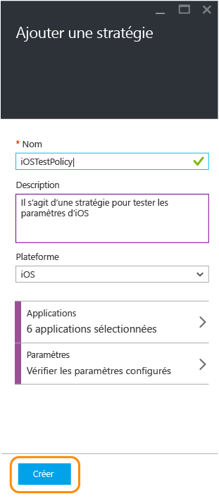

Quand vous avez fini de créer une stratégie comme décrit dans la procédure précédente, elle n’est pas déployée sur les utilisateurs.  Suivez les étapes décrites ci-dessous pour déployer la stratégie.

> [!IMPORTANT]
> Si vous créez une stratégie GAM pour une application à l’aide de la console d’administration Intune et une stratégie GAM à l’aide du portail Azure, la stratégie créée à l’aide du portail est prioritaire. Cependant, la création de rapports dans la console Intune ou Configuration Manager indique les paramètres de stratégie créés à partir du portail Azure. Exemple :
>
> -   Vous avez créé une stratégie de gestion des applications mobiles dans la console d’administration Intune qui bloque la copie à partir d’une application.
> -   Vous avez créé une stratégie de gestion des applications mobiles dans la console Azure qui autorise la copie à partir d’une application.
> -   Vous associez ces deux stratégies à la même application.
> -   Il en résulte que la stratégie créée à partir de la console Azure est prioritaire et que la copie est autorisée.
> -   Cependant, l’état et les rapports dans la console Intune indiquent de façon erronée que la copie est bloquée.

## Déployer une stratégie sur les utilisateurs

1.  Dans le panneau **Stratégie**, choisissez **Groupes d’utilisateurs** pour ouvrir le panneau **Groupes d’utilisateurs**. Choisissez **Ajouter un groupe d’utilisateurs** dans le panneau **Groupes d’utilisateurs** pour ouvrir le panneau **Ajouter un groupe d’utilisateurs**.

    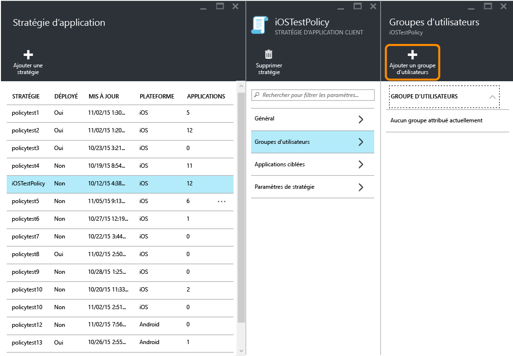

2.  Une liste de groupes d’utilisateurs s’affiche sur le panneau **Ajouter un groupe d’utilisateurs** . Il s’agit de la liste de tous les groupes de sécurité figurant dans **Azure Active Directory**.  Vous pouvez sélectionner les groupes d’utilisateurs auxquels vous souhaitez appliquer cette stratégie et choisir **Sélectionner**. Si vous choisissez **Sélectionner**, la stratégie est déployée pour les utilisateurs.

    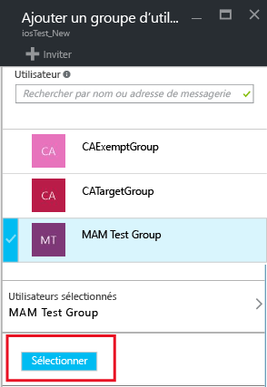

    Vous avez créé une stratégie et l’avez déployée pour les utilisateurs.

Seuls les utilisateurs en possession de licences [!INCLUDE[wit_nextref](../includes/wit_nextref_md.md)] sont affectés par la stratégie.  Les utilisateurs figurant dans le groupe de sécurité que vous avez sélectionné et qui n’ont pas de licence [!INCLUDE[wit_nextref](../includes/wit_nextref_md.md)] ne sont pas affectés.

>[!IMPORTANT]
> Si vous utilisez Intune avec Configuration Manager pour gérer vos appareils iOS et Android, la stratégie est appliquée uniquement aux utilisateurs figurant directement dans le groupe que vous avez sélectionné.  Les membres des groupes enfants imbriqués dans le groupe que vous avez sélectionné ne sont pas affectés.

Les utilisateurs finaux peuvent télécharger les applications à partir de l’App Store ou de Google Play. Pour plus d'informations, voir :
* [Ce qui se passe quand votre application Android est gérée par des stratégies GAM](user-experience-for-mam-enabled-android-apps-with-microsoft-intune.md)
* [Ce qui se passe quand votre application iOS est gérée par des stratégies GAM](user-experience-for-mam-enabled-ios-apps-with-microsoft-intune.md)
##  Modifier des stratégies existantes
Vous pouvez modifier une stratégie existante et l’appliquer aux utilisateurs ciblés. Toutefois, quand vous modifiez des stratégies existantes, les utilisateurs déjà connectés aux applications ne voient pas les modifications pendant une période de huit heures.

Pour voir immédiatement l’effet des modifications, l’utilisateur final doit se déconnecter de l’application et se reconnecter.

### Pour modifier la liste des applications associées à la stratégie

1.  Dans le panneau **Stratégie d’application**, choisissez la stratégie à modifier. Cette opération ouvre un panneau spécifique à la stratégie que vous venez de sélectionner.

    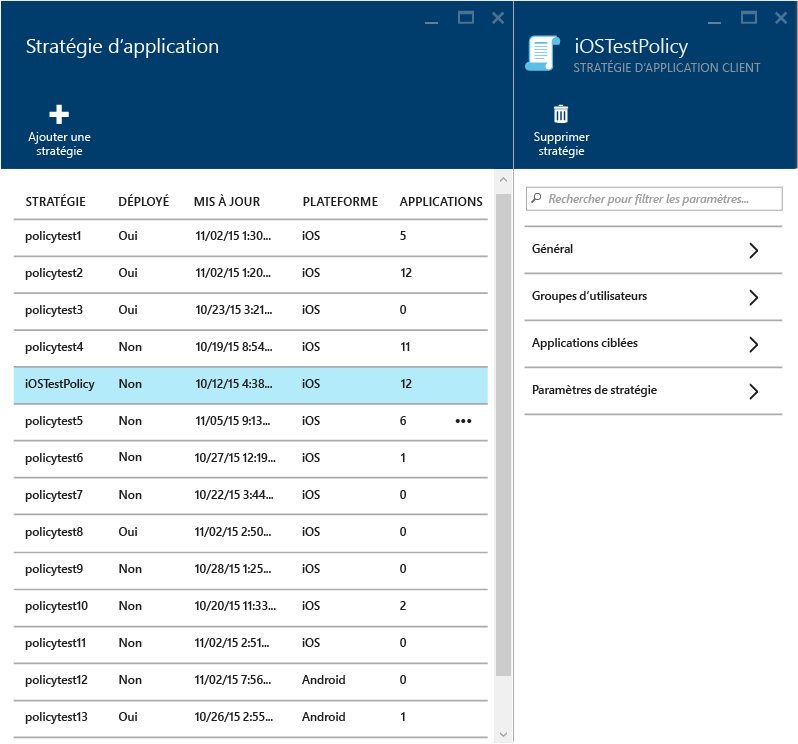

2.  Dans le panneau de la stratégie, choisissez **Applications ciblées** pour afficher la liste des applications.

3.  Supprimez ou ajoutez des applications dans la liste et choisissez l’icône **Enregistrer** pour enregistrer les modifications.

### Pour modifier la liste des groupes d’utilisateurs

1.  Dans le panneau **Stratégie d’application**, choisissez la stratégie à modifier. Cette opération ouvre le panneau spécifique à la stratégie que vous avez sélectionnée.

2.  Dans le panneau de la stratégie, choisissez **Groupes d’utilisateurs** pour ouvrir le panneau **Groupe d’utilisateurs** contenant la liste des groupes d’utilisateurs actuels qui ont cette stratégie.

3.  Pour **ajouter un nouveau groupe d’utilisateurs** à la stratégie, choisissez **Ajouter un groupe d’utilisateurs**, puis sélectionnez le groupe d’utilisateurs. Choisissez **Sélectionner** pour déployer la stratégie pour le groupe que vous avez sélectionné.

    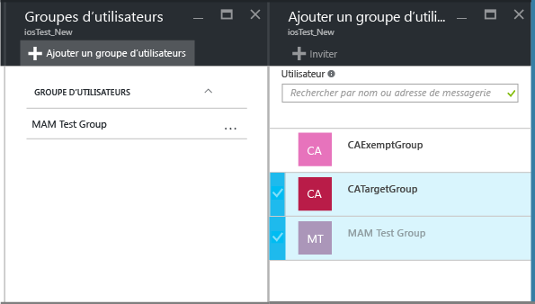

4.  Pour **supprimer un groupe d’utilisateurs**, mettez en surbrillance le groupe d’utilisateurs à supprimer, choisissez le bouton de sélection (...), puis choisissez **Supprimer**.

    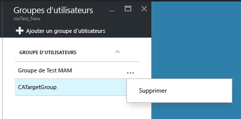

### Pour modifier les paramètres d’une stratégie

1.  Dans le panneau **Stratégie d’application**, choisissez la stratégie à modifier. Cette opération ouvre un panneau spécifique à la stratégie que vous venez de sélectionner.

    

2.  Choisissez **Paramètres de stratégie** pour ouvrir le panneau **Paramètres de stratégie**.

3.  Modifiez les paramètres, puis choisissez l’icône **Enregistrer** pour enregistrer les modifications.

    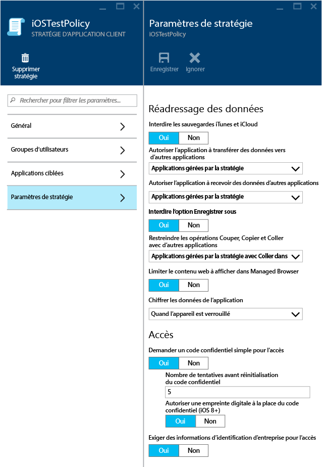

## Paramètres de stratégie
Pour afficher une liste complète des paramètres de stratégie pour iOS et Android, sélectionnez l’un des éléments suivants :

> [!div class="op_single_selector"]
- [Stratégies iOS](ios-mam-policy-settings.md)
- [Stratégies Android](android-mam-policy-settings.md)

## Étapes suivantes
[Surveiller l’état de la conformité et des utilisateurs](monitor-mobile-app-management-policies-with-microsoft-intune.md)

### Voir aussi
* [Ce qui se passe quand votre application Android est gérée par des stratégies GAM](user-experience-for-mam-enabled-android-apps-with-microsoft-intune.md)
* [Ce qui se passe quand votre application iOS est gérée par des stratégies GAM](user-experience-for-mam-enabled-ios-apps-with-microsoft-intune.md)

<!--HONumber=Oct16_HO3-->

