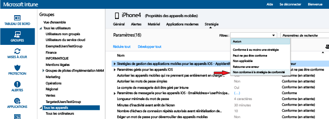

# Déployer et contrôler une stratégie de conformité d’appareils dans Microsoft Intune
## Déployer une stratégie de conformité
Déployez la stratégie de conformité que vous avez [créée](create-a-device-compliance-policy-in-microsoft-intune.md) vers un ou plusieurs groupes d’utilisateurs ou d’appareils de votre organisation.

1.  Dans l’espace de travail **Stratégie**, sélectionnez la stratégie à déployer, puis choisissez **Gérer le déploiement**.

2.  Dans la boîte de dialogue **Gérer le déploiement**, choisissez un ou plusieurs groupes vers lesquels vous voulez déployer la stratégie, puis choisissez **Ajouter > OK**.
 Vous pouvez déployer une stratégie de conformité pour des utilisateurs et/ou des appareils. Utilisez des groupes Active Directory que vous avez déjà créés et synchronisés avec Intune, ou créez ces groupes manuellement dans la console Intune. Pour en savoir plus sur la manière de déployer des stratégies, consultez [Déployer une stratégie de configuration](manage-settings-and-features-on-your-devices-with-microsoft-intune-policies.md).

Utilisez le récapitulatif de l’état et les alertes dans la page **Vue d’ensemble** de l’espace de travail **Stratégie** pour identifier les problèmes liés à la stratégie qui nécessitent votre attention. En outre, le **Tableau de bord** contient un récapitulatif de l'état.

> [!IMPORTANT]
> Si vous n'avez pas déployé de stratégie de conformité et que vous activez la stratégie d'accès conditionnel Exchange, l'accès sera autorisé à tous les appareils ciblés.

## Résolution des conflits de stratégie Intune
Des conflits de stratégie peuvent se produire quand plusieurs stratégies Intune sont appliquées à un appareil. Si les paramètres de stratégie se chevauchent, Intune résout les conflits en appliquant les règles suivantes :

-   Si les paramètres en conflit proviennent d'une stratégie de configuration Intune et d'une stratégie de conformité, les paramètres de la stratégie de conformité sont prioritaires sur ceux de la stratégie de configuration, même si ces derniers sont plus sécurisés.

-   Si vous avez déployé plusieurs stratégies de conformité, la plus sécurisée d'entre elles est utilisée.

## Analyser la stratégie de conformité

#### Pour afficher les appareils non conformes à une stratégie de conformité

1.  Dans la [console d’administration Microsoft Intune](https://manage.microsoft.com), choisissez **Groupes > Tous les appareils**.

2.  Double-cliquez sur le nom d’un appareil dans la liste des appareils.

3.  Choisissez l’onglet **Stratégie** pour afficher la liste des stratégies applicables à cet appareil.

4.  Dans la liste déroulante **Filtres**, sélectionnez **Non conforme à la stratégie de conformité**.

#### Pour afficher les rapports d’attestation d’intégrité

1.  Dans la [console d’administration Microsoft Intune](https://manage.microsoft.com), choisissez **Rapports**.

2.  Dans la page **Rapport d’attestation d’intégrité - Créer un rapport**, vous pouvez afficher un rapport avec toutes les données d’attestation de l’intégrité de Windows 10 recueillies par Intune. Vous pouvez aussi utiliser des filtres pour créer un rapport avec un sous-ensemble des données. Les filtres peuvent être basés sur le type d’appareil, le système d’exploitation ou seulement un sous-ensemble de points de données.

## Étapes suivantes
Vous pouvez désormais utiliser la stratégie de conformité avec des stratégies d'accès conditionnel pour contrôler l'accès aux services de votre organisation.

[Restreindre l’accès aux services de messagerie et O365](restrict-access-to-email-and-o365-services-with-microsoft-intune.md)

### Voir aussi
[Introduction aux stratégies de conformité des appareils dans Intune](introduction-to-device-compliance-policies-in-microsoft-intune.md)

<!--HONumber=Jul16_HO4-->

