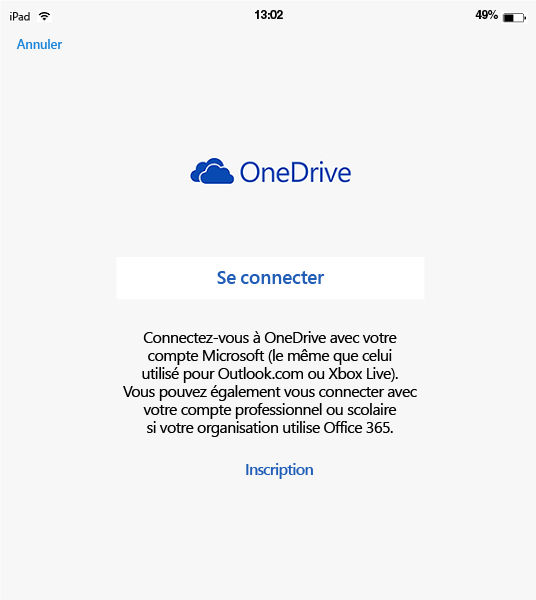
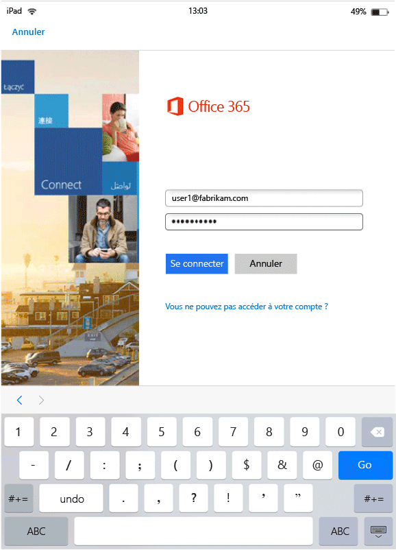

---
# required metadata

title: Expérience de l’utilisateur final pour des applications avec GAM activé | Microsoft Intune
description:
keywords:
author: karthikaraman
manager: jeffgilb
ms.date: 04/28/2016
ms.topic: article
ms.prod:
ms.service: microsoft-intune
ms.technology:
ms.assetid: b57e6525-b57c-4cb4-a84c-9f70ba1e8e19

# optional metadata

#ROBOTS:
#audience:
#ms.devlang:
ms.reviewer: jeffgilb
ms.suite: ems
#ms.tgt_pltfrm:
#ms.custom:

---

# Expérience de l’utilisateur final pour des applications avec GAM activé
Les stratégies de gestion des applications mobiles (GAM) sont appliquées uniquement lorsque les applications sont utilisées dans le contexte de travail.  Lisez les scénarios suivants pour comprendre le fonctionnement des applications gérées.
##  Accès à OneDrive sur un appareil iOS

1.  Lancez l’application  **OneDrive** pour afficher la page de connexion.

    

    > [!NOTE]
    > En règle générale, sur un appareil personnel, l’utilisateur final téléchargerait l’application.  Si l’appareil est géré par une solution GPM, vous pouvez déployer l’application sur l’appareil.

2.  Tapez votre nom d’utilisateur de compte professionnel. Vous êtes redirigé vers la page d’ **authentification O365** pour que vous y entriez vos informations d’identification professionnelles.

    

3.  Une fois vos informations d’identification correctement authentifiées par Azure AD, les stratégies GAM sont appliquées et il vous est demandé de redémarrer l’application **OneDrive** .

    

4.  Quand vous relancez l’application **OneDrive**, elle démarre avec les stratégies GAM activées. Vous êtes maintenant invité à définir un **code confidentiel** pour l’application (si vous avez configuré la stratégie pour cela).

    

5.  Une fois que vous avez défini et confirmé le code confidentiel, vous êtes en mesure d’accéder aux fichiers figurant dans votre espace **OneDrive Entreprise**.

    

    > [!NOTE] Lorsque vous modifiez une stratégie déployée, les modifications sont appliquées la prochaine fois que vous ouvrez l’application.

##  Accès à OneDrive sur un appareil Android

1.  Lancez l’application OneDrive pour afficher la page de connexion.

    > [!NOTE]
    > En règle générale, sur un appareil personnel, l’utilisateur final téléchargerait l’application.  Si l’appareil est géré par une solution GPM, vous pouvez déployer l’application sur l’appareil.

2.  Tapez votre nom d’utilisateur de compte professionnel. Vous êtes redirigé vers la page d’ **authentification O365** pour que vous y entriez vos informations d’identification professionnelles.

    

3.  Une fois vos informations d’identification correctement authentifiées par **Azure AD**, un message s’affiche, stipulant les instructions d’installation de l’application Portail d’entreprise, si celle-ci n’est pas encore installée sur l’appareil.  Appuyez sur **Obtenir l’application** pour continuer.

>[!NOTE]
>L’application Portail d’entreprise est obligatoire pour toutes les applications associées aux stratégies GAM sur les appareils Android. Pour les appareils qui ne sont pas inscrits dans Intune, l’application doit être installée sur l’appareil, mais le démarrage ou la connexion à l’application ne sont pas obligatoires.  

  

4.  Vous êtes maintenant dans le magasin **Google Play** , où vous pouvez télécharger et installer l’application **Portail d’entreprise** .

    L’application Portail d’entreprise permet de maintenir la protection et la sécurité des données.

    

5.  Une fois l’installation terminée, cliquez sur **Accepter** pour accepter les termes du contrat.

6.  L’application **OneDrive** démarre automatiquement.

7.  La prochaine fois que vous ouvrez OneDrive, une invite s’affiche pour que vous définissiez un **code confidentiel**, à condition que les paramètres de stratégie soient définis pour exiger un code confidentiel pour accéder à l’application **OneDrive** .

    

8.  Une fois le code confidentiel défini et confirmé, vous pouvez continuer à utiliser l’application **OneDrive**, qui est désormais gérée par les stratégies d’application.

##  Utilisation d’applications avec prise en charge de plusieurs identités
Microsoft Word est utilisé comme exemple dans ce scénario.

1.  Ouvrez l’application **Word** sur votre appareil. Nous utilisons un appareil iOS pour illustrer ces étapes.

2.  Appuyez sur **Nouveau** pour créer un document Word.

    

3.  Tapez une phrase de votre choix.  Quand vous essayez d’enregistrer ce document, des emplacements personnels et professionnels apparaissent comme options pour enregistrer le document que vous venez de créer.  À ce stade, les stratégies d’application ne sont pas encore appliquées dans la mesure où ce contexte professionnel/personnel n’est pas encore établi.

4.  Enregistrez le document dans l’emplacement OneDrive Entreprise. Il est désormais marqué en tant que données d’entreprise et les restrictions de stratégie s’appliquent.

    

5.  Ouvrez le document que vous avez enregistré dans votre emplacement professionnel.  Copiez le texte, ouvrez votre compte **Facebook** personnel et essayez de coller le texte copié.  Normalement, vous ne pouvez pas coller le contenu dans la nouvelle publication Facebook. L’option Coller n’est pas grisée, mais rien ne se passe quand vous appuyez sur **Coller**.

    

    

6.  À présent, répétez les étapes 2 et 3 pour créer un autre document. Tapez une phrase mais, au lieu d’enregistrer le document dans votre emplacement professionnel, enregistrez-le dans votre emplacement personnel, par exemple dans **OneDrive - Personnel**.

    

7.  Ouvrez le document personnel enregistré.  Copiez le texte, ouvrez l’application **Facebook** et essayez d’y coller le texte copié. Vous constatez que vous pouvez coller ce contenu dans une publication Facebook.

    

##  Gestion des comptes d'utilisateur

Intune prend en charge le déploiement de stratégies GAM vers un seul compte d’utilisateur par appareil. Si un appareil a plusieurs comptes professionnels, un seul compte est géré par les stratégies GAM.

Il est possible que le deuxième utilisateur soit bloqué sur l’appareil, mais cela dépend de l’application utilisée. Toutefois, dans tous les cas, seul le premier utilisateur sujet aux stratégies GAM est affecté par la stratégie.

Si un appareil a plusieurs comptes d’utilisateur existants avant le déploiement des stratégies, le premier compte vers lequel les stratégies GAM sont déployées est géré par les stratégies GAM Intune.

**Microsoft Word**, **Excel** et **PowerPoint** ne bloquent pas un deuxième compte d’utilisateur, mais celui-ci n’est pas affecté par les stratégies GAM.  

Pour les **applications OneDrive et Outlook**, vous ne pouvez utiliser qu’un seul compte professionnel.  L’ajout de plusieurs comptes professionnels est bloqué sur ces applications.  Toutefois, vous pouvez supprimer un utilisateur et en ajouter un autre sur l’appareil.

Lisez l’exemple de scénario ci-dessous pour mieux comprendre le comportement quand il existe plusieurs comptes d’utilisateur.

L’utilisateur A travaille pour deux sociétés : **Société X** et **Société Y**. L’utilisateur A a un compte professionnel pour chaque société, et tous deux utilisent Intune pour déployer des stratégies GAM. **Société X** déploie des stratégies GAM **avant** **Société Y**. Le compte associé à **Société X** est soumis à la stratégie GAM, contrairement au compte associé à Société Y. Si vous souhaitez que le compte d’utilisateur associé à Société Y soit géré par les stratégies GAM, vous devez supprimer le compte d’utilisateur associé à Société X.
### Ajout d’un deuxième compte
#### IOS
Sur un appareil iOS, si vous essayez d’ajouter un deuxième compte professionnel, un message de blocage peut s’afficher.  Une option permettant de supprimer le compte existant et d’en ajouter un nouveau apparaît également. Vous pouvez procéder ainsi en cliquant sur **Oui**.

####  Android
Sur un appareil Android, un message de blocage peut s’afficher avec des instructions permettant de supprimer le compte existant et d’en ajouter un nouveau.  Sur les appareils Android, pour supprimer le compte existant, accédez à **Paramètres &gt;Général &gt; Gestionnaire d’applications &gt;Portail d’entreprise et sélectionnez « Effacer les données »**.

##  Affichage de fichiers multimédias avec l’application de partage Rights Management
Pour afficher les fichiers image, AV et PDF de la société sur des appareils Android, utilisez l’[application de partage Microsoft Rights Management (RMS)](https://play.google.com/store/apps/details?id=com.microsoft.ipviewer).

Vous pouvez télécharger cette application à partir de la boutique Google Play.  Une fois l’application installée sur votre appareil, lancez-la et authentifiez-vous avec vos informations d’identification professionnelles. Vous devriez maintenant pouvoir afficher les fichiers protégés et non protégés à partir d’autres applications gérées par une stratégie.

**Appareils Android non inscrits dans Intune**

Avant de pouvoir utiliser l’application de partage RMS pour afficher les fichiers à partir d’autres applications gérées par Intune, lancez l’application RMS et authentifiez-vous avec votre compte professionnel.  Lorsque vous vous connectez, vous voyez le message suivant **seulement si vous n’avez pas de licence RMS** :

**Authentification réussie – Vous pouvez désormais afficher les fichiers d’entreprise, mais votre organisation n’est pas configurée pour vous permettre de protéger des fichiers. Contactez votre administrateur pour plus d’informations.**

Cela ne vous empêche pas d’utiliser l’application de partage RMS pour afficher les fichiers de l’entreprise. Vous pouvez encore ouvrir et afficher les fichiers de l’entreprise à partir d’autres applications gérées par Intune, et les stratégies GAM s’appliquent encore.  Ce message stipule que vous ne serez pas en mesure d’ajouter les fonctionnalités de protection supplémentaires fournies par l’application de partage RMS.  Vous devez disposer d’une licence RMS pour ajouter une protection à vos fichiers. Pour en savoir plus sur les fonctionnalités de protection de fichiers RMS, consultez [Protéger un fichier sur un appareil](https://docs.microsoft.com/en-us/rights-management/rms-client/sharing-app-protect-in-place) et [Protéger un fichier que vous partagez par courrier électronique](https://docs.microsoft.com/en-us/rights-management/rms-client/sharing-app-protect-by-email).

### Voir aussi
[Créer et déployer des stratégies de gestion des applications mobiles à l’aide de Microsoft Intune](create-and-deploy-mobile-app-management-policies-with-microsoft-intune.md)

<!--HONumber=Jun16_HO1-->

