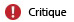
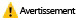

# Recevoir des alertes Microsoft Intune
Les alertes vous tiennent informé de ce qu’il se passe dans Microsoft Intune.

Par exemple, les alertes peuvent vous informer des événements suivants :

-   Problème au niveau du connecteur Exchange affectant la gestion des appareils mobiles

-   Découverte d'un logiciel malveillant sur un ordinateur

-   Détection d’un conflit entre deux stratégies Intune

## Fonctionnement des alertes
Les alertes générées varient en fonction des **types d’alerte**, c’est-à-dire d’un ensemble de règles préconfigurées intégrées à Intune. Par exemple, le type d'alerte **Le stockage cloud dispose de 10 % ou moins d'espace libre** vous avertit qu'il vous manque de l'espace pour stocker vos applications dans le cloud. Pour chaque type d'alerte, vous pouvez configurer des propriétés, en activer ou en désactiver. Par exemple, pour le type d'alerte évoqué ci-dessus, vous pouvez configurer les éléments suivants :

-   **État :** indique si ce type d'alerte est activé ou désactivé.

-   **Gravité :** indique la sévérité de l'alerte.

|Gravité|Détails|
|--------|-------|
    ||Indique l'existence d'un problème sérieux que vous devez examiner au plus vite. Il peut s'agir, par exemple, de la détection d'un logiciel malveillant sur un ordinateur.|
    ||Indique la présence d'un problème qui n'est pas sérieux pour le moment, mais qui pourrait le devenir si vous n'y prêtez pas attention. Il peut s'agir, par exemple, de mises à jour de sécurité en attente d'installation.|
    ||Indique des informations non essentielles à vos activités comme, par exemple, la mise à disposition d'une nouvelle version du connecteur Exchange.|

D'autres types d'alerte peuvent contenir d'autres éléments configurables, par exemple, le pourcentage d'appareils devant être affectés par un problème avant qu'une alerte soit générée.

**Quand les critères d’un type d’alerte sont remplis, une alerte est générée et s’affiche dans la console d’administration Intune.**

Par ailleurs, vous pouvez configurer Intune de façon à être averti par courrier électronique quand une alerte est générée.

## Configuration d'alertes
Dans la [console d’administration Microsoft Intune](https://manage.microsoft.com), choisissez **Administration** &gt; **Alertes et notifications**, puis choisissez l’une des tâches de configuration suivantes :

|Tâche|Description|
|--------|---------------|
|**Types d’alerte**|Choisissez le type d'alerte que vous voulez configurer, puis procédez de l'une des façons suivantes :  Choisissez **Configurer**. Dans la boîte de dialogue **Configurer le type d’alerte** , configurez les paramètres de votre choix, puis choisissez **OK**.  **Activez** ou **désactivez** l’alerte.  Développez le nœud **Types d’alerte** et choisissez une catégorie pour afficher uniquement les types d’alerte de cette catégorie.|
|**Destinataires**|Choisissez **Ajouter** pour ajouter une nouvelle adresse e-mail destinée à recevoir les notifications par e-mail que vous configurez.  Vous pouvez aussi **modifier** ou **supprimer** des destinataires existants.  Pour recevoir des notifications, vous devez aussi ajouter cette adresse e-mail comme destinataire sous **Règles de notification**.|
|**Règles de notification**|Permet de configurer des règles qui définissent le ou les destinataires d'une alerte par courrier électronique. Voici les possibilités qui s'offrent à vous :  **Choisir une règle existante** : choisissez une règle, puis choisissez **Sélectionner les destinataires**. Vous pouvez ensuite sélectionner tous les destinataires appelés à recevoir un message électronique dès qu'une alerte conforme à cette règle est générée.  **Créer une règle** : entrez un nom pour la règle, sélectionnez les catégories d’alerte et la gravité d’alerte qui s’appliquent aux règles, sélectionnez les groupes d’appareils auxquels la règle s’applique et sélectionnez les utilisateurs qui reçoivent un e-mail quand une alerte est générée.  Vous pouvez aussi **activer**, **désactiver**, **modifier**ou **supprimer** une règle existante.|

## Utilisation d'alertes
Utilisez les options suivantes pour gérer les alertes à partir de la console d'administration Intune.

|Option|Description|
|----------|---------------|
|**Afficher les alertes actives**|Choisissez parmi :  **Afficher une synthèse des alertes** : dans l’espace de travail **Tableau de bord**, les principales erreurs sont affichées dans le volet Alertes. Choisissez le volet pour afficher des informations plus détaillées.  Par ailleurs, vous pouvez afficher une synthèse des alertes dans la page **Vue d'ensemble** de l'espace de travail **Alertes** .  **Afficher toutes les alertes** : dans l’espace de travail **Alertes**, choisissez **Toutes les alertes**.|
|**Consulter les remarques**|Choisissez parmi :  Dans l’espace de travail **Tableau de bord**, choisissez **Remarques**.  Dans l’espace de travail **Alertes**, choisissez **Toutes les alertes** &gt; **Remarques**.|
|**Fermeture d'une alerte**|Dans la liste des alertes, sélectionnez l’alerte à fermer, puis choisissez **Fermer l’alerte**.  Les alertes fermées sont définitivement supprimées au bout de 90 jours.|
|**Réactiver une alerte fermée**|Dans la liste des alertes, définissez le menu déroulant **Filtres** sur **Fermé**.  Dans la liste des alertes fermées, sélectionnez l’alerte que vous souhaitez réactiver, puis choisissez **Réactiver l’alerte**.|
Les alertes Intune restent actives tant que :

-   le problème à l'origine de l'alerte n'a pas été résolu ;

-   vous ne fermez pas l'alerte manuellement ;

-   les 45 jours suivant la génération de l'alerte ne sont pas écoulés.

> [!TIP]
> Si une même alerte est générée par des appareils qui exécutent des systèmes d'exploitation différents, vous risquez de voir apparaître plusieurs versions de la même alerte dans la liste des alertes.

### Voir aussi
[Analyse et rapports avec Microsoft Intune](monitoring-and-reports-with-microsoft-intune.md)

<!--HONumber=Jul16_HO4-->

