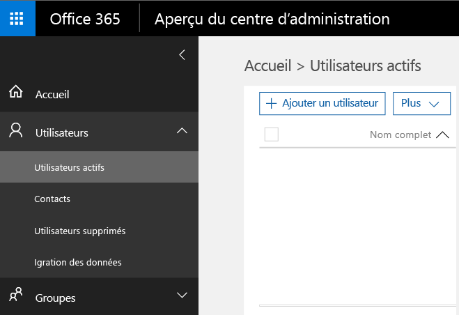
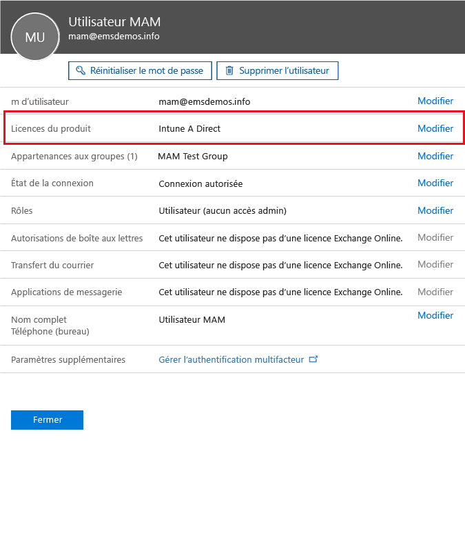
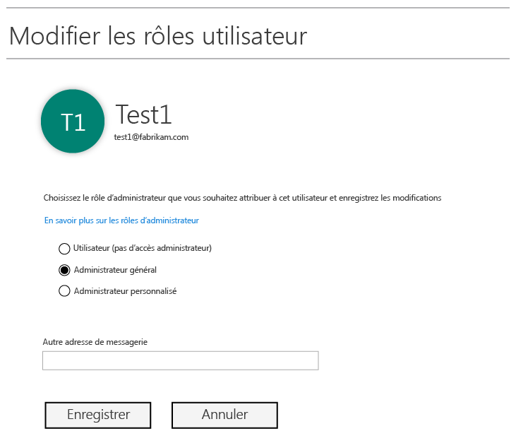
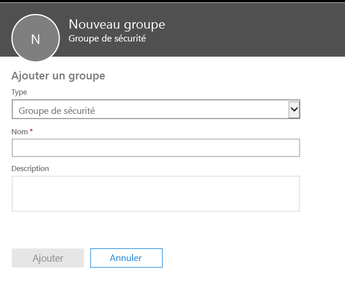
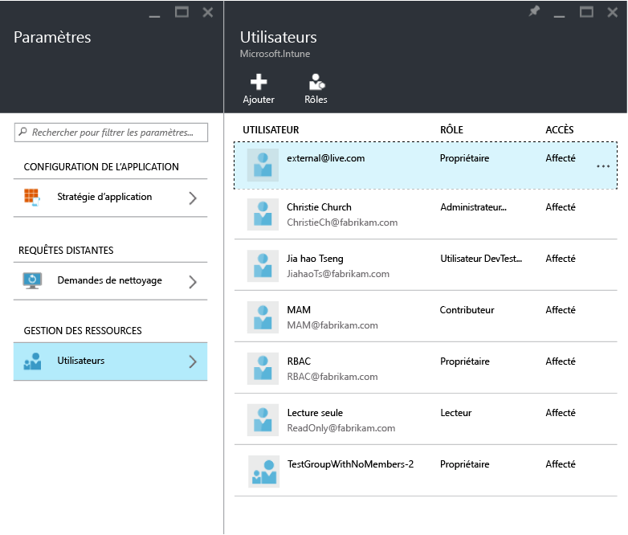
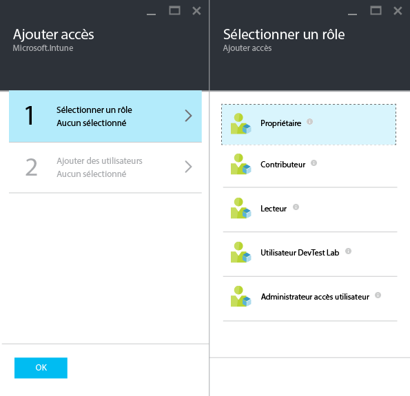
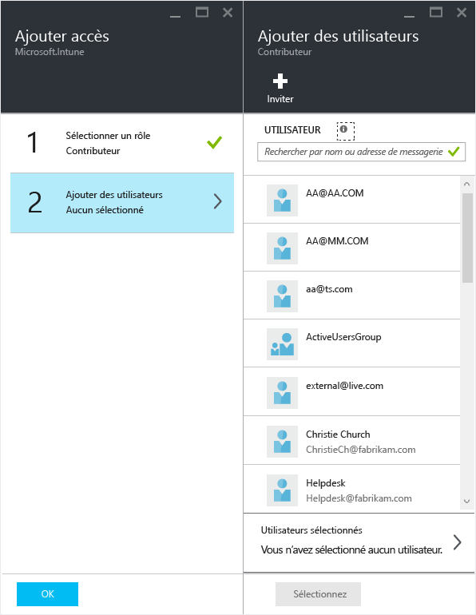

# Se préparer à configurer des stratégies de gestion des applications mobiles avec Microsoft Intune
Cette rubrique décrit ce que vous devez faire avant de pouvoir créer des stratégies de gestion des applications mobiles dans le portail Azure.

Le portail Azure est la nouvelle console d’administration pour créer des stratégies de gestion des applications mobiles. Nous vous recommandons d’utiliser ce portail pour créer des stratégies de gestion des applications mobiles. Le portail Azure prend en charge les scénarios de gestion des applications mobiles suivants :
- Appareils mobiles inscrits dans Intune
- Appareils gérés par une solution de gestion des appareils mobiles tierce
- Appareils qui ne sont gérés par aucune solution de gestion des appareils mobiles (BYOD)

Si vous ne connaissez pas le portail Azure, lisez la rubrique [Portail Azure pour les stratégies de gestion des applications mobiles Microsoft Intune](azure-portal-for-microsoft-intune-mam-policies.md) pour bénéficier d’un aperçu rapide.

>[!IMPORTANT]

> Si vous utilisez la console d’administration Intune pour gérer vos appareils, vous pouvez créer des stratégies de gestion des applications mobiles qui prennent en charge des applications pour les appareils inscrits dans Intune à l’aide de la console d’administration Intune. Mais nous vous recommandons d’utiliser le portail Azure, même pour les appareils qui sont inscrits dans Intune. Pour obtenir des instructions sur la création d’une stratégie de gestion des applications mobiles à l’aide de la console d’administration Intune, consultez [Configurer et déployer des stratégies de gestion des applications mobiles dans la console Microsoft Intune](configure-and-deploy-mobile-application-management-policies-in-the-microsoft-intune-console.md).

> La console d’administration Intune peut ne pas afficher tous les paramètres de stratégie de gestion des applications mobiles. Si vous créez ces stratégies à la fois sur la console d’administration Intune et le portail Azure, la stratégie dans le portail Azure est appliquée aux applications et déployée sur les utilisateurs.
> Les stratégies de gestion des applications mobiles créées dans la console d’administration Intune ne peuvent pas être importées dans le portail Azure.  Elles doivent être recréées dans le portail Azure.

##  Plateformes prises en charge
- iOS 8.1 ou version ultérieure

- Android 4 ou version ultérieure

Les appareils Windows ne sont pas pris en charge actuellement.
##  Applications prises en charge
* **Applications Microsoft :** ces applications intègrent le Kit de développement logiciel (SDK) de l’application Intune et ne nécessitent aucun traitement supplémentaire avant d’appliquer les stratégies de gestion des applications mobiles.
Pour afficher la liste complète des applications Microsoft prises en charge, accédez à la [Galerie d’applications mobiles Microsoft Intune](https://www.microsoft.com/en-us/server-cloud/products/microsoft-intune/partners.aspx) dans la page des partenaires d’application Microsoft Intune. Cliquez sur l’application pour afficher les scénarios et les plateformes pris en charge et savoir si l’application prend en charge plusieurs identités.
* **Applications métier de votre organisation :** vous devez préparer les applications pour inclure le Kit de développement logiciel (SDK) de l’application Intune avant de pouvoir appliquer les stratégies de gestion des applications mobiles.

  * Pour les appareils gérés par Intune, consultez [Décider comment préparer les applications pour la gestion des applications mobiles](decide-how-to-prepare-apps-for-mobile-application-management-with-microsoft-intune.md).
  * Pour les appareils qui ne sont pas gérés comme des appareils appartenant à un employé ou pour les appareils qui sont gérés par une solution tierce de gestion des appareils mobiles, consultez [Protéger les données et applications métier sur les appareils non inscrits dans Intune](protect-line-of-business-apps-and-data-on-devices-not-enrolled-in-microsoft-intune.md).

*Avant* de pouvoir configurer des stratégies de gestion des applications mobiles, vous avez besoin des éléments suivants :

-   Un abonnement à Microsoft Intune.    Les utilisateurs ont besoin de licences [!INCLUDE[wit_nextref](../includes/wit_nextref_md.md)] pour obtenir des applications avec une stratégie de gestion des applications mobiles.

-   Un abonnement Office 365, qui est requis pour les éléments suivants :
  - Appliquer des stratégies de gestion des applications mobiles aux applications prenant en charge plusieurs identités.
  - Créer des comptes professionnels SharePoint Online et Exchange Online. Les versions locales d’Exchange et de SharePoint ne sont pas prises en charge.
-   Configuration de Skype Entreprise Online pour l’authentification moderne. Pour plus d’informations, consultez [Activer l’authentification moderne](http://social.technet.microsoft.com/wiki/contents/articles/34339.skype-for-business-online-enable-your-tenant-for-modern-authentication.aspx.md).

- Azure Active Directory (Azure AD) pour créer des utilisateurs. Azure AD authentifie les utilisateurs lorsqu’ils ouvrent l’application et entrent leurs informations d’identification professionnelles.

    > [!NOTE]
    > Si vous configurez des utilisateurs à l’aide de la console [!INCLUDE[wit_nextref](../includes/wit_nextref_md.md)], n’oubliez pas que la configuration de stratégie de gestion des applications mobiles est transférée vers le portail Azure. Pour utiliser ce portail, vous devez configurer des groupes d’utilisateurs Azure AD à l’aide du portail Office 365.

## Créer des utilisateurs et attribuer des licences Microsoft Intune

1. Vérifiez que vous êtes inscrit à Intune. Vous êtes déjà inscrit à [!INCLUDE[wit_nextref](../includes/wit_nextref_md.md)] si vous utilisez actuellement [!INCLUDE[wit_nextref](../includes/wit_nextref_md.md)] pour gérer vos appareils.  Vous êtes également inscrit à [!INCLUDE[wit_nextref](../includes/wit_nextref_md.md)] si vous avez acheté une licence Enterprise Mobility Suite (EMS). Si vous essayez [!INCLUDE[wit_nextref](../includes/wit_nextref_md.md)] pour tester les fonctionnalités de gestion des applications mobiles, vous pouvez obtenir un compte d’essai sur la [page web de Microsoft Intune](http://www.microsoft.com/en-us/server-cloud/products/microsoft-intune/).

    Pour vérifier si vous êtes inscrit à [!INCLUDE[wit_nextref](../includes/wit_nextref_md.md)], dans le portail Office, accédez à la page de **facturation**.  [!INCLUDE[wit_nextref](../includes/wit_nextref_md.md)] doit être indiqué comme **Actif** dans vos abonnements.

2.  Connectez-vous au [portail Office](http://portal.office.com) à l’aide de vos informations d’identification d’administrateur.

3.  Accédez à la page **Utilisateurs actifs** pour ajouter des utilisateurs et attribuer des licences [!INCLUDE[wit_nextref](../includes/wit_nextref_md.md)].

    

    

4.  Pour permettre à un utilisateur d’accéder au portail Office, au portail Azure AD et au portail Azure, affectez-lui le **rôle d’administrateur général**.

    

5.  Les stratégies de gestion des applications mobiles sont déployées pour des groupes d’utilisateurs dans Azure Active Directory. Pour créer des groupes d’utilisateurs pour vos stratégies de gestion des applications mobiles, accédez à la page **Groupes** du portail Office et choisissez l’option **Ajouter un groupe** dans le menu du haut pour créer un groupe de sécurité.  Tapez un nom et une description, puis cliquez sur **Créer**. Lorsque le groupe est créé, vous pouvez y ajouter des utilisateurs en cliquant sur **Modifier les membres**. Le groupe de sécurité est créé dans Azure Active Directory.

    

Le tableau suivant répertorie les rôles et autorisations que vous pouvez attribuer aux utilisateurs administrateurs.

|||
|--|----|
|**Rôle**|**Autorisations**|
|Administrateur général (portail Office 365)|Accès au portail Office 365 et au portail Azure AD.  Accès au portail Azure (permet d’effectuer à la fois des tâches de gestion de rôles et d’applications mobiles).|
|Propriétaire (portail Azure)|Accès au portail Azure (permet d’effectuer à la fois des tâches de gestion de rôles et d’applications mobiles).|
|Collaborateur (portail)|Accès au portail Azure (permet uniquement d’effectuer des tâches de gestion d’applications mobiles).|

## Affecter le rôle de collaborateur à un utilisateur

Les administrateurs généraux ont accès au [portail Azure](https://portal.azure.com).  Si vous voulez que d’autres utilisateurs administrateurs puissent configurer des stratégies et effectuer d’autres tâches de gestion des applications mobiles, vous pouvez leur affecter le rôle de collaborateur :

1.  Dans le panneau **Paramètres**, dans la section **Gestion des ressources**, cliquez sur **Utilisateurs**.

    

2.  Cliquez sur **Ajouter** pour ouvrir le panneau **Ajouter un accès** .

3.  Cliquez sur **Sélectionner un rôle**, puis sur **Collaborateur**.

    

4.  Cliquez sur **Ajouter un utilisateur**, puis recherchez l’utilisateur en utilisant son nom ou son adresse électronique. Les utilisateurs qui figurent dans cette liste sont les 1 000 premiers utilisateurs que vous avez créés précédemment dans Azure AD à l’aide du portail Office. Cliquez sur **OK** dans le panneau **Ajouter un accès** pour enregistrer et attribuer le rôle à l’utilisateur.

    

    > [!IMPORTANT]
    > Si vous sélectionnez un utilisateur qui n’a pas de licence [!INCLUDE[wit_nextref](../includes/wit_nextref_md.md)], il ne pourra pas accéder au portail.

## Étapes suivantes
[Créer et déployer des stratégies de gestion des applications mobiles à l’aide de Microsoft Intune](create-and-deploy-mobile-app-management-policies-with-microsoft-intune.md)

<!--HONumber=Jul16_HO4-->

