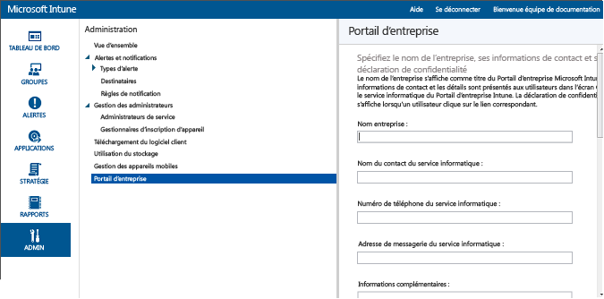

---
# required metadata

title: Se préparer à inscrire des appareils | Microsoft Intune
description:
keywords:
author: NathBarn
manager: jeffgilb
ms.date: 04/28/2016
ms.topic: article
ms.prod:
ms.service: microsoft-intune
ms.technology:
ms.assetid: 44fd4af0-f9b0-493a-b590-7825139d9d40

# optional metadata

#ROBOTS:
#audience:
#ms.devlang:
ms.reviewer: jeffgilb
ms.suite: ems
#ms.tgt_pltfrm:
#ms.custom:

---

# Se préparer à inscrire des appareils dans Microsoft Intune
Pour permettre aux employés d’inscrire des appareils mobiles (notamment [Android](set-up-android-management-with-microsoft-intune.md), [iOS et Mac](set-up-ios-and-mac-management-with-microsoft-intune.md), [Windows Phone](set-up-windows-phone-management-with-microsoft-intune.md), ainsi que des [PC Windows](set-up-windows-device-management-with-microsoft-intune.md)) dans Intune, vous devez activer l’inscription d’appareils. Pour autoriser l’inscription, vous devez définir une autorité de gestion des appareils mobiles, configurer le portail d’entreprise Intune, attribuer des licences et activer l’inscription pour la plateforme d’appareils.

## Définir l'autorité de gestion des appareils mobiles
L’autorité de gestion d’appareils mobiles définit le service de gestion habilité à gérer un ensemble d’appareils. Les options en matière d’autorité de gestion des appareils mobiles incluent Intune en version autonome et Configuration Manager avec Intune. Si vous définissez Configuration Manager en tant qu’autorité de gestion, aucun autre service ne peut être utilisé pour la gestion des appareils mobiles.

>[!IMPORTANT]
> Réfléchissez bien avant de décider de gérer les appareils mobiles à l’aide d’Intune uniquement (service en ligne) ou à l’aide de System Center Configuration Manager avec Intune (solution logicielle locale avec service en ligne). Une fois qu’elle est définie, l’autorité de gestion des appareils mobiles n’est pas modifiable.

1.  Dans la [console d’administration Microsoft Intune](http://manage.microsoft.com), choisissez **Administration** &gt; **Gestion des appareils mobiles**.

2.  Dans la liste **Tâches** , cliquez sur **Définir l'autorité de gestion des appareils mobiles**. La boîte de dialogue **Définir l'autorité MDM** s'ouvre.

    

3.  Intune vous invite à confirmer que vous souhaitez définir Intune comme autorité MDM. Cochez la case, puis choisissez **Oui** pour utiliser Microsoft Intune pour gérer les appareils mobiles.

## Configurer le portail d’entreprise Intune

Le portail d’entreprise Intune permet aux utilisateurs d’accéder aux données de l’entreprise et d’effectuer des tâches courantes, notamment l’inscription d’appareils, l’installation d’applications et d’accéder à des informations d’assistance fournies par le département informatique.

> [!TIP]Quand vous personnalisez le portail d’entreprise, les configurations s’appliquent à la fois au site web du portail d’entreprise et aux applications Portail d’entreprise.

La personnalisation du Portail d’entreprise permet de fournir une expérience familière et utile à vos utilisateurs finaux. Pour ce faire, connectez-vous à la [console d’administration Microsoft Intune](https://manage.microsoft.com) comme administrateur du service ou client, choisissez **Administration** &gt; **Portail d’entreprise** et configurez les paramètres du portail d’entreprise.

#### Informations de contact et déclaration de confidentialité de l'entreprise

Le nom de l’entreprise s’affiche comme titre du Portail d’entreprise. Les informations de contact et les détails sont présentés aux utilisateurs dans l’écran Contacter le service informatique du Portail d’entreprise. La déclaration de confidentialité s’affiche lorsqu’un utilisateur clique sur le lien correspondant.

|Nom du champ|Longueur maximale|Plus d'informations|
    |----------|------------------------|----------------|
    |Nom de la société|40|Ce nom s’affiche comme titre du Portail d’entreprise.|
    |Nom du contact du service informatique|40|Ce nom s’affiche dans la page **Contacter le service informatique**.|
    |Numéro de téléphone du service informatique|20|Ce numéro s’affiche dans la page **Contacter le service informatique**.|
    |Adresse de messagerie du service informatique|40|Cette adresse s’affiche dans la page **Contacter le service informatique**. Vous devez entrer une adresse de messagerie valide au format **alias@nomdedomaine.com**.|
    |Informations supplémentaires|120|S’affiche dans la page **Contacter le service informatique**.|
    |URL de la déclaration de confidentialité de l'entreprise|79|Vous pouvez spécifier la déclaration de confidentialité de votre entreprise qui s’affiche lorsque les utilisateurs cliquent sur les liens de confidentialité à partir du Portail d’entreprise. Vous devez entrer une URL valide au format https://www.contoso.com.|

#### Contacts du support
Les utilisateurs peuvent voir le lien du site web de support dans le Portail d’entreprise et l’utiliser pour accéder au support en ligne.

|Nom du champ|Longueur maximale|Plus d'informations|
    |----------|------------------------|----------------|
    |URL du site Web de support technique|150|Si vous avez un site web de support technique auquel vous aimeriez que les utilisateurs accèdent, spécifiez cette URL ici. L’URL doit être au format https://www.contoso.com. Si vous ne spécifiez aucune URL, rien ne s’affiche pour le site web de support technique dans la page **Contacter le service informatique** du Portail d’entreprise.|
    |Nom du site web|40|Il s'agit du nom convivial qui s'affiche pour l'URL permettant d'accéder au site Web de support technique. Si vous spécifiez l’URL d’un site web de support technique sans aucun nom convivial, **Accéder au site web du service informatique** apparaît dans la page **Contacter le service informatique** du Portail d’entreprise.|

#### Personnalisation de l’image de la société

Vous pouvez personnaliser votre Portail d’entreprise avec le logo et le nom de votre société, un thème chromatique et un arrière-plan.

|Nom du champ|Plus d'informations|
    |----------|----------------|
    |Couleur de thème|Sélectionnez une couleur de thème à appliquer au Portail d’entreprise.|
    |Inclure le logo de l'entreprise|Lorsque vous activez cette option, vous pouvez télécharger le logo de votre entreprise pour qu’il apparaisse sur le Portail de celle-ci. Vous pouvez télécharger deux logos : un qui s’affiche quand l’arrière-plan du Portail d’entreprise est blanc, et un autre qui s’affiche quand l’arrière-plan du Portail d’entreprise utilise la couleur de thème que vous avez sélectionnée. Chaque logo doit être un fichier de type .png ou .jpg, et avoir une résolution maximale de 400 x 100 pixels et une taille inférieure ou égale à 750 Ko .|
    |Choisir un arrière-plan pour l'application Portail d'entreprise [!INCLUDE[win8_client_2](../includes/win8_client_2_md.md)]|Ce paramètre affecte l’arrière-plan de l’application Portail d’entreprise [!INCLUDE[win8_client_2](../includes/win8_client_2_md.md)] uniquement.|

Après avoir enregistré vos modifications, vous pouvez utiliser les liens proposés au bas de la page **Portail d’entreprise** de la console d’administration pour afficher le site web du Portail d’entreprise. Ces liens ne peuvent pas être modifiés. Lorsqu’un utilisateur se connecte, ces liens présentent vos abonnements dans le Portail d’entreprise.

## Attribuer une licence d’utilisateur Intune

Vous utilisez le **portail de gestion Office 365** pour ajouter manuellement des utilisateurs basés sur le cloud et attribuer des licences aux comptes d’utilisateur basés sur le cloud et aux comptes synchronisés à partir de votre annuaire Active Directory local vers Azure AD.

1.  Connectez-vous au [portail de gestion Office 365](https://portal.office.com/Admin/Default.aspx) à l’aide de vos informations d’identification d’administrateur du client.

2.  Sélectionnez le compte d’utilisateur auquel vous souhaitez attribuer une licence utilisateur Intune et cochez la case **Microsoft Intune** dans les propriétés du compte utilisateur.

3.  Le compte d’utilisateur est alors ajouté au groupe d’utilisateurs Microsoft Intune qui autorise l’utilisateur à utiliser le service et à inscrire ses appareils pour les gérer.

## Configurer la gestion des appareils
Après avoir configuré l’autorité de gestion des appareils mobiles, vous devez configurer la gestion des appareils pour les systèmes d’exploitation que votre organisation souhaite prendre en charge. Les étapes requises pour configurer la gestion des appareils varient selon le système d’exploitation. Par exemple, le système d’exploitation Android ne vous demande d’effectuer aucune opération dans la console d’administration Intune. En revanche, iOS et Windows nécessitent une relation d’approbation entre les appareils et Intune pour autoriser la gestion.

> [!div class="op_single_selector"]
- [Configuration de la gestion Android avec Microsoft Intune](set-up-android-management-with-microsoft-intune.md)
- [Configurer la gestion iOS et MAC avec Microsoft Intune](set-up-ios-and-mac-management-with-microsoft-intune.md)
- [Configurer la gestion de Windows Phone avec Microsoft Intune](set-up-windows-phone-management-with-microsoft-intune.md)
- [Configurer la gestion des périphériques Windows avec Microsoft Intune](set-up-windows-device-management-with-microsoft-intune.md)

Vous pouvez également effectuer les opérations suivantes :
 - Utiliser le [compte de gestionnaire d’inscription d’appareil](enroll-corporate-owned-devices-with-the-device-enrollment-manager-in-microsoft-intune.md) pour inscrire de nombreux appareils
 - [Indiquer les appareils d’entreprise avec des numéros IMEI](specify-corporate-owned-devices-with-international-mobile-equipment-identity-imei-numbers.md) pour mieux inscrire les appareils et cibler la stratégie

<!--HONumber=Jun16_HO1-->

