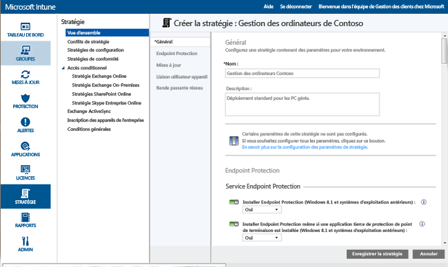
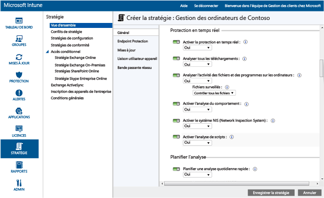
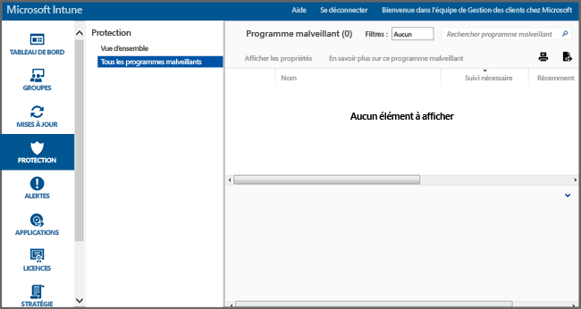

---
# required metadata

title: Endpoint Protection pour PC Windows| Microsoft Intune
description:
keywords:
author: NathBarn
manager: jeffgilb
ms.date: 04/28/2016
ms.topic: article
ms.prod:
ms.service: microsoft-intune
ms.technology:
ms.assetid: 002241bf-6cd0-4c75-a4f0-891ac7e6721a

# optional metadata

#ROBOTS:
#audience:
#ms.devlang:
ms.reviewer: jeffgilb
ms.suite: ems
#ms.tgt_pltfrm:
#ms.custom:

---

# Contribuer à la sécurisation des PC Windows avec Endpoint Protection pour Microsoft Intune
Microsoft Intune vous permet de sécuriser vos ordinateurs gérés de plusieurs façons, notamment avec Endpoint Protection qui offre une protection en temps réel contre les menaces posées par les programmes malveillants, maintient à jour les définitions de logiciels malveillants et analyse automatiquement les ordinateurs. Endpoint Protection fournit également des outils qui vous aident à gérer et à surveiller les attaques de logiciels malveillants.

Si vous n’avez pas encore installé le client Intune sur vos ordinateurs, consultez [Installer le client de PC Windows avec Microsoft Intune](install-the-windows-pc-client-with-microsoft-intune.md).

Utilisez les informations des sections suivantes pour configurer, déployer et surveiller Endpoint Protection.

## Choisir quand utiliser Endpoint Protection
En tant qu'administrateur informatique, l'une de vos principales priorités est de maintenir les ordinateurs que vous gérez libres de tous programmes malveillants et virus. Avant de déployer Intune sur les PC Windows de votre organisation, vous devez déterminer comment protéger les ordinateurs en sélectionnant l’une des options suivantes et en configurant ses paramètres de stratégie associée :

|Je veux :|Paramètres de stratégie Endpoint Protection|Plus d'informations|
|--------------|---------------------------------------|--------------------|
|Utiliser Microsoft Intune Endpoint Protection uniquement si aucune application tierce de protection de point de terminaison n’est installée.  Vous pouvez utiliser Microsoft Intune Endpoint Protection sur tous les ordinateurs sur lesquels aucune application tierce de protection de point de terminaison n’est installée.|Installer Endpoint Protection = **Oui**  Activer Endpoint Protection = **Oui**  Installer Endpoint Protection même si une application tierce de protection de point de terminaison est installée = **Non**|Si une application tierce de protection de point de terminaison est détectée, Microsoft Intune Endpoint Protection n’est pas installé ou est désinstallé s’il a déjà été installé.|
|Utiliser Microsoft Intune Endpoint Protection même si une application tierce de protection de point de terminaison est installée.  Avec cette approche, vous allez exécuter simultanément Microsoft Intune Endpoint Protection et l’application tierce de protection de point de terminaison. Cette configuration n'est pas recommandée en raison de problèmes de performances potentiels.|Installer Endpoint Protection = **Oui**  Activer Endpoint Protection = **Oui**  Installer Endpoint Protection même si une application tierce de protection de point de terminaison est installée = **Oui**|Contexte d'utilisation :  -   Vous souhaitez passer à l’utilisation de Microsoft Intune Endpoint Protection. -   Vous déployez un nouveau client qui utilise Microsoft Intune Endpoint Protection. -   Vous mettez à niveau un client qui utilise Microsoft Intune Endpoint Protection.|
|Utiliser Intune sans Microsoft Intune Endpoint Protection. À la place, vous devrez vous fier à une application tierce de protection de point de terminaison.|Installer Endpoint Protection = **Non**|Si vous n'utilisez aucune application tierce de protection de point de terminaison, cette configuration n'est pas recommandée, car elle peut exposer les ordinateurs de votre organisation aux attaques de programmes malveillants ou d'autre nature.  Microsoft Intune Endpoint Protection n’est pas installé, et il est désinstallé s’il a été installé auparavant.|
Pour passer de votre application de protection de point de terminaison actuelle à Microsoft Intune Endpoint Protection, procédez comme suit :

1.  Continuez d’exécuter votre application de protection de point de terminaison actuelle lors du déploiement du logiciel client Intune vers ces ordinateurs.

2.  Vérifiez que Microsoft Intune Endpoint Protection est installé et contribue à sécuriser les ordinateurs clients.

3.  Supprimez le logiciel tiers de protection de point de terminaison en procédant comme suit :

    -   Utilisez la fonction de distribution de logiciels Intune pour déployer un outil de suppression de logiciels fourni par le fabricant de l’application tierce de protection de point de terminaison. Pour plus d’informations, consultez [Déployer des applications avec Microsoft Intune](deploy-apps.md).

    -   Supprimez manuellement l'application tierce de protection de point de terminaison.

> [!NOTE] Intune ne désinstalle pas automatiquement les applications tierces de protection de point de terminaison.

## Comment configurer Microsoft Intune Endpoint Protection
Procédez comme suit pour configurer Endpoint Protection pour Microsoft Intune.

1.  Dans la [console d’administration Microsoft Intune](https://manage.microsoft.com/), cliquez sur **Stratégie** > **Ajouter une stratégie**.

2.  Développez **Gestion des ordinateurs** et sélectionnez **Paramètres de l’Agent Microsoft Intune**. Sélectionnez **Créer et déployer une stratégie personnalisée** pour spécifier la stratégie des paramètres Endpoint Protection, puis cliquez sur le bouton **Créer une stratégie**. Vous pouvez utiliser les paramètres recommandés ou personnaliser les paramètres. Pour plus d’informations sur la création et le déploiement des stratégies, consultez la rubrique [Tâches courantes de gestion des PC Windows avec le client Microsoft Intune](common-windows-pc-management-tasks-with-the-microsoft-intune-computer-client.md).

  

Vous pouvez afficher la stratégie Endpoint Protection déployée dans la page **Toutes les stratégies** de l’espace de travail **Stratégie**.

## Paramètres du service Endpoint Protection

|Paramètre de stratégie|Détails|
|------------------|--------------------|
|**Installer Endpoint Protection**|Attribuez la valeur **Oui** pour installer Endpoint Protection sur des ordinateurs gérés. Si une application de protection de point de terminaison tierce est détectée pendant l’installation, Endpoint Protection n’est pas installé, sauf si le paramètre **Installer Endpoint Protection même si une application tierce de protection de point de terminaison est installée** est défini sur **Oui**. **Remarque :** Intune Endpoint Protection est installé par défaut sur les ordinateurs gérés. Si vous ne souhaitez pas qu’Endpoint Protection soit installé sur vos ordinateurs gérés, vous devez affecter explicitement à cette stratégie la valeur **Non**. Si Endpoint Protection a déjà été installé et que la stratégie est mise à jour sur **Non**, le client Endpoint Protection est désinstallé. Valeur recommandée : **Oui**|
|**Installer Endpoint Protection même si une application tierce de protection du point de terminaison est installée**|Attribuez la valeur **Oui** pour installer Microsoft Intune Endpoint Protection même si une application tierce de protection de point de terminaison est détectée.  Valeur recommandée : **Oui**|
|**Activer Endpoint Protection**|Attribuez la valeur **Oui** pour activer Microsoft Intune Endpoint Protection sur les ordinateurs avec le client Endpoint Protection.  Si la valeur est **Non** et que Microsoft Intune Endpoint Protection est installé, l’interface utilisateur du client Endpoint Protection n’est pas accessible aux utilisateurs et toutes les fonctions de protection sont inactives.  Valeur recommandée : **Oui**|
|**Désactiver l'interface utilisateur du client**|Attribuez la valeur **Oui** pour masquer l’interface utilisateur du client Microsoft Intune Endpoint Protection aux utilisateurs (nécessite le redémarrage de l’ordinateur client pour entrer en vigueur).  Valeur recommandée : **Non**|
|**Installer Endpoint Protection même si une application tierce de protection du point de terminaison est installée**|Attribuez la valeur **Oui** pour forcer l’installation de Microsoft Intune Endpoint Protection, même si une application tierce de protection de point de terminaison est détectée.  Valeur recommandée : **Non**|
|**Créer un point de restauration système avant de remédier au(x) programme(s) malveillant(s)**|Attribuez la valeur **Oui** pour créer un point de restauration du système Windows avant de démarrer une correction de programmes malveillants.  Valeur recommandée : **Oui**|
|**Assurer le suivi des programmes malveillants résolus (jours)**|Permet à Endpoint Protection de suivre les programmes malveillants dont le cas a été résolu pendant une période donnée pour que vous puissiez vérifier manuellement les ordinateurs précédemment infectés.  Vous pouvez spécifier une valeur comprise entre 0 et 30 jours.  Valeur recommandée : **7 jours**|
Si vous avez attribué la valeur **Oui** aux stratégies **Installer Endpoint Protection** et **Activer Endpoint Protection** et la valeur **Non** au paramètre **Installer Endpoint Protection même si une application tierce de protection de point de terminaison est installée**, Microsoft Intune Endpoint Protection détectera qu’une autre application de protection de point de terminaison est installée et ne sera pas installé ou sera désinstallé s’il a déjà été installé (cependant, Microsoft Intune Endpoint Protection crée un rapport sur l’intégrité de l’autre application de protection de point de terminaison dans Intune).

  La protection en temps réel est la façon dont Microsoft Security Essentials vous avertit quand des menaces telles que des virus et des logiciels espions tentent de s’installer ou de s’exécuter sur votre PC. Au moment où cela se produit, un message s’affiche dans la zone de notification à l’extrême droite de la barre des tâches

### Paramètres de protection en temps réel

|Paramètre de stratégie|Détails|
|------------------|--------------------|
|**Activer la protection en temps réel**|Permet de surveiller et d'analyser tous les fichiers et toutes les applications accessibles. Il bloque également tous les fichiers et applications malveillants avant qu'ils ne s'exécutent sur des ordinateurs.  Valeur recommandée : **Oui**|
|**Analyser tous les téléchargements**|Permet d'analyser tous les fichiers et toutes les pièces jointes qui sont téléchargés à partir d'Internet sur les ordinateurs.  Valeur recommandée : **Oui**|
|**Analyser l'activité des fichiers et des programmes sur les ordinateurs**|Permet d'analyser les fichiers entrants et sortants, ainsi que l'activité des programmes sur les ordinateurs. Grâce à ce paramètre, Endpoint Protection peut contrôler le moment où des fichiers et des programmes commencent à s’exécuter, et vous alerter s’ils effectuent des opérations ou si certaines opérations sont effectuées sur ceux-ci.  Valeur recommandée : **Oui**|
|**Fichiers surveillés**|Si l'option **Surveiller l'activité des fichiers et des programmes installés sur les ordinateurs** est activée, ce paramètre vous permettra de choisir si seuls les fichiers entrants, sortants ou tous les fichiers doivent être analysés.  Valeur recommandée : **Contrôler tous les fichiers**|
|**Activer l'analyse du comportement**|Permet à Microsoft Intune Endpoint Protection de rechercher certains schémas d’activité suspecte sur les ordinateurs clients.  Valeur recommandée : **Oui**|
|**Activer le système NIS (Network Inspection System)**|Active le Système NIS (Network Inspection System) sur les ordinateurs clients. Le système NIS utilise des signatures de vulnérabilités connues disponibles auprès du [Centre de protection Microsoft contre les programmes malveillants](http://go.microsoft.com/fwlink/?LinkId=234249) pour faciliter la détection et le blocage du trafic réseau malveillant.  Valeur recommandée : **Oui**|

  

### Analyser des paramètres de planification

|Paramètre de stratégie|Plus d'informations|
|------------------|--------------------|
|**Planifier une analyse quotidienne rapide**|Permet de planifier une analyse quotidienne rapide des fichiers fréquemment utilisés et des fichiers système importants sur les ordinateurs. Cette analyse rapide n'a qu'une incidence minime sur les performances.  Valeur recommandée : **Oui**|
|**Lancer une analyse rapide à l'issue de deux analyses rapides consécutives non effectuées**|Configure Endpoint Protection pour exécuter automatiquement une analyse rapide sur les ordinateurs si deux analyses rapides planifiées consécutives ne sont pas effectuées sur ces derniers.  Valeur recommandée : **Oui**|
|**Planifier une analyse complète**|Configure une analyse complète de tous les fichiers et toutes les ressources sur les disques durs locaux des ordinateurs. Cette analyse peut prendre un certain temps et peut avoir une incidence sur les performances des ordinateurs (en fonction du nombre de fichiers et de ressources analysés).  Valeur recommandée : **Non**|
|**Lancer une analyse complète à l'issue de deux analyses complètes consécutives non effectuées**|Configure Endpoint Protection pour exécuter automatiquement une analyse complète sur les ordinateurs si deux analyses complètes planifiées consécutives ne sont pas effectuées sur ces derniers.  Valeur recommandée : non configuré|

### Paramètres des options d'analyse

|Paramètre de stratégie|Détails|
|------------------|--------------------|
|**Exécuter une analyse complète après l'installation d'Endpoint Protection**|Configure Endpoint Protection pour exécuter automatiquement une analyse complète du système après son installation sur les ordinateurs. Cette analyse ne s'effectue que lorsque les ordinateurs sont inactifs afin de minimiser son impact sur la productivité de l'utilisateur.  Valeur recommandée : **Oui**|
|**Exécuter automatiquement une analyse complète lorsque cela est nécessaire pour suivre l'élimination de programmes malveillants**|Attribuez la valeur **Oui** pour permettre à Endpoint Protection d’exécuter automatiquement une analyse complète du système sur les ordinateurs après l’élimination de programmes malveillants pour confirmer que d’autres fichiers n’étaient pas affectés.  Valeur recommandée : **Oui**|
|**Lancer une analyse planifiée uniquement lorsque l'ordinateur est en état d'attente**|Attribuez la valeur **Oui** pour empêcher le démarrage d'analyses planifiées lorsque des ordinateurs sont en activité afin d'éviter toute perte de productivité pour les utilisateurs.  Valeur recommandée : **Oui**|
|**Rechercher les dernières définitions de programmes malveillants avant de lancer une analyse**|Attribuez la valeur **Oui** pour permettre à Endpoint Protection de rechercher automatiquement les récentes définitions de programmes malveillants avant de lancer une analyse sur les ordinateurs.  Valeur recommandée : **Oui**|
|**Analyser les fichiers d'archives**|Attribuez la valeur **Oui** pour configurer Endpoint Protection de sorte qu’il recherche des programmes malveillants dans les fichiers d’archive (fichiers .zip ou .cab) stockés sur les ordinateurs.  Valeur recommandée : **Non**|
|**Analyser les messages électroniques**|Attribuez la valeur **Oui** pour configurer Endpoint Protection de sorte qu’il analyse le courrier électronique entrant quand celui-ci arrive sur les ordinateurs.  Valeur recommandée : **Oui**|
|**Analyser les fichiers ouverts à partir de dossiers partagés sur le réseau**|Attribuez la valeur **Oui** pour configurer Endpoint Protection de sorte qu’il analyse les fichiers ouverts à partir de dossiers partagés sur le réseau. Il s'agit généralement de fichiers accessibles à l'aide d'un chemin UNC. L'activation de cette fonctionnalité peut engendrer des problèmes pour les utilisateurs disposant d'un accès en lecture seule, car ils ne sont pas en mesure de supprimer les programmes malveillants.  Valeur recommandée : **Non**|
|**Analyser les lecteurs réseau mappés**|Attribuez la valeur **Oui** pour configurer Endpoint Protection de sorte qu’il analyse les fichiers sur les lecteurs réseau mappés. L'activation de cette fonctionnalité peut engendrer des problèmes pour les utilisateurs disposant d'un accès en lecture seule, car ils ne sont pas en mesure de supprimer les programmes malveillants.  Valeur recommandée : **Non**|
|**Analyser les lecteurs amovibles**|Attribuez la valeur **Oui** pour configurer Endpoint Protection de sorte qu’il recherche des programmes malveillants et indésirables sur les lecteurs amovibles, comme les disques mémoire flash USB, lors d’une analyse complète sur les ordinateurs.  Valeur recommandée : **Oui**|
|**Limiter l'utilisation du processeur lors d'une analyse à**|Configure le pourcentage maximal d'utilisation du processeur pendant les analyses planifiées sur des ordinateurs. Vous pouvez définir cette valeur entre 1 et 100 %.  Valeur recommandée : **50 %**|

### Paramètres des actions par défaut

Le paramètre **Choisir comment Endpoint Protection agit sur les logiciels malveillants pour les niveaux d’alerte suivants** spécifie l’action par défaut effectuée par Endpoint Protection quand des programmes malveillants de différents niveaux d’alerte sont détectés. Pour chaque niveau d'alerte, vous pouvez supprimer le logiciel malveillant, le mettre en quarantaine ou effectuer l'action recommandée par Microsoft. Valeur recommandée : **Action recommandée** qui permet à Endpoint Protection de prescrire une action.   

### Paramètres de fichiers et dossiers exclus

Le paramètre **Fichiers et dossiers à exclure lors de l’exécution d’une analyse ou de l’utilisation de la protection en temps réel** exclut les fichiers ou dossiers spécifiques lors de l’exécution d’une analyse ou lorsque la protection en temps réel est utilisée sur les ordinateurs.

### Paramètres de processus exclus

Le paramètre **Processus à exclure pendant l’exécution d’une analyse ou l’utilisation de la protection en temps réel** vous permet d’exclure certains processus lors de l’exécution d’une analyse ou d’une protection en temps réel. Vous pouvez exclure uniquement les fichiers avec les extensions suivantes : **.exe**, **.com** ou **.scr**.

### Paramètres de types de fichier exclus

Le paramètre **Extensions de fichier à exclure pendant l’exécution d’une analyse ou l’utilisation de la protection en temps réel** vous permet d’exclure certaines extensions de noms de fichiers lors de l’exécution d’une analyse ou de l’utilisation de la protection en temps réel sur les ordinateurs.

### Paramètres de Microsoft Active Protection Service
Microsoft Active Protection Service est une communauté en ligne qui vous aide à décider comment répondre aux menaces potentielles. En outre, la communauté aide à arrêter la propagation de nouvelles infections par des programmes malveillants. Vous pouvez **rejoindre Microsoft Active Protection Service** en sélectionnant **Oui** et en spécifiant votre **niveau d’adhésion** :
  - **De base** : envoie des informations de base à Microsoft sur les logiciels malveillants détectés. Ces informations sont les suivantes : origine des logiciels détectés, actions appliquées par vous-même ou appliquées automatiquement par Endpoint Protection, indication de la réussite éventuelle de ces actions.
  - **Options avancées** : envoie plus d’informations à Microsoft sur les programmes malveillants, les logiciels espions et les logiciels potentiellement indésirables. Ces informations sont les suivantes : emplacement des logiciels détectés, noms de fichier, mode de fonctionnement des logiciels détectés et indication de leur impact sur votre ordinateur.

Vous pouvez également **Recevoir des définitions dynamiques basées sur les rapports Microsoft Active Protection Service**.

## Tâches de gestion pour Endpoint Protection
Les tâches suivantes vous aident à effectuer différentes tâches de gestion sur les ordinateurs gérés qui exécutent Endpoint Protection :
 - Mettre à jour les définitions de programmes malveillants
  - Console Intune : dans l’espace de travail **Groupes**, sélectionnez les ordinateurs que vous souhaitez mettre à jour. Cliquez sur **Tâches à distance** &gt; **Mettre à jour les définitions de programmes malveillants**.
  - Ordinateur géré : démarrez le logiciel client Endpoint Protection à partir de la zone de notification Windows. Cliquez sur l'onglet **Mise à jour** , puis sur **Mettre à jour**.
 - Effectuer une analyse des programmes malveillants :
  - Console Intune : dans l’espace de travail **Groupes**, sélectionnez les ordinateurs que vous souhaitez analyser. Cliquez sur **Effectuer une analyse complète des programmes malveillants** ou sur **Effectuer une analyse rapide des programmes malveillants**.
  - Ordinateur géré : démarrez le logiciel client Endpoint Protection à partir de la zone de notification Windows. Sélectionnez **Rapide**, **Complète**ou **Personnalisée**, puis cliquez sur **Analyser maintenant**.

Vous pouvez afficher l’état d’une tâche à distance en cliquant sur le lien **Tâches à distance** dans le coin inférieur droit de la console Intune. La boîte de dialogue **État de tâche à distance** répertorie les tâches à distance en cours, l'état de la tâche, le nom de l'appareil et toutes les erreurs signalées, et fournit un lien permettant de corriger ces informations, le cas échéant.

## Surveiller Endpoint Protection
Vous pouvez contrôler l'état des logiciels malveillants sur vos ordinateurs en utilisant l'espace de travail **Protection** de la [console d'administration Microsoft Intune](https://manage.microsoft.com/). Cet espace de travail comporte deux pages :
 - **Vue d’ensemble de la protection** : affiche les problèmes importants sous forme de liens sur lesquels vous pouvez cliquer pour obtenir plus d’informations. Les problèmes pouvant être affichés sont les suivants :
  - **Instances de programme malveillant nécessitant un suivi** : cliquez sur ce lien pour afficher une liste des problèmes relatifs à des logiciels malveillants, ainsi que les mesures à prendre pour résoudre le problème. Vous pouvez affiner davantage cette liste pour afficher les ordinateurs qui sont affectés.
  - **Ordinateurs avec programme malveillant nécessitant un suivi** : cliquez sur ce lien pour afficher tous les ordinateurs ayant des problèmes non résolus relatifs à des logiciels malveillants, ainsi que les mesures à prendre pour résoudre le problème.
  - **Appareils non protégés** : cliquez sur ce lien pour afficher les ordinateurs qui ne sont pas protégés par un logiciel de protection de point de terminaison parce qu’aucun logiciel n’est installé ou en raison d’une erreur. Sélectionnez un ordinateur pour afficher plus de détails.
  - **Appareils avec une autre application Endpoint Protection en cours d’exécution** : cliquez sur le lien pour afficher les ordinateurs qui exécutent une application tierce de protection de point de terminaison.
 - **Tous les programmes malveillants** : affiche une liste de tous les programmes malveillants actifs sur vos ordinateurs. Vous pouvez affiner cette la liste en vue d'afficher tous les ordinateurs affectés par un programme malveillant spécifique, ou vous pouvez sélectionner l'une des tâches suivantes :
  - **Afficher les propriétés** : ouvre une page qui contient plus d’informations sur le programme malveillant sélectionné.
  - **En savoir plus sur ce programme malveillant** : ouvre une rubrique du Centre de protection Microsoft contre les programmes malveillants qui contient plus d’informations sur le logiciel malveillant.

> [!IMPORTANT] L’espace de travail **Protection** n’est pas affiché dans la console d’administration tant que vous n’avez pas installé le client et que vous ne gérez pas au moins un ordinateur client.

  

### Comment afficher les chemins d'accès de détection récents pour les programmes malveillants sur des ordinateurs
Intune peut afficher au maximum les chemins d'accès des 10 dernières instances de programme malveillant détectées sur un appareil. L'option **Chemins d'accès de détection récents** est désactivée par défaut. Pour activer cet affichage :

1.  Dans la [console d’administration Microsoft Intune](https://manage.microsoft.com/), accédez à **Groupes** > **Tous les appareils** . **Programme malveillant**.

2.  Cliquez sur un en-tête de colonne. Une liste des colonnes disponibles s'affiche.

3.  Cochez la case **Chemins d'accès de détection récents** dans la liste. La colonne **Chemins d'accès de détection récents** apparaît et affiche au maximum les 10 dernières instances de programme malveillant surveillées sur l'appareil.

## Effectuer une analyse des programmes malveillants ou mettre à jour les définitions de programmes malveillants sur un ordinateur
Intune peut effectuer une analyse complète ou rapide des programmes malveillants à l’aide d’Endpoint Protection ou de Windows Defender sur un PC géré à distance qui est installé avec le client Intune.

1. Dans la [console d’administration Microsoft Intune](https://manage.microsoft.com/), accédez à **Groupes** > **Présentation** > **Tous les appareils** > **Tous les ordinateurs**, puis sélectionnez l’ordinateur que vous souhaitez cibler.

2. Cliquez sur la liste déroulante **Tâches à distance**, puis sélectionnez la tâche. La tâche s’exécute sur l’ordinateur distant.

## Besoin d'aide ?
Pour obtenir de l’aide et une assistance, consultez [Résoudre les problèmes liés à Endpoint Protection dans Microsoft Intune](/intune/troubleshoot/troubleshoot-endpoint-protection-in-microsoft-intune).

### Voir aussi
[Stratégies pour protéger les PC Windows](policies-to-protect-windows-pcs-in-microsoft-intune.md)

<!--HONumber=Jun16_HO1-->

