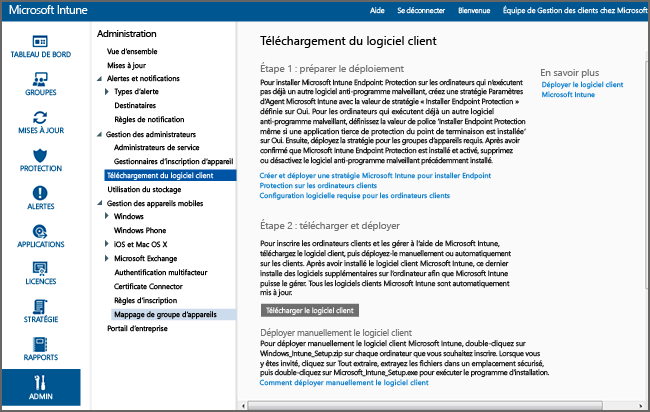

# Installer le client de PC Windows avec Microsoft Intune
Utilisez ce guide pour que votre PC Windows soit géré par le logiciel client Microsoft Intune.

## Avant de commencer
Avant de lancer l’installation du logiciel client Intune, lisez la rubrique [Résoudre des conflits de stratégie entre les objets de stratégie de groupe et Microsoft Intune](resolve-gpo-and-microsoft-intune-policy-conflicts.md) pour comprendre la configuration requise pour une installation correcte du client. Revenez ensuite à ces instructions.

## Installer le client
Utilisez ces étapes pour installer le client :

-   [Pour télécharger le logiciel client](#to-download-the-client-software)

Puis, utilisez une ou plusieurs des méthodes suivantes pour installer le client :

-   [Pour déployer manuellement le logiciel client](#to-manually-deploy-the-client-software)

-   [Pour déployer automatiquement le logiciel client à l'aide d'une stratégie de groupe](#to-automatically-deploy-the-client-software-by-using-group-policy)

-   [Procédure permettant aux utilisateurs d'inscrire automatiquement leurs ordinateurs](#how-users-can-self-enroll-their-computers)

-   [Installer le logiciel client Microsoft Intune dans le cadre d'une image](#install-the-microsoft-intune-client-software-as-part-of-an-image)

Si vous n’avez plus besoin de gérer un ordinateur avec Intune, vous pouvez en retirer l’ordinateur, ce qui supprime également le logiciel client de cet ordinateur. Pour plus d’informations, consultez [Tâches courantes de gestion des PC Windows avec le client Microsoft Intune](common-windows-pc-management-tasks-with-the-microsoft-intune-computer-client.md).

### Pour télécharger le logiciel client

1.  Dans la [console d’administration Microsoft Intune](https://manage.microsoft.com/), cliquez sur **Admin** &gt; **Téléchargement du logiciel client**.

  

2.  Dans la page **Téléchargement du logiciel client**, cliquez sur **Télécharger le logiciel client**, puis enregistrez le package **Microsoft_Intune_Setup.zip** contenant le logiciel à un emplacement sécurisé de votre réseau.

    > [!NOTE]
    > Le package d’installation du logiciel client Intune contient des informations sur votre compte. Si des utilisateurs non autorisés arrivent à accéder au package d'installation, ils peuvent inscrire des ordinateurs dans le compte représenté par le certificat intégré.

3.  Extrayez le contenu du package d'installation dans l'emplacement sécurisé de votre réseau.

    > [!IMPORTANT]
    > Ne renommez pas ou ne supprimez pas le fichier **ACCOUNTCERT** extrait, au risque de faire échouer l’installation du logiciel client.

### Pour déployer manuellement le logiciel client

1.  Sur un ordinateur, accédez au dossier dans lequel se trouvent les fichiers d’installation du logiciel client, puis exécutez **Microsoft_Intune_Setup.exe** pour installer le logiciel client.

    > [!NOTE]
    > L'état de l'installation s'affiche lorsque vous placez le curseur sur l'icône de la barre des tâches de l'ordinateur client.

### Pour déployer automatiquement le logiciel client à l'aide d'une stratégie de groupe

1.  Dans le dossier contenant les fichiers **Microsoft_Intune_Setup.exe** et **MicrosoftIntune.accountcert**, exécutez la commande suivante pour extraire les programmes d’installation Windows Installer des ordinateurs 32 et 64 bits :

    ```
    Microsoft_Intune_Setup.exe/Extract <destination folder>
    ```

2.  Copiez les fichiers **Microsoft_Intune_x86.msi**, **Microsoft_Intune_x64.msi** et **MicrosoftIntune.accountcert** vers un emplacement réseau accessible à tous les ordinateurs sur lesquels le logiciel client doit être installé.

    > [!IMPORTANT]
    > Ne séparez ou ne renommez pas les fichiers, au risque de faire échouer l'installation du logiciel client.

3.  Utilisez la stratégie de groupe pour déployer les logiciels sur les ordinateurs de votre réseau.

    Pour plus d'informations sur l'utilisation d'une stratégie de groupe pour déployer automatiquement des logiciels, consultez la documentation de Windows Server.

### Procédure permettant aux utilisateurs d'inscrire automatiquement leurs ordinateurs
Les utilisateurs finaux peuvent inscrire eux-mêmes chacun de leurs ordinateurs via le portail d’entreprise Intune. Chaque ordinateur inscrit est lié au compte d'utilisateur qui a été utilisé pour installer le logiciel client.

> [!NOTE]
> -   L'utilisateur doit être administrateur sur l'ordinateur pour pouvoir installer le logiciel client.
> -   L'inscription automatique nécessite qu'Internet Explorer soit installé sur l'ordinateur client.
> -   Chaque fois qu’un utilisateur final inscrit lui-même un ordinateur, il utilise une licence Intune.
> -   Vous devez utiliser un compte professionnel ou scolaire pour inscrire vous-même un ordinateur. Vous ne pouvez pas inscrire automatiquement un ordinateur à l'aide d'un compte Microsoft.
> -   Si le logiciel client est déjà installé sur un ordinateur, une erreur s'affiche chez l'utilisateur final.

### Pour inscrire automatiquement un ordinateur (informations destinées aux utilisateurs finaux)

1.  Ouvrez une session sur le portail d'entreprise à partir de l'ordinateur que vous souhaitez inscrire.

2.  Cliquez sur **Ajouter un appareil**.

3.  Cliquez sur **Télécharger le logiciel** , puis sur **Exécuter**.

4.  Cliquez sur **Suivant** pour démarrer l’Assistant d’installation de Microsoft Intune.

5.  Une fois l'Assistant Installation terminé, cliquez sur **Terminer**.

### Installer le logiciel client Microsoft Intune dans le cadre d'une image
Vous pouvez déployer le logiciel client Intune sur des ordinateurs dans le cadre d’une image de système d’exploitation en utilisant la procédure suivante comme exemple :

1.  Copiez les fichiers d’installation du client **Microsoft_Intune_Setup.exe** et **MicrosoftIntune.accountcert** dans le dossier **%Systemdrive%\Temp\Microsoft_Intune_Setup** se trouvant sur l’ordinateur de référence.

2.  Créez l'entrée de Registre **WindowsIntuneEnrollPending** en ajoutant la commande suivante au script **SetupComplete.cmd** :

    ```
    %windir%\system32\reg.exe add HKEY_LOCAL_MACHINE\Software\Microsoft\Onlinemanagement\Deployment /v
    WindowsIntuneEnrollPending /t REG_DWORD /d 1
    ```

3.  Ajoutez la commande suivante à **setupcomplete.cmd** pour exécuter le package d’inscription avec l’argument de ligne de commande /PrepareEnroll :

    ```
    %systemdrive%\temp\Microsoft_Intune_Setup\Microsoft_Intune_Setup.exe /PrepareEnroll
    ```
    > [!TIP]
    > Le script **SetupComplete.cmd** permet au programme d'installation de Windows d'apporter des modifications au système avant qu'un utilisateur ouvre une session. L’argument de ligne de commande **/PrepareEnroll** prépare un ordinateur ciblé afin qu’il soit automatiquement inscrit dans Intune une fois l’installation de Windows terminée.

4.  Placez **SetupComplete.cmd** dans le dossier **%Windir%\Setup\Scripts** sur l’ordinateur de référence.

5.  Capturez une image de l'ordinateur de référence et déployez-la sur les ordinateurs ciblés.

Au redémarrage de l'ordinateur ciblé à la fin des opérations du programme d'installation de Windows, la clé de Registre **WindowsIntuneEnrollPending** est créée. Le package d'inscription vérifie si l'ordinateur est inscrit. Si l'ordinateur est inscrit, aucune action n'est exécutée. Si l’ordinateur n’est pas inscrit, le package d’inscription crée une tâche d’inscription automatique Microsoft Intune.

Quand la tâche d’inscription automatique s’exécute à l’heure planifiée suivante, elle vérifie l’existence de la valeur de Registre **WindowsIntuneEnrollPending** et tente d’inscrire l’ordinateur ciblé dans Intune. Si l'inscription échoue pour une raison quelconque, l'inscription est tentée à nouveau lors de la prochaine exécution de la tâche. Les tentatives continuent pendant un mois.

La tâche d’inscription automatique Intune, la valeur de Registre **WindowsIntuneEnrollPending** et le certificat de compte sont supprimés de l’ordinateur ciblé quand l’inscription est réussie ou après un délai d’un mois.

## Analyser et valider la réussite du déploiement du client
Utilisez l'une des procédures suivantes pour vous analyser et valider la réussite du déploiement du client.

### Pour vérifier l'installation du logiciel client depuis la console d'administration Microsoft Intune

1.  Dans la [console d’administration Microsoft Intune](https://manage.microsoft.com/), cliquez sur **Groupes** &gt; **Tous les appareils** &gt; **Tous les ordinateurs**.

2.  Faites défiler la liste des ordinateurs vers le bas pour accéder aux ordinateurs gérés qui communiquent avec Intune, ou pour rechercher un ordinateur géré spécifique en tapant le nom de l’ordinateur ou une partie de son nom dans la zone **Rechercher des appareils**.

3.  Examinez l'état de l'ordinateur dans le volet inférieur de la console et résolvez les erreurs.

### Pour créer un rapport d'inventaire informatique afin d'afficher tous les ordinateurs inscrits

1.  Dans la [console d’administration Microsoft Intune](https://manage.microsoft.com/), cliquez sur **Rapports** &gt; **Rapports d’inventaire informatique**.

2.  Dans la page **Créer un rapport** , ne modifiez pas les valeurs par défaut renseignées dans les champs (sauf si vous voulez appliquer des filtres), puis cliquez sur **Afficher le rapport**.

3.  La page **Rapport d’inventaire des ordinateurs** s’ouvre dans une nouvelle fenêtre et affiche tous les ordinateurs inscrits avec succès dans Intune.

    > [!TIP]
    > Cliquez sur n'importe quel en-tête de colonne dans le rapport pour trier la liste en fonction du contenu de cette colonne.


### Voir aussi
[Gérer des PC Windows avec Microsoft Intune](manage-windows-pcs-with-microsoft-intune.md)


<!--HONumber=Jun16_HO4-->


