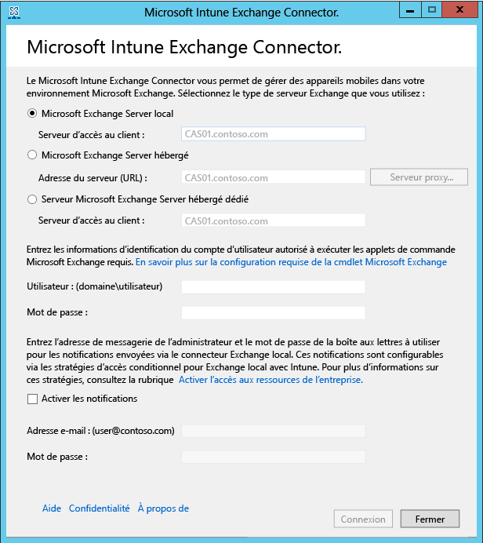

---
# required metadata

title: Installer le connecteur Exchange de Microsoft Intune pour Exchange local | Microsoft Intune
description:
keywords:
author: NathBarn
manager: jeffgilb
ms.date: 04/28/2016
ms.topic: article
ms.prod:
ms.service: microsoft-intune
ms.technology:
ms.assetid: 41ff4212-a6f5-4374-8731-631f7560cff1

# optional metadata

#ROBOTS:
#audience:
#ms.devlang:
ms.reviewer: jeffgilb
ms.suite: ems
#ms.tgt_pltfrm:
#ms.custom:

---

# Installer le connecteur Exchange local de Microsoft Intune

Pour configurer une connexion qui permet à Microsoft Intune de communiquer avec le serveur Exchange Server qui héberge les boîtes aux lettres des appareils mobiles, vous devez télécharger et configurer l’outil Connecteur local depuis la console Administrateur d’Intune.

## Configuration requise pour le connecteur local
Le tableau suivant indique la configuration requise pour l’ordinateur où vous installez le connecteur Exchange local.

|Condition requise|Plus d'informations|
|---------------|--------------------|
|Systèmes d'exploitation|Intune prend en charge le connecteur Exchange local sur un ordinateur qui exécute toutes les éditions de Windows Server 2008 SP2 64 bits, Windows Server 2008 R2, Windows Server 2012 ou Windows Server 2012 R2.  Le connecteur n'est pas pris en charge sur une installation Server Core.|
|Version Microsoft Exchange|Le connecteur local nécessite Microsoft Exchange 2010 SP1 ou ultérieur.|
|Autorité de gestion des appareils mobiles| [Définir Intune comme autorité de gestion des appareils mobiles](get-ready-to-enroll-devices-in-microsoft-intune.md#set-mobile-device-management-authority).|
|Matériel|L’ordinateur sur lequel vous installez le connecteur nécessite un processeur 1,6 GHz avec 2 Go de mémoire RAM et 10 Go d’espace disque libre.|
|Synchronisation Active Directory|Avant de pouvoir utiliser un des connecteurs pour connecter Intune à votre serveur Exchange Server, vous devez [configurer la synchronisation Active Directory](/intune/get-started/start-with-a-paid-subscription-to-microsoft-intune-step-3) pour que vos utilisateurs et groupes de sécurité locaux soient synchronisés avec votre instance d’Azure Active Directory.|
|Logiciels supplémentaires|Une installation complète de Microsoft .NET Framework 4 et Windows PowerShell 2.0 doit exister sur l’ordinateur qui héberge le connecteur.|
|Réseau|L'ordinateur sur lequel vous installez le connecteur doit être dans un domaine qui entretient une relation d'approbation avec le domaine qui héberge votre instance d'Exchange Server.  L’ordinateur nécessite des configurations qui lui permettent d’accéder au service Intune à travers les pare-feu et les serveurs proxy sur les ports 80 et 443. Les domaines utilisés par Intune comprennent manage.microsoft.com, &#42;manage.microsoft.com et &#42;.manage.microsoft.com.|
|Le serveur Exchange hébergé configuré et en cours d’exécution|Pour plus d’informations, consultez [Exchange Server 2016](https://technet.microsoft.com/library/mt170645.aspx). |
|Définir Intune comme autorité de gestion des appareils mobiles|[Définir Intune comme autorité de vos appareils mobiles](get-ready-to-enroll-devices-in-microsoft-intune.md#BKMK_Set_MDM_Authority)|

### Spécifications des applets de commande Exchange

Vous devez créer un compte d’utilisateur Active Directory utilisé par le connecteur Exchange d’Intune. Le compte doit être autorisé à exécuter les applets de commande Windows PowerShell Exchange nécessaires suivantes :

 -   Get-ActiveSyncOrganizationSettings, Set-ActiveSyncOrganizationSettings
 -   Get-CasMailbox, Set-CasMailbox
 -   Get-ActiveSyncMailboxPolicy, Set-ActiveSyncMailboxPolicy, New-ActiveSyncMailboxPolicy, Remove-ActiveSyncMailboxPolicy
 -   Get-ActiveSyncDeviceAccessRule, Set-ActiveSyncDeviceAccessRule, New-ActiveSyncDeviceAccessRule, Remove-ActiveSyncDeviceAccessRule
 -   Get-ActiveSyncDeviceStatistics
 -   Get-ActiveSyncDevice
 -   Get-ExchangeServer
 -   Get-ActiveSyncDeviceClass
 -   Get-Recipient
 -   Clear-ActiveSyncDevice, Remove-ActiveSyncDevice
 -   Set-ADServerSettings
 -   Get-Command

## Télécharger le package d’installation du logiciel Connecteur Exchange local

1. Sur un système d’exploitation pris en charge pour le connecteur Exchange local, ouvrez la [console d’administration Microsoft Intune](http://manage.microsoft.com) (http://manage.microsoft.com) avec un compte d’utilisateur qui est administrateur dans le client Exchange avec une licence d’utilisation d’Exchange Server.

2.  Dans le volet des raccourcis de l’espace de travail, choisissez **ADMIN**..

3.  Dans le volet de navigation, sous **Gestion des appareils mobiles**, développez **Microsoft Exchange**, puis choisissez **Configurer la connexion Exchange**.

4.  Dans la page **Configurer la connexion Exchange**, choisissez **Télécharger On-Premises Connector**..

5.  Le connecteur Exchange local se trouve dans un dossier compressé (.zip) que vous pouvez ouvrir ou enregistrer. Dans la boîte de dialogue **Téléchargement de fichier**, choisissez **Enregistrer** pour stocker le dossier compressé dans un emplacement sécurisé.

> [!IMPORTANT]
> Ne renommez pas et ne déplacez pas les fichiers du dossier du connecteur Exchange local. Le fait de déplacer ou de renommer le contenu du dossier empêche l’installation.

## Installer et configurer le connecteur Exchange local d’Intune
Procédez comme suit pour installer le connecteur Exchange local d’Intune. Le connecteur Exchange local ne peut être installé qu’une seule fois par abonnement Intune, et sur un ordinateur seulement. Si vous essayez de configurer un connecteur Exchange local supplémentaire, la connexion initiale est remplacée par la nouvelle.

1.  Sur un système d’exploitation pris en charge pour le connecteur local, extrayez les fichiers de **Exchange_Connector_Setup.zip** à un emplacement sécurisé.

2.  Une fois les fichiers extraits, ouvrez le dossier extrait et double-cliquez sur **Exchange_Connector_Setup.exe** pour installer le connecteur Exchange local.

    > [!IMPORTANT]
    > Si le dossier de destination n’est pas un emplacement sécurisé, vous devez supprimer le fichier de certificat **WindowsIntune.accountcert** après l’installation d’On-Premises Connector.

3.  Dans le champ **Serveur Exchange**, sélectionnez le type d’environnement de votre serveur Exchange : **Serveur Microsoft Exchange local** ou **Serveur Microsoft Exchange hébergé**..

  

  Pour un serveur Exchange local, spécifiez le nom du serveur ou le nom de domaine complet du serveur Exchange qui héberge le rôle **Serveur d’accès au client**.

  Pour un serveur Exchange hébergé, spécifiez l’adresse du serveur Exchange. Pour trouver l'URL du serveur Exchange hébergé :

      1.  Ouvrez Outlook Web App pour Office 365.

      2.  Choisissez l’icône «? » en haut à gauche et sélectionnez **À propos de**..

      3.  Recherchez la valeur **Serveur externe POP** .

      4.  Choisissez **Serveur proxy** pour spécifier les paramètres du serveur proxy pour votre serveur Exchange hébergé.
        1.  Sélectionnez **Utiliser un serveur proxy lors de la synchronisation des informations de l’appareil mobile**..

        2.  Entrez le **nom du serveur proxy** et le **numéro de port** à utiliser pour accéder au serveur.

        3.  S’il est nécessaire de fournir des informations d’identification utilisateur pour accéder au serveur proxy, sélectionnez Utiliser les informations d’identification pour la connexion au serveur proxy, puis entrez le **domaine\utilisateur** et le **mot de passe**..

        4.  Choisissez **OK**..

5.  Spécifiez les informations d’identification, l’**Utilisateur (Domaine\utilisateur)** et le **Mot de passe** nécessaires pour la connexion à votre serveur Exchange.

6.  Fournissez les informations d'identification administratives nécessaires pour envoyer des notifications à la boîte aux lettres Exchange de l'utilisateur. Ces notifications sont configurables via les stratégies d'accès conditionnel Intune.

    Vérifiez que le service de découverte automatique et les services web Exchange sont configurés sur le serveur d'accès au client Exchange. Pour plus d’informations à ce sujet, consultez [Serveur d’accès au client](https://technet.microsoft.com/library/dd298114.aspx).

7.  Dans le champ **Mot de passe** , entrez le mot de passe de ce compte pour permettre à Intune d’accéder au serveur Exchange Server.

8. Choisissez **Se connecter**..

    La configuration de la connexion peut prendre quelques minutes.

Lors de la configuration, le connecteur Exchange stocke vos paramètres de proxy pour permettre l’accès à Internet. Si vos paramètres de proxy changent, vous devez reconfigurer le connecteur Exchange pour lui appliquer les paramètres de proxy mis à jour.

Une fois la connexion configurée par le connecteur Exchange, les appareils mobiles associés à des utilisateurs gérés dans le connecteur Exchange sont automatiquement synchronisés et ajoutés au connecteur Exchange. Cette synchronisation peut prendre un certain temps.

> [!NOTE]
> Si vous avez installé le connecteur Exchange local et qu’à un moment donné, vous supprimez la connexion Exchange, vous devez désinstaller le connecteur Exchange local de l’ordinateur où il a été installé.

## Valider la connexion Exchange

Une fois que vous avez correctement configuré le connecteur Exchange, vous pouvez afficher l’état de la connexion et la dernière tentative de synchronisation réussie. Dans la [console d’administration Microsoft Intune](http://manage.microsoft.com), choisissez l’espace de travail **ADMIN** et, sous **Gestion des appareils mobiles**, choisissez **Microsoft Exchange** et vérifiez que les détails que vous avez fournis apparaissent sous **Informations de connexion à Exchange**..

Vous pouvez également vérifier la date et l'heure de la dernière tentative de synchronisation réussie.

<!--HONumber=May16_HO1-->

