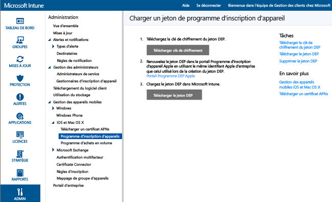

# Inscrire des appareils iOS DEP d’entreprise
Microsoft Intune peut déployer un profil d’inscription qui inscrit les appareils iOS qui ont été achetés via le programme DEP « à distance ». Le package d’inscription peut inclure des options d’Assistant de configuration pour l’appareil. Les appareils inscrits via le programme DEP ne peuvent pas être désinscrits par les utilisateurs.

## Gestion DEP d’Apple pour les appareils iOS avec Microsoft Intune
Pour gérer les appareils iOS d’entreprise avec le programme d’inscription des appareils (DEP) d’Apple, votre organisation doit participer au programme et obtenir des appareils par le biais de ce programme. Les détails de cette procédure sont disponibles à l'adresse suivante :  [https://deploy.apple.com](https://deploy.apple.com). Les avantages du programme incluent la configuration automatique des appareils sans utiliser de câble USB pour connecter chaque appareil à un ordinateur.

Avant de pouvoir inscrire des appareils iOS d’entreprise à l’aide du programme DEP, vous devez obtenir un jeton approprié auprès d’Apple. Ce jeton permet à Intune de synchroniser les informations sur les appareils participant à ce programme et appartenant à votre entreprise. Il permet également à Intune d'effectuer des téléchargements de profil d'inscription sur Apple et d'attribuer des appareils à ces profils.

1.  **Commencer à gérer des appareils iOS avec Microsoft Intune** 
    Avant de pouvoir inscrire des appareils iOS par le biais du programme DEP, vous devez terminer d’activer la gestion iOS pour Intune.

2.  **Obtenir une clé de chiffrement** 
    En tant qu’administrateur, ouvrez la [console d’administration Microsoft Intune](http://manage.microsoft.com), accédez à **Administration** &gt; **Gestion des appareils mobiles** &gt; **iOS** &gt; **Programme d’inscription d’appareils**, puis choisissez **Télécharger la clé de chiffrement**. Enregistrez le fichier de clé de chiffrement (.pem) localement. Le fichier .pem est utilisé pour demander un certificat de relation d'approbation à partir du portail du programme d'inscription d'appareils d'Apple.

      

3.  **Obtenir un jeton du programme d'inscription d'appareils** 
    Accédez au [portail du Programme DEP](https://deploy.apple.com) (https://deploy.apple.com) et connectez-vous avec votre ID Apple d’entreprise. Cet ID Apple doit être utilisé par la suite pour renouveler votre jeton DEP.

    1.  Dans le [portail du Programme d’inscription d’appareils](https://deploy.apple.com), accédez à **Programme d’inscription d’appareils** &gt; **Gérer les serveurs**, puis choisissez **Ajouter un serveur MDM**.

    2.  Entrez le **Nom du serveur MDM**, puis choisissez **Suivant**. Le nom du serveur vous permet d’identifier le serveur de gestion des appareils mobiles (MDM) uniquement. Il ne s’agit pas du nom ou de l’URL du serveur Microsoft Intune.

    3.  La boîte de dialogue **Ajouter&lt;nom_serveur&gt;** s’ouvre. Choisissez **Choisir un fichier** pour charger le fichier .pem, puis choisissez **Suivant**.

    4.  La boîte de dialogue **Ajouter&lt;nom_serveur&gt;** affiche un lien **Votre jeton de serveur**. Téléchargez le fichier de jeton de serveur (.p7m) sur votre ordinateur, puis choisissez **Terminé**.

    Ce fichier de certificat (.p7m) est utilisé pour établir une relation d'approbation entre le serveur Intune et le serveur du programme d'inscription d'appareils d'Apple.

4.  **Ajouter le jeton DEP à Intune** 
    Dans la [console d’administration Microsoft Intune](http://manage.microsoft.com), accédez à **Admin** &gt; **Gestion des appareils mobiles** &gt; **iOS** &gt; **Programme d’inscription d’appareils**, puis choisissez **Charger le jeton DEP**. **Accédez** au fichier de certificat (.p7m), entrez votre **ID Apple**, puis choisissez **Télécharger**.

5.  **Ajouter la stratégie Inscription des appareils d’entreprise** 
    Dans la [console d’administration Microsoft Intune](http://manage.microsoft.com), accédez à **Stratégie** &gt; **Inscription d’appareil professionnel**, puis choisissez **Ajouter**.

    Remplissez la section **Général**, notamment les champs **Nom** et **Description**, et spécifiez si les appareils attribués au profil ont une affinité utilisateur ou s’ils appartiennent à un groupe.
      - **Demander l’affinité utilisateur** : l’appareil doit être affilié à un utilisateur durant l’installation initiale. Il peut ensuite être autorisé à accéder aux données et aux e-mails de l’entreprise pour le compte de cet utilisateur. L’**affinité utilisateur** doit être configurée pour les appareils gérés par DEP qui appartiennent à des utilisateurs et doivent utiliser le portail d’entreprise (c’est-à-dire, pour installer des applications).  **Remarque :** les appareils DEP avec l’affinité utilisateur ne prennent pas en charge l’authentification multifacteur.

      > [!NOTE]
      > Dans le cas de DEP avec affinité utilisateur, un point de terminaison WS-Trust 1.3 Username/Mixed doit être activé pour demander un jeton utilisateur.

      - **Aucune affinité utilisateur** : l’appareil n’est pas affilié à un utilisateur. Utilisez cette affiliation pour les appareils qui effectuent des tâches sans accéder aux données de l’utilisateur local. Les applications qui nécessitent l’affiliation d’un utilisateur, y compris l’application Portail d’entreprise utilisée pour installer les applications métier, ne fonctionneront pas.

    Vous pouvez également **assigner les appareils au groupe suivant**. Choisissez **Sélectionner...** pour choisir un groupe.

    [!INCLUDE[groups deprecated](../includes/group-deprecation.md)]

    Ensuite, activez **Configurez les paramètres DEP (Device Enrollment Program) pour cette stratégie** pour prendre en charge le programme DEP.

      

     Les paramètres suivants sont disponibles pour les appareils gérés par le programme DEP :

     - **Service** : s’affiche quand les utilisateurs appuient sur **À propos de la configuration** pendant l’activation
     - **Numéro de téléphone du support** : s’affiche quand l’utilisateur clique sur le bouton **Besoin d’aide** pendant l’activation
     - **Mode de préparation** : défini pendant l’activation et ne peut pas être modifié sans rétablir les paramètres d’usine de l’appareil :
        - **Non supervisé** : capacités de gestion limitées
        - **Supervisé** : active plusieurs options de gestion et désactive le verrou d’activation par défaut
     - **Verrouiller le profil d’inscription de l’appareil** : défini pendant l’activation et ne peut pas être modifié sans rétablir les paramètres d’usine
        - **Désactiver** : permet de supprimer le profil de gestion à partir du menu **Paramètres**
        - **Activer** : (nécessite le **Mode de préparation** = **Supervisé**) désactive les paramètres iOS qui pourraient autoriser la suppression du profil de gestion
     - **Options de l’Assistant Installation** : ces paramètres facultatifs peuvent être configurés plus tard dans le menu **Paramètres** d’iOS.
        - **Code secret** : demande un code secret pendant l’activation. Exige toujours un code secret, sauf si l’appareil doit être sécurisé ou si son accès doit être contrôlé d’une autre façon (c’est-à-dire, en mode plein écran qui limite l’appareil à une seule application).
        - **Services de localisation** : si activé, l’Assistant Installation vous invite à spécifier le service pendant l’activation
        - **Restaurer** : si activé, l’Assistant Installation invite à spécifier la sauvegarde iCloud pendant l’activation
        - **ID Apple** : si cette option est activée, iOS demande un ID Apple aux utilisateurs quand Intune tente d’installer une application sans ID. Un ID Apple est nécessaire pour télécharger des applications App Store iOS, y compris celles qui sont installées par Intune.
        - **Termes et conditions** : si cette option est activée, l’Assistant Installation invite l’utilisateur à accepter les conditions générales d’Apple pendant l’activation
        - **ID tactile** : si cette option est activée, l’Assistant Installation vous invite à spécifier ce service pendant l’activation
        - **Apple Pay** : si cette option est activée, l’Assistant Installation vous invite à spécifier ce service pendant l’activation
        - **Zoom** : si cette option est activée, l’Assistant Installation vous invite à spécifier ce service pendant l’activation
        - **Siri** : si cette option est activée, l’Assistant Installation vous invite à spécifier ce service pendant l’activation
        - **Envoyer les données de diagnostic à Apple** : si cette option est activée, l’Assistant Installation vous invite à spécifier ce service pendant l’activation
     -  **Activez la gestion supplémentaire via Apple Configurator** : spécifiez **Interdire** pour empêcher la synchronisation des fichiers avec iTunes ou la gestion via Apple Configurator. Il vaut mieux choisir **Interdire**, exporter les configurations supplémentaires d’Apple Configurator, puis déployer en tant que profil de configuration iOS personnalisé via Intune, au lieu d’utiliser ce paramètre pour permettre un déploiement manuel avec ou sans un certificat.
        - **Interdire** : empêche l’appareil de communiquer via USB (désactive l’appariement)
        - **Autoriser** : autorise un appareil à communiquer via une connexion USB pour n’importe quel PC ou Mac
        - **Demander un certificat** : permet un appariement avec un Mac avec un certificat importé dans le profil d’inscription

6.  **Attribuer des appareils DEP pour la gestion** Accédez au [portail du Programme DEP](https://deploy.apple.com) (https://deploy.apple.com) et connectez-vous avec votre ID Apple d’entreprise. Accédez à **Programme de déploiement** &gt; **Programme d’inscription d’appareils** &gt; **Gérer les appareils**. Spécifiez la façon dont vous allez **Choisir des appareils**, fournissez les informations relatives aux appareils et spécifiez les détails par appareil : **Numéro de série**, **Numéro de commande**ou **Télécharger un fichier CSV**. Ensuite, choisissez **Affecter au serveur**, le &lt;nom_serveur&gt; spécifié pour Microsoft Intune, puis **OK**.

7.  **Synchroniser les appareils gérés par DEP** En tant qu’administrateur, ouvrez la [console d’administration Microsoft Intune](http://manage.microsoft.com), accédez à **Administration** &gt; **Gestion des appareils mobiles** &gt; **iOS** &gt; **Programme d’inscription d’appareils**, puis choisissez **Synchroniser maintenant**. Une demande de synchronisation est envoyée à Apple. Pour afficher les appareils gérés par DEP après la synchronisation, dans la [console d’administration Microsoft Intune](http://manage.microsoft.com), accédez à **Groupes** &gt; **Tous les appareils** &gt; **Appareils d’entreprise préinscrits** &gt; **Par numéro de série iOS**. Dans l’espace de travail **Par numéro de série iOS**, l’**État** des appareils gérés est « Non contacté » tant que l’appareil n’est pas démarré et n’exécute pas l’Assistant d’installation pour inscrire l’appareil.

    Pour être conforme aux conditions d’Apple pour un trafic DEP acceptable, Intune impose les restrictions suivantes :
     -  Une synchronisation DEP complète ne peut pas s’exécuter plus d’une fois tous les sept jours. Pendant une synchronisation complète, Intune actualise chaque numéro de série attribué à Intune par Apple, que le numéro de série ait été ou non déjà synchronisé. Si une synchronisation complète est tentée dans les sept jours de la synchronisation complète précédente, Intune actualise seulement les numéros de série qui ne figurent pas déjà dans Intune.
     -  Toute demande de synchronisation doit se terminer dans un délai de 10 minutes. Pendant ce temps ou jusqu’au succès de la demande, le bouton **Synchroniser** est désactivé.

8.  **Distribuer des appareils aux utilisateurs** Vos appareils d’entreprise peuvent désormais être distribués aux utilisateurs. Quand un appareil iOS est activé, il est inscrit pour être géré par Intune.

## Modifications apportées aux affectations de groupe Intune

En novembre, la gestion des groupes d’appareils sera migrée vers Azure Active Directory. Après la transition vers des groupes Azure Active Directory, l’affectation de groupe n’apparaîtra pas dans les options de **profil d’inscription de l’entreprise**. Plusieurs mois pourront s’écouler avant que vous ne constatiez les effets de cette modification. Après le déplacement vers le nouveau portail, les attributions de groupes d’appareils dynamiques peuvent être définies en fonction des noms des profils d’inscription de l’entreprise. Ce processus garantit que les appareils déjà affectés à un groupe d’appareils sont inscrits automatiquement dans le groupe avec une stratégie et des applications déployées. [En savoir plus sur les groupes Azure Active Directory](https://azure.microsoft.com/documentation/articles/active-directory-accessmanagement-manage-groups/)

### Voir aussi
[Prérequis pour l’inscription des appareils](prerequisites-for-enrollment.md)

<!--HONumber=Nov16_HO2-->

