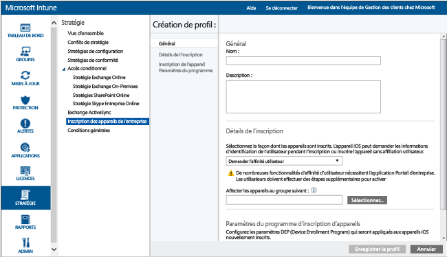
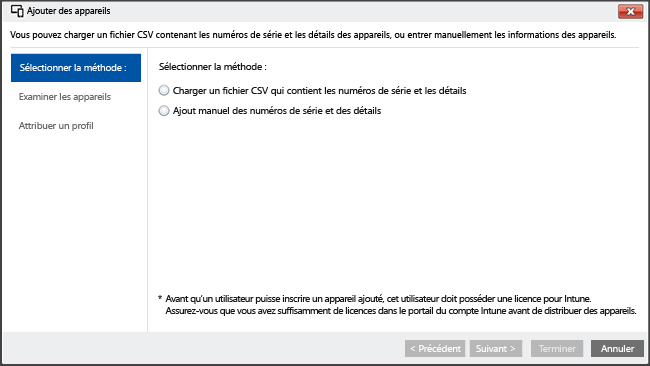

---
# required metadata

title: Assistant de configuration pour les appareils iOS avec Microsoft Intune | Microsoft Intune
description:
keywords:
author: NathBarn
manager: jeffgilb
ms.date: 04/28/2016
ms.topic: article
ms.prod:
ms.service: microsoft-intune
ms.technology:
ms.assetid: 46e5b027-4280-4809-b45f-651a6ab6d0cd

# optional metadata

#ROBOTS:
#audience:
#ms.devlang:
ms.reviewer: jeffgilb
ms.suite: ems
#ms.tgt_pltfrm:
#ms.custom:

---

# Inscription des appareils iOS avec Apple Configurator avec l’Assistant de configuration
Intune prend en charge l’inscription d’appareils iOS d’entreprise à l’aide de l’outil [Apple Configurator](http://go.microsoft.com/fwlink/?LinkId=518017) s’exécutant sur un ordinateur Mac. Ce processus réinitialise l’appareil aux paramètres d’usine et le prépare à exécuter l’Assistant de configuration par le nouvel utilisateur de l’appareil avec les stratégies de l’entreprise préinstallées.


## Inscription Assistant Configuration pour les appareils iOS avec Microsoft Intune
À l’aide de l’outil Apple Configurator, vous pouvez rétablir les paramètres d’usine des appareils iOS et les préparer pour que le nouvel utilisateur des appareils puisse les configurer.  Cette méthode implique de connecter l’appareil iOS à un ordinateur Mac via une connexion USB pour configurer l’inscription d’entreprise. Elle suppose que vous utilisez Apple Configurator 2.0. La plupart des scénarios requièrent que la stratégie appliquée à l’appareil iOS comprenne *Affinité utilisateur* pour activer l’application Portail d’entreprise Intune.

**Conditions préalables**
* Accès physique aux appareils iOS : les appareils doivent être déconfigurés (réinitialisation aux paramètres d’usine) sans protection par mot de passe
* Numéros de série des appareils : [Comment obtenir un numéro de série iOS](https://support.apple.com/en-us/HT204308)
* Câbles de connexion USB
* Ordinateur Mac avec [Apple Configurator 2.0](https://itunes.apple.com/us/app/apple-configurator-2/id1037126344?mt=12)


1.  **Créer un groupe d'appareils mobiles** (facultatif) Si votre entreprise a besoin de groupes d'appareils mobiles pour faciliter la gestion des appareils, créez ces groupes. [Utiliser des groupes pour gérer les utilisateurs et les appareils avec Microsoft Intune](use-groups-to-manage-users-and-devices-with-microsoft-intune.md).

2.  **Créer un profil pour des appareils** Un profil d'inscription d'appareil définit les paramètres appliqués à un groupe d'appareils. Si ce n'est déjà fait, créez un profil d'inscription d'appareil pour les appareils iOS inscrits à l'aide d'Apple Configurator.

    ###### Pour créer un profil

    1.  Dans la [console d'administration Microsoft Intune](http://manage.microsoft.com), accédez à **Stratégie** &gt; **Appareils d'entreprise**, puis choisissez **Ajouter...**.

    

    2.  Entrez les détails des profils d'appareils :

        -   **Nom** : nom du profil d'inscription d'appareil. (Non visible pour les utilisateurs)

        -   **Description** : description du profil d’inscription d’appareil. (Non visible pour les utilisateurs)

        -   **Détails de l’inscription** : indique comment les appareils sont inscrits.

            -   **Demander l’affinité utilisateur** : l’appareil iOS peut être affilié à un utilisateur durant la configuration initiale. Il peut ensuite être autorisé à accéder aux données de l’entreprise et à envoyer des messages électroniques au nom de cet utilisateur. Pour la plupart des scénarios de l’Assistant Configuration, utilisez **Demander l’affinité utilisateur**.
            Ce mode prend en charge plusieurs scénarios :

                -   **Appareil personnel d’entreprise** : « Choisir votre propre appareil » (CYOD). Similaire aux appareils personnels ou qui nous appartiennent, mais l’administrateur possède certains privilèges, notamment l’autorisation de réinitialiser, d’administrer l’appareil et d’en annuler l’inscription. L'utilisateur de l'appareil peut installer des applications et a d'autres autorisations pour utiliser son appareil, s'il n'est pas bloqué par la stratégie de gestion.

                -   **Compte de gestionnaire d'inscription d'appareil** : l'appareil est inscrit à l'aide d'un compte d'administrateur Intune spécial. Il peut être géré comme un compte privé, mais seul l'utilisateur qui connaît les informations d'identification du gestionnaire d'inscription peut installer des applications et réinitialiser, administrer l'appareil ou en annuler l'inscription. Pour plus d’informations sur l’inscription d’un appareil partagé par de nombreux utilisateurs par le biais d’un compte commun, consultez [Inscrire des appareils d’entreprise avec le Gestionnaire d’inscription d’appareil dans Microsoft Intune](enroll-corporate-owned-devices-with-the-device-enrollment-manager-in-microsoft-intune.md).

            -   **Pas d’affinité utilisateur** : l’appareil n’est affilié à aucun utilisateur. Utilisez cette affiliation pour les appareils qui effectuent des tâches sans accéder aux données de l'utilisateur local. Les applications nécessitant une affiliation utilisateur sont désactivées ou ne fonctionnent pas.

        -   **Affectation préalable du groupe d’appareils** : tous les appareils déployés dans ce profil appartiennent initialement à ce groupe. Vous pouvez réaffecter les appareils après l'inscription.

          -  **Device Enrollment Program (DEP)** : vous ne pouvez pas utiliser Apple Device Enrollment Program (DEP) avec l’inscription par le biais de l’Assistant de configuration. Vérifiez que ce commutateur est **désactivé**.

    3.  Choisissez **Enregistrer le profil** pour ajouter le profil.

3.  **Ajouter des appareils iOS à inscrire avec l'Assistant Configuration** Dans la [console d'administration Microsoft Intune](http://manage.microsoft.com), accédez à **Groupes** &gt; **Tous les appareils** &gt; **Tous les appareils d'entreprise** &gt; **Tous les appareils**, puis choisissez **Ajouter des appareils**. Vous pouvez ajouter des appareils de deux manières :

    

    -   **Charger un fichier CSV qui contient les numéros de série** : créez une liste de valeurs séparées par des virgules (.csv) de deux colonnes sans en-tête, limitée à 5000 appareils ou à 5 Mo par fichier CSV.

        |||
        |-|-|
        |&lt;Série 1&gt;|&lt;Détails de l'appareil 1&gt;|
        |&lt;Série 2&gt;|&lt;Détails de l’appareil 2&gt;|
        Dans un éditeur de texte, ce fichier .csv s'affiche comme suit :

        ```
        0000000,PO 1234
        111111111,PO 1234
        ```

    -   **Ajouter manuellement les détails des appareils** : entrez le numéro de série et les détails de cinq appareils au maximum.

    > [!NOTE]
    > Si vous devez supprimer par la suite des appareils d’entreprise de la gestion Intune, vous devrez peut-être retirer le numéro de série de l’appareil d’Intune dans le groupe d’appareils **Par numéro de série iOS** sous **Appareils d’entreprise préinscrits** pour désactiver l’inscription des appareils.  Si Intune effectue une procédure de récupération d'urgence pendant la suppression des numéros de série ou aux environs de cette période, vous devez vérifier que seuls les numéros de série des appareils actifs sont présents dans ce groupe.

    Choisissez **Suivant**.

4.  **Sélectionner les appareils à inscrire** Confirmez les appareils à inscrire. Il n'est pas possible d'importer des numéros de série déjà inscrits ou inscrits par d'autres moyens. Cliquez sur **Suivant** pour continuer.

5.  **Attribuer un profil** Spécifiez le profil à attribuer aux appareils ajoutés à la liste des profils disponibles, vérifiez les **Détails du profil d'inscription**, puis choisissez **Terminer**. Les appareils ajoutés manuellement peuvent être affectés à n’importe quel profil d’inscription.

6.  **Exporter un profil à déployer sur des appareils iOS** Dans la [console d'administration Microsoft Intune](http://manage.microsoft.com), accédez à **Stratégie** &gt; **Inscription d'appareil professionnel**, puis sélectionnez le profil d'appareil à déployer sur les appareils mobiles. Choisissez **Exporter...** dans la barre des tâches. Copiez et enregistrez la valeur **URL de profil**. Vous la chargerez dans Apple Configurator plus tard pour définir le profil Intune utilisé par les appareils iOS.
    Vous devez modifier l’URL du profil 2.0 pour prendre en charge Apple Configurator 2. Remplacer
    ```
    https://manage.microsoft.com/EnrollmentServer/Discovery.svc/iOS/ESProxy?id=
    ```
    avec

    ```
    https://appleconfigurator2.manage.microsoft.com/MDMServiceConfig?id=
    ```

   Vous allez télécharger l’URL de ce profil sur le service Apple DEP avec Apple Configurator au cours de la procédure suivante pour définir le profil Intune utilisé par les appareils iOS.


7.  **Préparer l'appareil avec Apple Configurator** Les appareils iOS sont connectés à l'ordinateur Mac et inscrits pour la gestion des appareils mobiles.

    1.  Sur un ordinateur Mac, ouvrez **Apple Configurator 2**. Dans la barre de menus, choisissez **Apple Configurator 2**, puis cliquez sur **Préférences**.

         > [!WARNING]
         > Les paramètres d'usine des appareils sont rétablis pendant le processus d'inscription. En guise de bonne pratique, vous devez réinitialiser l’appareil et le mettre sous tension. En guise de bonne pratique, les appareils doivent afficher l’écran **Hello** quand vous les connectez.

    2. Dans le volet Préférences, sélectionnez **Serveurs** et cliquez sur le symbole « + » situé sous le volet de gauche pour lancer l’assistant de serveur MDM. Choisissez **Suivant**.

    3. Saisissez le **Nom** et **l’URL d’inscription** pour le serveur de MDM de l’étape 6 ci-dessus. Pour l’URL d’inscription, saisissez l’URL du profil d’inscription exporté depuis Intune. Choisissez **Suivant**.  

       Si vous recevez un avertissement à propos des exigences de profil de confiance pour Apple TV, vous pouvez désactiver l’option **Profil de confiance** sans risque en cliquant sur le « X » gris. Vous pouvez également ignorer tout avertissement de certificat d’ancrage. Pour continuer, cliquez sur **Suivant** jusqu’à ce que l’Assistant soit terminé.

    4.  Dans le volet **Serveurs**, choisissez « Modifier » à côté du profil du nouveau serveur. Assurez-vous que l’URL d’inscription correspond exactement à l’URL exportée depuis Intune. Saisissez à nouveau l’URL d’origine si elle est différente, puis **Enregistrez** le profil d’inscription exporté depuis Intune.

    5.  Connectez les appareils mobiles iOS à l'ordinateur Apple à l'aide d'un adaptateur USB.

        > [!WARNING]
        > Les paramètres d'usine des appareils sont rétablis pendant le processus d'inscription. En guise de bonne pratique, vous devez réinitialiser l’appareil et le mettre sous tension. En guise de bonne pratique, les appareils doivent afficher l’écran **Hello** quand vous lancez l’Assistant de configuration.

    6.  Choisissez **Préparer**. Dans le volet **Prepare iOS Device** (Préparer l’appareil iOS), sélectionnez **Manual** (Manuel), puis **Next** (Suivant).

    7. Dans le volet **Enroll in MDM Server** (Inscription dans un serveur MDM), sélectionnez le nom du serveur que vous avez créé, puis cliquez sur **Next** (Suivant).

    8. Dans le volet **Supervise Devices** (Surveiller les appareils), sélectionnez le niveau de surveillance, puis cliquez sur **Next** (Suivant).

    9. Dans le volet **Create an Organization** (Créer une organisation), choisissez l’organisation (**Organization**) ou créez-en une, puis cliquez sur **Next** (Suivant).

    10. Dans le volet **Configure iOS Setup Assistant** (Configurer l’Assistant d’installation iOS), choisissez les étapes présentées à l’utilisateur, puis choisissez **Prepare** (Préparer). Si vous y êtes invité, authentifiez-vous pour mettre à jour les paramètres d’approbation.  

    11. Une fois la préparation de l’appareil iOS terminée, vous pouvez déconnecter le câble USB.  

8.  **Distribuer des appareils** Les appareils sont désormais prêts pour l'inscription d'entreprise. Éteignez les appareils et distribuez-les aux utilisateurs. Quand l’appareil est allumé, l’Assistant Installation démarre.


### Voir aussi
[Se préparer à inscrire des appareils](get-ready-to-enroll-devices-in-microsoft-intune.md)


<!--HONumber=Jun16_HO3-->


