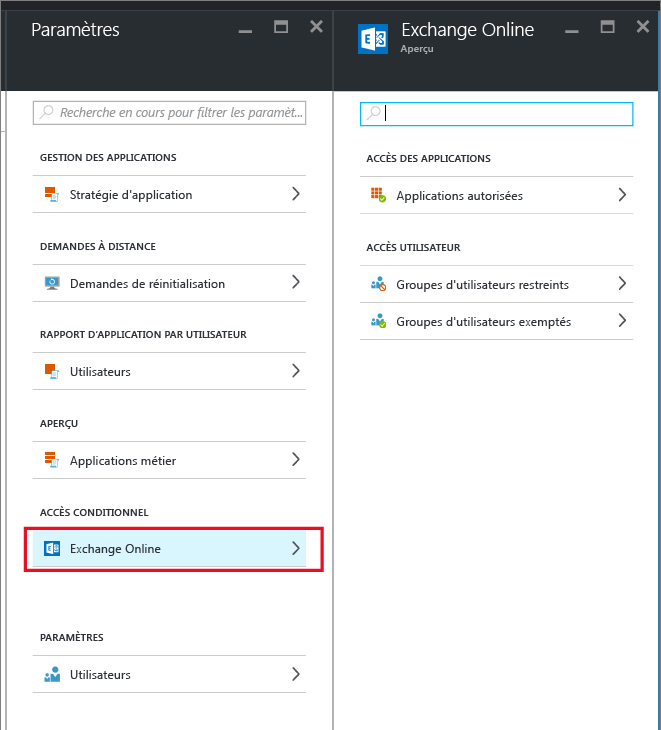
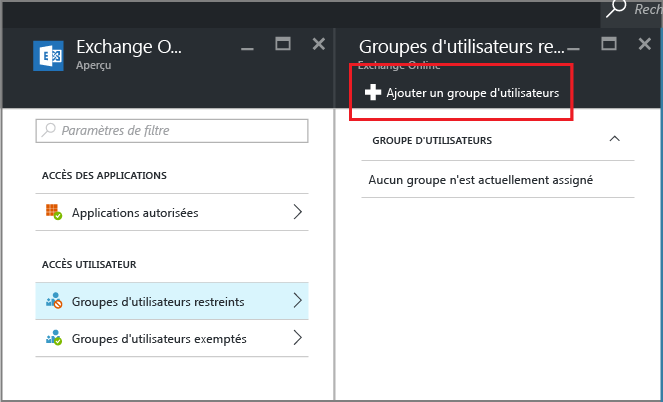

# Créer un accès conditionnel à Exchange Online pour autoriser uniquement les applications prises en charge par la gestion des applications mobiles
Cette rubrique fournit des instructions étape par étape pour configurer l’accès conditionnel pour Exchange Online afin d’autoriser uniquement les applications mobiles qui prennent en charge les stratégies de gestion des applications mobiles (GAM).

## Créer une stratégie Exchange Online
1.  Connectez-vous au [portail Azure](portal.azure.com) qui inclut la fonctionnalité d’accès aux applications. Si vous n’avez pas l’habitude d’utiliser le portail Azure, lisez la rubrique [Portail Azure pour les stratégies de gestion des appareils mobiles](azure-portal-for-microsoft-intune-mam-policies.md).

2.  Choisissez **Parcourir > Intune > panneau Gestion des applications mobiles Intune > Paramètres** et, dans la section **Accès conditionnel**, choisissez **Exchange Online**.

  

3.  Dans le panneau **Applications autorisées**, choisissez l’option **Autoriser les applications qui prennent en charge les stratégies d’application Intune** pour autoriser uniquement les applications prises en charge par les stratégies GAM Intune à accéder à Exchange Online. Quand vous sélectionnez cette option, la liste des applications prises en charge s’affiche.

  >[!NOTE]
  >Aucun des clients de messagerie Exchange Active Sync, y compris les clients de messagerie intégrés sur iOS et Android qui se connectent à Exchange Online, ne pourra envoyer ou recevoir des e-mails. Les utilisateurs recevront à la place un simple e-mail les informant qu’ils doivent utiliser l’application de messagerie Outlook. 
4.   Pour appliquer cette stratégie aux utilisateurs, ouvrez le panneau **Groupes d’utilisateurs restreints**, puis choisissez **Ajouter un groupe d’utilisateurs**. Sélectionnez un ou plusieurs groupes d’utilisateurs devant obtenir cette stratégie.

  

5.  Vous souhaiterez peut-être que certains utilisateurs du groupe d’utilisateurs que vous avez sélectionné à l’étape précédente ne soient pas affectés par cette stratégie. Dans ce cas, ajoutez le groupe d’utilisateurs à la liste des groupes d’utilisateurs exemptés. Dans le panneau **Exchange Online**, choisissez **Groupes d’utilisateurs exemptés**. Choisissez **Ajouter un groupe d’utilisateurs** pour ouvrir la liste des groupes d’utilisateurs. Sélectionnez les groupes que vous souhaitez exclure de cette stratégie.  

## Modifier une stratégie existante
### Ajouter ou supprimer des groupes d’utilisateurs

Pour **supprimer un groupe d’utilisateurs** de la liste **Groupes d’utilisateurs restreints**, ouvrez le panneau **Groupes d’utilisateurs restreints**, mettez en surbrillance le groupe d’utilisateurs que vous souhaitez supprimer, puis cliquez sur l’ellipse **(...)** pour voir l’option **Supprimer**. Choisissez **Supprimer** pour supprimer le groupe d’utilisateurs de la liste. Vous pouvez suivre la même procédure pour supprimer un groupe d’utilisateurs de la liste **Groupes d’utilisateurs exemptés**.

## Étapes suivantes
[Bloquer les applications dépourvues de l’authentification moderne](block-apps-with-no-modern-authentication.md)
### Voir aussi
[Protéger les données d’application avec des stratégies GAM](protect-app-data-using-mobile-app-management-policies-with-microsoft-intune.md)

<!--HONumber=Oct16_HO2-->

