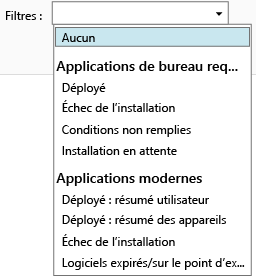

# Surveillance de déploiements d’applications dans Microsoft Intune

## Surveillance d’un déploiement d’application
Vous pouvez voir les applications que vous gérez et l’état de tous les déploiement dans la console d’administration Intune.

### Pour afficher les applications que vous gérez ainsi que leur statut
Dans l’espace de travail **Applications**, cliquez sur le nœud **Applications**, puis cliquez sur **Applications**.

La liste des applications que vous gérez s'affiche. Vous pouvez cliquer sur n'importe quelle application pour afficher le statut de l'installation dans le volet inférieur de la fenêtre de console. Cliquez sur le statut pour afficher plus de détails. Par exemple, si l’état indique **1 utilisateur dispose de ce logiciel**, vous pouvez cliquer sur le message afin d’afficher le nom de l’utilisateur.

> [!TIP]
> Vous pouvez utiliser la liste déroulante **Filtres** pour afficher uniquement les applications qui répondent aux critères que vous spécifiez, telles que les applications dont l’installation a échoué ou les applications qui ont été déployées avec succès.
> 
> 

En outre, l’espace de travail **Tableau de bord** présente une vue d’ensemble de l’état de vos applications. Si vous cliquez n'importe où dans la vue d'ensemble, vous serez dirigé vers la liste des applications.

## Pour afficher plus d'informations détaillées sur une application
Dans la liste des applications, sélectionnez n’importe quelle application, puis cliquez sur **Afficher les propriétés**.

Sur la page **Propriétés du logiciel** de l’application, cliquez sur l’un des onglets suivants : **Général** -affiche des informations générales sur l’application et l’état de son installation, **Appareils** -affiche les appareils ayant installé avec succès un déploiement ciblé de l’application, **Utilisateurs** -affiche les utilisateurs dont les appareils ont correctement installé un déploiement ciblé de l’application.

Comme auparavant, vous pouvez utiliser la liste déroulante **Filtres** pour configurer les valeurs affichées sous les onglets.

<!--HONumber=Jul16_HO4-->

