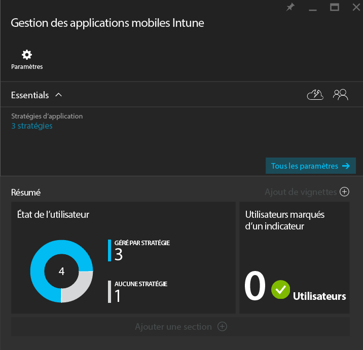
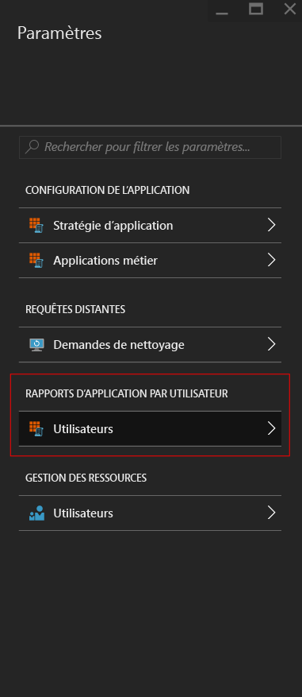
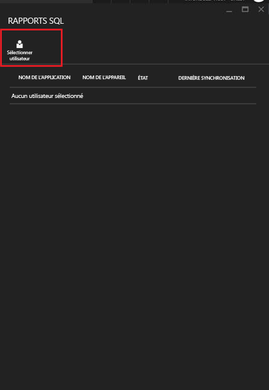
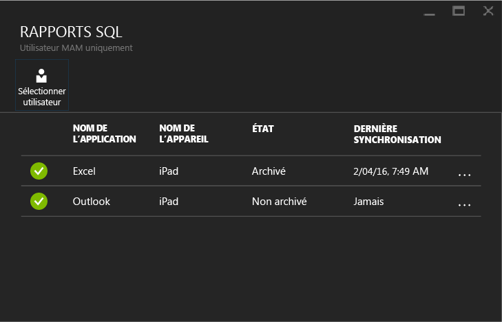

# Analyser les stratégies de gestion des applications mobiles à l’aide de Microsoft Intune
Après avoir configuré une stratégie de gestion des applications mobiles et l’avoir appliquée aux utilisateurs, vous pouvez surveiller l’état de conformité dans le [portail Azure](https://portal.azure.com). Le portail Azure inclut des informations sur les utilisateurs concernés par la stratégie, l’état de conformité et les problèmes que vos utilisateurs finaux pourraient rencontrer.
## Vue Résumé
Dans le panneau **Gestion des applications mobiles Intune**, vous pouvez voir un résumé de l’état de conformité, comme décrit ci-dessous :

-   **UTILISATEURS :** le nombre total d’utilisateurs dans votre société qui utilisent les applications associées à la stratégie.

-   **GÉRÉ PAR STRATÉGIE :** le nombre d’utilisateurs ayant utilisé au moins l’une des applications dans un contexte professionnel.

-   **AUCUNE STRATÉGIE :** le nombre d’utilisateurs qui utilisent les applications associées à la stratégie, mais ne sont pas affectés par votre stratégie.  Vous pouvez envisager d’ajouter ces utilisateurs à votre stratégie.

- **Utilisateurs marqués d’un indicateur :** le nombre d’utilisateurs ayant rencontré des problèmes. Actuellement, seuls les utilisateurs avec des appareils jailbroken sont répertoriés sous **Utilisateurs marqués d’un indicateur**.

## Vue détaillée
Vous pouvez accéder à la vue détaillée du résumé en cliquant sur les vignettes **État de l’utilisateur** et **Utilisateurs marqués d’un indicateur**.

### État de l’utilisateur
Vous pouvez rechercher un utilisateur et examiner son état de conformité. Le panneau **Rapport d’application** affiche les informations suivantes sur un utilisateur sélectionné :
- Les appareils associés au compte d’utilisateur
- Applications avec la stratégie MAM sur l’appareil
- État :

  **Activé :** signifie que la stratégie a été déployée pour l’utilisateur, et que l’application a été utilisée au moins une fois dans un contexte professionnel.

  **Non activé :** signifie que la stratégie a été déployée pour l’utilisateur, mais que l’application n’a pas été utilisée au moins une fois dans un contexte professionnel depuis.

>[!NOTE]
> Si la stratégie de gestion des applications mobiles n’est pas appliquée à l’utilisateur que vous recherchez, un message vous informe que l’utilisateur n’est ciblé par aucune des stratégies d’application.

Pour afficher le rapport d’un utilisateur, procédez comme suit :

**Étape 1 :** pour sélectionner un utilisateur, cliquez sur la vignette Résumé ou choisissez l’option **RAPPORT D’APPLICATION PAR L’UTILISATEUR** dans le panneau **Paramètres** comme indiqué ci-dessous :

**Étape 2 :** le panneau **Rapport d’application** s’ouvre. Choisissez **Sélectionner un utilisateur** pour rechercher un utilisateur Azure Active Directory.

**Étape 3 :** après avoir sélectionné l’utilisateur dans la liste, vous verrez les détails de l’état de conformité de cet utilisateur.

### Utilisateurs marqués d’un indicateur
La vue détaillée affiche le message d’erreur, l’application à laquelle l’utilisateur a accédé lorsque l’erreur s’est produite, la plateforme de l’appareil et un horodatage.  

### Voir aussi
[Gérer les transferts de données entre applications iOS](manage-data-transfer-between-ios-apps-with-microsoft-intune.md)

[Expérience de l’utilisateur final pour des applications avec MAM activée](end-user-experience-for-mam-enabled-apps-with-microsoft-intune.md)

<!--HONumber=Jul16_HO4-->

