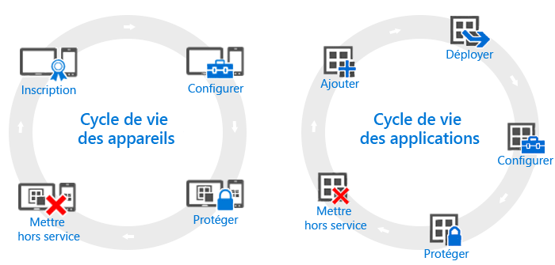

---
# required metadata

title: Vue d’ensemble des cycles de vie des appareils et des applications | Microsoft Intune
description:
keywords:
author: robstackmsft
manager: jeffgilb
ms.date: 04/28/2016
ms.topic: article
ms.prod:
ms.service: microsoft-intune
ms.technology:
ms.assetid: 38e08253-14a0-4cc4-87be-7b110c12a523

# optional metadata

#ROBOTS:
#audience:
#ms.devlang:
ms.reviewer: jeffgilb
ms.suite: ems
#ms.tgt_pltfrm:
#ms.custom:

---

# Vue d’ensemble des cycles de vie des appareils et des applications

Les besoins de différentes organisations peuvent diverger, mais elles devront toutes exécuter certaines étapes en continu, quels que soient leurs autres besoins opérationnels. Ces étapes peuvent être regroupées en deux catégories principales, appelés **cycles de vie**. Le cycle de vie de déploiement que vous suivez varie selon le scénario que vous tentez de mettre en œuvre. Par exemple, vous pouvez n’avoir besoin que du cycle de vie des appareils, du cycle de vie des applications ou des deux.

À des fins de gestion, chaque appareil a un cycle de vie s’étendant de son inscription initiale à sa mise hors service lorsqu’il n’est plus utilisé. Le [cycle vie de la gestion des appareils](overview-of-device-lifecycle-in-microsoft-intune.md) vous guide à travers toutes les options d’inscription, de configuration et de protection des appareils, puis lors de leur retrait de la gestion.

De même, les applications avec lesquelles vous travaillez ont leur propre [cycle de vie](overview-of-app-lifecycle-in-microsoft-intune.md) qui comprend des étapes s’étendant de l’ajout d’une application à Intune à son retrait lorsqu’elle n’est plus utilisée.

<!--HONumber=Jun16_HO1-->

