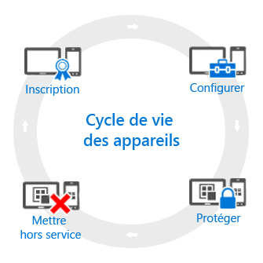

# Vue d’ensemble du cycle de vie de la gestion des appareils mobiles.

Tous les appareils que vous gérez ont un *cycle de vie*. Intune peut vous aider à gérer ce cycle de vie, de l’inscription de l’appareil à son retrait quand il n’est plus nécessaire :

## Inscription
De nos jours, les stratégies de gestion des appareils mobiles traitent une large gamme de téléphones, de tablettes et de PC (iOS, Android, Windows et Mac OS X). Si vous devez gérer un appareil, ce qui est généralement le cas pour les appareils professionnels, la première étape consiste à [configurer l’inscription de cet appareil](enroll-devices-in-microsoft-intune.md). Vous pouvez également gérer les PC Windows en les inscrivant dans Intune (Gestion des appareils mobiles) ou en [installant le logiciel client Intune](manage-windows-pcs-with-microsoft-intune.md).

## La configuration de
L’inscription de vos appareils n’est que la première étape. Pour tirer parti de toutes les offres d’Intune et vous assurer que vos appareils sécurisés et conformes aux normes de l’entreprise, vous pouvez choisir parmi une large gamme de **stratégies** qui vous permettent de configurer presque chaque aspect de la gestion du fonctionnement des appareils. Par exemple, les utilisateurs doivent-ils avoir des mots de passe sur les appareils qui contiennent des données de l'entreprise ? Vous pouvez l'exiger. Avez-vous un Wi-Fi d’entreprise ? Vous pouvez le configurer automatiquement. Voici les types d’options de configuration disponibles :

- [**Stratégies de configuration**](manage-settings-and-features-on-your-devices-with-microsoft-intune-policies.md) : ces stratégies vous permettent de configurer les capacités et les fonctionnalités des appareils que vous gérez. Par exemple, vous pouvez exiger l’utilisation d’un mot de passe sur un Windows Phone, ou désactiver l’utilisation de la caméra sur un iPhone.
- [**Stratégies d’accès aux ressources d’entreprise**](enable-access-to-company-resources-with-microsoft-intune.md) : permettre à vos utilisateurs d’accéder à leurs ressources de travail sur leur appareil personnel peut représenter un réel défi. Par exemple, comment vous assurez-vous que tous les appareils qui doivent accéder à la messagerie d’entreprise sont configurés correctement ? Comment vous assurer que les utilisateurs peuvent accéder au réseau de l’entreprise par le biais d’une connexion VPN sans avoir à connaître les paramètres requis souvent complexes ? Intune peut réduire ce fardeau en configurant automatiquement les appareils que vous gérez de manière à ce qu’ils puissent accéder aux ressources d’entreprise courantes.
- [**Stratégies de gestion des PC Windows (avec le logiciel client Intune)**](common-windows-pc-management-tasks-with-the-microsoft-intune-computer-client.md) : tandis que l’inscription des PC Windows auprès d’Intune permet de tirer le meilleur parti des fonctionnalités de gestion des appareils, Intune continue à prendre en charge la gestion des PC Windows avec le logiciel client Intune. Si vous avez besoin d’informations sur certaines des tâches que vous pouvez effectuer sur des PC, renseignez-vous ici.

## Protection
Dans le monde informatique moderne, la protection des appareils contre tout accès non autorisé est l’une des tâches les plus importantes à réaliser. Outre les éléments de l’étape de **configuration** du cycle de vie des appareils, Intune fournit davantage de fonctionnalités qui protègent les appareils que vous gérez de tout accès non autorisé ou d’attaques malveillantes :
- [**l’authentification multifacteur**](protect-windows-devices-with-multi-factor-authentication.md) : l’ajout d’une couche supplémentaire d’authentification pour les connexions utilisateur peut renforcer davantage la sécurité des appareils. Les appareils Windows, Windows Phone et Windows Mobile proposent l’authentification multifacteur qui nécessite un second niveau d’authentification tel qu’un appel téléphonique ou un SMS avant que les utilisateurs puissent disposer d’un accès.
- [**les paramètres de Microsoft Passport**](control-microsoft-passport-settings-on-devices-with-microsoft-intune.md) - Microsoft Passport est une méthode d’authentification alternative qui permet aux utilisateurs d’utiliser un *geste* (par exemple, la reconnaissance d’une empreinte digitale) ou Windows Hello pour se connecter sans avoir besoin d’un mot de passe.
- [**les stratégies pour protéger les ordinateurs Windows (avec le logiciel client Intune)**](policies-to-protect-windows-pcs-in-microsoft-intune.md) : lorsque vous gérez des ordinateurs Windows à l’aide du logiciel client Intune, vous pouvez utiliser des stratégies qui permettent de contrôler les paramètres pour Endpoint Protection, les mises à jour logicielles et le pare-feu Windows sur les ordinateurs que vous gérez.

## Mettre hors service
Quand un appareil est perdu ou volé, doit être remplacé, ou lorsque des utilisateurs changent de poste, il doit généralement être [mis hors service ou réinitialisé](use-remote-wipe-to-help-protect-data-using-microsoft-intune.md). Pour ce faire, vous pouvez entre autres réinitialiser l’appareil, le supprimer de la gestion ou réinitialiser les données d’entreprise qu’il contient.

<!--HONumber=Jul16_HO2-->

