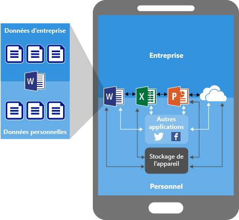
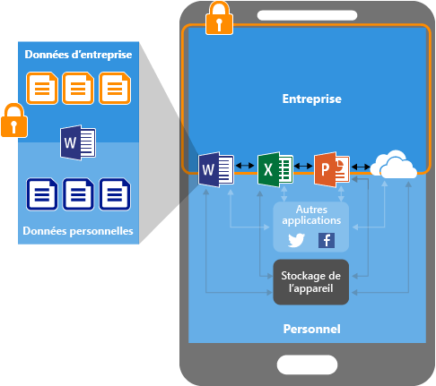
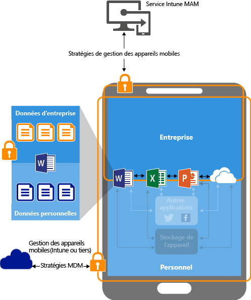

---
# required metadata

title: Protéger les données d’application à l’aide des stratégies de gestion des applications mobiles | Microsoft Intune
description:
keywords:
author: karthikaraman
manager: jeffgilb
ms.date: 04/28/2016
ms.topic: article
ms.prod:
ms.service: microsoft-intune
ms.technology:
ms.assetid: ab6cd622-b738-4a63-9c91-56044aaafa6d

# optional metadata

#ROBOTS:
#audience:
#ms.devlang:
ms.reviewer: joglocke
ms.suite: ems
#ms.tgt_pltfrm:
#ms.custom:

---

# Protéger les données d’application à l’aide des stratégies de gestion des applications mobiles avec Microsoft Intune

## Comment protéger les données d’application
Vos employés utilisent des appareils mobiles pour des tâches à la fois personnelles et professionnelles.  Tout en veillant à ce que vos employés soient productifs, vous voulez éviter toute perte de données, qu’elle soit intentionnelle ou non.  Vous devez également avoir la possibilité de protéger des données d’entreprise accessibles à l’aide de appareils même si vous ne les gérez pas.

Vous pouvez utiliser des stratégies de gestion des applications mobiles Intune pour protéger les données de votre entreprise. Étant donné que les stratégies de gestion des applications mobiles sont indépendantes de toute solution de gestion des appareils mobiles, vous pouvez les utiliser pour protéger les données de votre entreprise en inscrivant ou non les appareils dans une solution de gestion des appareils. En implémentant des **stratégies au niveau de l’application**, vous pouvez restreindre l’accès aux ressources d’entreprise et conserver les données au sein de votre département informatique.

Les stratégies de gestion des applications mobiles prennent en charge les applications qui s’exécutent sur :

-   **Appareils gérés et inscrits** dans [!INCLUDE[wit_nextref](../includes/wit_nextref_md.md)]. Les appareils de cette catégorie sont généralement des appareils d’entreprise.

  > [!IMPORTANT]
  > Si vous utilisez Intune pour gérer vos appareils iOS et Android, vous pouvez créer des stratégies de gestion des applications mobiles pour les applications mobiles Office qui se connectent aux services Office 365. Les stratégies de gestion des applications mobiles ne sont pas prises en charge pour les applications qui se connectent à des services Exchange ou SharePoint locaux.

-   **Les appareils gérés et inscrits dans le cadre d’une solution de gestion des appareils mobiles tierce**.   Les appareils de cette catégorie sont généralement des appareils d’entreprise.

  > [!NOTE] Les stratégies de gestion des applications mobiles ne doivent pas être utilisées avec des solutions de gestion des applications mobiles tierces ou des solutions de conteneur sécurisé.

-   **Appareils non gérés**.  Les appareils de cette catégorie sont généralement la propriété d’employés et ne sont pas gérés ou inscrits dans Intune ou d’autres solutions de gestion des appareils mobiles.

**Les principaux avantages de l’utilisation de stratégies de gestion des applications mobiles sont les suivants :**

-   Protection des données de votre entreprise au niveau de l’application.  Étant donné que la gestion des applications mobiles ne nécessite pas de gestion des appareils, vous pouvez protéger les données d’entreprise à la fois sur les appareils gérés et non gérés. La gestion est centrée autour de l’identité de l’utilisateur, ce qui supprime la nécessité de gérer les appareils.

-   La productivité des utilisateurs finaux n’est pas affectée et les stratégies ne sont pas appliquées pour une utilisation de l’application dans un contexte personnel.  Les stratégies sont appliquées uniquement dans un contexte professionnel, vous donnant ainsi la possibilité de protéger les données d’entreprise sans toucher aux données personnelles.

Il existe d’autres avantages à utiliser la gestion des appareils mobiles (MDM) avec des stratégies de gestion des applications mobiles (MAM). Les entreprises peuvent avoir recours aux deux simultanément. Par exemple, un employé peut utiliser un téléphone fourni par l’entreprise ainsi qu’une tablette personnelle.  Dans ce cas, le téléphone de l’entreprise est inscrit dans la gestion des appareils mobiles et protégé par des stratégies de gestion des applications mobiles, tandis que l’appareil personnel est protégé par des stratégies de gestion des applications mobiles uniquement.

- **La gestion des appareils mobiles permet de s’assurer que l’appareil est protégé**.  Par exemple, vous pouvez demander un code confidentiel pour accéder à l’appareil ou déployer des applications gérées sur l’appareil. Vous pouvez également déployer des applications sur des appareils via votre solution MDM, pour mieux contrôler la gestion des applications.

- **Les stratégies de gestion des applications mobiles permettent de veiller à ce que des protections de la couche application soient en place**. Par exemple, vous pouvez exiger un code confidentiel pour ouvrir une application dans un contexte professionnel, pour partager les données entre les applications ou pour empêcher les données d’application de l’entreprise d’être enregistrées dans un emplacement de stockage personnel.

### Les stratégies de gestion des applications mobiles sont actuellement prises en charge sous :
-   iOS 8.1 ou version ultérieure

-   Android 4 ou version ultérieure

Les appareils Windows ne sont pas pris en charge actuellement.
##  Comment les stratégies de gestion des applications mobiles protègent les données d’application

####  Applications sans stratégies de gestion des applications mobiles :

Lorsque les applications sont utilisées sans aucune restriction, les données d’entreprise et personnelles peuvent se mélanger.  Les données d’entreprise peuvent alors finir dans des emplacements de stockage personnels ou être transmises à des applications hors de votre portée, entraînant une perte de données. Les flèches dans le diagramme indiquent un déplacement des données sans restriction entre les applications (professionnelles et personnelles) et vers des emplacements de stockage.

### Protection des données avec les stratégies de gestion des applications mobiles :

Vous pouvez utiliser des stratégies de gestion des applications mobiles pour empêcher l’enregistrement des sur le stockage local de l’appareil et limiter le déplacement des données vers d’autres applications qui ne sont pas protégés par des stratégies de gestion des applications mobiles. Les paramètres de stratégie de gestion des applications mobiles sont entre autres :
- Stratégies de réadressage de données telles qu’**Interdire Enregistrer sous**, **Restreindre les opérations couper, copier et coller**.
- Paramètres de stratégie d’accès tels que **Demander un code confidentiel simple pour l'accès** et **Bloquer l’exécution des applications gérées sur les appareils jailbroken ou rootés**.

### Protection des données avec des stratégies de gestion des applications mobiles sur des appareils gérés par une solution de gestion des appareils mobiles :

**Pour les appareils inscrits dans une solution de gestion des appareils mobiles**-

L’illustration ci-dessus montre les couches de protection offertes par les stratégies combinées de gestion des appareils mobiles et de gestion des applications mobiles.

La solution de gestion des appareils mobiles :

-   Inscrit l’appareil.

-   Déploie les applications sur l’appareil.

-   Assure la gestion et la conformité de l’appareil en continu.

**Les stratégies de gestion des applications mobiles sont synonymes de valeur ajoutée car :**

-   Elles empêchent les données d’entreprise de s’échapper vers des applications et de services de particuliers.

-   Elles appliquent des restrictions (enregistrement sous, Presse-papiers, code confidentiel, etc.) aux applications mobiles.

-   Elles permettent d’effacer les données d’entreprise des applications sans supprimer ces applications de l’appareil.

### Protection des données avec des stratégies de gestion des applications mobiles pour les appareils sans inscription

Le diagramme ci-dessus illustre comment les stratégies de protection des données fonctionnent au niveau de l’application sans gestion des appareils mobiles.

Pour les appareils BYOD non inscrits dans une solution de gestion des appareils mobiles, les stratégies de gestion des applications mobiles peuvent faciliter la protection des données d’entreprise au niveau de l’application.
Cependant, il existe certaines limites à connaître, dont voici des exemples :

-   Vous ne pouvez déployer des applications sur l’appareil.  L’utilisateur final doit obtenir les applications depuis le Store.

-   Vous ne pouvez pas configurer des profils de certificat sur ces appareils.

-   Vous ne pouvez pas configurer des paramètres VPN et Wi-Fi d’entreprise sur ces appareils.

## Prise en charge de plusieurs identités

Les applications qui prennent en charge plusieurs identités vous permettent d’utiliser des comptes différents (professionnels et personnels) pour accéder aux applications auxquelles des stratégies de gestion des applications mobiles sont appliquées lorsque les applications sont utilisées dans le contexte de travail.  

Par exemple, lorsque l’utilisateur final lance l’application OneDrive à l’aide de son compte professionnel, il ne peut pas déplacer les fichiers vers un emplacement de stockage personnel. Toutefois, lorsque l’utilisateur final utilise OneDrive avec son compte personnel, ils peuvent copier et déplacer des données à partir de leur compte personnel OneDrive sans restriction.  

Pour obtenir une explication détaillée de l’expérience de l’utilisation d’applications associées à des stratégies de gestion des applications mobiles et savoir comment les applications prenant en charge plusieurs identités permettent d’appliquer des stratégies de gestion des applications mobiles uniquement dans le contexte de travail, consultez [Utilisation d’applications avec prise en charge de plusieurs identités](end-user-experience-for-mam-enabled-apps-with-microsoft-intune.md#using-apps-with-multi-identity-support)

Toutes les applications mobiles Office prennent en charge plusieurs identités.

##  Étapes suivantes
[Préparez-vous à configurer des stratégies de gestion des applications mobiles](get-ready-to-configure-mobile-app-management-policies-with-microsoft-intune.md)

[Créer et déployer des stratégies de gestion des applications mobiles à l’aide de Microsoft Intune](create-and-deploy-mobile-app-management-policies-with-microsoft-intune.md)

<!--HONumber=Jun16_HO2-->

