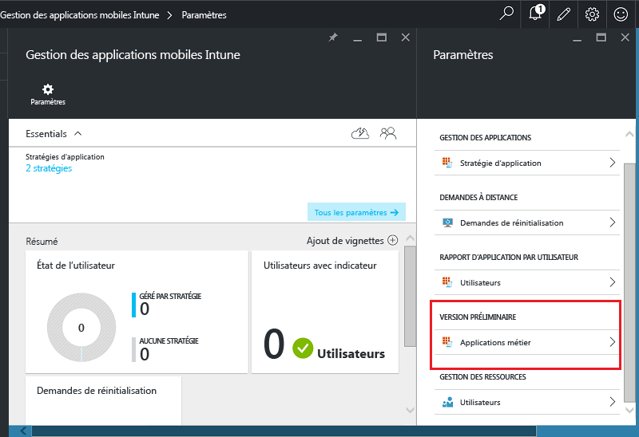
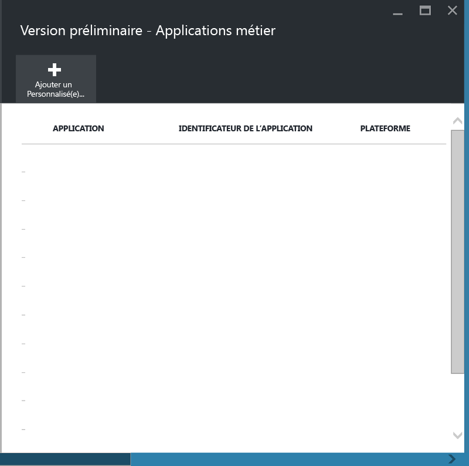
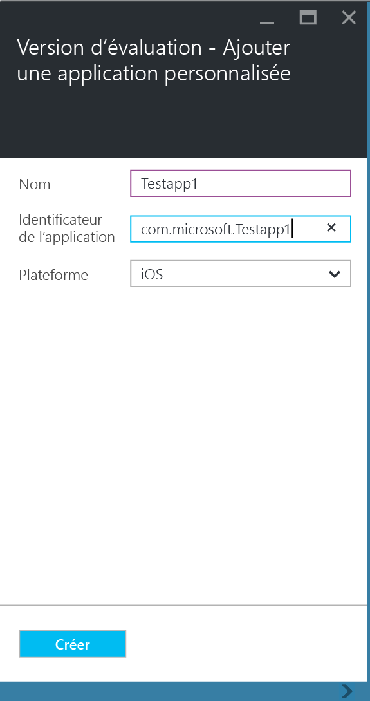
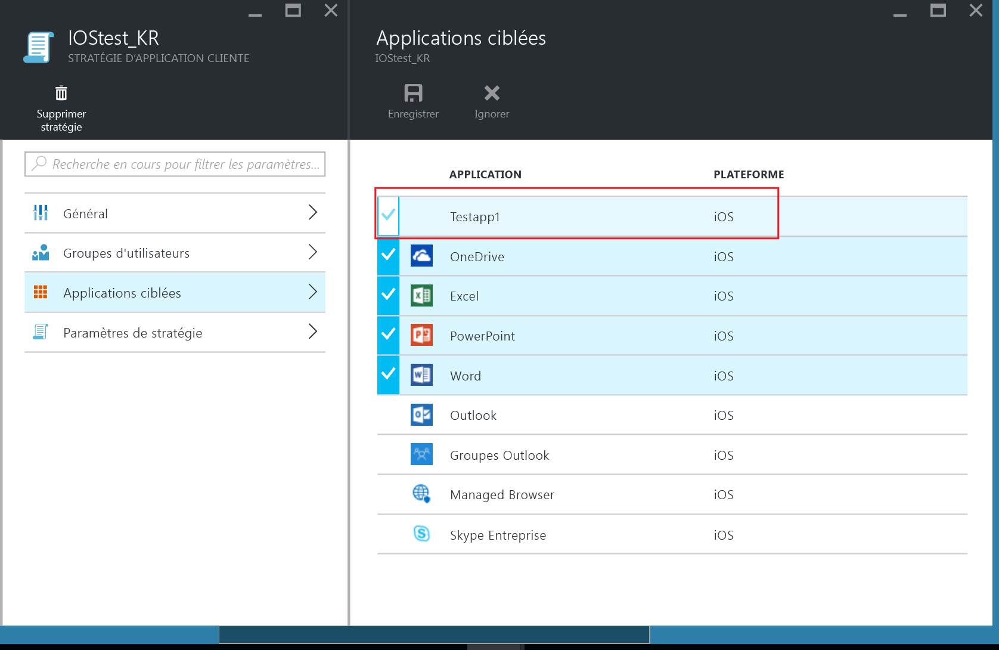
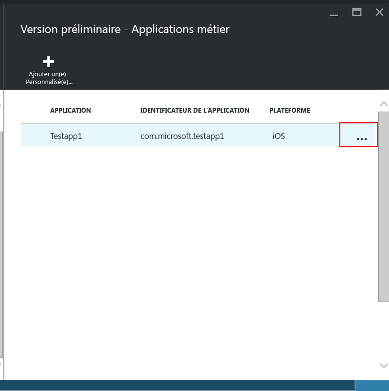
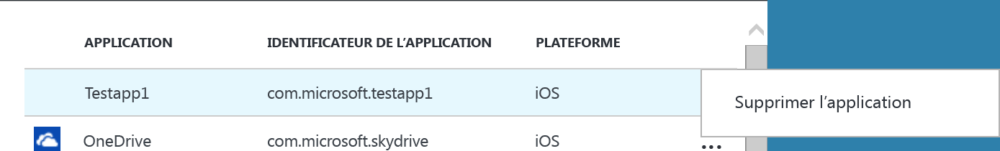

# Protéger les données et applications métier sur des appareils non inscrits dans Microsoft Intune

Les stratégies de gestion des applications mobiles (GAM) protègent les données de l’entreprise en limitant les actions qui pourraient provoquer une fuite des données de l’entreprise et en appliquant des exigences pour l’accès aux données, comme un code confidentiel de l’application. Pour appliquer des stratégies GAM à des applications métier iOS et Android, vous devez d’abord encapsuler l’application avec l’outil de création de package de restrictions d’application Microsoft Intune.  L’encapsulation d’application est le processus visant à appliquer une couche de gestion à une application mobile sans exiger la moindre modification de l’application sous-jacente.  Une fois l’application encapsulée, vous pouvez lui appliquer des stratégies GAM et la distribuer aux utilisateurs finaux.  

Cette rubrique explique les étapes nécessaires pour appliquer des stratégies GAM pour les applications accessibles sur les **appareils personnels des employés qui ne sont pas gérés** et les appareils qui sont gérés par une **solution tierce de gestion des appareils mobiles**.  Pour préparer vos applications métier qui s’exécutent sur des **appareils inscrits dans la gestion d’appareils mobiles Intune**, consultez [Décider comment préparer les applications pour la gestion des applications mobiles avec Microsoft Intune](decide-how-to-prepare-apps-for-mobile-application-management-with-microsoft-intune.md).

##  Étape 1: Préparer l’application
Avant de pouvoir appliquer les stratégies GAM à une application, vous devez tout d’abord encapsuler l’application à l’aide de l’outil de création de package de restrictions d’application Microsoft Intune.  Pour obtenir des instructions pour télécharger et utiliser l’outil de création de package de restrictions d’application, consultez les pages suivantes :

- [Préparer des applications iOS pour la gestion des applications mobiles avec l’outil de création de package de restrictions d’application Intune](prepare-ios-apps-for-mobile-application-management-with-the-microsoft-intune-app-wrapping-tool.md)
- [Préparer des applications Android pour la gestion des applications mobiles avec l’outil de création de package de restrictions d’application Intune](prepare-android-apps-for-mobile-application-management-with-the-microsoft-intune-app-wrapping-tool)

>[!IMPORTANT]  
>Cette version de l’outil de création de package de restrictions d’application, qui prend en charge les appareils non inscrits dans Intune, est disponible pour iOS et est en préversion publique pour Android. Vous pouvez télécharger l’outil à partir de [ce dépôt GitHub](https://github.com/msintuneappsdk/intune-app-wrapping-tool-ios) pour iOS et à partir de [ce dépôt GitHub](https://github.com/msintuneappsdk/intune-app-wrapper-android-preview) pour Android.

## Étape 2 : Ajouter l’application

Pour associer votre application métier aux stratégies GAM, vous devez ajouter les détails de l’application à votre abonnement/client Intune en procédant comme suit :

1. Dans le [portail Azure](https://portal.azure.com/), accédez à **Gestion des applications mobiles Intune > Paramètres** et choisissez **Applications métier**.

  

2. Dans le panneau **Applications métier**, choisissez **Ajouter une application personnalisée**.

  
3.  Fournissez un nom pour l’application, l’identificateur de lot dans le champ Identificateur de l’application et la plateforme (iOS ou Android).

   Cette étape permet de créer une liste unique de votre application.  L’application est également affichée dans la liste des applications ciblées pour une stratégie GAM pour votre client, telle que décrite à l’étape suivante.

## Étape 3 : Appliquer des stratégies GAM
Une fois que les métadonnées de l’application sont chargées sur le service, l’application s’affiche dans la liste des applications.  Vous pouvez à présent [créer une stratégie ou utiliser une stratégie existante](create-and-deploy-mobile-app-management-policies-with-microsoft-intune.md) et l’appliquer à l’application métier que vous avez ajoutée à l’étape 2.

>[!IMPORTANT]
>La stratégie GAM doit être appliquée pour les utilisateurs qui s’apprêtent à utiliser l’application encapsulée.  Les utilisateurs pour lesquels cette stratégie n’a pas été déployée ne peuvent pas utiliser cette application.

  
## Étape 4 : Distribuer l’application
Vous pouvez déployer des applications sur vos utilisateurs finaux de diverses manières :
* Pour les appareils inscrits dans une solution tierce de gestion des appareils mobiles, vous pouvez distribuer les applications via votre solution de gestion des appareils mobiles.
* Pour les appareils gérés par aucune solution de gestion des appareils mobiles, vous avez besoin d’une solution personnalisée. Les utilisateurs finaux doivent télécharger et installer l’application sur leur appareil.

## Modification des métadonnées
Si vous devez modifier les détails de l’application, tels que le nom de l’application ou l’identificateur de lot, vous devez [supprimer l’application](#remove-apps) et [l’ajouter](#step-2-add-the-app) avec les nouvelles métadonnées.

##  Supprimer des applications
Vous pouvez supprimer une application métier de la liste des applications.  Cela supprime l’application de la liste ainsi que l’association avec les stratégies GAM, mais ne supprime pas et ne désinstalle pas l’application sur l’appareil de l’utilisateur final.  

1.  Dans le [portail Azure](https://portal.azure.com/), accédez à **Gestion des applications mobiles Intune > Paramètres**.  Dans le panneau **Paramètres**, choisissez **Activité commerciale** pour ouvrir la liste des applications existantes.  
2.  Sélectionnez l’application que vous souhaitez supprimer, puis choisissez le menu contextuel **(...)**.

  
3.  Choisissez **Supprimer l’application** pour supprimer l’application.

  

  Cela supprime les applications de la liste des applications métier et de la liste des applications ciblées dans la stratégie GAM.

<!--HONumber=Nov16_HO2-->

