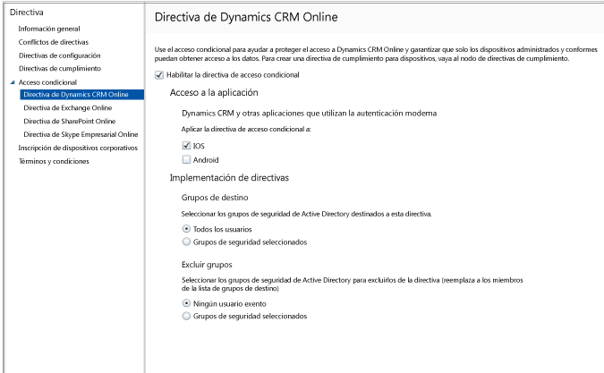

# Restreindre l’accès à la messagerie à Dynamics CRM Online avec Intune
Vous pouvez contrôler l’accès à Microsoft Dynamics CRM Online à partir des appareils iOS et Android avec l’accès conditionnel Microsoft Intune.  L’accès conditionnel Intune comprend deux composants :
* La [stratégie de conformité des appareils](introduction-to-device-compliance-policies-in-microsoft-intune.md) que l’appareil doit respecter pour être considéré comme conforme.
* La [stratégie d’accès conditionnel](restrict-access-to-email-and-o365-services-with-microsoft-intune.md) dans laquelle vous spécifiez les conditions que l’appareil doit remplir pour accéder au service.

Pour en savoir plus sur le fonctionnement de l’accès conditionnel, lisez l’article [Restreindre l’accès aux services de messagerie, O365 et autres](restrict-access-to-email-and-o365-services-with-microsoft-intune.md).

[!IMPORTANT] Pour déployer l’accès conditionnel, vous devez avoir des abonnements à Intune et Azure Active Directory Premium, et les utilisateurs doivent avoir une licence pour chacun des deux produits. L’**abonnement Enterprise Mobility + Security (EMS)** comprend un abonnement à Intune et un abonnement à Azure Active Directory Premium. Pour plus d’informations, consultez la [page de tarification d’Enterprise Mobility](https://www.microsoft.com/en-us/cloud-platform/enterprise-mobility-pricing). Si vous n’avez pas d’abonnement EMS, vous pouvez obtenir un abonnement à Azure Active Directory Premium. Consultez la [page de tarification d’Azure Active Directory](https://azure.microsoft.com/en-us/pricing/details/active-directory/). 

Quand un utilisateur ciblé tente d’utiliser l’application Dynamics CRM sur son appareil, l’évaluation suivante se produit :

Pour accéder à Dynamics CRM Online, un appareil doit être :
* un appareil **Android** ou **iOS**,
* **inscrit** auprès de Microsoft Intune,
* **conforme** à toutes les stratégies de conformité Microsoft Intune déployées.

L’état de l’appareil est stocké dans Azure Active Directory, qui autorise ou bloque l’accès en fonction des conditions que vous spécifiez.

Si une condition n'est pas remplie, l'utilisateur reçoit l'un des messages suivants quand il tente de se connecter :
* Si l’appareil n’est pas inscrit auprès de Microsoft Intune ou dans Azure Active Directory, l’utilisateur reçoit un message contenant des instructions pour installer l’application Portail d’entreprise et inscrire l’appareil.
* Si l’appareil n’est pas conforme, l’utilisateur reçoit un message le dirigeant vers le site web ou l’application Portail d’entreprise Microsoft Intune, où il peut trouver des informations sur le problème et des solutions pour y remédier.

## Configurer l’accès conditionnel à Dynamics CRM Online  
### Étape 1 : configurer les groupes de sécurité Active Directory

Avant de commencer, configurez les groupes de sécurité Azure Active Directory pour la stratégie d'accès conditionnel. Vous pouvez configurer ces groupes dans le **Centre d’administration Office 365**. Ces groupes seront utilisés pour cibler ou exempter les utilisateurs de la stratégie. Quand un utilisateur est ciblé par une stratégie, chaque appareil qu'il utilise doit être conforme à cette stratégie pour qu'il puisse accéder aux ressources.

Vous pouvez spécifier deux types de groupes que la stratégie Dynamics CRM pourra utiliser :
* **Groupes ciblés** : contient les groupes d’utilisateurs auxquels s’applique la stratégie.
* **Groupes exemptés** : contient les groupes d’utilisateurs exempts de la stratégie.

Si un utilisateur se trouve dans les deux groupes, il est exempt de la stratégie.

### Étape 2 : configurer et déployer une stratégie de conformité
[Créez](create-a-device-compliance-policy-in-microsoft-intune.md) et [déployez](deploy-and-monitor-a-device-compliance-policy-in-microsoft-intune.md) une stratégie de conformité pour tous les appareils qui seront affectés par la stratégie. Il s’agit de tous les appareils utilisés par les utilisateurs des groupes ciblés.

> [!NOTE]
> Tandis que les stratégies de conformité sont déployées sur des groupes Microsoft Intune, les stratégies d’accès conditionnel sont destinées aux groupes de sécurité Azure Active Directory.

> [!IMPORTANT]
> Si vous n’avez pas déployé de stratégie de conformité, les appareils seront traités comme étant conformes.

Quand vous êtes prêt, passez à l’Étape 3.
### Étape 3 : Configurer la stratégie Dynamics CRM
Ensuite, configurez la stratégie de manière à restreindre l’accès à Dynamics CRM aux appareils gérés et conformes. Cette stratégie sera stockée dans Azure Active Directory.

1.  Dans la console d’administration Microsoft Intune, choisissez **Stratégie > Accès conditionnel > Stratégie Dynamics CRM Online**.

  

2.  Sélectionnez **Activer la stratégie d’accès conditionnel**.
3.  Sous **Accès aux applications**, vous pouvez choisir d’appliquer la stratégie d’accès conditionnel à :
  * **iOS**
  * **Android**
4.  Sous **Groupes ciblés**, choisissez **Modifier** pour sélectionner les groupes de sécurité Azure Active Directory auxquels la stratégie sera appliquée. Vous pouvez cibler cette stratégie sur tous les utilisateurs ou seulement sur un groupe d’utilisateurs donné.
5.  Sous **Groupes exemptés**, vous pouvez éventuellement choisir **Modifier** pour sélectionner les groupes de sécurité Azure Active Directory exempts de cette stratégie.
6.  Une fois terminé, choisissez **Enregistrer**.

Vous avez maintenant configuré l’accès conditionnel à Dynamics CRM. La stratégie d'accès conditionnel prend effet immédiatement. Il est donc inutile de la déployer.
##  analyser la conformité et les stratégies d'accès conditionnel

Dans l'espace de travail **Groupes** , vous pouvez afficher l'état de l'accès conditionnel de vos appareils.

Sélectionnez un groupe d'appareils mobiles quelconque, puis sous l'onglet **Appareils** , sélectionnez l'un des **Filtres**suivants :
* **Appareils non enregistrés avec AAD** : l’accès à Dynamics CRM est bloqué pour ces appareils.
* **Appareils non conformes** : l’accès à Dynamics CRM est bloqué pour ces appareils.
* **Appareils enregistrés avec AAD et conformes** : ces appareils peuvent accéder à Dynamics CRM.

##  Étapes suivantes
[Restreindre l’accès à Exchange Online](restrict-access-to-exchange-online-with-microsoft-intune.md)

[Restreindre l’accès à Exchange localement](restrict-access-to-exchange-onpremises-with-microsoft-intune.md)
[Restreindre l’accès à SharePoint Online](restrict-access-to-sharepoint-online-with-microsoft-intune.md)

[Restreindre l’accès à Skype Entreprise Online](restrict-access-to-skype-for-business-online-with-microsoft-intune.md)

<!--HONumber=Oct16_HO1-->

