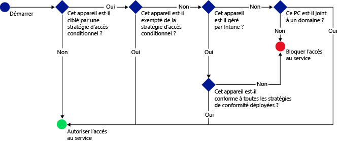

# Restreindre l’accès aux services de messagerie, O365 et autres avec Microsoft Intune
Vous pouvez restreindre l’accès à votre messagerie d’entreprise et aux services O365 avec l’accès conditionnel d’Intune. La capacité d’accès conditionnel d’Intune vous permet de vous assurer que l’accès à la messagerie de votre entreprise et aux services O365 est limité aux appareils qui respectent les règles que vous avez définies.
## Comment fonctionne l’accès conditionnel ?
Les paramètres de la stratégie de conformité sont utilisés pour évaluer la conformité de l’appareil. La stratégie d’accès conditionnel utilise l’évaluation pour bloquer ou autoriser l’accès à un service spécifique. Lorsqu’une stratégie d’accès conditionnel est utilisée en association avec une stratégie de conformité, seuls les appareils conformes pourront accéder au service. La stratégie de conformité et la stratégie d’accès conditionnel sont déployées pour l’utilisateur. La conformité avec les stratégies de chaque appareil que l’utilisateur utilise pour accéder aux services est contrôlée.

N’oubliez pas que l’utilisateur de l’appareil doit déployer une stratégie de conformité sur l’appareil afin que sa conformité soit évaluée.
Si aucune stratégie de conformité n’est déployée sur l’utilisateur, l’appareil est considéré comme conforme et aucune restriction d’accès ne s’applique.

Quand un appareil ne remplit pas les conditions définies dans les stratégies, l’utilisateur final est guidé tout au long du processus d’inscription de cet appareil et du processus de résolution du problème qui empêche l’appareil d’être conforme.

Voici un flux typique d’accès conditionnel :

## Comment configurer l’accès conditionnel ?
Utilisez l’accès conditionnel pour gérer l’accès à Microsoft **Exchange sur site**, **Exchange Online**, **Exchange Online Dedicated**, **SharePoint Online** et **Skype Entreprise Online**.

Pour mettre en place l’accès conditionnel, configurez une stratégie de conformité des appareils et une stratégie d’accès conditionnel.

La stratégie de conformité inclut des paramètres tels que le mot de passe, le chiffrement et le jailbreak de l’appareil. L’appareil doit respecter ces règles pour être considéré comme conforme.

Vous pouvez définir une stratégie d’accès conditionnel pour restreindre l’accès en fonction de :
- l’état de conformité de l’appareil ;
- la plateforme sous laquelle fonctionne l’appareil ;
- le type d’applications utilisées pour accéder aux services.

Contrairement à d’autres stratégies Intune, vous ne déployez pas de stratégies d’accès conditionnel. Au lieu de cela, une fois que vous avez configuré la stratégie et sélectionné les utilisateurs concernés, la stratégie est appliquée à tous les utilisateurs ciblés. Quand un utilisateur est ciblé par une stratégie, chaque appareil qu'il utilise doit être conforme à cette stratégie pour qu'il puisse accéder aux ressources.

## Étapes suivantes
1. [En savoir plus sur la stratégie de conformité des appareils et son fonctionnement](introduction-to-device-compliance-policies-in-microsoft-intune.md)

2. [Créer une stratégie de conformité](create-a-device-compliance-policy-in-microsoft-intune.md)

2.  Créer une stratégie d’accès conditionnel pour l’une des situations suivantes :
> [!div class="op_single_selector"]
  - [Créer une stratégie d’accès conditionnel à Exchange Online](restrict-access-to-exchange-online-with-microsoft-intune.md)
  - [Créer une stratégie d’accès conditionnel à Exchange sur site](restrict-access-to-exchange-onpremises-with-microsoft-intune.md)
  - [Créer une stratégie d’accès conditionnel à Exchange Online Dedicated](restrict-access-to-exchange-online-with-microsoft-intune.md)
  - [Créer une stratégie d’accès conditionnel à Exchange Online Dedicated (environnement hérité)](restrict-access-to-exchange-onpremises-with-microsoft-intune.md)
  - [Créer une stratégie d’accès conditionnel à SharePoint Online](restrict-access-to-sharepoint-online-with-microsoft-intune.md)
  - [Créer une stratégie d’accès conditionnel à Skype Entreprise Online](restrict-access-to-skype-for-business-online-with-microsoft-intune.md)
  - [Créer une stratégie d’accès conditionnel à Dynamics CRM Online](restrict-access-to-dynamics-crm-online-with-microsoft-intune.md)

<!--HONumber=Nov16_HO2-->

