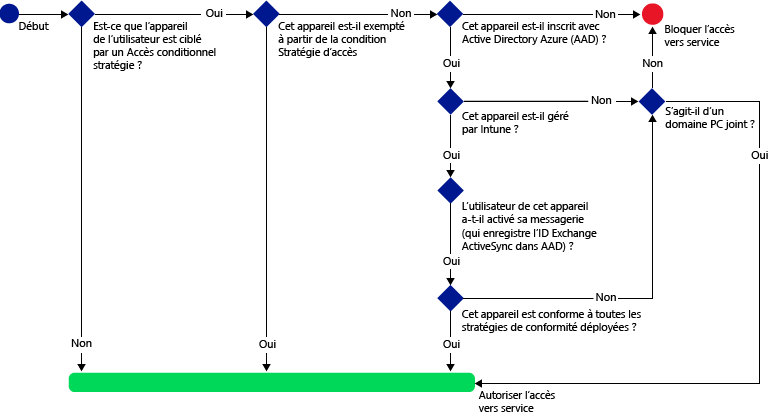
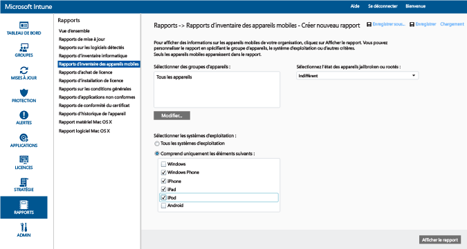
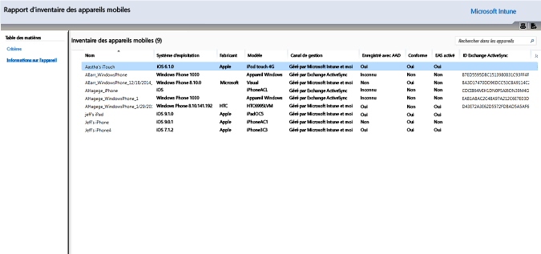
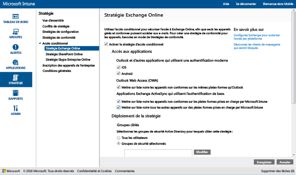
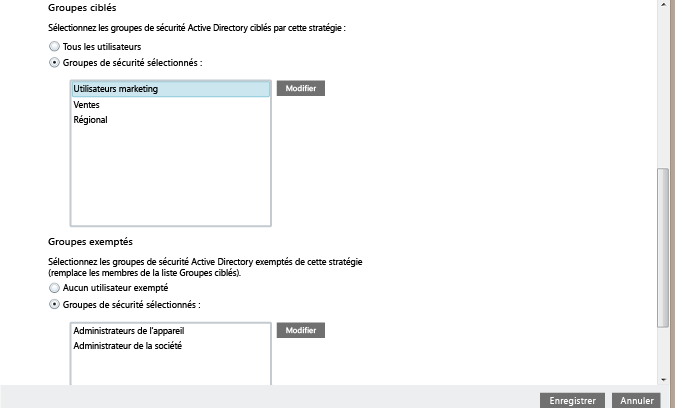
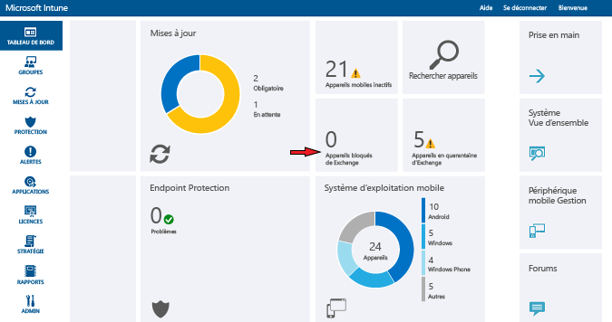

# Restreindre l’accès à la messagerie Exchange Online et Exchange Online Dedicated (nouvel environnement) avec Intune

Si vous disposez d’un environnement Exchange Online Dedicated et que vous ne savez pas s’il s’agit de la nouvelle configuration ou d’une configuration héritée, contactez votre responsable de compte.

Pour contrôler l’accès à la messagerie Exchange Online ou Exchange Online Dedicated (nouvel environnement), configurez l’accès conditionnel à Exchange Online dans Intune.
Pour en savoir plus sur le fonctionnement de l’accès conditionnel, lisez l’article [Restreindre l’accès aux services de messagerie, O365 et autres](restrict-access-to-email-and-o365-services-with-microsoft-intune.md).

>[!IMPORTANT]
>L’accès conditionnel des PC et des appareils Windows 10 Mobile avec des applications utilisant l’authentification moderne n’est actuellement pas disponible pour tous les clients Intune. Si vous utilisez déjà ces fonctionnalités, vous n’avez pas d’action particulière à effectuer. Vous pouvez continuer à les utiliser.

>Si vous n’avez pas créé de stratégies d’accès conditionnel pour des PC ou des appareils Windows 10 Mobile pour les applications utilisant l’authentification moderne et souhaitez le faire, inscrivez-vous à la version préliminaire publique d’Azure Active Directory qui inclut l’accès conditionnel basé sur des appareils pour des appareils Intune gérés ou des PC Windows joints à un domaine. Lisez [ce billet de blog](https://blogs.technet.microsoft.com/enterprisemobility/2016/08/10/azuread-conditional-access-policies-for-ios-android-and-windows-are-in-preview/) pour en savoir plus.  

**Avant** de configurer l’accès conditionnel, vous devez :

-   Disposer d’un **abonnement Office 365 qui inclut Exchange Online (comme E3)** ; les utilisateurs doivent disposer d’une licence pour Exchange Online.

-  Il est possible de configurer le **connecteur de service à service Microsoft Intune** facultatif, qui connecte [!INCLUDE[wit_nextref](../includes/wit_nextref_md.md)] à Microsoft Exchange Online et vous aide à gérer les informations sur les appareils avec la console [!INCLUDE[wit_nextref](../includes/wit_nextref_md.md)]. Il n’est pas nécessaire d’utiliser le connecteur pour utiliser des stratégies de conformité ou d’accès conditionnel, mais il est obligatoire pour exécuter les rapports qui aident à évaluer l’impact de l’accès conditionnel.

   > [!NOTE]
   > Ne configurez pas le connecteur de service à service si vous prévoyez d’utiliser l’accès conditionnel à Exchange Online et Exchange sur site

   Pour obtenir des instructions sur la configuration du connecteur, consultez [Connecteur de service à service Intune](intune-service-to-service-exchange-connector.md)

Une fois les stratégies d’accès conditionnel configurées et ciblées sur un utilisateur, l’**appareil** dont l’utilisateur se sert pour se connecter à sa messagerie doit :

-   Être **inscrit** auprès d’[!INCLUDE[wit_nextref](../includes/wit_nextref_md.md)] ou être un PC joint à un domaine.

-  Être **inscrit dans Azure Active Directory**. Cela se produit automatiquement quand l’appareil est inscrit auprès d’[!INCLUDE[wit_nextref](../includes/wit_nextref_md.md)]. En outre, l’ID Exchange ActiveSync du client doit être inscrit auprès d’Azure Active Directory.

  Le service AAD DRS sera activé automatiquement pour les clients Intune et Office 365. Les clients qui ont déjà déployé le service d'inscription d'appareils AD FS ne verront pas les appareils inscrits dans leur annuaire Active Directory local.

-   Être **compatible** avec n’importe quelle stratégie de conformité [!INCLUDE[wit_nextref](../includes/wit_nextref_md.md)] déployée sur cet appareil ou joint à un domaine local.

Si une stratégie d’accès conditionnel n’est pas remplie, l’utilisateur reçoit l’un des messages suivants quand il tente de se connecter :

- Si l’appareil n’est pas inscrit auprès d’[!INCLUDE[wit_nextref](../includes/wit_nextref_md.md)] ou qu’il n’est pas inscrit dans Azure Active Directory, l’utilisateur reçoit un message contenant des instructions pour installer l’application du portail d’entreprise, inscrire l’appareil et activer la messagerie. Ce processus associe également l’ID Exchange ActiveSync de l’appareil à l’enregistrement dans Azure Active Directory.

-   Si l’appareil est considéré comme non conforme aux règles de stratégie de conformité, l’utilisateur final est dirigé vers le site web ou l’application du portail d’entreprise [!INCLUDE[wit_nextref](../includes/wit_nextref_md.md)] où il trouvera des informations sur le problème et sa résolution.

Le diagramme ci-dessous illustre le flux utilisé par les stratégies d’accès conditionnel à Exchange Online.

## Prise en charge des appareils mobiles
Vous pouvez restreindre l’accès à la messagerie Exchange Online à partir d’**Outlook** et d’autres **applications qui utilisent l’authentification moderne** :

- Android 4.0 et versions ultérieures, Samsung Knox Standard 4.0 et versions ultérieures
- iOS 8.0 et versions ultérieures
- Windows Phone 8.1 et versions ultérieures

L’**authentification moderne** permet aux clients Microsoft Office de bénéficier de la connexion basée sur la bibliothèque ADAL (Active Directory Authentication Library).

-   L'authentification ADAL permet aux clients Office de procéder à une authentification basée sur un navigateur (également appelée authentification passive).  Pour s'authentifier, l'utilisateur est dirigé vers une page web de connexion. Cette nouvelle méthode d’authentification améliore la sécurité, avec par exemple l’**authentification multifacteur** et l’**authentification par certificat**.
Cet [article](https://support.office.com/en-US/article/How-modern-authentication-works-for-Office-2013-and-Office-2016-client-apps-e4c45989-4b1a-462e-a81b-2a13191cf517) contient plus d’informations sur le fonctionnement de l’authentification moderne.
Configurez des règles de revendications AD FS pour bloquer les protocoles autres que l'authentification moderne. Des instructions détaillées sont fournies dans le scénario 3 : [bloquer tout accès à O365, à l’exception des applications basées sur un navigateur](https://technet.microsoft.com/library/dn592182.aspx).

Vous pouvez restreindre l’accès à **Outlook Web Access (OWA)** sur Exchange Online depuis un navigateur sur les appareils **iOS** et **Android**.  L’accès ne sera autorisé qu’à partir des navigateurs pris en charge sur les appareils compatibles :

* Safari (iOS)
* Chrome (Android)
* Managed Browser (iOS et Android)

**Les navigateurs non pris en charge seront bloqués**.

Les applications OWA pour iOS et Android ne sont pas prises en charge.  Elles doivent être bloquées par des règles de revendications AD FS.

Vous pouvez restreindre l’accès à la messagerie Exchange à partir du **client de messagerie Exchange ActiveSync** intégré sur les plateformes suivantes :

- Android 4.0 et versions ultérieures, Samsung Knox Standard 4.0 et versions ultérieures

- iOS 8.0 et versions ultérieures

- Windows Phone 8.1 et versions ultérieures

## Prise en charge des PC

Vous pouvez configurer l'accès conditionnel pour les PC qui exécutent des applications de bureau Office pour accéder à **Exchange Online** et **SharePoint Online** pour les PC qui répondent aux exigences suivantes :

-   Le PC doit exécuter Windows 7.0 ou Windows 8.1.

-   Le PC doit être joint à un domaine ou conforme aux règles de stratégie de conformité.

    Pour être considéré comme conforme, le PC doit être inscrit dans [!INCLUDE[wit_nextref](../includes/wit_nextref_md.md)] et être conforme aux stratégies.

    Les PC joints à un domaine doivent être configurés pour [inscrire automatiquement l’appareil](https://azure.microsoft.com/documentation/articles/active-directory-conditional-access-automatic-device-registration/) auprès d’Azure Active Directory.
    >[!NOTE]
    >L’accès conditionnel n’est pas pris en charge sur les ordinateurs qui exécutent le client Intune.

-   [L’authentification moderne Office 365 doit être activée](https://support.office.com/en-US/article/Using-Office-365-modern-authentication-with-Office-clients-776c0036-66fd-41cb-8928-5495c0f9168a) et toutes les mises à jour Office les plus récentes doivent être installées.

    L’authentification moderne permet aux clients Windows Office 2013 d’utiliser une connexion basée sur la bibliothèque ADAL (Active Directory Authentication Library) et permet de bénéficier d’une sécurité accrue, comme l’**authentification multifacteur** et l’**authentification basée sur certificat**.

-   Configurez des règles de revendications AD FS pour bloquer les protocoles autres que l’authentification moderne. Des instructions détaillées sont fournies dans le scénario 3 : [bloquer tout accès à O365, à l’exception des applications basées sur un navigateur](https://technet.microsoft.com/library/dn592182.aspx).

## Configurer l’accès conditionnel
### Étape 1 : Configurer et déployer une stratégie de conformité
Assurez-vous de [créer](create-a-device-compliance-policy-in-microsoft-intune.md) et de [déployer](deploy-and-monitor-a-device-compliance-policy-in-microsoft-intune.md) une stratégie de conformité pour les groupes d’utilisateurs qui recevront également la stratégie d’accès conditionnel.

> [!IMPORTANT]
> Si vous n’avez pas déployé de stratégie de conformité, les appareils seront considérés comme conformes et seront autorisés à accéder à Exchange.

### Étape 2 : Évaluer l’impact de la stratégie d’accès conditionnel
Vous pouvez utiliser les **Rapports d’inventaire des appareils mobiles** pour identifier les appareils qui sont susceptibles de ne pas pouvoir accéder à Exchange quand vous aurez configuré la stratégie d’accès conditionnel.

Pour ce faire, configurez une connexion entre [!INCLUDE[wit_nextref](../includes/wit_nextref_md.md)] et Exchange avec le [connecteur de service à service Microsoft Intune](intune-service-to-service-exchange-connector.md).
1.  Accédez à **Rapports -> Rapports d’inventaire des appareils mobiles**.

2.  Dans les paramètres de rapport, sélectionnez le groupe [!INCLUDE[wit_nextref](../includes/wit_nextref_md.md)] à évaluer et, si nécessaire, les plateformes d’appareils auxquelles la stratégie sera appliquée.
3.  Une fois que vous avez sélectionné les critères qui répondent aux besoins de votre organisation, choisissez **Afficher le rapport**.
La visionneuse de rapports s’ouvre dans une nouvelle fenêtre.

Après avoir exécuté le rapport, examinez ces quatre colonnes pour déterminer si un utilisateur sera bloqué :

-   **Canal de gestion** : indique si l'appareil est géré par Intune, Exchange ActiveSync ou les deux.

-   **Enregistré avec AAD** : indique si l'appareil est inscrit auprès d'Azure Active Directory (ce qui s'appelle une « jonction d'espace de travail »).

-   **Conforme** : indique si l'appareil est conforme aux stratégies de conformité que vous avez déployées.

-   **ID Exchange ActiveSync** : l'ID ActiveSync Exchange des appareils iOS et Android doit être associé à l'enregistrement d'inscription de l'appareil dans Azure Active Directory. Ceci se produit quand l’utilisateur choisit le lien **Activer la messagerie** dans l’e-mail de mise en quarantaine.

    > [!NOTE]
    > Les appareils Windows Phone affichent toujours une valeur dans cette colonne.

Les appareils qui font partie d'un groupe ciblé verront leur accès à Exchange bloqué, sauf si les valeurs de colonne correspondent à celles répertoriés dans le tableau suivant :

--------------------------
|Canal de gestion|Enregistré avec AAD|Conforme|ID Exchange ActiveSync|Action résultante|
|----------------------|------------------|-------------|--------------------------|--------------------|
|**Géré par Microsoft Intune et Exchange ActiveSync**|Oui|Oui|Valeur affichée|Accès à la messagerie accordé|
|Toute autre valeur|Non|Non|Aucune valeur affichée|Accès à la messagerie bloqué|
----------------------
Vous pouvez exporter le contenu du rapport et utiliser la colonne **Adresse de messagerie** pour informer les utilisateurs qu’ils ne pourront pas accéder à la messagerie.

### Étape 3 : Configurer des groupes d’utilisateurs pour la stratégie d’accès conditionnel
Les stratégies d’accès conditionnel ciblent différents groupes de sécurité Azure Active Directory. Vous pouvez également exclure certains groupes d’utilisateurs de cette stratégie.  Quand un utilisateur est ciblé par une stratégie, chaque appareil qu'il utilise doit être conforme à cette stratégie pour qu'il puisse accéder à la messagerie.

Vous pouvez configurer ces groupes dans le **Centre d'administration Office 365**ou dans le **Portail de compte Intune**.

Vous pouvez spécifier deux types de groupes dans chaque stratégie :

-   **Groupes ciblés** : groupes d’utilisateurs auxquels la stratégie est appliquée.

-   **Groupes exemptés** : groupes d'utilisateurs exempts de la stratégie (facultatif).

Si un utilisateur se trouve dans les deux groupes, il est exempt de la stratégie.

Seuls les groupes qui sont ciblés par la stratégie d’accès conditionnel sont évalués.

### Étape 4 : Configurer la stratégie d’accès conditionnel

1.  Dans la [console d’administration Microsoft Intune](https://manage.microsoft.com), choisissez **Stratégie** > **Accès conditionnel** > **Stratégie Exchange Online**.

2.  Dans la page **Stratégie Exchange Online** , sélectionnez **Activer la stratégie d'accès conditionnel pour Exchange Online**.

    > [!NOTE]
    > Si vous n’avez pas déployé de stratégie de conformité, les appareils sont traités comme étant conformes.
    >
    > Quel que soit l'état de conformité, tous les utilisateurs ciblés par la stratégie doivent inscrire leurs appareils auprès de [!INCLUDE[wit_nextref](../includes/wit_nextref_md.md)].

3.  Sous **Accès aux applications**, pour les applications qui utilisent l’authentification moderne, vous avez deux moyens de choisir les plateformes auxquelles la stratégie doit s’appliquer. Les plateformes prises en charge sont Android, iOS, Windows et Windows Phone.

    -   **Toutes les plateformes**

        Cette opération exige que tous les appareils utilisés pour accéder à **Exchange Online** soient inscrits dans Intune et conformes aux stratégies.  Toute application cliente utilisant l’**authentification moderne** est soumise à la stratégie d’accès conditionnel. De plus, si la plateforme n’est actuellement pas prise en charge par Intune, l’accès à **Exchange Online** est bloqué.

        Si vous sélectionnez l’option **Toutes plateformes**, Azure Active Directory applique cette stratégie à toutes les demandes d’authentification, quelle que soit la plateforme signalée par l’application cliente.  Toutes les plateformes doivent être inscrites et être conformes, sauf dans les cas suivants :
        *   Les appareils Windows doivent être inscrits et conformes et/ou être joints à un domaine avec un annuaire Active Directory local.
        * Plateformes non prises en charge comme Mac OS.  Toutefois, les applications utilisant l’authentification moderne issues de ces plateformes sont toujours bloquées.

        >[!TIP]
           Vous ne verrez peut-être pas cette option si vous n’utilisez pas l’accès conditionnel pour PC.  Utilisez les **Plateformes spécifiques** à la place. L’accès conditionnel pour PC n’est actuellement pas disponible pour tous les clients Intune.   Vous trouverez plus d’informations sur la manière d’accéder à cette fonctionnalité [dans ce billet de blog ](https://blogs.technet.microsoft.com/enterprisemobility/2016/08/10/azuread-conditional-access-policies-for-ios-android-and-windows-are-in-preview/).

    -   **des plateformes spécifiques**

         La stratégie d’accès conditionnel s’applique à toutes les applications clientes qui utilisent l’**authentification moderne** sur les plateformes d’appareils que vous spécifiez.

4. Sous **Outlook Web Access (OWA)**, vous pouvez choisir d’autoriser l’accès à Exchange Online uniquement par le biais des navigateurs pris en charge : Safari (iOS) et Chrome (Android). L’accès à partir d’autres navigateurs est bloqué. Les restrictions de plateforme que vous avez sélectionnées pour Accès aux applications pour Outlook s’appliquent également ici.

  Sur les appareils **Android**, les utilisateurs doivent activer l’accès au navigateur.  Pour ce faire, l’utilisateur final doit activer l’option « Activer l’accès du navigateur » sur l’appareil inscrit comme suit :
  1.    Lancer l’**application Portail d’entreprise**.
  2.    Accéder à la page **Paramètres** à partir des trois points (...) ou du bouton de menu matériel.
  3.    Appuyer sur le bouton **Activer l’accès du navigateur**.
  4.    Dans le navigateur Chrome, se déconnecter d’Office 365 et redémarrer Chrome.

  Sur les plateformes **iOS et Android**, pour identifier l’appareil qui est utilisé pour accéder au service, Azure Active Directory émet un certificat TLS (Transport Layer Security) à destination de l’appareil.  L’appareil affiche le certificat avec une invite demandant à l’utilisateur final de sélectionner le certificat, comme indiqué dans les captures d’écran ci-dessous. L’utilisateur final doit sélectionner ce certificat pour continuer à utiliser le navigateur.

  **iOS**

  

  **Android**

  

5.  Sous **Applications Exchange ActiveSync**, vous pouvez choisir d’empêcher les appareils non conformes d’accéder à Exchange Online. Vous pouvez également choisir d’autoriser ou de bloquer l’accès à la messagerie lorsque l’appareil ne fonctionne pas sur une plateforme prise en charge. Les plateformes prises en charge sont Android, iOS, Windows et Windows Phone.

6.  Sous **Groupes ciblés**, sélectionnez les groupes de sécurité Active Directory auxquels la stratégie sera appliquée. Vous pouvez choisir de cibler tous les utilisateurs ou une liste sélectionnée de groupes d’utilisateurs.

    > [!NOTE]
    > Pour les utilisateurs qui figurent dans les **Groupes ciblés**, les stratégies Intune remplacent les stratégies et les règles Exchange.
    >
    > Exchange n’applique les règles d’autorisation, de blocage et de mise en quarantaine d’Exchange, ainsi que les stratégies Exchange, que si :
    >
    > -   L'utilisateur n'a pas de licence Intune.
    > -   L'utilisateur a une licence Intune, mais n'appartient à aucun groupe de sécurité ciblé dans la stratégie d'accès conditionnel.

6.  Sous **Groupes exemptés**, sélectionnez les groupes de sécurité Active Directory exemptés de cette stratégie. Si un utilisateur figure à la fois dans les groupes ciblés et exemptés, il sera exempt de la stratégie.

7.  Une fois terminé, choisissez **Enregistrer**.

-   La stratégie d'accès conditionnel prend effet immédiatement. Il est donc inutile de la déployer.

-   Quand un utilisateur crée un compte de messagerie, l’appareil est bloqué immédiatement.

-   Si un utilisateur bloqué inscrit l’appareil auprès d’[!INCLUDE[wit_nextref](../includes/wit_nextref_md.md)] et corrige les éventuels problèmes de non-conformité, l’accès à la messagerie est débloqué dans les deux minutes.

-   Si l’utilisateur désinscrit son appareil, la messagerie est bloquée après environ six heures.

**Pour obtenir des exemples de scénarios décrivant comment configurer la stratégie d’accès conditionnel pour restreindre l’accès des appareils, consultez des [exemples de scénarios de restriction de l’accès à la messagerie](restrict-email-access-example-scenarios.md).**

## analyser la conformité et les stratégies d'accès conditionnel

#### Pour afficher les appareils avec accès bloqué à Exchange

Dans le tableau de bord [!INCLUDE[wit_nextref](../includes/wit_nextref_md.md)], choisissez la vignette **Appareils avec accès bloqué à Exchange** pour afficher le nombre d’appareils bloqués et des liens vers des informations supplémentaires.

## Étapes suivantes
[Restreindre l’accès à SharePoint Online](restrict-access-to-sharepoint-online-with-microsoft-intune.md)

[Restreindre l’accès à Skype Entreprise Online](restrict-access-to-skype-for-business-online-with-microsoft-intune.md)

<!--HONumber=Sep16_HO3-->

