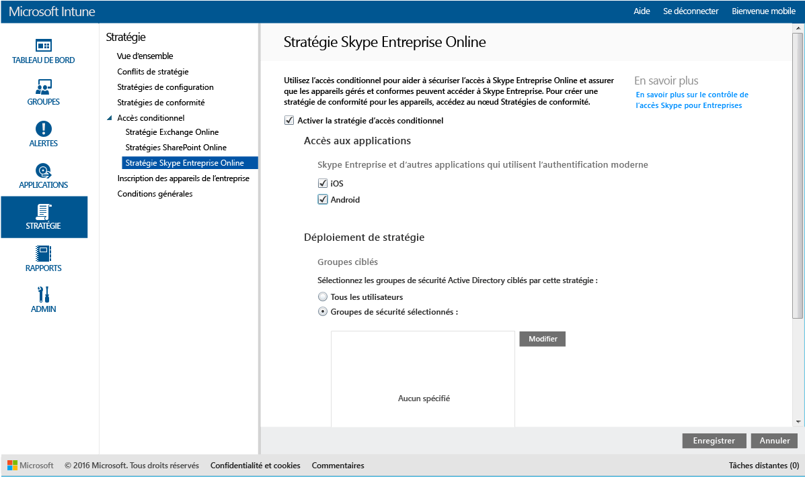

# Restreindre l’accès à Skype Entreprise Online avec Microsoft Intune
Utilisez la stratégie d’accès conditionnel à **Skype Entreprise Online** pour contrôler l’accès à Skype Entreprise Online.
L’accès conditionnel comprend deux composants :
- La stratégie de conformité des appareils que l’appareil doit respecter pour être considéré comme conforme.
- La stratégie d’accès conditionnel dans laquelle vous spécifiez les conditions que l’appareil doit remplir pour accéder au service.
Pour en savoir plus sur le fonctionnement de l’accès conditionnel, lisez l’article [Restreindre l’accès à la messagerie et aux services O365](restrict-access-to-email-and-o365-services-with-microsoft-intune.md).

Lorsqu’un utilisateur ciblé tente d’utiliser Skype Entreprise Online sur son appareil, l’évaluation suivante se produit :

**Avant** de configurer une stratégie d’accès conditionnel à Skype Entreprise Online, vous devez :
- Disposer d’un **abonnement Skype Entreprise Online** et affecter une licence Skype Entreprise Online aux utilisateurs.
- Disposer d’un abonnement à **Enterprise Mobility Suite** ou **Azure Active Directory Premium**.
-   [Authentification moderne activée](https://docs.microsoft.com/en-us/intune/deploy-use/restrict-access-to-skype-for-business-online-with-microsoft-intune) pour Skype Entreprise Online.
-  Tous vos utilisateurs finaux doivent utiliser **Skype Entreprise Online**. Si votre déploiement comprend à la fois Skype Entreprise Online et Skype Entreprise local, la stratégie d’accès conditionnel n’est pas appliquée aux utilisateurs finaux.

    Pour accéder à Skype Entreprise Online, un appareil doit être :

-   un appareil **Android** ou **iOS**,

-   **inscrit** auprès de [!INCLUDE[wit_nextref](../includes/wit_nextref_md.md)].

-   **conforme** à toutes les stratégies de conformité [!INCLUDE[wit_nextref](../includes/wit_nextref_md.md)] déployées.

L’état de l’appareil est stocké dans Azure Active Directory, qui autorise ou bloque l’accès en fonction des conditions que vous spécifiez.

Si une condition n'est pas remplie, l'utilisateur reçoit l'un des messages suivants quand il tente de se connecter :

-   Si l’appareil n’est pas inscrit auprès d’[!INCLUDE[wit_nextref](../includes/wit_nextref_md.md)] ou qu’il n’est pas inscrit dans Azure Active Directory, l’utilisateur reçoit un message contenant des instructions pour installer l’application du portail d’entreprise et inscrire l’appareil.

-   Si l’appareil n’est pas conforme, l’utilisateur reçoit un message le dirigeant vers l’application ou le site web du portail d’entreprise [!INCLUDE[wit_nextref](../includes/wit_nextref_md.md)], où il peut trouver des informations sur le problème et des solutions pour y remédier.

## Configurer l’accès conditionnel à Skype Entreprise Online

### Étape 1 : configurer les groupes de sécurité Active Directory
Avant de commencer, configurez les groupes de sécurité Azure Active Directory pour la stratégie d'accès conditionnel. Vous pouvez configurer ces groupes dans le **Centre d’administration Office 365**. Ces groupes seront utilisés pour cibler ou exempter les utilisateurs de la stratégie. Quand un utilisateur est ciblé par une stratégie, chaque appareil qu'il utilise doit être conforme à cette stratégie pour qu'il puisse accéder aux ressources.

Vous pouvez spécifier deux types de groupes que la stratégie Skype Entreprise pourra utiliser :

-   **Groupes ciblés** : contient les groupes d’utilisateurs auxquels s’applique la stratégie.

-   **Groupes exemptés** : contient les groupes d’utilisateurs exempts de la stratégie.

Si un utilisateur se trouve dans les deux groupes, il est exempt de la stratégie.

### Étape 2 : configurer et déployer une stratégie de conformité
[Créez](create-a-device-compliance-policy-in-microsoft-intune.md) et [déployez](deploy-and-monitor-a-device-compliance-policy-in-microsoft-intune.md) une stratégie de conformité pour tous les appareils qui seront affectés par la stratégie. Il s’agit de tous les appareils utilisés par les utilisateurs des **Groupes ciblés**.

> [!NOTE]
> Tandis que les stratégies de conformité sont déployées sur les groupes [!INCLUDE[wit_nextref](../includes/wit_nextref_md.md)], les stratégies d’accès conditionnel sont destinées aux groupes de sécurité Azure Active Directory.

> [!IMPORTANT]
> Si vous n’avez pas déployé de stratégie de conformité, les appareils seront traités comme étant conformes.

Quand vous êtes prêt, passez à l' **Étape 3**.

### Étape 3: Configurer la stratégie Skype Entreprise Online
Ensuite, configurez la stratégie de manière à restreindre l’accès à Skype Entreprise Online aux appareils gérés et conformes. Cette stratégie sera stockée dans Azure Active Directory.

####
1.  Dans la [Console d’administration Microsoft Intune](https://manage.microsoft.com), cliquez sur **Stratégie** > **Accès conditionnel** > **Stratégie Skype Entreprise Online**.

2.  Sélectionnez **Activer la stratégie d’accès conditionnel**.

3.  Sous **Accès aux applications**, vous pouvez choisir d’appliquer la stratégie d’accès conditionnel à :

    -   **iOS**

    -   **Android**

4.  Sous **Groupes ciblés**, cliquez sur **Modifier** pour sélectionner les groupes de sécurité Active Directory auxquels la stratégie sera appliquée. Vous pouvez cibler cette stratégie sur tous les utilisateurs ou seulement sur un groupe d’utilisateurs donné.

5.  Sous **Groupes exemptés**, vous pouvez éventuellement cliquez sur **Modifier** pour sélectionner les groupes de sécurité Azure Active Directory exempts de cette stratégie.

6.  Une fois terminé, cliquez sur **Enregistrer**.

Vous avez maintenant configuré l’accès conditionnel à Skype Entreprise Online. La stratégie d'accès conditionnel prend effet immédiatement. Il est donc inutile de la déployer.

## analyser la conformité et les stratégies d'accès conditionnel
Dans l'espace de travail **Groupes** , vous pouvez afficher l'état de l'accès conditionnel de vos appareils.

Sélectionnez un groupe d'appareils mobiles quelconque, puis sous l'onglet **Appareils** , sélectionnez l'un des **Filtres**suivants :

* **Appareils non enregistrés avec AAD** : l’accès à Skype Entreprise Online est bloqué pour ces appareils.

* **Appareils non conformes** : l’accès à Skype Entreprise Online est bloqué pour ces appareils.

* **Appareils enregistrés avec AAD et conformes** : ces appareils peuvent accéder à Skype Entreprise Online.

<!--HONumber=Jul16_HO5-->

