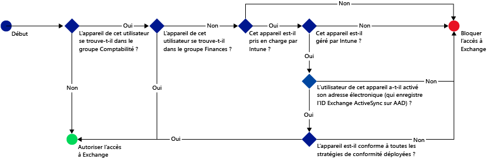
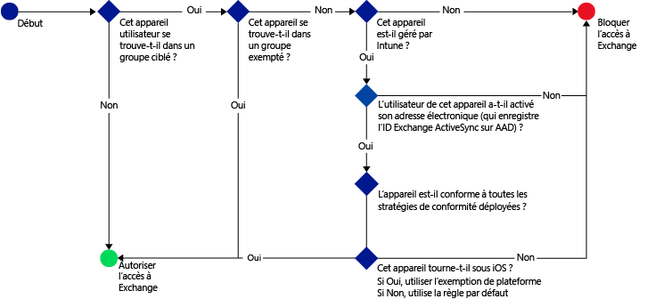

# Restreindre l’accès à la messagerie avec Microsoft Intune : exemples de scénarios

## Empêchez les utilisateurs d’accéder à Exchange Online avec des appareils non conformes.
### Exigences du scénario
- Tous les utilisateurs du groupe de sécurité Active Directory **Comptabilité** voient leur accès à Exchange Online bloqué si leur appareil n’est pas conforme à une stratégie de conformité que vous avez déployée.
- S’il existe des utilisateurs dans ce groupe dont les appareils ne sont pas pris en charge par [!INCLUDE[wit_nextref](../includes/wit_nextref_md.md)], leur accès à Exchange Online doit être bloqué sur cet appareil.
- Les utilisateurs qui se trouvent dans le groupe de sécurité Active Directory **Finance** doivent être exemptés de la stratégie, même s’ils se trouvent également dans le groupe de sécurité **Comptabilité**.

Pour ce faire, configurez une stratégie d’accès conditionnel à Exchange Online avec les paramètres suivants :

-   Sélectionnez **Activer la stratégie d’accès conditionnel**.

- Sélectionnez les plateformes auxquelles vous souhaitez autoriser l’accès à partir d’applications avec l’authentification moderne.
- Pour les applications Exchange ActiveSync, sélectionnez **Bloquer les appareils non conformes sur les plateformes prises en charge par Microsoft Intune** et **Bloquer tous les autres appareils sur les plateformes non prises en charge par Microsoft Intune**.
-   Dans la section **Groupe ciblé**, sous **Groupes de sécurité sélectionnés**, choisissez le groupe d’utilisateurs **Comptabilité**.

-   Dans la section **Groupe exempté**, sous **Groupes de sécurité sélectionnés**, choisissez le groupe d’utilisateurs **Finance**.

Le flux suivant est utilisé pour déterminer quels sont les appareils qui peuvent accéder à Exchange Online :

## Tous les appareils iOS qui accèdent à Exchange sur site doivent être gérés par Intune
### Exigences du scénario
- Seuls les appareils sous iOS doivent pouvoir accéder à Exchange sur site.
- Les appareils doivent également être inscrits dans Intune et respecter les règles de stratégie de conformité pour pouvoir être utilisés pour accéder à Exchange.

Pour ce faire, configurez la stratégie d’accès conditionnel à Exchange sur site ci-dessous avec les paramètres suivants :

-   Sélectionnez l’option **Bloquer l’accès des applications de messagerie à Exchange sur site si l’appareil n’est pas conforme ou n’est pas inscrit dans Microsoft Intune**. En sélectionnant cette option, la stratégie d’accès conditionnel est activée, ce qui implique que tous les appareils doivent être inscrits dans Microsoft Intune et respecter les règles de stratégie de conformité pour pouvoir accéder à Exchange.

-   Pour les paramètres avancés Exchange ActiveSync, créez une :

  -   exception de plateforme qui permet aux appareils exécutant iOS d'accéder à Exchange ;   

  -   règle par défaut qui spécifie que, si un appareil n’est pas couvert par la règle d’exception de la plateforme, il ne doit pas pouvoir accéder à Exchange. Cette règle permet de s’assurer que les appareils qui ne fonctionnent pas sous iOS ne peuvent pas accéder à Exchange.

Le flux suivant est utilisé pour déterminer quels sont les appareils qui peuvent accéder à Exchange :

## Aucun appareil Android ne peut accéder à Exchange sur site.
### Exigences du scénario
- L’accès à Exchange doit être bloqué pour tous les appareils Android.
- Tous les autres appareils pris en charge peuvent accéder à Exchange du moment qu'ils sont gérés par [!INCLUDE[wit_nextref](../includes/wit_nextref_md.md)].

Pour ce faire, configurez une stratégie d’accès conditionnel à Exchange sur site avec les paramètres suivants :

-   Sélectionnez l’option **Bloquer l’accès des applications de messagerie à Exchange sur site si l’appareil n’est pas conforme ou n’est pas inscrit dans Microsoft Intune**. En sélectionnant cette option, vous spécifiez que tous les appareils doivent être inscrits dans Intune et respecter les règles de stratégie de conformité.

- Pour les paramètres avancés Exchange ActiveSync, créez une :
  -   exception de plateforme qui empêche les appareils sous Android d’accéder à Exchange. Cette règle permet de s’assurer que les appareils Android ne peuvent pas être utilisés pour accéder à Exchange.

  -   règle par défaut qui spécifie que tout appareil non couvert par d’autres règles doit pouvoir accéder à Exchange. Cette règle par défaut garantit que les appareils exécutant des plateformes autres qu’Android mais prises en charge par Microsoft Intune peuvent être utilisés pour accéder à Exchange. Ils doivent toutefois être inscrits dans Intune et respecter les règles de stratégie de conformité.

Le flux suivant est utilisé pour déterminer quels sont les appareils qui peuvent accéder à Exchange :

<!--HONumber=Oct16_HO4-->

