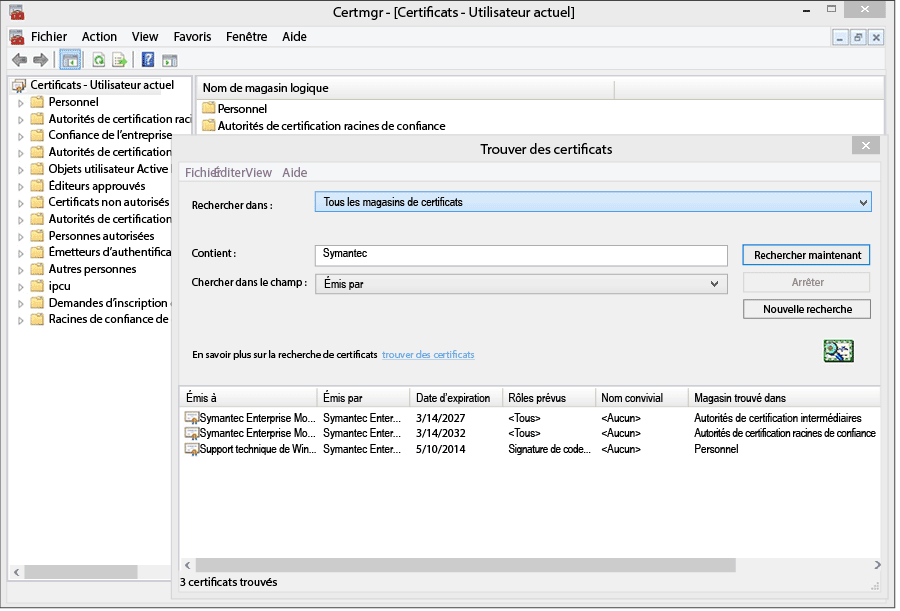
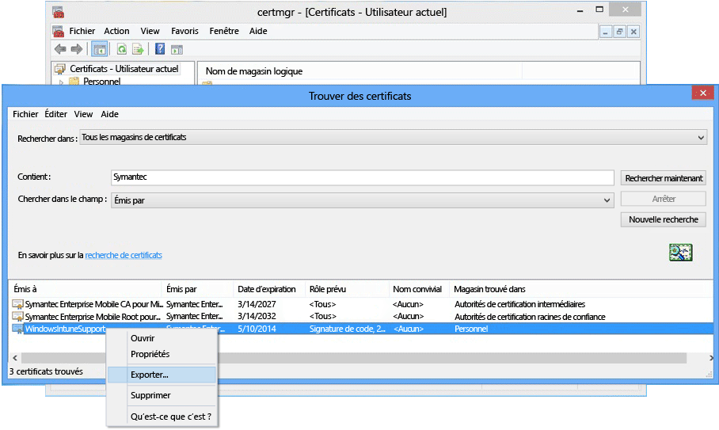

---
# required metadata

title: Configurer la gestion de Windows Phone 8.0 | Microsoft Intune
description:
keywords:
author: NathBarn
manager: jeffgilb
ms.date: 06/09/2016
ms.topic: article
ms.prod:
ms.service: microsoft-intune
ms.technology:
ms.assetid: 61e9b6c3-8795-49b0-8ab2-a9a05ee3ea1f

# optional metadata

#ROBOTS:
#audience:
#ms.devlang:
ms.reviewer: priyar
ms.suite: ems
#ms.tgt_pltfrm:
#ms.custom:

---

# Configurer la gestion des appareils pour Windows Phone 8.0

Windows Phone 8.0 nécessite un certificat Symantec pour installer l’application Portail d’entreprise Intune et permettre la gestion de l’appareil. Un certificat est également requis pour signer les applications métier. La rubrique suivante concerne uniquement Windows Phone 8.0. Pour gérer Windows Phone 8.1 ou version ultérieure, y compris Windows 10 Mobile, consultez [Configurer l’inscription de Windows Phone](set-up-windows-phone-management-with-microsoft-intune.md).

> [!IMPORTANT] À partir de septembre 2016, l’application Portail d’entreprise pour Windows 8.0 et Windows Phone 8.0 ne sera plus disponible en téléchargement.

-   **Windows Phone 8** – Certificat obligatoire
-   **Windows Phone 8.1 et Windows 10 Mobile** exigent un certificat uniquement dans les cas suivants :

    -   Vous souhaitez déployer l’application Portail d’entreprise avec Intune

    -   Vous déployez des applications métier (on parle aussi dans ce cas de chargement de « version test »)


  > [!IMPORTANT] Le certificat Symantec utilisé pour gérer certains appareils mobiles Windows et Windows Phone [doit être renouvelé régulièrement](renew-a-symantec-code-signing-certificate.md).

Les exigences de configuration de la gestion d'appareils mobiles Windows Phone varient en fonction du mode de gestion prévu des appareils.  Le fait de définir deux enregistrements CNAME dans l'enregistrement DNS de votre entreprise a pour effet de faciliter l'inscription des utilisateurs. Si vos utilisateurs sont appelés à télécharger l'application Portail d'entreprise depuis le Store, dès lors que vous aurez configuré les paramètres DNS, il vous suffira de configurer le Portail d'entreprise et d'indiquer aux utilisateurs la procédure d'inscription.  Dans le cas de Windows Phone 8.0 ou de Windows Phone 8.1, là où vous déploierez le Portail d’entreprise, vous aurez besoin d’un certificat Symantec pour signer le code de l’application.

## Configurer les exigences de configuration pour activer la gestion de Windows Phone
1.  **Configurer Intune** Si vous ne l’avez pas encore fait, préparez la gestion des appareils mobiles en [définissant l’autorité de gestion des appareils mobiles](get-ready-to-enroll-devices-in-microsoft-intune.md#set-mobile-device-management-authority) sur **Microsoft Intune** et en configurant la gestion des appareils mobiles.

2.  **Définir un alias DNS pour l'adresse du serveur d'inscription** (facultatif)

    L'alias DNS (type d'enregistrement CNAME) permet aux utilisateurs d'inscrire leurs appareils avec plus de facilité grâce au remplissage automatique du nom du serveur pendant l'inscription.

    1.  Dans la [console d’administration Microsoft Intune](http://manage.microsoft.com), cliquez sur **Administration** &gt; **Gestion des appareils mobiles** &gt; **Windows Phone**.

    2.  Tapez l’URL du domaine vérifié du site web de l’entreprise dans la zone **Spécifiez un nom de domaine vérifié**, puis cliquez sur **Auto-détection de test**.

    3.  Créez des enregistrements de ressources **CNAME** DNS pour le domaine de votre entreprise. Ces enregistrements doivent contenir les informations suivantes :

        |Nom d'hôte|Pointe vers|TTL|
        |-------------|-------------|-------|
        |enterpriseenrollment.company_domain.com|enterpriseenrollment-s.manage.microsoft.com |1 heure|
        |enterpriseregistration.company_domain.com|enterpriseregistration.windows.net|1 heure|
        Par exemple, si le site web de votre entreprise est contoso.com, vous devez créer un enregistrement CNAME dans DNS qui redirige EnterpriseEnrollment.contoso.com vers manage.microsoft.com. S'il existe plusieurs domaines vérifiés, créez un enregistrement CNAME pour chaque domaine.

        -   `enterpriseenrollment-s.manage.microsoft.com` – Prend en charge une redirection vers le service Intune avec reconnaissance du domaine à partir du nom de domaine de l’adresse de messagerie.

        -   `enterpriseregistration.windows.net` – Prend en charge une jonction d’espace de travail pour les appareils mobiles. Il prend également en charge l'accès conditionnel pour Windows 8.1.

    

3.  **Gérer les certificats pour prendre en charge la signature des applications** [Obligatoire pour les appareils Windows Phone 8.0 et Windows Phone 8.1 qui n’accèdent pas au Windows Phone Store et/ou qui n’ont pas besoin d’applications métier.]

    Pour prendre en charge l'application Portail d'entreprise pour Windows Phone 8.0 et déployer des applications d'entreprise sur Windows Phone 8.1, vous devez obtenir un **certificat de signature de code Symantec Enterprise Mobile**. Vous ne pouvez pas utiliser un certificat émis par votre propre autorité de certification, car seul le certificat Symantec est approuvé par les appareils Windows Phone. Ce certificat est requis pour :

    -   signer l’application Portail d’entreprise pour un déploiement sur [!INCLUDE[winphone8_client_1](../includes/winphone8_client_1_md.md)] à des fins de gestion des inscriptions et des téléphones ;

    -   signer des applications métier pour que [!INCLUDE[wit_nextref](../includes/wit_nextref_md.md)] puisse les déployer sur des appareils Windows Phone.

    Les étapes ci-dessous vous aideront à obtenir les certificats requis et à signer l'application du portail d'entreprise. Vous aurez besoin d'un compte du Centre de développement Windows Phone, puis vous devrez acheter un certificat Symantec.

    1.  **Rejoindre le centre de développement Windows Phone** Rejoignez le [Centre de développement Windows Phone](http://go.microsoft.com/fwlink/?LinkId=268442) en utilisant des informations de compte d’entreprise quand vous vous connectez pour acheter votre compte d’entreprise. Cette demande devra être autorisée par un responsable de l'entreprise avant que vous ne receviez un certificat de signature de code.

    2.  **Obtenir un certificat Symantec d’entreprise** Achetez un certificat sur le [site web de Symantec](http://go.microsoft.com/fwlink/?LinkId=268441) à l’aide de votre identifiant Symantec. Après avoir acheté le certificat, l'approbateur d'entreprise que vous avez désigné dans votre compte Centre de développement Windows Phone recevra un e-mail lui demandant d'approuver la demande de certificat. Pour plus d’informations sur la nécessité d’obtenir un certificat Symantec, consultez la rubrique [Pourquoi Windows Phone requiert-il un certificat Symantec ?](https://technet.microsoft.com/en-us/library/dn764959.aspx#BKMK_Symantec) Forum Aux Questions sur l'inscription des appareils Windows.

    3.  **Importer les certificats** Une fois la demande approuvée, vous recevrez un e-mail contenant des instructions pour importer les certificats. Suivez les instructions de l'e-mail pour importer les certificats.

    4.  **Vérifier les certificats importés** Pour vérifier que les certificats ont été importés correctement, accédez au composant logiciel enfichable **Certificats**, cliquez avec le bouton droit sur **Certificats**, puis sélectionnez **Rechercher des certificats**. Dans le champ **Contient** , indiquez « Symantec » et cliquez sur **Rechercher**. Les certificats que vous avez importés doivent apparaître dans les résultats.

        

    5.  **Exporter un certificat de signature** Après avoir vérifié que les certificats sont présents, vous pouvez exporter le fichier .pfx pour signer le portail d’entreprise. Sélectionnez le certificat Symantec dont le **Rôle prévu** est « Signature du code ». Cliquez avec le bouton droit sur le certificat de signature de code et sélectionnez **Exporter**.

        

        Dans l' **Assistant Exportation de certificat**, sélectionnez **Oui, exporter la clé privée** , puis cliquez sur **Suivant**. Sélectionnez **Échange d’informations personnelles - PKCS #12 (.PFX)** et activez **Inclure tous les certificats dans le chemin d’accès de certification si possible**. Effectuez toutes les étapes de l'Assistant. Pour plus d'informations, voir [Comment exporter un certificat avec la clé privée](http://go.microsoft.com/fwlink/?LinkID=203031).

    6.  **Télécharger et signer l'application Portail d'entreprise**

        Pour prendre en charge l'inscription Windows Phone, l'application Portail d'entreprise Windows Phone 8.0 doit être signée et chargée dans Intune.

        1.  **Télécharger l’application Portail d’entreprise** Téléchargez l’application [Portail d’entreprise Intune pour Windows Phone](http://go.microsoft.com/fwlink/?LinkId=268440) à partir du Centre de téléchargement. L'emplacement d'installation par défaut est `C:\Program Files (x86)\Microsoft Corporation\Windows Intune Company Portal for Windows Phone`.

        2.  **Télécharger Windows Phone 8.0 SDK** Téléchargez le [SDK Windows Phone](http://go.microsoft.com/fwlink/?LinkId=615570).

        3.  **Signer le code de l’application Portail d’entreprise** Utilisez l’application XAPSignTool téléchargée avec le SDK pour signer l’application Portail d’entreprise avec le fichier .pfx créé à partir du certificat Symantec. Pour plus d'informations, consultez [Comment signer une application d'entreprise à l'aide de XapSignTool](http://go.microsoft.com/fwlink/?LinkID=280195).

    7.  **Télécharger l’application Portail d’entreprise sur Intune** Téléchargez le fichier signé de l’application Portail d’entreprise et votre certificat de signature de code pour mettre l’application à la disposition des utilisateurs finaux.

        1.  Dans la [console d’administration Intune](http://manage.microsoft.com), cliquez sur **Administration** &gt; **Windows Phone**.

        2.  Cliquez sur **Télécharger le fichier d’application signé** et connectez-vous avec votre ID d’administrateur Intune.

        3.  Dans la page **Installation du logiciel**, renseignez **Spécifier l’emplacement des fichiers d’installation du logiciel** en accédant à l’emplacement de l’application Portail d’entreprise (.xap pour Windows Phone 8.0 ou .appx pour Windows Phone 8.1) dont le code est signé.

            Si vous évaluez Intune et si vous téléchargez un fichier d’application dont le code est signé dans un compte d’évaluation d’Intune, décochez la case **Utiliser le fichier d’application Portail d’entreprise signé par l’exemple de certificat de signature de code Symantec**.

        4.  Ajoutez le fichier du certificat (.pfx) que vous avez exporté à **Certificat de signature de code** et créez un mot de passe pour le certificat.

        5.  Dans la page **Description du logiciel** , renseignez les champs sans oublier que les utilisateurs voient ces informations sur leurs appareils quand ils affichent les détails de l'application sur le portail d'entreprise.

        6.  Effectuez toutes les étapes de l'Assistant. Les utilisateurs qui inscrivent un appareil Windows Phone 8.0 reçoivent à présent l'application Portail d'entreprise sur leurs appareils durant l'inscription. Les utilisateurs Windows Phone 8.1 peuvent installer l'application Portail d'entreprise à partir de la version du Store de l'application Portail d'entreprise.  Si l'accès au Windows Phone Store par les appareils Windows Phone 8.1 est bloqué ou que vous souhaitez déployer l'application Portail d'entreprise avec Intune, vous devez télécharger et signer l'application Portail d'entreprise Windows Phone 8.1 (SSP.appx).

4.  **Expliquer aux utilisateurs comment accéder aux ressources d’entreprise avec le portail d’entreprise** Vos utilisateurs doivent savoir comment inscrire leurs appareils et connaître les principes de la gestion d’appareils. [Ce qu'il faut dire à vos utilisateurs finaux concernant l'utilisation de Microsoft Intune](what-to-tell-your-end-users-about-using-microsoft-intune.md)

## Déployer l'application Portail d'entreprise Windows Phone 8.1
Vous pouvez déployer l’application Portail d’entreprise sur les appareils Windows Phone 8.1 avec Intune au lieu de l’installer à partir du Windows Phone Store. Vous devrez quand même activer l'inscription d'appareils Windows Phone selon les étapes décrites plus haut à l'aide du certificat Symantec. Vous devez donc télécharger l'application Portail d'entreprise Windows Phone 8.1 et la signer avec votre certificat Symantec.  Cela n'est nécessaire que si vos utilisateurs ne sont pas appelés à utiliser le Store d'entreprise et si vous souhaitez déployer le Portail d'entreprise sur des appareils Windows Phone 8.1.


1.  **Télécharger l'application Portail d'entreprise**

    Téléchargez l’[application Portail d’entreprise Microsoft Intune pour Windows Phone 8.1](http://go.microsoft.com/fwlink/?LinkId=615799) à partir du Centre de téléchargement et exécutez le fichier à extraction automatique (.exe). Ce fichier contient deux fichiers :

    -   CompanyPortal.appx : application d'installation du Portail d'entreprise pour Windows Phone 8.1

    -   WinPhoneCompanyPortal.ps1 : script PowerShell que vous pouvez utiliser pour signer le fichier de l'application Portail d'entreprise à des fins de déploiement vers des appareils Windows Phone 8.1

2.  **Télécharger le SDK Windows Phone** Téléchargez [Windows Phone 8.0 SDK](http://go.microsoft.com/fwlink/?LinkId=615570) (http://go.microsoft.com/fwlink/?LinkId=268439) et installez-le sur votre ordinateur. Ce SDK est nécessaire pour générer un jeton d'inscription d'application.

3.  **Générer un fichier AETX** Générez un fichier de jeton d’inscription d’application (.aetx) à partir du fichier PFX Symantec. Pour cela, utilisez le fichier AETGenerator.exe inclus dans Windows Phone 8.0 SDK. Pour obtenir des instructions sur la création d'un fichier AETX, consultez [Comment générer un jeton d'inscription d'application pour Windows Phone](https://msdn.microsoft.com/library/windows/apps/jj735576.aspx).

4.  **Télécharger le SDK Windows pour Windows 8.1** Téléchargez et installez le [SDK Windows Phone](http://go.microsoft.com/fwlink/?LinkId=613525) (http://go.microsoft.com/fwlink/?LinkId=613525). Notez que le script PowerShell inclus avec l'application Portail d'entreprise utilise l'emplacement d'installation par défaut, à savoir `${env:ProgramFiles(x86)}\Windows Kits\8.1`. Si vous effectuez l'installation à un autre emplacement, vous devez inclure celui-ci dans un paramètre d'applet de commande.

5.  **Signer le code de l’application à l’aide de PowerShell** En tant qu’administrateur, ouvrez **Windows PowerShell** sur l’ordinateur hôte sur lequel sont installés le SDK Windows et le certificat de signature de code Symantec Enterprise Mobile, accédez au fichier Sign-WinPhoneCompanyPortal.ps1, puis exécutez le script.

    **Exemple 1**

    ```
    .\Sign-WinPhoneCompanyPortal.ps1 -InputAppx 'C:\temp\CompanyPortal.appx' -OutputAppx 'C:\temp\CompanyPortalEnterpriseSigned.appx' -PfxFilePath 'C:\signing\cert.pfx' -PfxPassword '1234' -AetxPath 'C:\signing\cert.aetx'
    ```
    Cet exemple signe le fichier CompanyPortal.appx à l'emplacement C:\temp\ et produit le fichier CompanyPortalEnterpriseSigned.appx. Il utilise le mot de passe PFX 1234 et lit l'ID d'éditeur dans le fichier PFX. Il lit aussi l'ID d'entreprise dans le fichier cert.aetx.

    **Exemple 2**

    ```
    .\Sign-WinPhoneCompanyPortal.ps1 -InputAppx 'C:\temp\CompanyPortal.appx' -OutputAppx 'C:\temp\CompanyPortalEnterpriseSigned.appx' -PfxFilePath 'C:\signing\cert.pfx' -PfxPassword '1234' -PublisherId 'OID.0.9.2342.19200300.100.1.1=1000000001, CN="Test, Inc.", OU=Test 1' -EnterpriseId 1000000001
    ```
    Cet exemple signe le fichier CompanyPortal.appx à l'emplacement C:\temp\ et produit le fichier CompanyPortalEnterpriseSigned.appx. Il utilise le mot de passe PFX 1234 et utilise l'ID d'éditeur spécifié.

    **Paramètres :**

    -   `-InputAppx` – Chemin d’accès local au fichier CompanyPortal.appx (entre guillemets simples). Par exemple, 'C:\temp\CompanyPortal.appx'.

    -   `-OutputAppx` – Chemin d’accès local et nom de fichier de l’application Portail d’entreprise signée (entre guillemets simples). Par exemple, 'C:\temp\CompanyPortalEnterpriseSigned.appx'

    -   `-PfxFilePath` – Chemin d’accès local et nom du fichier PFX exporté du certificat Symantec. Par exemple, 'C:\signing\cert.pfx'.

    -   `-PfxPassword` – Mot de passe utilisé pour signer le fichier PFX (entre guillemets simples). Par exemple, '1234'.

    -   `-AetxPath` – Chemin d’accès local au fichier .aetx utilisé pour lire l’ID d’entreprise si l’argument 'EnterpriseId' n’est pas défini. Vous devez spécifier cet argument ou EnterpriseId. Par exemple, 'C:\signing\cert.aetx'.

    -   `-PublisherId` – ID d’éditeur de l’entreprise. S'il n'est pas fourni, le champ 'Subject' du certificat de signature de code Symantec Enterprise Mobile est utilisé. Par exemple, 'OID.0.9.2342.19200300.100.1.1=1000000001, CN="Test, Inc.", OU=Test 1'.

    -   `-SdkPath` – Chemin d’accès au dossier racine du Kit de développement logiciel (SDK) Windows pour Windows 8.1. Cet argument est facultatif et sa valeur par défaut est ${env:ProgramFiles(x86)}\Windows Kits\8.1.

    -   `-EnterpriseId` – ID d’entreprise. Vous devez spécifier cet argument ou 'AetxPath'. Si cet argument n'est pas fourni, l'ID d'entreprise est lu dans le fichier AETX. Par exemple, 1000000001.

6.  Déployez l'application Portail d'entreprise Windows Phone 8.1 (SSP.appx).

    > [!IMPORTANT]
    > Le fichier ssp.xap et l'application Portail d'entreprise du Store peuvent être installés en même temps, ce qui peut prêter à confusion pour les utilisateurs. Pour que tous les utilisateurs se servent de ssp.xap, créez une application bloquée pour la version du Store de l'application Portail d'entreprise. Pour que tous les appareils Windows Phone 8.1 utilisent uniquement la version du Store de l'application Portail d'entreprise, vous avez trois possibilités :
    >
    > -   Si vous n'effectuez pas de chargement de version test des applications et si vous n'avez pas besoin d'assurer la prise en charge de Windows Phone 8.0, ne téléchargez pas le fichier ssp.xap signé.
    > -   Si des applications faisant l'objet d'un chargement de version test sont nécessaires, et s'il n'y a aucun appareil Windows Phone 8 en cours d'inscription, changez le déploiement de ssp.xap créé automatiquement en remplaçant « disponible » par « désinstaller ».
    > -   Si des applications faisant l'objet d'un chargement de version test doivent être installées et si des appareils Windows Phone 8.0 doivent s'inscrire et recevoir le fichier ssp.xap, créez un déploiement logiciel du fichier ssp.xap, puis déployez ce dernier avec l'action **désinstaller** . Dans la mesure où les appareils Windows Phone 8.0 ne prennent pas en charge l'installation ou la désinstallation forcée des applications, ils ignorent le déploiement. Les appareils Windows Phone 8.1 prennent en charge l'action de désinstallation et suppriment ssp.xap.


<!--HONumber=Jun16_HO2-->


