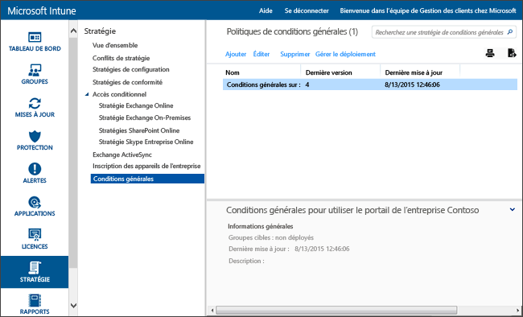

# Paramètres de la stratégie de conditions générales dans Microsoft Intune
Vous pouvez déployer les conditions générales d’Intune pour des groupes d’utilisateurs pour expliquer comment l’inscription, l’accès aux ressources de travail et l’utilisation de l’application Portail d’entreprise affectent les utilisateurs et les appareils. Les utilisateurs doivent accepter les conditions générales avant de pouvoir utiliser le Portail d’entreprise pour s’inscrire et accéder à leur travail.

Vous pouvez créer et déployer plusieurs stratégies contenant différentes conditions générales. Vous pouvez également produire des versions des mêmes conditions générales dans différentes langues et les déployer pour les groupes appropriés.

## Créer une stratégie de conditions générales

1.  Dans la [console d’administration Microsoft Intune](http://manage.microsoft.com), cliquez sur **Stratégie** &gt; **Conditions générales**.

    

2.  Cliquez sur **Ajouter** pour créer une stratégie de conditions générales.

    Vous pouvez également **Modifier** ou **Supprimer** une stratégie existante.

3.  Dans la page **Créer les conditions générales**, spécifiez les informations suivantes :

    -   **Nom** : nom unique de stratégie affiché dans la console Intune.

    -   **Description** : détails qui vous aident à identifier la stratégie dans la console Intune.

    -   **Titre** : titre affiché pour les utilisateurs dans le portail d’entreprise.

    -   **Texte expliquant ce que cela signifie si l’utilisateur accepte** : étiquette informant les utilisateurs des conséquences de l’acceptation. **Exemple** : « J’accepte les conditions générales. »

4.  Quand vous avez terminé, cliquez sur **Enregistrer**. La nouvelle stratégie s’affiche dans le nœud **Conditions générales** de l’espace de travail **Stratégie**.

## Déployer une stratégie de conditions générales

1.  Dans la [console d’administration Microsoft Intune](http://manage.microsoft.com), cliquez sur **Stratégie** &gt; **Conditions générales**.

2.  Dans la liste **Stratégies associées aux conditions générales**, sélectionnez la stratégie à déployer, puis cliquez sur **Gérer le déploiement**.

3.  Dans la boîte de dialogue **Gérer le déploiement**, sélectionnez les groupes d’utilisateurs pour lesquels vous souhaitez déployer la stratégie, puis cliquez sur **OK**.

    Quand des utilisateurs ciblés accèdent au portail d'entreprise, Intune affiche les conditions générales que vous avez déployées. Les utilisateurs doivent accepter ces conditions générales avant de pouvoir accéder aux ressources de l'entreprise.

## Surveiller une stratégie associée aux conditions générales

1.  Dans la [console d’administration Microsoft Intune](http://manage.microsoft.com), cliquez sur **Stratégie** &gt; **Conditions générales**.

2.  Dans la fenêtre **Créer un rapport**, cliquez sur **Afficher le rapport**. Le rapport dresse la liste des utilisateurs qui ont accepté les conditions générales que vous avez déployées.

### Mises à jour et contrôle de version pour les conditions générales
Quand vous modifiez une stratégie existante associée à des conditions générales, vous pouvez choisir le comportement lors du déploiement de la stratégie. Appliquez la procédure suivante pour vous aider à mettre à jour des stratégies de conditions générales existantes.

## Utilisation de plusieurs versions des conditions générales

1.  Dans la [console d’administration Microsoft Intune](http://manage.microsoft.com), cliquez sur **Stratégie** &gt; **Conditions générales**.

2.  Sélectionnez la stratégie de conditions générales à modifier, puis cliquez sur **Modifier**.

3.  Dans la page **Modifier les conditions générales**, apportez les modifications nécessaires, puis spécifiez si cette nouvelle version exige que tous les utilisateurs acceptent les conditions générales ou si seuls les nouveaux utilisateurs verront la nouvelle version.

    Nous vous recommandons d'incrémenter le numéro de version et d'exiger l'acceptation chaque fois que vous apportez des modifications majeures à votre stratégie de conditions générales. Conservez le numéro de version actuel si vous corrigez des fautes de frappe ou si vous modifiez la mise en forme, par exemple.

### Voir aussi
[Gérer des paramètres et des fonctionnalités sur vos appareils avec des stratégies Microsoft Intune](manage-settings-and-features-on-your-devices-with-microsoft-intune-policies.md)

<!--HONumber=Jul16_HO4-->

