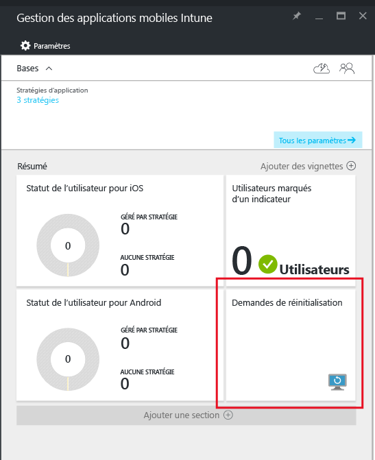
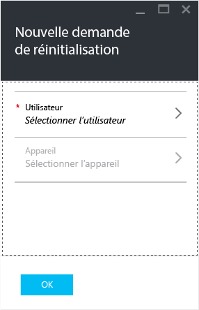
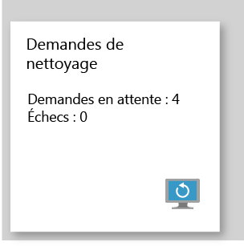

# Réinitialiser les données d’applications d’entreprise managées avec Microsoft Intune
Lorsqu'un appareil est perdu ou volé, ou si l'employé quitte votre entreprise, vous devez vous assurer que les données de l'application d’entreprise sont supprimées de l'appareil. Toutefois, vous ne devez pas supprimer les données personnelles de l'appareil, en particulier si cet appareil appartient à un employé.

Pour supprimer de façon sélective les données de l'application d’entreprise, créez une demande de réinitialisation à l'aide de la procédure décrite à la section **Créer une demande de réinitialisation** de cette rubrique.  Une fois la demande remplie, les données d’entreprise sont supprimées de l’application lors de sa prochaine exécution sur l’appareil.
>[!NOTE]
> Les contacts synchronisés directement depuis l’application vers le carnet d’adresses natif sont supprimés. Les contacts synchronisés à partir du carnet d’adresses natif vers une autre source externe ne peuvent pas être effacés. Actuellement, ceci s’applique uniquement à l’application Microsoft Outlook.

## Créer une demande de réinitialisation

1.  Dans le panneau **Gestion des applications mobiles Intune** , choisissez la vignette **Demandes de réinitialisation** .

    

2.  Choisissez **Nouvelles demandes de réinitialisation**.

    

3.  Dans le panneau **Nouvelle demande de réinitialisation**, choisissez **Utilisateur** pour ouvrir le panneau **Utilisateur** et sélectionnez l’utilisateur possédant les données des applications à réinitialiser.

4.  Choisissez **Appareil**.  Cette opération ouvre le panneau **Appareil** qui répertorie tous les appareils associés à l’utilisateur sélectionné.  Sélectionnez l’appareil à réinitialiser.

5.  Vous voilà revenu dans le panneau **Nouvelle demande de réinitialisation**. Choisissez **Ok** pour effectuer une demande de réinitialisation. Le service crée une demande de réinitialisation distincte pour chaque application protégée sur l’appareil et en fait le suivi.

## Analyser vos demandes de réinitialisation
La vignette **Demande de réinitialisation** du panneau **Gestion des applications mobiles Intune** propose un rapport de synthèse.  Ce dernier indique l’état général des demandes de réinitialisation, notamment le nombre de demandes en attente et d’échecs. Vous pouvez obtenir plus de détails en suivant les étapes décrites ci-dessous :

1.  Dans le panneau **Gestion des applications mobiles Intune**, choisissez la vignette **Demande de réinitialisation** pour ouvrir le panneau **Demande de réinitialisation** .

2.  Le panneau **Demande de réinitialisation** affiche la liste de vos demandes regroupées par utilisateurs.  Étant donné que le système crée une demande de réinitialisation pour chaque application protégée en cours d’exécution sur l’appareil, vous pouvez voir plusieurs demandes pour un même utilisateur.  L’état de la demande de réinitialisation est indiquée : **en attente**, **échec**ou **réussite**.

L’utilisateur doit ouvrir l’application pour que la réinitialisation se produise. Cette opération peut prendre jusqu’à 30 minutes après l’envoi de la demande. 

Les réinitialisations en attente sont affichées jusqu’à ce que vous les supprimiez manuellement.  Pour supprimer manuellement une demande de réinitialisation, cliquez dessus avec le bouton droit et sélectionnez Supprimer.

### Voir aussi
[Protéger les données d’application à l’aide des stratégies de gestion des applications mobiles](protect-app-data-using-mobile-app-management-policies-with-microsoft-intune.md)

[Utilisation du portail Azure](azure-portal-for-microsoft-intune-mam-policies.md)

<!--HONumber=Nov16_HO2-->

