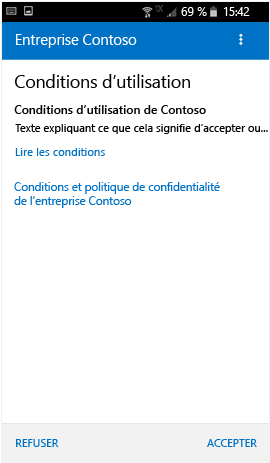

# Inscrire un appareil Android dans Intune

Si votre société ou votre école utilise Microsoft Intune, vous pouvez inscrire votre appareil Android pour accéder à la messagerie, aux fichiers et d’autres ressources d’entreprise. L’inscription de vos appareils permet au service Informatique de gérer ces ressources professionnelles ou pédagogiques et de les sécuriser, tout en vous donnant la liberté d’utiliser l’appareil de votre choix pour effectuer votre travail. Pour en savoir plus sur l’inscription, consultez [Que se passe-t-il quand j’installe l’application Portail d’entreprise et que j’inscris mon appareil ?](what-happens-if-you-install-the-Company-Portal-app-and-enroll-your-device-in-intune-android.md).

Ces instructions d’inscription concernent les appareils Samsung Knox Android et les appareils Android « natifs » (autres que Samsung Knox). Pour déterminer si vous disposez d’un appareil Samsung Knox, accédez à **Paramètres** &gt; **À propos de l’appareil**. Si « Version Knox » n’apparaît pas dans la liste, c’est que vous avez un appareil Android natif.

Avant ou après l’inscription, vous pouvez être invité à choisir une catégorie qui décrit le mieux votre utilisation de l’appareil. Votre administrateur informatique utilise cette catégorie pour déterminer les applications auxquelles vous avez accès.

Si vous recevez une erreur pendant l’inscription de votre appareil dans Intune, vous pouvez [envoyer les erreurs d’inscription à votre administrateur informatique](send-enrollment-errors-to-your-it-administrator-android.md).

**Pour inscrire un appareil Android**

1.  Installez l’application Portail d’entreprise Intune gratuite à partir de [Google Play](http://play.google.com/store/apps/details?id=com.microsoft.windowsintune.companyportal).

2.  Ouvrez l’application Portail d’entreprise Microsoft Intune.

3.  Dans l’écran de **bienvenue** du portail d’entreprise, appuyez sur **Se connecter**, puis connectez-vous avec votre compte professionnel ou scolaire.

       

4.  Si votre administrateur informatique a établi des conditions générales, cliquez sur **ACCEPTER** pour en accepter les termes.

    

5.  Connectez-vous à l’application Portail d’entreprise à l’aide de votre compte professionnel ou scolaire et de votre mot de passe, puis appuyez sur **Se connecter**.

    

6.  Dans l’écran **Configuration de l’accès à l’entreprise**, appuyez sur **COMMENCER**.

    

7.  Dans l’écran **Pourquoi inscrire votre appareil ?**, découvrez ce que vous pouvez faire une fois votre appareil inscrit, puis appuyez sur **Continuer**.

    

8.  Consultez la liste de ce que votre administrateur informatique peut voir et ne pas voir sur votre appareil, puis appuyez sur **CONTINUER**.

    

9.  Dans l’écran **Et ensuite ?**, découvrez ce qui se passe lors de l’inscription, puis appuyez sur **INSCRIRE**.

    

10.  Si vous utilisez Android 6.0 ou version ultérieure, effectuez cette étape. Sinon, passez à l'étape suivante.

    Si votre administrateur informatique a configuré certaines stratégies, les messages suivants peuvent s’afficher :
    -   **Autoriser l’application Portail d’entreprise à passer et gérer des appels téléphoniques ?**

    

    Si ce message s’affiche, appuyez sur **Autoriser** Vous pouvez appuyer sur Autoriser sans risque, car **Microsoft ne passe jamais ni ne gère vos appels téléphoniques**. Google contrôle le texte du message et Microsoft ne peut pas le modifier. Quand vous autorisez l’accès, vous autorisez simplement votre appareil à écrire des journaux de données sur la carte SD de l’appareil, ce qui vous permet de déplacer ces journaux à l’aide d’un câble USB.

    Si vous refusez l’accès, le message apparaît la prochaine fois que vous vous connectez à l’application Portail d’entreprise, mais vous pouvez désactiver les futurs messages en cochant la case **Ne plus poser la question**.  Si vous décidez ensuite d’autoriser l’accès, accédez à **Paramètres** &gt; **Applications** &gt; **Portail d’entreprise** &gt; **Autorisations** &gt; **Téléphone**, puis activer l’autorisation.

    -   **Autoriser le portail d’entreprise à accéder à vos contacts ?**

    

    Si ce message s’affiche, appuyez sur **Autoriser** Vous pouvez appuyer sur Autoriser sans risque, car **Microsoft n’accède jamais à vos contacts**. Google contrôle le texte du message et Microsoft ne peut pas le modifier. Quand vous autorisez l’accès, l’application Portail d’entreprise est uniquement autorisée à créer, utiliser et gérer votre compte professionnel.

    Si vous refusez l’accès, le message apparaît la prochaine fois que vous appuyez sur **Envoyer des données**, mais vous pouvez désactiver les messages ultérieurs en cochant la case **Ne plus poser la question**. Si vous décidez ensuite d’autoriser l’accès, accédez à **Paramètres** &gt; **Applications** &gt; **Portail d’entreprise** &gt; **Autorisations** &gt; **Stockage**, puis activer l’autorisation.

11.  Dans l’écran **Activer l’administrateur d’appareils**, cliquez sur **Activer**.

    

12.  Suivez les invites pour entrer un code confidentiel ou un mot de passe. Si vous avez déjà configuré un code confidentiel ou un mot de passe sur cet appareil, cet écran ne s’affiche pas ou vous n’êtes pas invité à entrer un nouveau code confidentiel ou mot de passe.

    

13.  Si vous utilisez un appareil Samsung Knox, appuyez sur **Confirmer**. Vous verrez ensuite un message vous informant que votre appareil est en cours d’inscription. Si vous utilisez un appareil Android natif, vous verrez l’écran ci-dessous qui indique que votre appareil est en cours d’inscription.

    

    Cet écran montre que votre appareil est en cours d’inscription.

    

14. Quand l’écran **Configuration de l’accès à l’entreprise** s’affiche, appuyez sur **CONTINUER**. Si un message vous indique que votre appareil n’est pas conforme, suivez les instructions pour résoudre le problème, puis appuyez sur **CONTINUER**.

      

11. Dans l’écran **Fin de la configuration de l’accès à l’entreprise**, appuyez sur **TERMINÉ**. Votre appareil est maintenant inscrit.

    

Avant d’installer des applications d’entreprise, accédez à **Paramètres** &gt; **Sécurité** et activez **Sources inconnues**. Si vous n’activez pas cette option avant d’installer des applications, le message « Installation bloquée » s’affiche. Pour des raisons de sécurité, votre appareil est configuré pour bloquer les installations d’applications provenant de sources inconnues. Vous pouvez appuyer sur **Paramètres** dans la boîte de dialogue d’erreur pour accéder à l’option **Sources inconnues**.

Encore besoin d’aide ? Contactez votre administrateur (consultez le [site web Portail d’entreprise](http://portal.manage.microsoft.com) pour plus d’informations) ou écrivez à l’équipe Microsoft Android wintunedroidfbk@microsoft.com.

### Voir aussi
[Utilisation de votre appareil Android avec Intune](using-your-android-device-with-intune.md)

<!--HONumber=Aug16_HO2-->

