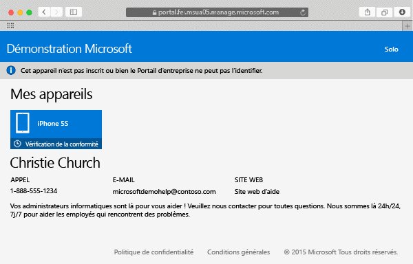

# Inscrire votre appareil Mac OS X dans Intune

Quand votre appareil Mac OS X est inscrit dans Intune, vous pouvez accéder au réseau de l’entreprise, à vos e-mails professionnels et à vos fichiers de travail. Vous pouvez également obtenir les applications de l’entreprise. Pour plus d’informations sur ce qui se passe quand vous inscrivez votre appareil, consultez [Que se passe-t-il quand vous installez l’application Portail d’entreprise et que vous inscrivez votre appareil dans Intune ?](what-happens-if-you-install-the-company-portal-app-and-enroll-your-device-in-intune-ios.md).

Si vous essayez d’inscrire un appareil iOS, consultez [Inscrire un appareil iOS dans Intune](enroll-your-device-in-intune-ios.md).

Pour inscrire un appareil Mac OS X

1.  À l’aide d’un navigateur Safari, ouvrez le [site web du portail d’entreprise](https://portal.manage.microsoft.com), puis appuyez sur la barre de notification.

2.  Appuyez sur **Cet appareil n’est pas inscrit ou bien le Portail d’entreprise ne peut pas l’identifier**.

    

3.  Appuyez sur **Installer** pour commencer à inscrire votre appareil.

    

4.  Dans la boîte de dialogue **Installer un profil de gestion**, appuyez sur **Installer**. Si une boîte de dialogue vous demande d’entrer vos informations d’identification, entrez votre nom d’utilisateur et votre mot de passe, puis appuyez sur **Continuer** &gt; **Installer**.

    

    Quand vous avez terminé l’inscription, une page **Profil de gestion** apparaît indiquant que votre profil a été vérifié.

    

Encore besoin d’aide ? Contactez votre administrateur informatique. Pour obtenir ses informations de contact, consultez le [site web du Portail d’entreprise](http://portal.manage.microsoft.com).

<!--HONumber=Oct16_HO2-->

