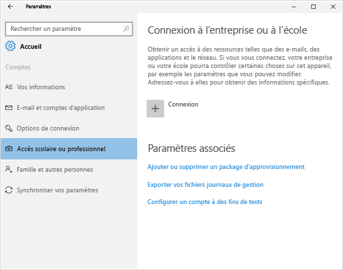
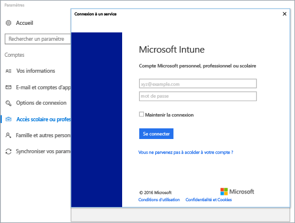
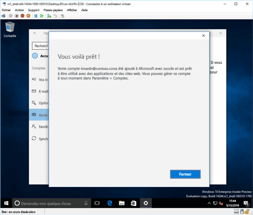

# Inscrire votre appareil Windows 10 dans Intune

1.  Cliquez sur **Accès scolaire ou professionnel**, puis cliquez sur **Connecter**.

    

2.  Entrez votre adresse e-mail professionnelle ou scolaire, puis appuyez sur **Suivant**.

    

3. Connectez-vous à Intune avec votre compte professionnel ou scolaire.

    

    Vous verrez un message indiquant que votre société ou votre école procède à l’inscription de votre appareil.

4. Lorsque l’écran **Vous voilà prêt !** s’affiche, appuyez sur **Fermer**. Vous avez terminé.

  

5. Si vous voulez vérifier que votre connexion est correcte, revenez aux **Paramètres**, où votre compte professionnel ou scolaire doit maintenant s’afficher.

    

Si vous avez suivi les étapes précédentes, mais que vous ne pouvez toujours pas accéder à votre compte e-mail ou vos fichiers professionnels ou scolaires, consultez les [Étapes de dépannage à suivre si vous voyez Accès scolaire ou professionnel](troubleshoot-your-windows-10-device-windows.md#troubleshooting-steps-to-follow-if-you-see-access-work-or-school).

<!--HONumber=Nov16_HO3-->

