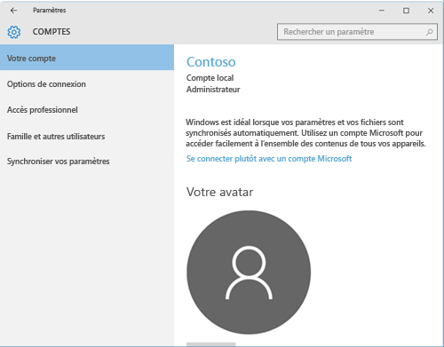
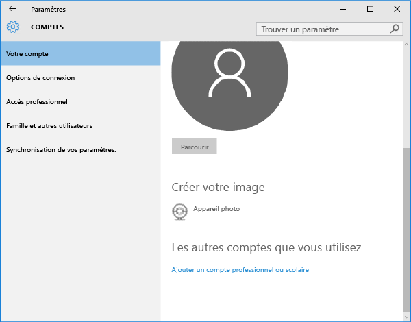
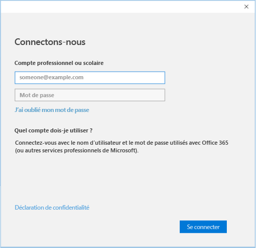

# Inscrire un appareil Windows 10 Mobile ou Windows 10 Desktop dans Intune

Si votre société ou votre école utilise Microsoft Intune, vous pouvez inscrire vos appareils pour accéder à la messagerie, aux fichiers et d’autres ressources d’entreprise. L’inscription de vos appareils permet à votre organisation de sécuriser les données d’entreprise. Pour en savoir plus sur l’inscription, consultez [Que se passe-t-il quand j’installe l’application Portail d’entreprise et que j’inscris mon appareil dans Intune ?](what-happens-if-you-install-the-company-portal-app-and-enroll-your-device-in-intune-windows.md) et [Liste de ce que votre administrateur peut voir et ne pas voir sur votre appareil](what-can-your-it-administrator-see-when-you-enroll-your-device-in-intune-windows.md).

Pour inscrire un appareil Windows 10 Mobile ou Windows 10 Desktop

1.  Accédez aux **Paramètres** Windows, puis appuyez sur **Comptes**.

    

2.  Appuyez sur **Votre compte**.

    

3.  Appuyez sur **Ajouter un compte professionnel ou scolaire**.

    

4.  Connectez-vous avec vos informations d'identification professionnelles ou scolaires.

    

Si vous avez suivi les étapes ci-dessus, mais que vous ne pouvez toujours pas accéder à votre messagerie, vos fichiers ou d’autres données professionnelles ou scolaires, retournez dans **Comptes** et appuyez sur **Accès professionnel**.

-   Vous voyez votre compte professionnel ou scolaire ? Félicitations, vous êtes connecté.

-   Si vous ne voyez pas votre compte professionnel ou scolaire, appuyez sur **Connexion**, puis connectez-vous avec vos informations d’identification professionnelles ou scolaires.

Nous vous recommandons aussi d'installer l'application Portail d'entreprise. Elle vous permet d'identifier et d'obtenir facilement les applications d'entreprise qui présentent un intérêt pour vous et votre rôle. En fonction de la façon dont votre entreprise a configuré Intune, l'application Portail d'entreprise a peut-être été installée dans le cadre de votre processus d'inscription. Pour vérifier si vous disposez de l’application, recherchez **Portail d’entreprise** dans votre liste d’applications. Si l'application Portail d'entreprise ne figure pas dans votre liste d'applications, procédez comme suit pour l'installer.

1.  Appuyez sur **Démarrer** &gt; **Store**.

2.  Appuyez sur **Rechercher** et tapez **portail d’entreprise**.

3.  Dans la liste des résultats, appuyez sur **Portail d’entreprise** &gt; **Installer**.

4.  Appuyez sur **Installer** ou **Gratuit**. L'option affichée dépend de la façon dont votre société a configuré l'application.

Encore besoin d’aide ? Contactez votre administrateur informatique. Pour obtenir ses informations de contact, consultez le [site web du Portail d’entreprise](http://portal.manage.microsoft.com).

### Voir aussi
[Inscrire un appareil Windows dans Intune](enroll-your-device-in-intune-windows.md) 
[Utilisation de votre appareil Windows avec Intune](using-your-windows-device-with-intune.md)

<!--HONumber=Aug16_HO1-->

