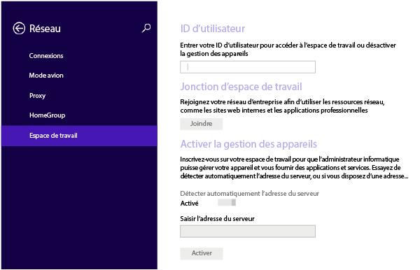
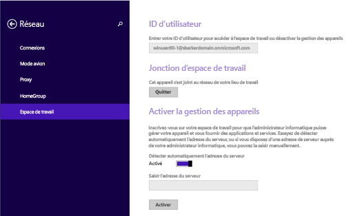
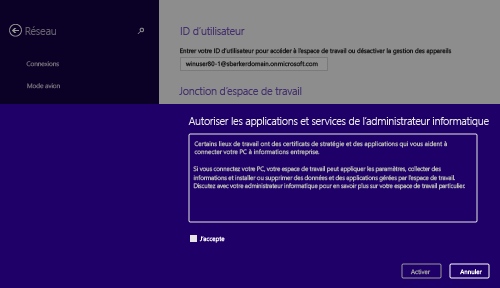
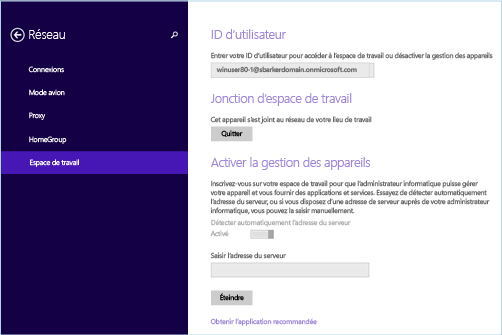

---
# required metadata

title: Inscrire un appareil Windows 8.1 ou Windows RT 8.1 dans Intune | Microsoft Intune
description:
keywords:
author: Staciebarker
manager: jeffgilb
ms.date: 04/28/2016
ms.topic: article
ms.prod:
ms.service: microsoft-intune
ms.technology:
ms.assetid: 28984f26-1070-4f7a-877c-669a59375c0c

# optional metadata

#ROBOTS:
#audience:
#ms.devlang:
ms.reviewer: jeffgilb
ms.suite: ems
#ms.tgt_pltfrm:
#ms.custom:

---

# Inscrire un appareil Windows 8.1 ou Windows RT 8.1 dans Intune

Si votre société ou votre école utilise Microsoft Intune, vous pouvez inscrire vos appareils pour accéder à la messagerie, aux fichiers et d’autres ressources d’entreprise. L’inscription de vos appareils permet à votre organisation de sécuriser les données d’entreprise. Pour en savoir plus sur l’inscription, consultez [Que se passe-t-il si vous installez l’application Portail d’entreprise et que vous inscrivez votre appareil dans Intune ?](what-happens-if-you-install-the-company-portal-app-and-enroll-your-device-in-intune-windows.md) et la liste de ce que [votre administrateur informatique peut voir et ne pas voir sur votre appareil](what-can-your-it-administrator-see-when-you-enroll-your-device-in-intune-windows.md).

Pour inscrire un appareil Windows 8.1 ou Windows RT 8.1

1.  Sur l’appareil, appuyez sur **Paramètres** &gt; **Paramètres du PC** &gt; **Réseau** &gt; **Espace de travail**.

    

2.  Si nécessaire, entrez votre adresse de messagerie professionnelle ou scolaire comme ID utilisateur, puis appuyez sur **Joindre**.

    Si votre ID utilisateur n’est pas obligatoire, l’adresse de messagerie que vous avez entrée lors de votre connexion à cet appareil est utilisée.

3.  Tapez le mot de passe de votre messagerie professionnelle ou scolaire.

    

4.  Sous **Activer la gestion des appareils**, appuyez sur **Activer**.

    

5.  Dans la boîte de dialogue **Autorisez les applications et services de l’administrateur**, cochez la case **J’accepte**, puis appuyez sur **Activer**.

    

    Une fois correctement inscrit, l’écran suivant apparaît.

    

Nous vous recommandons aussi d'installer l'application Portail d'entreprise. Elle vous permet d'identifier et d'obtenir facilement les applications d'entreprise qui présentent un intérêt pour vous et votre rôle. En fonction de la façon dont votre entreprise a configuré Intune, l'application Portail d'entreprise a peut-être été installée dans le cadre de votre processus d'inscription. Pour vérifier si vous disposez de l’application, recherchez **Portail d’entreprise** dans votre liste d’applications. Si l'application Portail d'entreprise ne figure pas dans votre liste d'applications, procédez comme suit pour l'installer.

1.  Appuyez sur **Démarrer** &gt; **Boutique**.

2.  Appuyez sur **Rechercher** et tapez **portail d’entreprise**.

3.  Dans la liste des résultats, appuyez sur **Portail d’entreprise**.

4.  Appuyez sur **Installer** ou **Gratuit**. L'option affichée dépend de la façon dont votre société a configuré l'application.

### Voir aussi
[Inscrire un appareil Windows dans Intune](enroll-your-device-in-intune-windows.md) 
[Utilisation de votre appareil Windows avec Intune](using-your-windows-device-with-intune.md)

<!--HONumber=May16_HO1-->

