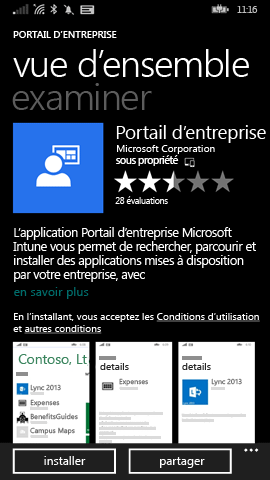
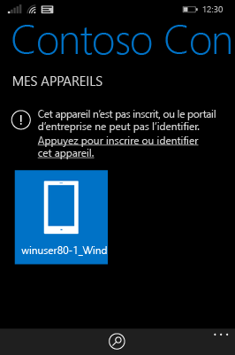
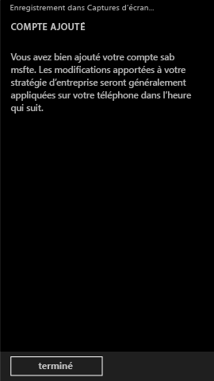

# Inscrire un appareil Windows Phone 8.1 dans Intune

Si votre société ou votre école utilise Microsoft Intune, vous pouvez inscrire vos appareils pour accéder à la messagerie, aux fichiers et d’autres ressources d’entreprise. Quand vous inscrivez vos appareils, votre organisation peut sécuriser les données d’entreprise. Pour en savoir plus sur l’inscription, consultez [Que se passe-t-il quand j’installe l’application Portail d’entreprise et que j’inscris mon appareil dans Intune ?](what-happens-if-you-install-the-company-portal-app-and-enroll-your-device-in-intune-windows.md) et [Liste de ce que votre administrateur peut voir et ne pas voir sur votre appareil](what-can-your-it-administrator-see-when-you-enroll-your-device-in-intune-windows.md).

Pour inscrire un appareil Phone 8.1 dans Intune, suivez les instructions qui s’appliquent à votre entreprise ou établissement scolaire :

-   [Si votre entreprise vous autorise à utiliser le Portail d'entreprise à partir du Windows Store](#if-your-company-lets-you-use-the-company-portal-from-the-windows-store)

-   [Si vous n’êtes pas autorisé à accéder au Windows Store à partir de votre Windows Phone ou si vous n’avez pas de compte Microsoft](#if-you-are-not-allowed-to-access-the-windows-store-from-your-windows-phone-or-if-you-do-not-have-a-microsoft-account)

## Si votre entreprise vous autorise à utiliser le Portail d'entreprise à partir du Windows Store
Installez l'application Portail d'entreprise sur votre appareil :

1.  Appuyez sur **Démarrer** &gt; **Store**.

2.  Appuyez sur **Rechercher**, puis tapez **portail d’entreprise**.

3.  Dans la liste des résultats, appuyez sur **Portail d’entreprise**.

    

4.  Appuyez sur **Portail d’entreprise** &gt; **Installer**.

    

Inscrivez votre appareil :

1.  Sur l’appareil, ouvrez l’application **Portail d’entreprise Microsoft Intune**.

2.  Entrez vos informations d'identification. Le cas échéant, vous pouvez être invité à accepter les termes et conditions de votre entreprise.

3.  Passez à **Mes appareils**.

4.  Appuyez sur **Appuyez pour inscrire ou identifier cet appareil**.

    

5.  Appuyez sur **Inscrire cet appareil**.

    

6.  Appuyez sur **Ajouter un compte**.

    

7.  Entrez les informations supplémentaires demandées, puis appuyez sur **Se connecter** pour terminer l’inscription. Votre compte d’espace de travail doit à présent être répertorié dans la page **Paramètres** &gt; **Espace de travail**.

    

## Si vous n’êtes pas autorisé à accéder au Windows Store à partir de votre Windows Phone ou si vous n’avez pas de compte Microsoft

1.  Appuyez sur **Paramètres** &gt; **Espace de travail**.

2.  Appuyez sur **ajouter un compte**, puis connectez-vous en utilisant votre compte professionnel.

3.  Entrez les informations supplémentaires demandées, puis appuyez sur **Se connecter** pour terminer l’inscription.

4.  Si vous êtes invité à installer l’application ou le hub d’entreprise, vérifiez que la case correspondante est cochée, puis appuyez sur **terminé**.

Si votre administrateur informatique a configuré le Portail d’entreprise pour qu’il soit installé au moment de l’inscription, il figurera dans votre liste d’applications.

Encore besoin d’aide ? Contactez votre administrateur informatique. Pour obtenir ses informations de contact, consultez le [site web du Portail d’entreprise](http://portal.manage.microsoft.com).

<!--HONumber=Oct16_HO2-->

