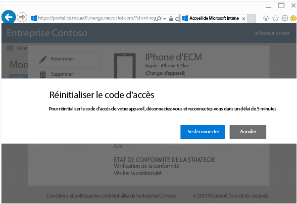
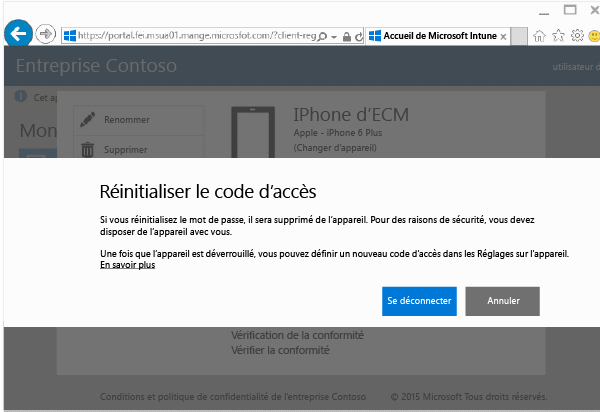

# Réinitialiser le code secret de votre appareil à partir du site web du portail d’entreprise

Si vous perdez le code confidentiel ou le mot de passe d’un appareil que vous avez inscrit dans Intune, vous pouvez utiliser le [site web du portail d’entreprise](http://portal.manage.microsoft.com) pour le réinitialiser. Vous pouvez utiliser le site web du portail d’entreprise pour gérer les ordinateurs et appareils que vous avez inscrits dans Intune et effectuer pour la majeure partie les mêmes tâches qu’avec l’application de votre portail d’entreprise.

> [!NOTE]
> La présence du bouton **Réinitialiser le code d’accès** sur le site web du portail d’entreprise dépend de la façon dont votre administrateur informatique a configuré Intune. La réinitialisation du code d’accès n’est pas prise en charge sur les appareils Windows 8.1.

Pour réinitialiser votre code d’accès

1.  Ouvrez le [site web du portail d’entreprise](http://portal.manage.microsoft.com) sur l’appareil dont vous souhaitez réinitialiser le code d’accès.

2.  Choisissez **Réinitialiser le code d’accès**.

    

3.  Choisissez **Déconnexion**, puis reconnectez-vous avec vos informations d’identification professionnelles ou scolaires. Vous devez vous reconnecter dans les cinq minutes.

    

4.  Choisissez **Réinitialiser le code d’accès**.

    

    Pour savoir comment la **réinitialisation du code d’accès** fonctionne sur votre appareil, consultez le tableau.

    |Plateforme|Prise en charge|
    |------------|-----------|
    |Android|Crée un code d’accès alphanumérique temporaire.|
    |iOS|Supprime le code d’accès de l’appareil et ne crée pas de code d’accès temporaire. Si vous utilisez Touch ID, vous devrez le reconfigurer sur votre appareil, car il est supprimé quand vous réinitialisez votre code d’accès.|
    |Windows 10 (appareils mobiles uniquement)|Crée un code d’accès alphanumérique temporaire. Windows Hello est pris en charge.|
    |Windows Phone 8.1|Crée un code d’accès numérique temporaire.|
    Une fois que vous avez déverrouillé votre appareil, vous pouvez définir un nouveau code d’accès en accédant à **Paramètres** sur votre appareil.

5.  Déverrouillez votre appareil et définissez un nouveau code d’accès, ou modifiez le code d’accès temporaire en accédant à **Paramètres** sur votre appareil.

    Pour afficher une notification confirmant que votre code d’accès a été réinitialisé avec succès, cliquez sur l’indicateur de notification en haut à droite du site web du portail d’entreprise.

Encore besoin d’aide ? Contactez votre administrateur informatique. Pour obtenir ses coordonnées, consultez le [site web du Portail d’entreprise](http://portal.manage.microsoft.com).

<!--HONumber=Nov16_HO1-->

