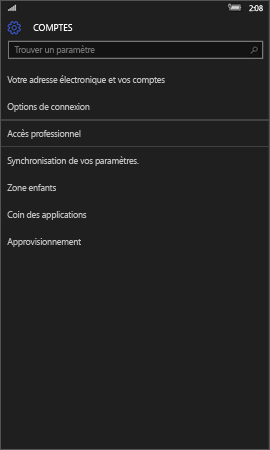
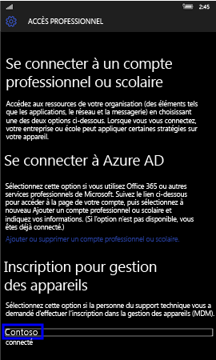
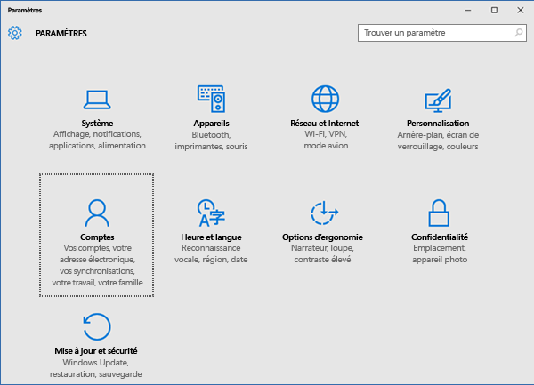
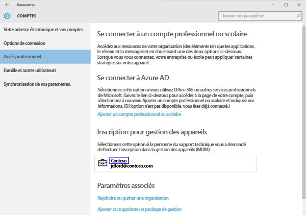
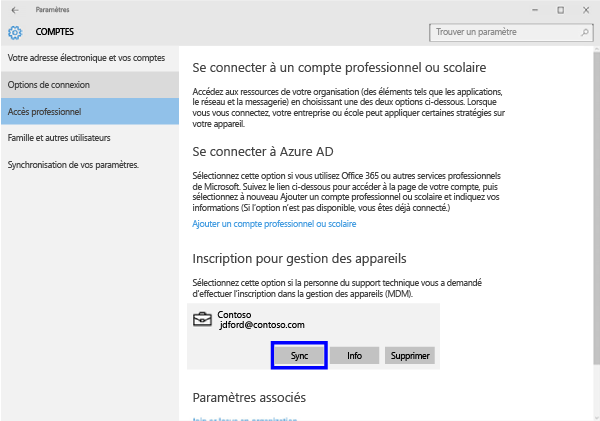
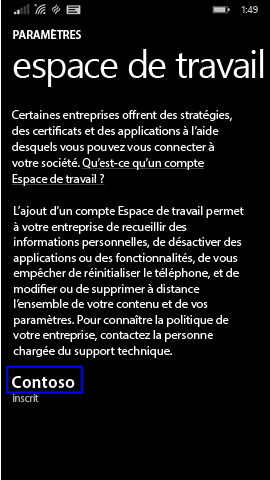

# Synchroniser votre appareil Windows manuellement
Si l’installation de votre application prend trop de temps, vous pouvez essayer de synchroniser votre appareil Windows manuellement. La synchronisation manuelle peut vous aider à accélérer l’installation.

Seules les versions suivantes sont prises en charge. Suivez les instructions correspondant au type d’appareil que vous utilisez.

* [Windows 10 Mobile](#windows-10-mobile)
* [Windows 10 Desktop](#windows-10-desktop)
* [Windows Phone 8.1](#windows-phone-8-1)

## Windows 10 Mobile
Pour synchroniser manuellement votre appareil mobile Windows 10 pour accélérer l’installation d’une application :

1. Accédez à **Toutes les applications** > **Paramètres** > **Comptes**.

    

2. Choisissez **Accès professionnel**.

    

3. Sous **Inscription à la gestion des appareils**, choisissez le nom de votre entreprise.

    

4. Choisissez l’icône **Synchroniser**.

    

    Le message « Nous synchronisons votre compte » apparaît en haut de l’écran. Le bouton **Synchroniser** est grisé tant que la synchronisation n’est pas terminée sur votre appareil.

## Poste de travail Windows 10
Pour synchroniser manuellement votre poste de travail Windows 10 pour accélérer l’installation d’une application :

1. Choisissez le bouton **Démarrer**, puis choisissez **Paramètres**.

    

2. Dans la page **Paramètres**, choisissez **Comptes**.

    

3. Dans la page **Comptes**, choisissez **Accès professionnel**.

    

4. Dans la section **Inscription à la gestion des appareils**, choisissez le nom de votre entreprise.

    

5. Choisissez le bouton **Synchroniser**.

    

   Le bouton est grisé jusqu’à ce que la synchronisation se termine.

## Windows Phone 8.1
Pour synchroniser manuellement votre appareil Windows Phone 8.1 pour accélérer l’installation d’une application :

1. Accédez à **Toutes les applications** > **Paramètres** > **espace de travail**.

    

2. Choisissez le nom de votre société.

    

3. Choisissez l’icône **Synchroniser**.

    

   Le message « Nous synchronisons votre compte » apparaît en haut de l’écran jusqu’à la fin de la synchronisation de votre appareil.

Encore besoin d’aide ? Contactez votre administrateur informatique. Pour obtenir ses informations de contact, consultez le [site web du Portail d’entreprise](http://portal.manage.microsoft.com).

<!--HONumber=Oct16_HO2-->

