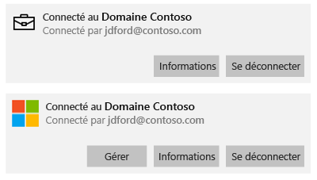

# Synchroniser votre appareil Windows manuellement
Si l’installation de votre application prend trop de temps, vous pouvez essayer de synchroniser votre appareil Windows manuellement. La synchronisation manuelle peut vous aider à accélérer l’installation.

Seules les versions suivantes sont prises en charge. Si votre appareil n’est pas répertorié, la synchronisation n’est pas prise en charge. Suivez les instructions correspondant au type d’appareil que vous utilisez.

* [Windows 10 Mobile](#windows-10-mobile)
* [Windows 10 Desktop](#windows-10-desktop)
* [Windows Phone 8.1](#windows-phone-8-1)

## Windows 10 Mobile
Pour synchroniser manuellement votre appareil mobile Windows 10 pour accélérer l’installation d’une application :

1. Accédez à **Toutes les applications** > **Paramètres** > **Comptes**.

    

2. Choisissez **Accès professionnel**.

    

3. Sous **Inscription à la gestion des appareils**, choisissez le nom de votre entreprise.

    

4. Choisissez l’icône **Synchroniser**.

    

    Le message « Nous synchronisons votre compte » apparaît en haut de l’écran. Le bouton **Synchroniser** est grisé tant que la synchronisation n’est pas terminée sur votre appareil.

## Windows 10 Desktop
Comme il existe plusieurs versions de Windows 10, il y a deux procédures. Pour connaître la procédure à exécuter, examinez les captures d’écran, puis suivez les étapes qui ressemblent à ce que vous voyez sur votre appareil. 

1. Choisissez le bouton **Démarrer**, puis choisissez **Paramètres**.

    

2. Dans la page **Paramètres**, choisissez **Comptes**.

    

3. Examinez les deux écrans suivants et déterminez celui qui ressemble à celui qui s’affiche sur votre appareil. Suivez les étapes correspondant à l’écran qui s’affiche sur votre appareil.

    Si cet écran s’affiche, qui indique « Accès Professionnel ou Scolaire », suivez les instructions indiquées dans la section [Étapes à suivre si vous voyez Accès scolaire ou professionnel](#steps-to-follow-if-you-see-access-work-or-school).

    

    Si vous voyez cet écran, qui indique « Accès professionnel », consultez les [étapes à suivre si vous voyez Accès professionnel](#steps-to-follow-if-you-see-your-account).

     

### Étapes à suivre si vous voyez Accès scolaire ou professionnel

1. Dans la page **Comptes**, choisissez **Accès Professionnel ou Scolaire**.

    

2. Choisissez votre compte professionnel ou scolaire. Selon la configuration effectuée par votre administrateur informatique, vous pouvez voir deux comptes similaires à l’exemple ci-dessous. Un compte est accompagné d’un porte-documents, l’autre du logo Microsoft. 

    - Si vous voyez le compte avec le porte-documents, sélectionnez-le, puis recherchez un bouton **Info** sous celui-ci. 
    - Si vous voyez uniquement le compte avec le logo Microsoft, sélectionnez le compte, puis recherchez un bouton **Info** sous celui-ci.

    

3. Choisissez le bouton **Info**. Une boîte de dialogue s’ouvre, similaire à l’exemple ci-dessous.

    

4. Choisissez le bouton **Synchroniser**. Votre appareil sera synchronisé avec Intune.

### Étapes à suivre si vous voyez Accès professionnel
    
1. Dans la page **Comptes**, choisissez **Accès professionnel**.

    

2. Dans la section **Inscription à la gestion des appareils**, choisissez le nom de votre entreprise.

    

3. Choisissez le bouton **Synchroniser**.

    

   Le bouton est grisé jusqu’à ce que la synchronisation se termine.

## Windows Phone 8.1
Pour synchroniser manuellement votre appareil Windows Phone 8.1 pour accélérer l’installation d’une application :

1. Accédez à **Toutes les applications** > **Paramètres** > **espace de travail**.

    

2. Choisissez le nom de votre société.

    

3. Choisissez l’icône **Synchroniser**.

    

   Le message « Nous synchronisons votre compte » apparaît en haut de l’écran jusqu’à la fin de la synchronisation de votre appareil.

Encore besoin d’aide ? Contactez votre administrateur informatique. Pour obtenir ses coordonnées, consultez le [site web du Portail d’entreprise](http://portal.manage.microsoft.com).

<!--HONumber=Nov16_HO1-->

