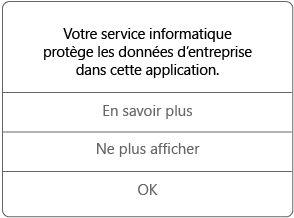

# Utiliser des applications gérées sur votre appareil iOS

Les applications gérées sont des applications que votre administrateur informatique peut configurer pour protéger les données d’entreprise auxquelles vous pouvez accéder dans cette application. Quand vous accédez à des données d’entreprise dans une application gérée sur votre appareil iOS, l’application peut ne pas fonctionner exactement comme prévu. Par exemple, vous ne pouvez pas copier et coller des données d’entreprise protégées, ou vous ne pouvez pas enregistrer ces données à certains emplacements.

Différentes applications gérées peuvent aussi fonctionner ensemble sur votre appareil pour vous permettre d’effectuer vos tâches quotidiennes tout en protégeant les données d’entreprise. Par exemple, si vous ouvrez un fichier de l’entreprise dans une application gérée et qu’une autre application gérée est nécessaire pour afficher ce fichier, l’application gérée qui vous permet d’afficher le fichier s’ouvre automatiquement. Si une application obligatoire n’est pas disponible, certaines actions, comme l’ouverture d’un document ou l’accès à un lien web à partir d’un document géré, peuvent ne pas être disponibles.

Quand vous accédez à des données d’entreprise dans une application gérée, un message semblable à celui ci-dessous s’affiche, qui vous indique que l’application que vous ouvrez est gérée.

### Comment obtenir des applications gérées ?
Vous obtenez des applications gérées de deux façons différentes :

-   Quand votre appareil est inscrit dans Microsoft Intune, vous installez l’application à partir de votre application Portail d’entreprise ou du site web du portail d’entreprise, ou bien votre administrateur informatique peut l’installer sur votre appareil. Pour en savoir plus sur l’inscription, consultez [Inscrire un appareil iOS dans Intune](enroll-your-device-in-intune-ios.md) ou [Inscrire votre appareil macOS dans Intune](enroll-your-device-in-intune-macos.md).

-   Vous installez une application à partir de l’App Store, puis vous vous connectez avec votre compte d’utilisateur d’entreprise qui est géré par Intune.

### Que peut gérer mon administrateur informatique dans une application ?
Voici quelques exemples d’options que votre administrateur informatique peut gérer dans une application et qui peuvent affecter vos interactions avec les données d’entreprise sur votre appareil :

-   Accès à des sites Web spécifiques

-   Transferts de données entre les applications

-   Enregistrement de fichiers

-   Opérations de copier et coller

-   Conditions d'accès de code confidentiel

-   Votre connexion à l’aide d’informations d’identification d’entreprise

-   Possibilité de sauvegarder dans le cloud

-   Possibilité de prendre des captures d’écran

-   Cryptage des données

Pour plus d’informations sur les applications gérées sur votre appareil, contactez votre administrateur informatique. Pour obtenir ses coordonnées, consultez le [site web du Portail d’entreprise](http://portal.manage.microsoft.com).

<!--HONumber=Dec16_HO2-->

