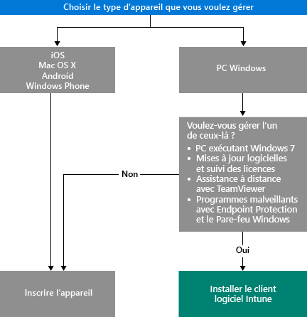

# Choisir comment gérer des appareils

Pour exploiter les nombreuses fonctionnalités proposées par Intune comme le déploiement d’applications et le contrôle des paramètres des appareils, vos appareils doivent être *gérés*. La manière de gérer des appareils varie selon les fonctionnalités Intune que vous voulez utiliser.
Cette rubrique vous aide à choisir la méthode qui répond à vos besoins.

Pour gérer des appareils qui exécutent iOS, Mac OS X, Android ou Windows Phone, vous devez les *inscrire*.

Pour gérer des PC Windows, vous avez deux possibilités :

1. Inscrivez l’appareil **ou**
2. Installez le *client logiciel Intune*.

## Déterminer la méthode à utiliser
Utilisez ce flux décisionnel pour déterminer la manière de gérer vos appareils.

Inscrivez les PC Windows pour obtenir le plus de fonctionnalités. Toutefois, le client logiciel Intune peut répondre davantage à vos besoins dans les situations suivantes :

- Le PC exécute Windows 7.
- Vous voulez gérer des mises à jour logicielles Windows et l’utilisation des licences.
- Vous voulez gérer les logiciels malveillants avec Endpoint Protection et le pare-feu Windows.
- Vous voulez assurer l’assistance à distance des utilisateurs à l’aide du logiciel TeamViewer.

Pour obtenir la liste détaillée des fonctions de gestion que vous obtenez avec chaque méthode, consultez [Fonctionnalités de gestion des appareils mobiles](mobile-device-management-capabilities-in-microsoft-intune.md) et [Fonctionnalités du client logiciel PC Intune](windows-pc-management-capabilities-in-microsoft-intune.md).
Pour plus d’informations sur les appareils et PC pris en charge par Intune, consultez [Ordinateurs et appareils mobiles pris en charge](/intune/get-started/supported-mobile-devices-and-computers).

## Gestion d’Exchange ActiveSync
En plus de l’inscription d’un appareil ou de l’installation du client logiciel Intune, vous pouvez également gérer des appareils en utilisant [Exchange ActiveSync](/intune/deploy-use/mobile-device-management-with-exchange-activesync-and-microsoft-intune). Cette méthode vous oblige à installer le connecteur local ou à utiliser le connecteur de service à service intégré pour vous connecter à votre instance Exchange Server.
Cette troisième méthode de gestion des appareils fournit néanmoins un ensemble limité de fonctionnalités de gestion par rapport aux autres méthodes.

## Étapes suivantes

- [Choisir comment inscrire des appareils mobiles](/intune/get-started/choose-how-to-enroll-devices1)
- [Gérer des PC Windows avec le logiciel client Intune PC](/intune/deploy-use/manage-windows-pcs-with-microsoft-intune)

- [Gestion des appareils mobiles Exchange ActiveSync avec Microsoft Intune](/intune/deploy-use/mobile-device-management-with-exchange-activesync-and-microsoft-intune).

<!--HONumber=Nov16_HO1-->

