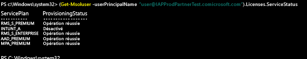

# Gérer les licences Intune avec PowerShell
Avant que les utilisateurs puissent se connecter pour utiliser le service Intune ou inscrire leurs appareils dans la gestion, vous devez affecter à chaque utilisateur une licence dans votre abonnement Intune, comme décrit dans [Gérer les licences Intune](start-with-a-paid-subscription-to-microsoft-intune-step-4.md). Toutefois, les organisations qui utilisent Microsoft Enterprise Mobility Suite (EMS) peuvent avoir des utilisateurs qui ont uniquement besoin d’Azure Active Directory Premium ou des services Intune dans le package EMS. Vous pouvez attribuer un service ou un groupe de services à l’aide des [applets de commande Azure Active Directory PowerShell](https://msdn.microsoft.com/library/jj151815.aspx).

Pour assigner de manière sélective des licences utilisateur pour les services EMS, ouvrez PowerShell en tant qu’administrateur sur un ordinateur où le [module Azure Active Directory pour Windows PowerShell](https://msdn.microsoft.com/library/jj151815.aspx#bkmk_installmodule) est installé. Vous pouvez installer PowerShell sur un ordinateur local ou sur un serveur ADFS.

Vous devez créer une nouvelle définition de référence (SKU) de licence qui s’applique uniquement aux plans de service requis. Pour ce faire, désactivez les plans que vous ne souhaitez pas appliquer. Par exemple, vous pouvez créer une définition de référence de licence qui n’attribue pas de licence Intune. Pour afficher une liste des services disponibles, tapez :

    (Get-MsolAccountSku | Where {$_.SkuPartNumber -eq "EMS"}).ServiceStatus

Vous pouvez exécuter la commande suivante pour exclure le plan de service Intune. Vous pouvez utiliser la même méthode pour étendre la procédure à un groupe de sécurité entier ou vous pouvez utiliser des filtres plus granulaires.

**Exemple 1** Créer un nouvel utilisateur sur la ligne de commande et affecter une licence EMS sans activer la partie Intune de la licence :

    Connect-MsolService

    New-MsolUser -DisplayName “Test User” -FirstName FName -LastName LName -UserPrincipalName user@<TenantName>.onmicrosoft.com –Department DName -UsageLocation US

    $CustomEMS = New-MsolLicenseOptions -AccountSkuId "<TenantName>:EMS" -DisabledPlans INTUNE_A
    Set-MsolUserLicense -UserPrincipalName user@<TenantName>.onmicrosoft.com -AddLicenses <TenantName>:EMS -LicenseOptions $CustomEMS

Vérification avec :

    (Get-MsolUser -UserPrincipalName "user@<TenantName>.onmicrosoft.com").Licenses.ServiceStatus

**Exemple 2** Désactiver la partie Intune de la licence EMS pour un utilisateur qui a déjà une licence :

    Connect-MsolService

    Set-MsolUserLicense -UserPrincipalName user@<TenantName>.onmicrosoft.com -RemoveLicenses IAPProdPartnerTest:EMS

    $CustomEMS = New-MsolLicenseOptions -AccountSkuId "<TenantName>:EMS" -DisabledPlans INTUNE_A
    Set-MsolUserLicense -UserPrincipalName user@<TenantName>.onmicrosoft.com -AddLicenses <TenantName>:EMS -LicenseOptions $CustomEMS

Vérification avec :

    (Get-MsolUser -UserPrincipalName "user@<TenantName>.onmicrosoft.com" .Licenses.ServiceStatus

### Étapes suivantes
Félicitations ! Vous venez d’effectuer l’étape 4 du *guide de démarrage rapide Intune*.
>[!div class="step-by-step"]

>[&larr; **Synchroniser les utilisateurs avec Intune**](.\start-with-a-paid-subscription-to-microsoft-intune-step-2.md)     [**Organiser les utilisateurs et les appareils** &rarr;](.\start-with-a-paid-subscription-to-microsoft-intune-step-5.md)  

<!--HONumber=Jul16_HO4-->

