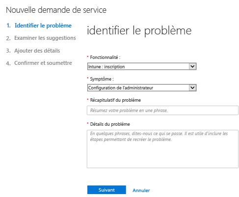
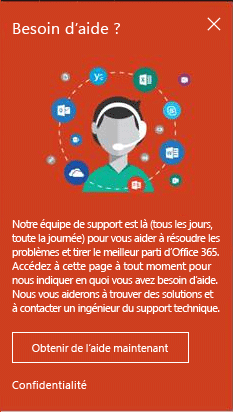
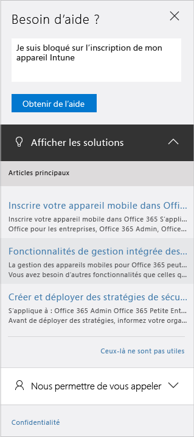

# Comment obtenir un support technique administrateur pour Microsoft Intune

Microsoft fournit un support technique global, en avant-vente, pour la facturation et l’abonnement pour Microsoft Intune. Un support technique est disponible en ligne et par téléphone pour les abonnements payants et d’évaluation. Le support technique en ligne est disponible en anglais et japonais. Le support par téléphone et le support à la facturation en ligne sont disponibles dans d’autres langues.

Le support pour Intune et pour Intune quand il est utilisé avec Configuration Manager est gratuit. Les clients Support Premier sont facturés pour les questions liées à des procédures (comment configurer une fonctionnalité Intune).

## Créer une demande de service en ligne

1.  Connectez-vous au [Centre d’administration Office 365](https://portal.office.com) en utilisant vos informations d’identification Intune. 
    >[!NOTE]
    >
    >Les clients Support Premier peuvent ouvrir un ticket de support Intune dans la [page du Support Premier](https://support.microsoft.com/en-us/premier/contacts).

2.  Cliquez sur la vignette Administration.
3.  Sur la gauche, en dessous de **Support**, choisissez **Support** pour ouvrir le ticket. Vous verrez probablement ceci :

    

    >[!NOTE]
    >
    >  Les clients qui ont ou ont eu un compte O365 avec 100 licences ou moins voient ceci, et doivent se référer à [Méthode alternative pour ouvrir un ticket de support](#alternate-method-to-open-a-support-ticket).
    >  
    > 

    -   Pour les problèmes de facturation, de licences et de compte, sélectionnez **Informations de facturation et de produit**.

    -   Pour tous les autres problèmes liés à Intune, sélectionnez **Gestion des appareils mobiles**.

    > [!NOTE]
    > Vous devrez peut-être sélectionner **plus** en bas de la liste pour afficher toutes les catégories.

3.  Suivez les instructions pour ouvrir votre demande. 

### Méthode alternative pour ouvrir un ticket de support

Suivez cette procédure si votre page de support ressemble à ceci :

1. Choisissez **Besoin d’aide**.
2. Dans la zone de texte, entrez une description de votre problème et choisissez **Obtenir de l’aide**.

    

3. Passez en revue les ressources en ligne suggérées pour de l’aide sans assistance, ou choisissez **Laissez-nous vous appeler** pour recevoir un appel du Support Microsoft.

## Support technique par téléphone
Consultez [Contacter le support par téléphone pour Microsoft Intune](contact-assisted-phone-support-for-microsoft-intune.md) pour obtenir la liste des numéros de téléphone par pays et par région, les horaires d’ouverture du support technique et les langues prises en charge pour chaque région.

## Suivi de vos demandes de service
1.  Connectez-vous au [Centre d’administration Office 365](https://portal.office.com) en utilisant vos informations d’identification Intune. 
2.  Cliquez sur la vignette Administration.
3.  Sur la gauche, en dessous de **Support**, choisissez **Demandes de service** pour passer en revue vos tickets. 

Nos réponses initiales aux demandes de service dépendent de la gravité du problème. Pour les problèmes les plus graves, notre première réponse pour les clients professionnels est faite dans les deux heures. Pour les clients Support Premier, la réponse varie en fonction de votre contrat de support. Il s’agit de cas où :

- Un ou plusieurs services ne sont pas accessibles ou sont inutilisables. 
- Des délais de production, d'opérations ou de déploiement sont gravement affectés ou il y aura un impact majeur sur la production ou la rentabilité. 
- Plusieurs utilisateurs ou services sont affectés.

Pour les problèmes de gravité modérée, notre première réponse pour les clients professionnels est faite dans les quatre heures. Pour les clients Support Premier, la réponse varie en fonction de votre contrat de support.  Il s’agit de cas où :

- Le service est utilisable, mais de manière affaiblie. 
- La situation a un impact modéré sur l'activité et peut être traitée pendant les heures de bureau. 
- Un utilisateur unique, un client ou un service est partiellement affecté.

Pour les autres problèmes, notre première réponse pour les clients professionnels est faite dans les huit heures. Pour les clients Support Premier, la réponse varie en fonction de votre contrat de support.  Il s’agit de cas où :

- La situation a un impact minimal sur l'activité. 
- Le problème est important mais n'a actuellement aucun impact significatif sur la productivité ou le service du client. 
- Un seul utilisateur rencontre une rupture partielle, mais il existe une solution acceptable.

> [!NOTE]
> **Si vous utilisez Microsoft System Center Configuration Manager** ou **Microsoft System Center Endpoint Protection** : pour obtenir du support technique sur Configuration Manager ou Endpoint Protection, contactez votre partenaire ou visitez le [Centre de solutions Microsoft System Center Configuration Manager et System Center Endpoint Protection](http://www.microsoft.com/en-us/server-cloud/products/system-center-2012-r2/resources.aspx) qui propose des documents d’auto-assistance élaborés, avec la possibilité d’ouvrir une demande de support en ligne ou par téléphone.
>
> Le support technique pour System Center Configuration Manager ou System Center Endpoint Protection nécessite un règlement ou est décrémenté de vos contrats de licence ou Premier Support existants.

## Aide sans assistance

Vous pouvez peut-être résoudre votre problème sans ouvrir un ticket de support.

Pour de l’aide sans assistance sur Intune, consultez [Conseils généraux de résolution des problèmes pour Microsoft Intune](general-troubleshooting-tips-for-microsoft-intune.md) ou les rubriques de résolution de problèmes spécifiques. Vous pouvez également rechercher une solution ou publier votre question sur le [forum Intune](https://social.technet.microsoft.com/Forums/en-US/home?forum=microsoftintuneprod). 

## Support pour les clients ayant des licences en volume
Si vous avez déjà acheté des licences auprès de Microsoft dans le cadre d'un programme de licence en volume, utilisez les liens suivants pour bénéficier du support technique :

-   Pour un support relatif aux licences et à la localisation des clés, consultez le [Centre de gestion des licences en volume](http://go.microsoft.com/fwlink/p/?LinkID=282016).

-   Pour les questions sur la facturation, consultez le [Support pour la facturation et la gestion des abonnements](http://support.microsoft.com/oas/default.aspx?prid=15371).

-   Pour obtenir des informations générales sur les licences en volume, consultez [Licences en volume](http://go.microsoft.com/fwlink/p/?LinkID=282015).

<!--HONumber=Nov16_HO3-->

