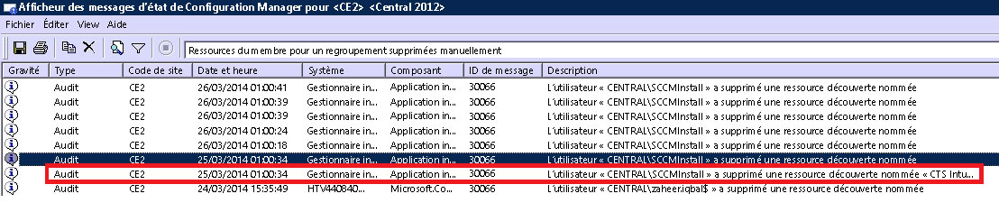

# Résoudre les problèmes d’inscription d’appareils dans Intune

Cette rubrique fournit des suggestions pour résoudre les problèmes liés à l’inscription d’appareils. Si ces informations ne vous permettent pas de remédier à votre problème, consultez [Comment obtenir un support technique pour Microsoft Intune](how-to-get-support-for-microsoft-intune.md) pour accéder à d’autres types d’assistance.

## Étapes initiales de dépannage

Avant de commencer le dépannage, vérifiez que vous avez configuré Intune correctement pour activer l’inscription. Vous pouvez consulter ces exigences de configuration dans les rubriques suivantes :

-   [Se préparer à inscrire des appareils dans Microsoft Intune](/intune/deploy-use/gprerequisites-for-enrollment.md)
-   [Configurer la gestion des appareils iOS et Mac](/intune/deploy-use/set-up-ios-and-mac-management-with-microsoft-intune)
-   [Configurer la gestion de Windows 10 Mobile et Windows Phone avec Microsoft Intune](/intune/deploy-use/set-up-windows-phone-management-with-microsoft-intune)
-   [Configurer la gestion des appareils Windows](/intune/deploy-use/set-up-windows-device-management-with-microsoft-intune)

Les utilisateurs d’appareils gérés peuvent recueillir des journaux d’inscription et de diagnostic qui peuvent vous être utiles. Les instructions destinées aux utilisateurs permettant de recueillir les journaux sont fournies dans :

- [Envoyer les journaux de données de diagnostic Android à votre administrateur informatique par câble USB](/intune/enduser/send-diagnostic-data-logs-to-your-it-administrator-using-a-usb-cable-android)
- [Envoyer les journaux de données de diagnostic Android à votre administrateur informatique par e-mail](/intune/enduser/send-diagnostic-data-logs-to-your-it-administrator-using-email-android)
- [Envoyer les erreurs d’inscription Android à votre administrateur informatique](/intune/enduser/send-enrollment-errors-to-your-it-administrator-android)
- [Envoyer les erreurs d’inscription iOS à votre administrateur informatique](/intune/enduser/send-errors-to-your-it-admin-ios)

## Problèmes généraux d’inscription
Ces problèmes peuvent se produire sur toutes les plateformes.

### Plafond d’appareils atteint
**Problème :** un utilisateur reçoit une erreur sur son appareil pendant l’inscription, par exemple une erreur **Portail d’entreprise temporairement indisponible** sur un appareil iOS, et le journal DMPdownloader.log dans Configuration Manager contient l’erreur **DeviceCapReached**.

**Resolution :** par défaut, les utilisateurs ne peuvent pas inscrire plus de 5 appareils.

#### Vérifier le nombre d’appareils inscrits et le nombre autorisé

1.  Dans le portail d’administration Intune, vérifiez que l’utilisateur n’a pas plus de 5 appareils attribués.

2.  Vérifiez dans le portail d’administration Intune sous Admin\Mobile Device Management\Enrollment Rules que la limite d’inscription d’appareils est définie à 5.

Les utilisateurs d’appareils mobiles peuvent supprimer des appareils à l’adresse URL suivante : [https://byodtestservice.azurewebsites.net/](https://byodtestservice.azurewebsites.net/).

Les administrateurs peuvent supprimer des appareils dans le portail Azure Active Directory.

#### Pour supprimer des appareils dans le portail Azure Active Directory

1.  Accédez à [http://aka.ms/accessaad](http://aka.ms/accessaad) ou choisissez **Administration** &gt; **Azure AD** dans [https://portal.office.com](https://portal.office.com).

2.  Connectez-vous avec l’ID de votre organisation en utilisant le lien sur le côté gauche de la page.

3.  Créez un abonnement Azure si vous n’en avez pas. Vous ne devriez pas avoir besoin de carte de crédit ni d’effectuer un paiement si vous disposez d’un compte payant (choisissez le lien d’abonnement **Enregistrer votre abonnement Azure Active Directory gratuit**).

4.  Sélectionnez **Active Directory** , puis le nom de votre organisation.

5.  Sélectionnez l’onglet **Utilisateurs** .

6.  Sélectionnez l’utilisateur dont vous voulez supprimer les appareils.

7.  Choisissez **Appareils**.

8.  Supprimez les appareils appropriés, par exemple, ceux qui ne sont plus utilisés ou qui n’ont pas de définitions précises.

> [!NOTE]

> Pour éviter d’atteindre le plafond d’inscription d’appareils, vous pouvez utiliser les Gestionnaires d’inscription d’appareil, comme indiqué dans [Inscrire des appareils d’entreprise avec le Gestionnaire d’inscription d’appareil dans Microsoft Intune](/intune/deploy-use/enroll-corporate-owned-devices-with-the-device-enrollment-manager-in-microsoft-intune).
>
> Un compte d’utilisateur ajouté au groupe Gestionnaires d’inscription d’appareil ne peut pas effectuer d’inscription si la stratégie d’accès conditionnel a été appliquée à cette connexion d’utilisateur spécifique.

### Portail d’entreprise temporairement indisponible
**Problème :** un utilisateur reçoit l’erreur **Portail d’entreprise temporairement indisponible** sur son appareil.

#### Dépannage de l’erreur Portail d’entreprise temporairement indisponible

1.  Supprimez l’application Portail d’entreprise Intune de l’appareil.

2.  Sur l’appareil, ouvrez le navigateur, accédez à [https://portal.manage.microsoft.com](https://portal.manage.microsoft.com), puis essayez de connecter un utilisateur.

3.  Si la connexion échoue, essayez avec un autre réseau.

4.  En cas d’échec, vérifiez que les informations d’identification de l’utilisateur ont bien été synchronisées avec Azure Active Directory.

5.  Si la connexion aboutit, l’appareil iOS vous invite à installer l’application Portail d’entreprise Intune et à procéder à l’inscription. Sur un appareil Android, vous devez d’abord installer manuellement l’application Portail d’entreprise Intune avant de tenter à nouveau l’inscription.

### Autorité GPM non définie
**Problème :** un utilisateur reçoit l’erreur **Autorité GPM non définie**.

#### Dépannage de l’erreur Autorité GPM non définie

1.  Vérifiez que l’autorité GPM a été correctement définie pour la version du service Intune que vous utilisez, c’est-à-dire, pour Intune, GPM O365 ou System Center Configuration Manager avec Intune. Pour Intune, l’autorité de gestion des appareils mobiles est définie dans **Administration** &gt; **Gestion des appareils mobiles**. Pour Configuration Manager avec Intune, vous la définissez pendant que vous configurez le connecteur Intune. Dans Office 365, il s’agit du paramètre **Appareils mobiles**.

    > [!NOTE]
    > Une fois que vous avez défini l’autorité de gestion des appareils mobiles, vous ne pouvez la modifier qu’en contactant le support technique, comme indiqué dans [Comment obtenir un support technique pour Microsoft Intune](how-to-get-support-for-microsoft-intune.md).

2.  Vérifiez que les informations d’identification de l’utilisateur ont bien été synchronisées avec Azure Active Directory en vous assurant que son nom d’utilisateur principal (UPN) correspond aux informations Active Directory dans le portail de compte.
    Si l’UPN ne correspond pas aux informations Active Directory :

    1.  Désactivez DirSync sur le serveur local.

    2.  Supprimez l’utilisateur en question de la liste d’utilisateurs du **Portail de compte Intune** .

    3.  Patientez environ une heure avant que le service Azure supprime les données incorrectes.

    4.  Réactivez DirSync et vérifiez que l’utilisateur est à présent correctement synchronisé.

3.  Dans le cas où vous utilisez System Center Configuration Manager avec Intune, vérifiez que l’utilisateur dispose d’un ID d’utilisateur Cloud valide :

    1.  Ouvrez SQL Management Studio.

    2.  Connectez-vous à la base de données appropriée.

    3.  Ouvrez le dossier de bases de données, recherchez et ouvrez le dossier **CM_DBName**, DBName représentant le nom de la base de données client.

    4.  Dans la partie supérieure, choisissez **Nouvelle requête** et exécutez les requêtes suivantes :

        -   Pour afficher tous les utilisateurs : `select * from [CM_ DBName].[dbo].[User_DISC]`

        -   Pour afficher des utilisateurs spécifiques, utilisez la requête suivante, où %testuser1% représente nom_utilisateur@domaine.com pour l’utilisateur que vous recherchez : `select * from [CM_ DBName].[dbo].[User_DISC] where User_Principal_Name0 like '%testuser1%'`

        Après avoir écrit la requête, choisissez **!Execute**.
        Une fois que les résultats ont été retournés, recherchez l’ID d’utilisateur cloud.  Si vous n’en trouvez pas, c’est que l’utilisateur n’a pas de licence Intune.

### Impossible de créer une stratégie ou d’inscrire des appareils si le nom de l’entreprise contient des caractères spéciaux
**Problème :** vous ne pouvez pas créer des stratégies, ni inscrire des appareils.

**Résolution :** dans le [Centre d’administration Office 365](https://portal.office.com/), supprimez les caractères spéciaux du nom de l’entreprise et enregistrez les informations de l’entreprise.

### Impossible de se connecter ou d’inscrire des appareils lorsque vous avez plusieurs domaines vérifiés
**Problème :** Quand vous ajoutez un deuxième domaine vérifié à votre ADFS, les utilisateurs avec le suffixe de nom principal d’utilisateur (UPN) du deuxième domaine peuvent ne pas pouvoir se connecter aux portails ou inscrire des appareils.

**Résolution :** les clients Microsoft Office 365 qui utilisent l’authentification unique (SSO) via les services ADFS 2.0 et qui disposent de plusieurs domaines de niveau supérieur pour les suffixes UPN des utilisateurs au sein de leur entreprise (par exemple, @contoso.com ou @fabrikam.com) doivent déployer une instance distincte d’ADFS 2.0 Federation Service pour chaque suffixe.  Il existe désormais un [correctif cumulatif pour ADFS 2.0](http://support.microsoft.com/kb/2607496) qui fonctionne conjointement avec le commutateur **SupportMultipleDomain** pour permettre au serveur ADFS de prendre en charge ce scénario sans nécessiter d’autres serveurs ADFS 2.0. Pour plus d’informations, consultez [ce blog](https://blogs.technet.microsoft.com/abizerh/2013/02/05/supportmultipledomain-switch-when-managing-sso-to-office-365/).

## Problèmes Android
### Échec de l’installation du profil
**Problème :** Un utilisateur reçoit l’erreur **Échec de l’installation du profil** sur un appareil Android.

### Procédure de dépannage en cas d’échec de l’installation d’un profil

1.  Vérifiez que l’utilisateur a reçu une licence appropriée pour la version du service Intune que vous utilisez.

2.  Vérifiez que l’appareil n’est pas déjà inscrit auprès d’un autre fournisseur GPM ou qu’il ne dispose pas déjà d’un profil de gestion.

4.  Vérifiez que Chrome pour Android est le navigateur par défaut et que les cookies sont activés.

### Problèmes touchant les certificats Android

**Problème** : l’utilisateur reçoit le message suivant sur son appareil : *Vous ne pouvez pas vous connecter, car il manque un certificat obligatoire à votre appareil.*

**Résolution** :

- L’utilisateur peut récupérer le certificat manquant en suivant [ces instructions](/intune/enduser/your-device-is-missing-a-required-certificate-android#your-device-is-missing-a-certificate-required-by-your-it-administrator).
- Si l’utilisateur ne peut pas récupérer le certificat, il manque peut-être des certificats intermédiaires sur votre serveur ADFS. Les certificats intermédiaires sont requis par Android pour approuver le serveur.

Vous pouvez importer ces certificats dans le magasin intermédiaire sur le serveur ADFS ou des proxy comme suit :

1.  Sur le serveur ADFS, lancez **Microsoft Management Console** et ajoutez le composant logiciel enfichable Certificats pour le **Compte d’ordinateur**.
5.  Recherchez le certificat que votre service ADFS utilise et affichez son certificat parent.
6.  Copiez le certificat parent et collez-le sous **Ordinateur\Autorités de certification intermédiaires\Certificats**.
7.  Copiez vos certificats ADFS, de déchiffrement ADFS et de signature ADFS et collez-les dans le magasin personnel du service ADFS.
8.  Redémarrez les serveurs ADFS.

L’utilisateur doit maintenant être en mesure de se connecter au site Portail d’entreprise sur l’appareil Android.

## Problèmes iOS
### Échec de l’installation du profil
**Problème :** Un utilisateur reçoit l’erreur **Échec de l’installation du profil** sur un appareil iOS.

### Procédure de dépannage en cas d’échec de l’installation d’un profil

1.  Vérifiez que l’utilisateur a reçu une licence appropriée pour la version du service Intune que vous utilisez.

2.  Vérifiez que l’appareil n’est pas déjà inscrit auprès d’un autre fournisseur GPM ou qu’il ne dispose pas déjà d’un profil de gestion.

3.  Accédez à [https://portal.manage.microsoft.com](https://portal.manage.microsoft.com) et essayez d’installer le profil quand vous y êtes invité.

4.  Vérifiez que Safari pour iOS est le navigateur par défaut et que les cookies sont activés.

### L’appareil iOS inscrit n’apparaît pas dans la console lors de l’utilisation de System Center Configuration Manager avec Intune
**Problème :** l’utilisateur inscrit l’appareil iOS, mais celui-ci n’apparaît pas dans la console d’administration de Configuration Manager. L’appareil n’indique pas qu’il a été inscrit. Causes possibles :

- Vous avez peut-être inscrit votre connecteur Intune dans un compte, puis dans un autre compte.
- Vous avez peut-être téléchargé le certificat de gestion des appareils mobiles à partir d’un compte et vous l’avez utilisé dans un autre compte.

**Résolution :** Effectuez les étapes suivantes :

1. Désactivez iOS dans le connecteur Windows Intune.
    1. Cliquez avec le bouton droit sur l’abonnement Intune et sélectionnez **Propriétés**.
    1. Dans l’onglet « iOS », désactivez l’option « Activer l’inscription iOS ».

1. Dans SQL, exécutez les étapes suivantes sur la base de données CAS

    1. mettre à jour SC_ClientComponent_Property set Value2 = '' où Name est similaire à '%APNS%'
    1. supprimer de MDMPolicy où PolicyType = 7
    1. supprimer de MDMPolicyAssignment où PolicyType = 7
    1. mettre à jour SC_ClientComponent_Property set Value2 = '' où Name est similaire à '%APNS%'
    1. supprimer de MDMPolicy où PolicyType = 11
    1. supprimer de MDMPolicyAssignment où PolicyType = 11
    1. SUPPRIMER Drs_Signals
1. Redémarrez le Service SMS Executive ou le serveur CM

1. Obtenez un nouveau certificat APN et téléchargez-le : cliquez avec le bouton droit sur l’abonnement à Intune dans le volet gauche de Configuration Manager. Sélectionnez **Créer une demande de certificat APNs** et suivez les instructions.
## Problèmes quand vous utilisez System Center Configuration Manager avec Intune
### Les appareils mobiles disparaissent
**Problème :** après avoir inscrit un appareil mobile dans Configuration Manager, il disparaît du regroupement d’appareils mobiles, mais l’appareil possède toujours son profil de gestion et est répertorié dans la passerelle CSS.

**Résolution :** cela peut être dû au fait qu’un processus personnalisé supprime les appareils non joints à un domaine ou que l’utilisateur a retiré l’appareil de l’abonnement. Pour identifier le processus ou le compte d’utilisateur qui a supprimé l’appareil de la console Configuration Manager, procédez comme suit.

#### Vérifier comment l’appareil a été supprimé

1.  Dans la console d’administration Configuration Manager, sélectionnez **Analyse** &gt; **État du système** &gt; **Requêtes sur les messages d’état**.

2.  Cliquez avec le bouton droit sur **Ressources du membre pour un regroupement supprimées manuellement**, puis sélectionnez **Afficher les messages**.

3.  Choisissez une heure/date appropriée ou les 12 dernières heures.

4.  Recherchez l’appareil en question et vérifiez comment l’appareil a été supprimé. L’exemple ci-dessous indique que le compte SCCMInstall a supprimé l’appareil via une application inconnue.

    

5.  Vérifiez que Configuration Manager n’a pas de tâche, de script ou tout autre processus planifié qui pourrait vider automatiquement les appareils mobiles hors domaine ou associés.

### Autres erreurs d’inscription iOS
Une liste des erreurs d’inscription iOS est fournie dans la documentation de l’utilisateur de l’appareil, dans [Des erreurs se produisent pendant l’inscription de votre appareil dans Intune](/intune/enduser/using-your-ios-or-mac-os-x-device-with-intune).

## Problèmes liés aux PC

### L’ordinateur est déjà inscrit - Erreur hr 0x8007064c
**Problème :** L’inscription échoue avec l’erreur **L’ordinateur est déjà inscrit**. Le journal d’inscription affiche l’erreur **hr 0x8007064c**.

Cela peut être dû au fait que l’ordinateur avait déjà été inscrit précédemment ou qu’il a l’image clonée d’un ordinateur qui avait été inscrit. Le certificat de compte du compte précédent est toujours présent sur l’ordinateur.

**Solution :**

1. Dans le menu **Démarrer**, **Exécuter** -> **MMC**.
1. **Fichier** -> **Ajouter/supprimer des composants logiciels enfichables**.
1. Double-cliquez sur **Certificats**, choisissez **Compte ordinateur**, **Suivant**, sélectionnez **Ordinateur local**.
1. Double-cliquez sur **Certificats (ordinateur local)**, choisissez **Personnel / certificats**.
1. Recherchez le certificat Intune émis par Sc_Online_Issuing et supprimez-le, le cas échéant
1. Supprimez cette clé de Registre si elle existe : **HKEY_LOCAL_MACHINE\SOFTWARE\Microsoft\OnlineManagement regkey** et toutes les sous-clés.
1. Tentez la réinscription.
1. Si l’ordinateur ne peut toujours pas être inscrit, recherchez cette clé et supprimez-la, si elle existe : **KEY_CLASSES_ROOT\Installer\Products\6985F0077D3EEB44AB6849B5D7913E95**.
1. Tentez la réinscription.

    > [!IMPORTANT]
    > Cette section, méthode ou tâche contient des étapes qui vous indiquent comment modifier le registre. Toutefois, des problèmes importants peuvent survenir si vous modifiez le registre de façon incorrecte. Par conséquent, assurez-vous de suivre les étapes avec précaution. Pour plus de protection, sauvegardez le registre avant de le modifier. Vous pourrez ainsi restaurer le Registre en cas de problème.
    > Pour plus d’informations sur la procédure de sauvegarde et de restauration du registre, consultez [Procédure de sauvegarde et de restauration du registre dans Windows](https://support.microsoft.com/en-us/kb/322756)

## Codes généraux des erreurs d’inscription

|Code d’erreur|Problème possible|Solution suggérée|
|--------------|--------------------|----------------------------------------|
|0x80CF0437 |L'horloge de l'ordinateur client n'est pas réglée sur l'heure correcte.|Assurez-vous que l'horloge et le fuseau horaire de l'ordinateur client sont correctement réglés.|
|0x80240438, 0x80CF0438, 0x80CF402C|Impossible de se connecter au service Intune. Vérifiez les paramètres de proxy du client.|Vérifiez que la configuration du proxy sur l’ordinateur client est prise en charge par Intune et que l’ordinateur client dispose d’un accès à Internet.|
|0x80240438, 0x80CF0438|Les paramètres de proxy dans Internet Explorer et le système local ne sont pas configurés.|Impossible de se connecter au service Intune. Vérifiez les paramètres de proxy du client et assurez-vous que la configuration proxy sur l’ordinateur client est prise en charge par Intune et que l’ordinateur client a accès à Internet.|
|0x80043001, 0x80CF3001, 0x80043004, 0x80CF3004|Le package d'inscription n'est plus à jour.|Téléchargez et installez le package de logiciel client le plus récent à partir de l’espace de travail Administration.|
|0x80043002, 0x80CF3002|Le compte est en mode de maintenance.|Vous ne pouvez pas inscrire de nouveaux ordinateurs clients lorsque le compte est en mode de maintenance. Pour afficher les paramètres de votre compte, connectez-vous à ce dernier.|
|0x80043003, 0x80CF3003|Le compte a été supprimé.|Vérifiez que votre compte et votre abonnement à Intune sont toujours actifs. Pour afficher les paramètres de votre compte, connectez-vous à ce dernier.|
|0x80043005, 0x80CF3005|L'ordinateur client a été mis hors service.|Patientez quelques heures, supprimez les anciennes versions du logiciel client de l'ordinateur et essayez de le réinstaller.|
|0x80043006, 0x80CF3006|Le nombre maximal de sièges autorisés pour le compte a été atteint.|Votre entreprise doit acheter des sièges supplémentaires pour que vous puissiez inscrire davantage d'ordinateurs clients dans le service.|
|0x80043007, 0x80CF3007|Impossible de trouver le fichier de certificat dans le même dossier que le programme d'installation.|Extrayez tous les fichiers avant de commencer l'installation. Ne renommez pas et ne déplacez pas les fichiers extraits : tous les fichiers doivent se trouver dans le même dossier sans quoi l'installation échouera.|
|0x8024D015, 0x00240005, 0x80070BC2, 0x80070BC9, 0x80CFD015|Le logiciel ne peut pas être installé, car un redémarrage de l'ordinateur client est en attente.|Redémarrez l'ordinateur, puis réessayez d'installer le logiciel client.|
|0x80070032|Une ou plusieurs conditions requises pour l'installation du logiciel client n'ont pas été remplies au niveau de l'ordinateur.|Assurez-vous que toutes les mises à jour nécessaires sont installées sur l'ordinateur client, puis réessayez d'installer le logiciel client.|
|0x80043008, 0x80CF3008|Échec du démarrage du service des mises à jour de gestion Microsoft Online.|Contactez le support Microsoft comme décrit dans [Comment obtenir un support technique pour Microsoft Intune](how-to-get-support-for-microsoft-intune.md).|
|0x80043009, 0x80CF3009|L'ordinateur client est déjà inscrit dans le service.|Vous devez mettre hors service l'ordinateur client avant de le réinscrire dans le service.|
|0x8004300B, 0x80CF300B|Impossible d'exécuter le package d'installation du logiciel client car la version de Windows en cours d'exécution sur le client n'est pas prise en charge.|Intune ne prend pas en charge la version de Windows en cours d’exécution sur l’ordinateur client.|
|0xAB2|Windows Installer n'a pas pu accéder à l'exécution VBScript d'une action personnalisée.|Cette erreur est générée par une action personnalisée basée sur des DLL (Dynamic-Link Libraries). Pour résoudre les problèmes liés aux DLL, vous pouvez avoir besoin d’utiliser les outils décrits dans [Microsoft Support KB198038: Useful Tools for Package and Deployment Issues](https://support.microsoft.com/en-us/kb/198038) (KB198038 du support technique Microsoft : Outils utiles en cas de problèmes de package et de déploiement).|
|0x80cf0440|La connexion au point de terminaison de service s'est terminée.|Le compte d’évaluation ou payant est suspendu. Créez un nouveau compte d’évaluation ou payant et recommencez l’inscription.|

### Étapes suivantes
Si ces informations de dépannage n’ont pas permis de vous aider, contactez le support Microsoft comme décrit dans [Comment obtenir un support technique pour Microsoft Intune](how-to-get-support-for-microsoft-intune.md).

<!--HONumber=Sep16_HO4-->

