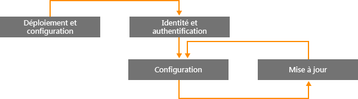

# Vers une gestion Windows moderne avec Microsoft Intune

L’usage d’appareils personnels dans le cadre professionnel et le travail des employés hors de l’entreprise amènent les organisations à repenser leur façon de gérer les appareils. Certaines organisations souhaitent effectuer un contrôle total et précis des appareils alors que d’autres choisissent une gestion plus légère basée sur des scénarios qui correspond plus aux modes de travail d’aujourd’hui.

Comme les versions précédentes, Windows 10 constitue le système d’exploitation le mieux géré pour les organisations. En faisant appel à des technologies comme la stratégie de groupe, Active Directory et System Center Configuration Manager, Windows offre une meilleure facilité de gestion et une sécurité renforcée. Avec une approche qui privilégie les mobiles et le cloud, il propose aussi une gestion plus simple et plus moderne grâce à des solutions cloud de gestion des appareils telles que Microsoft Enterprise Mobility Suite (EMS). Les innovations de Windows, disponibles via Windows as a Service, sont complétées par différents services cloud en constante évolution, comme Microsoft Intune, Azure Active Directory, Azure Rights Management Service, Office 365 et le Windows Store pour Entreprises.

Les organisations informatiques gagnent en flexibilité tout en ayant la possibilité de profiter des dernières innovations et de réduire leurs coûts. Ce document fournit des conseils relatifs aux stratégies de déploiement et de gestion de Windows 10. Il aide également à comprendre la réflexion stratégique de Microsoft sur le plan des outils de gestion des appareils. Lors de votre réflexion sur les principes de base de la gestion et sur la façon dont vous souhaitez les appliquer aux différents appareils, tenez compte des quatre phases suivantes du cycle de vie d’un appareil :

## Déploiement et mise en service

Contrairement au déploiement traditionnel de système d’exploitation qui implique des opérations informatiques complexes, la gestion moderne des appareils ouvre la voie à une « gestion immédiate ». Les équipes informatiques souhaitent pouvoir entièrement configurer et gérer les nouveaux appareils sans avoir à recréer d’images.  L’approvisionnement dynamique est plus facile que jamais grâce aux services de gestion d’appareils dans le cloud tels que Microsoft Intune. Vous pouvez également créer des packages d’approvisionnement autonomes avec le Concepteur de configuration et d’acquisition d’images Windows (Windows ICD). Bien sûr, nous continuons de prendre en charge les techniques d’imagerie traditionnelles pour permettre aux organisations de déployer des images personnalisées à l’aide de System Center Configuration Manager.

## Identité et authentification

Windows 10 et les services comme Active Directory Azure offrent de nouvelles possibilités dans le domaine de la gestion, de l’authentification et de l’identité basées sur le cloud. Les scénarios BYOD et CYOD conduisent les entreprises à revoir la façon dont les utilisateurs accèdent aux applications et ressources d’entreprise. Les utilisateurs et les appareils à gérer peuvent être classés dans deux catégories :

- Les appareils d’entreprise (CYOD) ou personnels (BYOD) dont se servent les utilisateurs mobiles pour les applications SaaS comme Office 365.

  Windows 10 permet aux employés d’approvisionner eux-mêmes leurs appareils. Les appareils d’entreprise peuvent facilement être configurés pour l’accès au réseau d’entreprise avec Azure AD Join. De la même manière, une nouvelle expérience BYOD simplifiée permet aux utilisateurs d’ajouter leur compte professionnel à Windows et d’accéder aux ressources d’entreprise à partir de leurs appareils personnels. L’utilisation conjointe d’Azure AD Join et de l’inscription automatique à MDM Intune permet d’avoir des appareils gérés par l’entreprise en [une seule étape simple](https://blogs.technet.microsoft.com/ad/2015/08/14/windows-10-azure-ad-and-microsoft-intune-automatic-mdm-enrollment-powered-by-the-cloud/), uniquement à partir du cloud. Azure AD Join est également une excellente solution pour le personnel intérimaire, les partenaires ou autres employés à temps partiel. Vous pouvez gérer les comptes de ces utilisateurs séparément du domaine Active Directory local tout en gardant un accès aux ressources d’entreprise nécessaires.
- Les tablettes et les PC joints au domaine qui utilisent des applications et ressources traditionnelles nécessitant une authentification ou qui accèdent à des ressources locales classifiées ou très sensibles.

  Les appareils Windows 10 joints à un domaine Active Directory local sont automatiquement inscrits auprès du service Azure AD. Les utilisateurs profitent ainsi également des fonctionnalités Windows 10 comme l’authentification unique pour accéder aux ressources cloud et locales où qu’ils soient, l’itinérance des paramètres d’entreprise, Microsoft Passport for Work et Windows Hello. Vous devez continuer à gérer les tablettes et les PC joints au domaine avec le client System Center Configuration Manager ou la stratégie de groupe.

Passez en revue les rôles définis dans votre organisation. Déterminez quels utilisateurs ou appareils doivent être joints au domaine et basculez les autres vers Azure AD. Consultez [cet article](https://azure.microsoft.com/en-us/documentation/articles/active-directory-azureadjoin-windows10-devices/) pour plus d’informations sur la façon dont Windows 10 et Azure AD optimisent l’accès aux ressources de travail selon les appareils et les scénarios.

Voici un exemple d’arbre de décision général. Des exceptions s’appliquent dans certains cas.

## Paramètres et configuration

La configuration requise dépend du niveau de gestion nécessaire, des appareils et des données à gérer, et des exigences du secteur. Les employés sont souvent gênés par des stratégies strictes que le service informatique applique sur leurs appareils personnels, qui les empêchent d’accéder à leurs e-mails professionnels et leurs documents de travail. Windows 10 fournit un ensemble cohérent de configurations pour les PC, les tablettes et les téléphones par le biais d’une couche MDM. L’approche MDM applique des paramètres qui reflètent la volonté de l’administrateur sans exposer chaque paramètre possible. À l’inverse, la stratégie de groupe expose tous les paramètres précis que l’administrateur contrôle individuellement. L’un des avantages de la gestion MDM est qu’elle permet aux administrateurs d’appliquer à plus grande échelle des paramètres de gestion de la confidentialité, de la sécurité et des applications avec des outils plus simples et plus performants. C’est pour cela que la gestion MDM est le meilleur choix pour les appareils utilisés hors de l’entreprise.

Beaucoup d’organisations ont encore besoin de gérer les ordinateurs joints au domaine à un niveau granulaire, par exemple, avec les 1 500 paramètres de stratégie de groupe configurables d’Internet Explorer ou les règles très spécifiques du Pare-feu Windows. Pour ces cas de figure, la stratégie de groupe et System Center Configuration Manager restent deux excellents modes de gestion. La stratégie de groupe est le meilleur moyen de configurer de façon précise les tablettes et les PC Windows joints au domaine qui sont connectés au réseau d’entreprise à l’aide d’outils Windows. Microsoft continue de fournir des paramètres de stratégie de groupe avec chaque nouvelle version de Windows. Configuration Manager reste la solution recommandée pour effectuer une configuration précise lors de déploiements de logiciel, de mises à jour Windows et de déploiements de système d’exploitation conséquents.

## Mise à jour d’appareils Windows

Avec Windows as a Service, les organisations informatiques n’ont plus besoin d’effectuer des opérations complexes d’acquisition d’images (réinitialisation et chargement) pour chaque nouvelle version de Windows. Les appareils de niveau CB (Current Branch) ou CBB (Current Branch for Business) bénéficient des dernières mises à jour des fonctionnalités et de la qualité via des processus de mise à jour corrective simples et souvent automatiques. MDM et Intune offrent des outils qui appliquent les mises à jour Windows sur les ordinateurs clients de l’entreprise. Configuration Manager offre des fonctionnalités avancées qui gèrent et suivent ces mises à jour, notamment des fenêtres de maintenance et des règles de déploiement automatique.

## Résumé

Si vous réfléchissez à la manière de passer à une gestion des appareils moderne dans votre organisation, pensez aux étapes que vous pouvez effectuer pour commencer.

1. **Vous pouvez agir dès aujourd’hui.** Dans la gestion d’appareils traditionnelle, quels sont les éléments à conserver et ceux pouvant être modernisés ? Qu’il s’agisse d’actions visant à limiter la création d’images personnalisées, réévaluer la gestion des paramètres ou réexaminer l’authentification et la conformité, les avantages peuvent être immédiats.

2. **Examinez les différents cas d’usage dans votre environnement.** Certains groupes d’appareils peuvent-ils profiter d’une gestion simplifiée et plus légère ? Les appareils BYOD, par exemple, se prêtent naturellement à une gestion dans le cloud. Les utilisateurs ou les appareils ayant accès à des données davantage contrôlées nécessitent plutôt une authentification via le domaine Active Directory local. Avec Configuration Manager et EMS, vous pouvez implémenter des scénarios de gestion moderne à votre rythme, par étapes, tout en choisissant la méthode de ciblage des appareils la plus adaptée aux besoins de votre entreprise. Le choix vous appartient.

## Étapes suivantes

- **Évaluez les besoins de gestion dans votre environnement.** Une gestion unique peut ne pas répondre à l’ensemble de vos besoins, en fonction des utilisateurs, de leur mobilité, de leurs appareils et des données auxquelles ils accèdent.
- **Tenez compte des exigences.** Avec Windows 10, Configuration Manager et Enterprise Mobility Suite, vous avez la possibilité de gérer les outils d’imagerie, d’authentification, de configuration et de gestion pour tous les scénarios.
- **Procédez par petites étapes.** Le passage à une gestion moderne des appareils ne s’effectue pas du jour au lendemain.
- **Optimisez vos investissements existants.** Tout au long de votre démarche pour passer d’un système de gestion local traditionnel à un système de gestion dans le cloud moderne, sachez tirer parti de l’architecture hybride et flexible de Configuration Manager et d’Intune. En s’appuyant sur les nouvelles fonctionnalités du modèle MDM/de gestion des identités dans le cloud, Microsoft s’efforce d’offrir une transition claire entre une gestion traditionnelle et une gestion moderne.

<!--HONumber=Oct16_HO4-->

