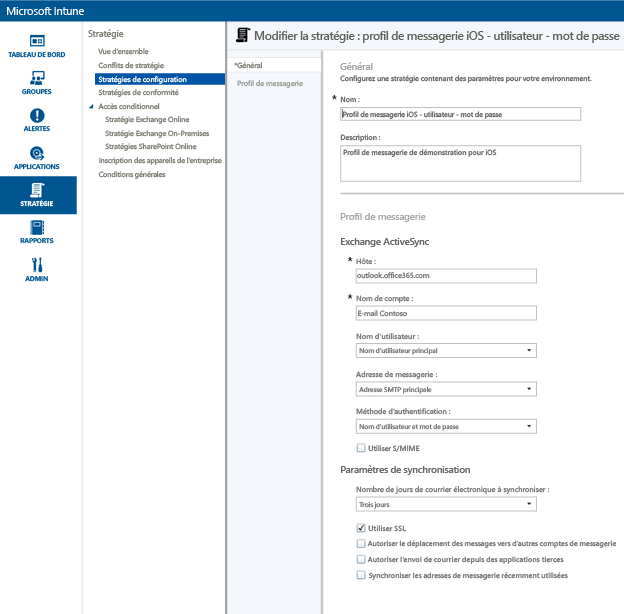
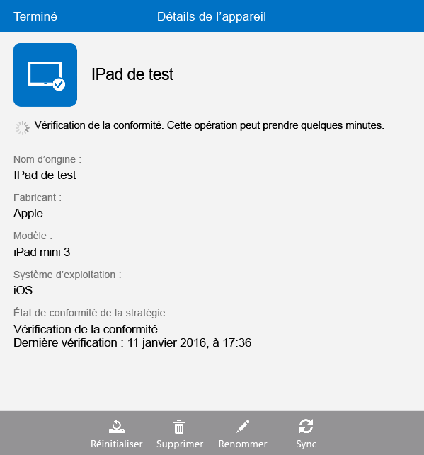

# Configurer l’accès à la messagerie pour les appareils iOS à l’aide de Microsoft Intune
Lorsque les appareils sont inscrits auprès d’Intune, vous pouvez les configurer afin que les utilisateurs puissent accéder au courrier électronique de l’entreprise. La première méthode consiste à créer et à déployer un **profil de messagerie** pour des types d’appareils spécifiques. Les profils de messagerie sont un type de stratégie Intune qui configure et connecte l’appareil d’un utilisateur au service de messagerie de votre entreprise.
L’utilisation d’un profil de messagerie automatise l’accès à la messagerie pour les appareils inscrits, ce qui vous évite d’avoir à configurer manuellement l’appareil. Un profil de messagerie garantit également que tous les utilisateurs finaux configurent l’accès de la même manière et avec les mêmes paramètres de base.

## Objectifs de cette procédure pas à pas

- Créer et déployer un profil de messagerie pour les appareils iOS
- Vérifier que la stratégie du profil de messagerie a été appliquée avec succès

## Éléments requis avant de commencer cette procédure pas à pas

- Un serveur Exchange, sur site ou hébergé sur Azure dans le cadre de votre abonnement Office/E3.
- Le nom d’hôte du serveur Exchange de votre entreprise. Il s’agit du nom de domaine complet (FQDN), par exemple **contosodemo55.onmicrosoft.com**.
- Un groupe d’utilisateurs pour lequel déployer le profil de messagerie. Si vous avez terminé la procédure pas à pas [Commencer une évaluation de Microsoft Intune et déployer une stratégie de code confidentiel iOS](start-a-microsoft-intune-trial-and-deploy-ios-pin-policy.md), vous pouvez utiliser le groupe d’utilisateurs **GroupDemo** que vous avez créé.
- Des appareils iOS inscrits vers lesquels déployer le profil. De nouveau, si vous avez terminé la procédure pas à pas [Commencer une évaluation de Microsoft Intune et déployer une stratégie de code confidentiel iOS](start-a-microsoft-intune-trial-and-deploy-ios-pin-policy.md), vous disposerez d’appareils iOS inscrits.

## Étapes de création et de déploiement d’un profil de messagerie pour les appareils iOS

Pour cette procédure pas à pas, nous utiliserons le serveur Exchange hébergé qui est fourni avec un abonnement d’évaluation.
1. Dans la console Intune, cliquez sur **Stratégie**, puis sur **Ajouter une stratégie**.

2. Dans la boîte de dialogue **Créer une nouvelle stratégie**, développez **iOS**, sélectionnez **Profil de messagerie**, puis cliquez sur **Créer une stratégie**.

3. Sur la page Créer une stratégie, entrez un nom pour la stratégie, tel que **Profil de messagerie iOS - utilisateur-mot de passe** et une description. Vous pouvez avoir plusieurs profils de messagerie pour différents types d’appareils et différentes méthodes d’authentification. Ceci vous permet d’utiliser le nom pour connaître la finalité du profil.
4. Entrez le nom d’hôte Exchange. Étant donné que nous utilisons le serveur Exchange hébergé sur Azure, pour le nom d’hôte nous entrons simplement : **outlook.office365.com**

5. Entrez le nom du compte qui sera affiché aux utilisateurs de l’appareil pour les aider à identifier le service de messagerie. Par exemple, **E-mail Contoso**.
6. Étant donné que nous utilisons le nom d’utilisateur et le mot de passe pour authentifier l’utilisateur pour le service Exchange, laissez les paramètres du nom d’utilisateur et du mot de passe tels qu’ils sont.
7. Ajustez les paramètres de synchronisation en fonction de vos besoins. Pour l’instant, utilisez simplement les valeurs par défaut, sauf si vous devez modifier une valeur spécifique.  
8. Cliquez sur **Enregistrer la stratégie**.
9. Une boîte de dialogue s’affiche vous demandant si vous souhaitez déployer la stratégie maintenant. Cliquez sur **Oui**.

10. Dans la fenêtre qui s’affiche ensuite, sélectionnez le groupe d’utilisateurs vers lequel déployer le profil de messagerie, cliquez sur **Ajouter**, puis sur **OK**.
 Après avoir cliqué sur **OK**, la stratégie commence à se propager aux appareils inscrits dans un délai d’une ou deux minutes.

## Procédure pour vérifier que le profil a été appliqué avec succès

Pour vérifier que le profil a été appliqué, vous devez accéder à l’un des appareils sur lesquels vous avez déployé le profil de messagerie.
1. Sur l’appareil iOS, ouvrez l’application de messagerie.
L’application demande le nom d’utilisateur et le mot de passe de l’e-mail de l’utilisateur.

2. Entrez le nom d’utilisateur et le mot de passe du compte de messagerie Exchange de l’utilisateur, puis appuyez sur **OK**.
 L’application de messagerie s’ouvre sur le compte Exchange et la messagerie est synchronisée sur l’appareil.

3. Vérifiez les paramètres de compte pour l’application de messagerie pour vous assurer que le nom du compte est identique à celui saisi dans le profil de messagerie (par exemple, **Messagerie Contoso**) et que les paramètres de synchronisation sont correctement configurés.

 S’il apparaît que le profil de messagerie n’a pas été appliqué automatiquement à l’appareil, vous pouvez appliquer manuellement la stratégie à l’aide de l’application Portail d’entreprise sur l’appareil.
1. Ouvrez l'application Portail d'entreprise.
2. Appuyez sur **Mes appareils**.
3. Appuyez sur le nom de votre appareil.

4. Appuyez sur **Sync** > **Vérifier la conformité**.
 Après quelques instants, le profil de messagerie est appliqué à l’appareil. Ensuite, vous pouvez suivre les étapes de vérification pour vous assurer que le profil a été correctement appliqué.

## Voir aussi
[Guide d'évaluation de Microsoft Intune](get-started-with-a-30-day-trial-of-microsoft-intune.md)

<!--HONumber=Jun16_HO4-->

