# Commencer une évaluation de Microsoft Intune et déployer une stratégie de code confidentiel iOS
Ces instructions pas à pas vous permettent de configurer une évaluation d’Intune et de configurer une stratégie de code confidentiel pour des appareils iOS. Pour obtenir une liste d’autres tâches d’évaluation d’Intune courantes, consultez [Tâches courantes pour l’évaluation d’Intune](common-microsoft-intune-evaluation-tasks.md).

## Passer en revue les conditions requises pour cette tâche

-   PC Windows avec Internet Explorer : pour effectuer les tâches d’administration

-   Appareil iOS 7.1 ou version ultérieure pour tester la validation de la stratégie utilisateur

-   Téléphone pour vous authentifier pendant l’inscription de la version d’évaluation

## Créer un compte d’évaluation Intune gratuit
> [!NOTE]
> Si vous avez déjà un abonnement à Intune, ignorez cette section et passez à la suivante.

1.  Sur un PC Windows, cliquez avec le bouton droit sur **Internet Explorer** (IE), puis sélectionnez **Navigation InPrivate**.

    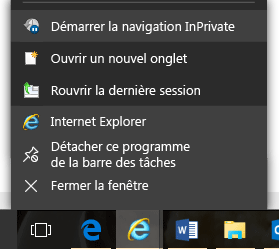

2.  Accédez au [portail d’inscription Intune](https://portal.office.com/Signup/Signup.aspx?OfferId=40BE278A-DFD1-470a-9EF7-9F2596EA7FF9&dl=INTUNE_A&ali=1), fournissez les informations demandées, puis cliquez sur **Suivant**.

    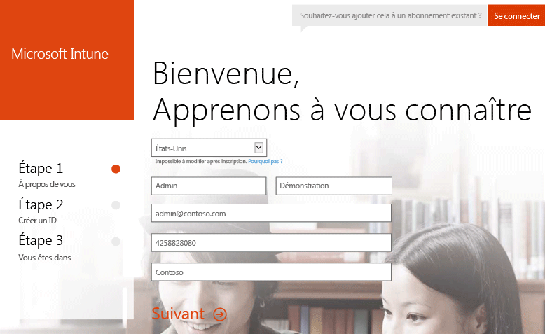

3.  Entrez un ID utilisateur et un mot de passe pour votre compte d’administrateur, puis cliquez sur **Suivant**. Vous utiliserez cet ID pour vous connecter au portail et effectuer vos tâches d’administration Intune.

    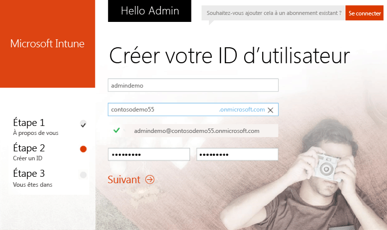

4.  Entrez votre numéro de téléphone portable et cliquez sur **M’envoyer un SMS** pour valider votre numéro.

    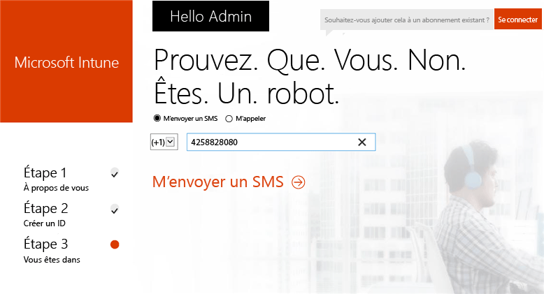

5.  Enregistrez les informations affichées à l’écran, puis cliquez sur **Vous êtes prêt !**.

    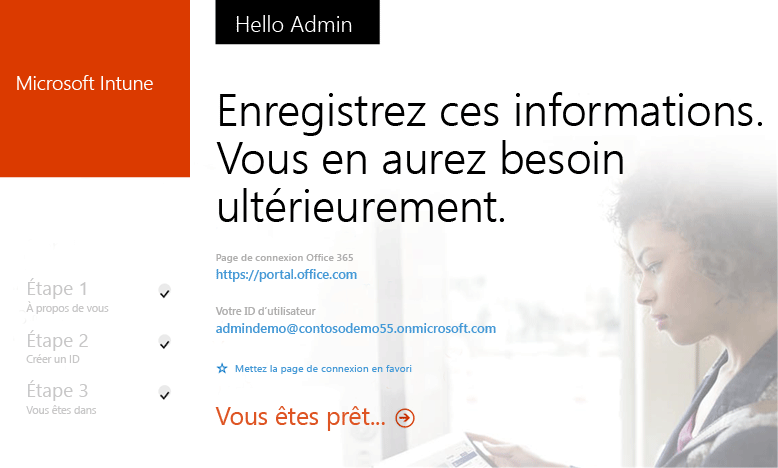

## Créer un utilisateur de test

1.  Sur un PC Windows, cliquez sur **Démarrer** pour accéder à la page de gestion des utilisateurs.

    

2.  Cliquez sur le bouton **+** pour ajouter un utilisateur.

    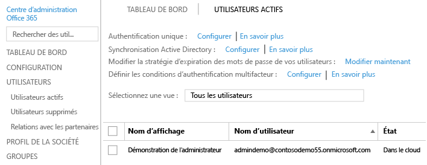

3.  Dans la page **Créer un compte d’utilisateur** :

    1.  Fournissez les informations relatives à l’utilisateur de test.

    2.  Sélectionnez l’option **Entrez le mot de passe**.

    3.  Décochez la case **Exiger que cette personne modifie son mot de passe la prochaine fois qu’il se connecte**.

    4.  Cliquez sur **Créer**.

    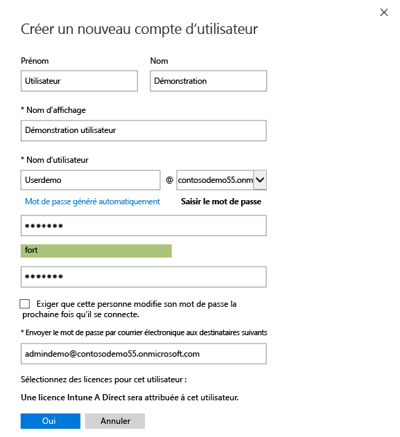

4.  Dans la page de confirmation de création de l’utilisateur, cliquez sur **Fermer**.

    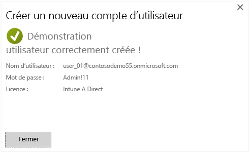

5.  Cliquez sur le bouton **Actualiser** pour voir l’utilisateur de test que vous avez créé.

    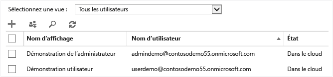

## Configurer une stratégie de code confidentiel iOS pour l’utilisateur de test

1.  Sur un PC Windows, définissez Intune comme autorité de gestion des appareils mobiles :

    1.  Accédez à la [console de gestion Intune](http://manage.microsoft.com/), connectez-vous avec votre compte d’administrateur, puis cliquez sur **Démarrer la gestion des appareils mobiles**. La page Autorité de gestion des appareils mobiles s’ouvre.

        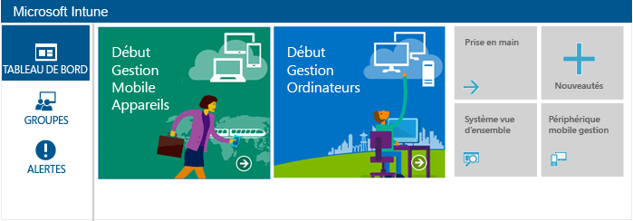

    2.  Cliquez sur le lien **Définir l’autorité de gestion des appareils mobiles**.

        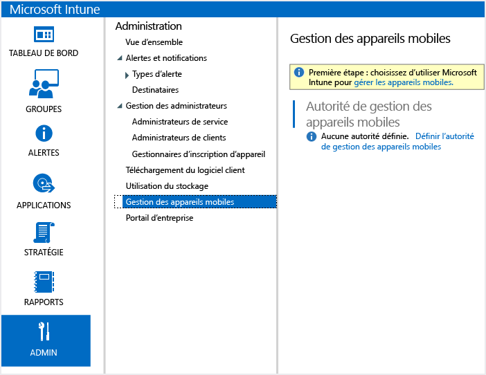

2.  Activez les appareils iOS pour l’inscription. Ce processus configure un certificat approuvé entre Apple Push Notification Service (APNs) et votre abonnement Intune.

    1.  Cliquez sur **Activer la plateforme iOS et Mac OS X**.

        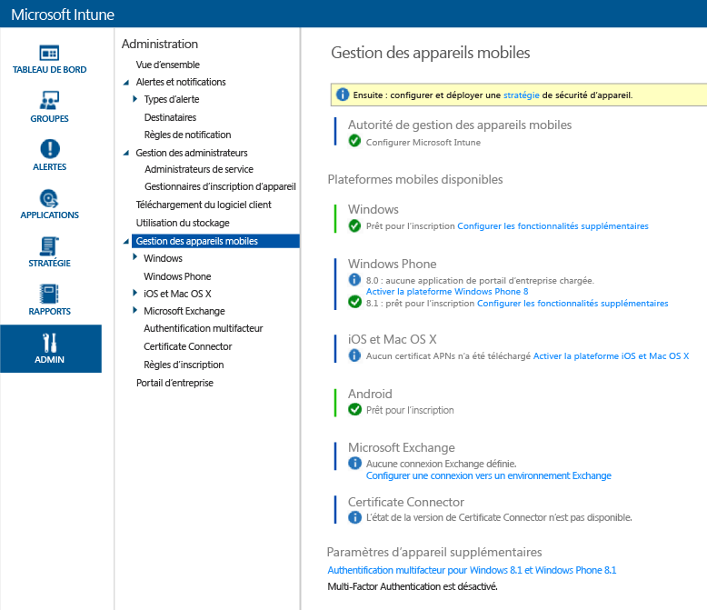

    2.  Cliquez sur **Télécharger la demande de certificat APNs**.

        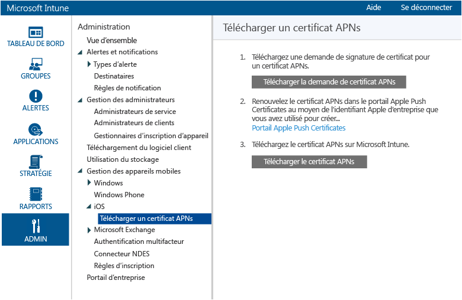

    3.  Spécifiez un nom de fichier et un emplacement pour votre demande de signature de certificat, puis cliquez sur **Enregistrer**. Ce fichier contient la clé publique qui correspond à une clé privée détenue par votre abonnement Intune.

        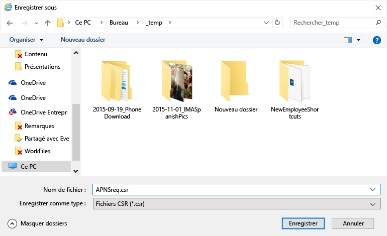

    4.  Cliquez sur **Portail Apple Push Certificates** pour ouvrir un nouvel onglet.

        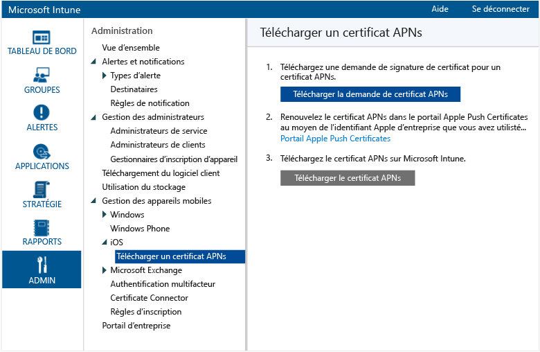

    5.  Entrez votre ID Apple et votre mot de passe, puis cliquez sur **Se connecter**. Cet ID peut être celui que vous utilisez sur votre appareil iOS pour obtenir des applications à partir de l’App Store iOS.

        

    6.  Cliquez sur **Créer un certificat**.

        

    7.  Lisez les conditions d’utilisation d’Apple, cochez la case, puis cliquez sur **Accepter**.

        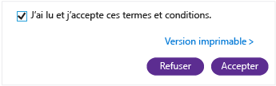

    8.  Cliquez sur **Parcourir**.

        

    9. Sélectionnez le fichier de demande de signature de certificat (CSR) que vous avez enregistré précédemment, puis cliquez sur **Ouvrir**.

        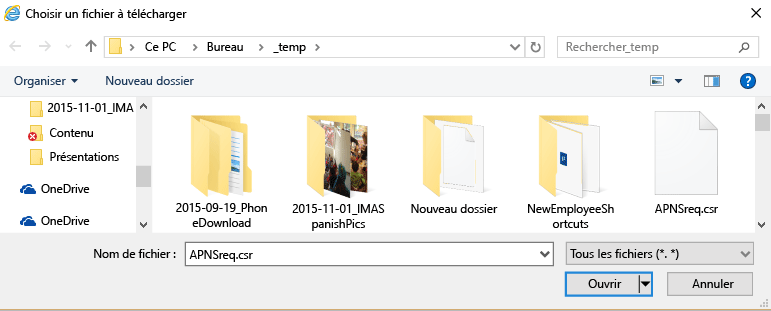

    10. Cliquez sur le bouton **Télécharger**.

        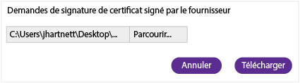

    11. Quand vous êtes invité à télécharger un fichier JSON, cliquez sur **Enregistrer sous**.

        

    12. Spécifiez un emplacement pour votre fichier JSON, puis cliquez sur **Enregistrer**.

        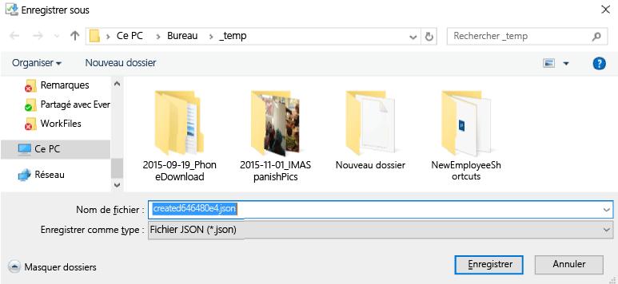

        Si votre page n’est pas automatiquement redirigée après quelques secondes, cliquez sur **Annuler**.

        

    13. Pour récupérer votre nouveau fichier de certificat, cliquez sur **Télécharger**.

        

    14. Quand vous êtes invité à télécharger un fichier PEM, cliquez sur **Enregistrer sous**.

        

    15. Spécifiez un emplacement pour le fichier PEM et cliquez sur **Enregistrer**.

        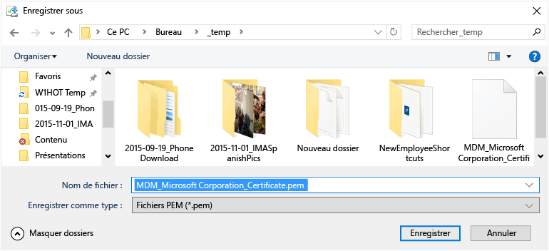

    16. Revenez à l’onglet de la console de gestion Intune, puis cliquez sur **Télécharger le certificat APNs**.

        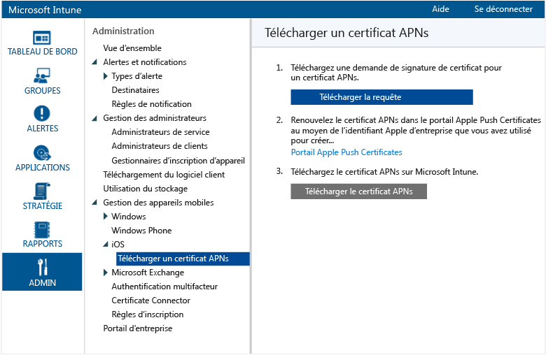

    17. Entrez votre ID Apple et cliquez sur **Parcourir**.

        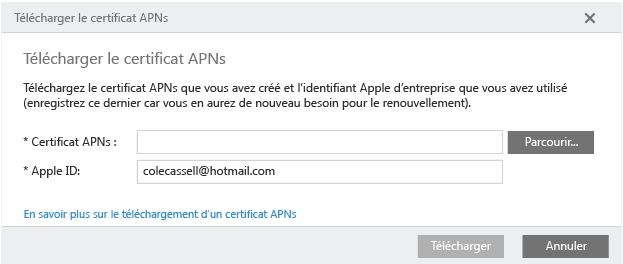

    18. Sélectionnez le fichier PEM que vous venez d’enregistrer, puis cliquez sur **Ouvrir**.

        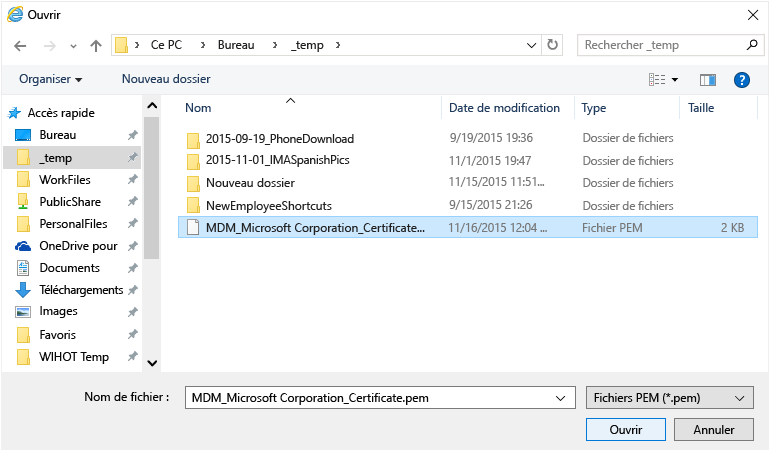

    19. Cliquez sur **Télécharger**.

        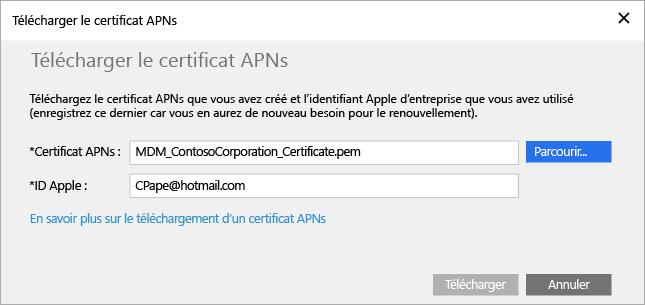

        Votre certificat APNs est maintenant configuré.

        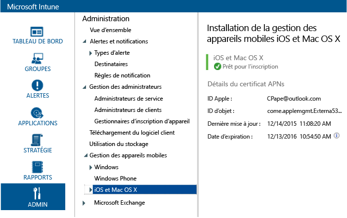

3.  Créez un groupe d’utilisateurs de test pour le ciblage de stratégie :

    1.  Dans le volet gauche, cliquez sur **Groupes**.

        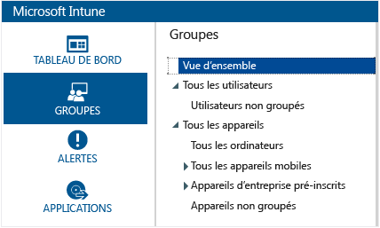

    2.  Tout à droite, cliquez sur **Créer un groupe**.

        

    3.  Spécifiez un nom de groupe, sélectionnez **Tous les utilisateurs** comme groupe parent, puis cliquez sur **Suivant**.

        

    4.  Dans le champ **Commencer l’appartenance au groupe par**, sélectionnez **Tous les utilisateurs du groupe parent**, puis cliquez sur **Terminer**.

        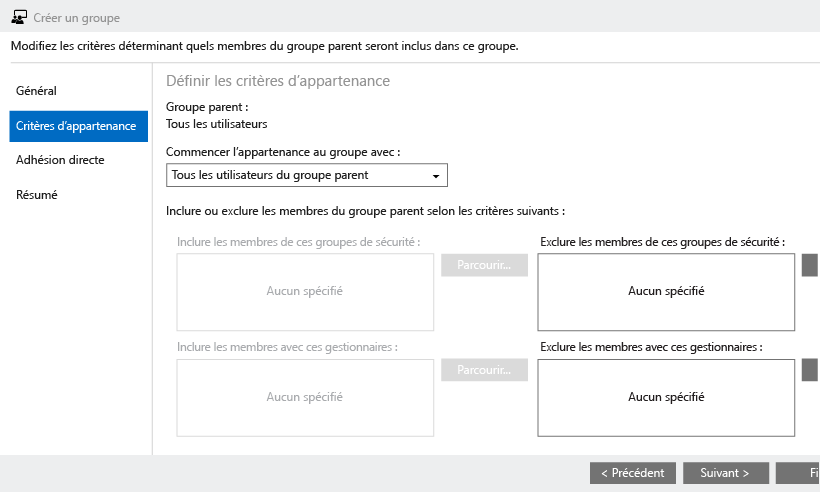

4.  Créez une stratégie de code confidentiel iOS et ciblez-la sur le groupe d’utilisateurs de test :

    1.  Dans le volet gauche, cliquez sur **Stratégie**.

        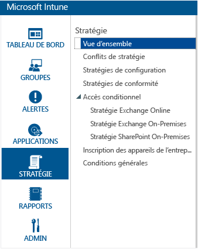

    2.  Tout à droite, cliquez sur **Ajouter une stratégie**.

        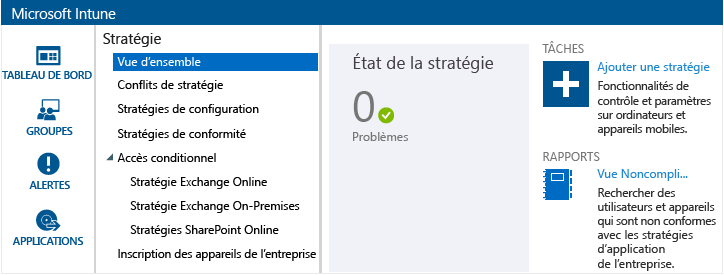

    3.  Développez le nœud iOS, sélectionnez la ligne **Configuration générale**, puis cliquez sur **Créer une stratégie**.

        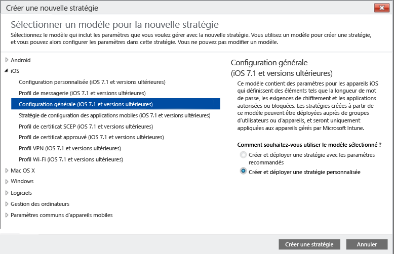

    4.  Tapez un nom pour la stratégie, activez l’option **Exiger un mot de passe pour déverrouiller les appareils mobiles**, puis affectez la valeur **4** comme **Longueur minimale du mot de passe**.

        

    5.  Cliquez sur **Oui** pour déployer la stratégie.

        

    6.  Cliquez sur le groupe d’utilisateurs créé précédemment, sur **Ajouter**, puis sur **OK**.

        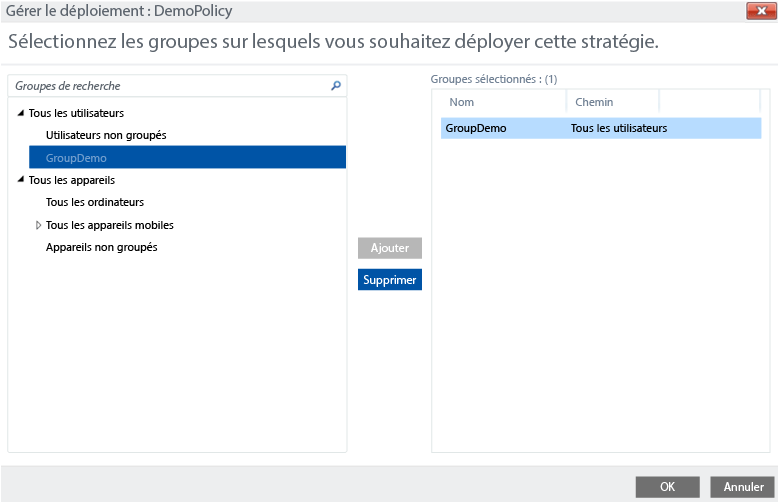

        Vous avez maintenant une stratégie de code confidentiel iOS qui cible votre groupe d’utilisateurs de test.

        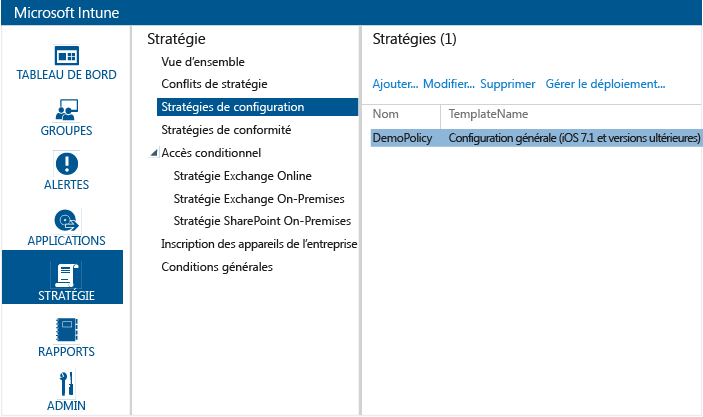

## Vérifier que la stratégie est appliquée sur un appareil iOS

1.  Sur un iPad, lancez l’App Store iOS, installez l’application gratuite **Portail d’entreprise Microsoft Intune**, puis ouvrez-la.

    

2.  Entrez le nom de compte et le mot de passe de votre utilisateur de test, puis appuyez sur **Se connecter**.

    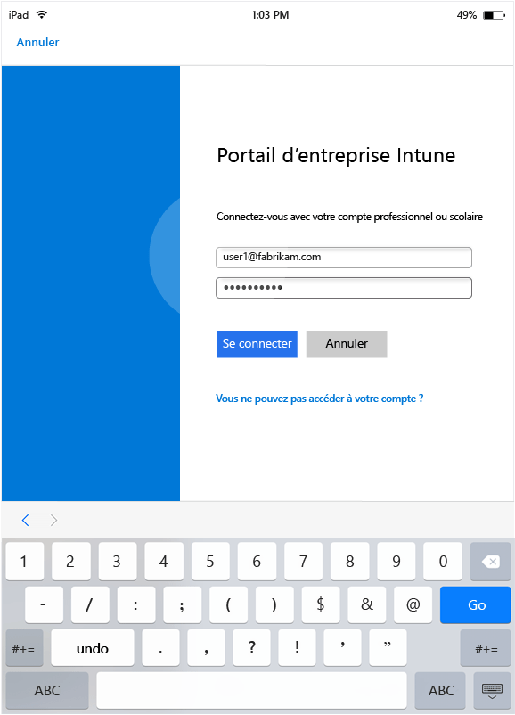

3.  Appuyez sur **Inscription** pour commencer l’inscription de l’appareil dans Intune.

    

4.  Dans l’écran **Installer un profil**, appuyez sur **Installer**.

    

5.  Dans la boîte de dialogue **Installer un profil**, appuyez sur **Installer**.

    

6.  Dans l’écran **Avertissement**, appuyez sur **Installer**.

    

7.  Dans la boîte de dialogue **Gestion à distance**, appuyez sur **Approuver**.

    

8.  Une fois l’installation du profil de gestion terminée, appuyez sur **Terminé**. L’inscription est terminée.

    

9. Une fois l’inscription terminée, appuyez sur **OK** et fermez l’application Portail d’entreprise.

    

10. Quand vous êtes invité à configurer un code d’accès, appuyez sur **Continuer**.

    

11. Tapez votre code d’accès, appuyez sur **Continuer**, retapez votre code d’accès, puis appuyez sur **Enregistrer**.

    

12. Appuyez sur le bouton d’alimentation pour verrouiller votre iPad, puis faites glisser pour le déverrouiller. Vous devez désormais entrer votre code d’accès pour déverrouiller l’appareil.

### Voir aussi
[Guide d'évaluation de Microsoft Intune](get-started-with-a-30-day-trial-of-microsoft-intune.md)

<!--HONumber=Jun16_HO4-->

