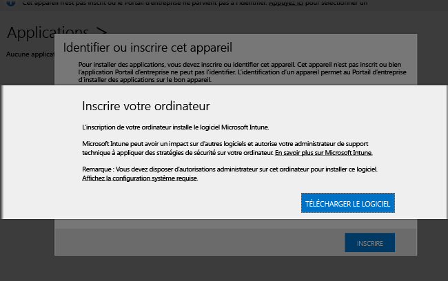

---

title: Installation du logiciel client PC | Microsoft Docs
description: "Utilisez ce guide pour que votre PC Windows soit géré par le logiciel client Microsoft Intune."
keywords: 
author: staciebarker
ms.author: stabar
ms.date: 01/24/2016
ms.topic: article
ms.prod: 
ms.service: microsoft-intune
ms.technology: 
ms.assetid: 64c11e53-8d64-41b9-9550-4b4e395e8c52
ms.reviewer: owenyen
ms.suite: ems
translationtype: Human Translation
ms.sourcegitcommit: 39f7de3a94b813cbd7b353cd319ecc54fcbf8694
ms.openlocfilehash: 4b1b466c62ac1c8e03bc6cebd5e214649160185f


---

# <a name="install-the-intune-software-client-on-windows-pcs"></a>Installer le logiciel client Intune sur des PC Windows
Les PC Windows peuvent être inscrits en installant le logiciel client Intune. Le logiciel client Intune peut être installé à l'aide des méthodes suivantes :

- Par l’administrateur informatique :
  - Installation manuelle
  - Installation à l'aide de la stratégie de groupe
  - Installation intégrée dans une image de disque

- Par les utilisateurs finaux, qui installent manuellement le client logiciel

Le client de logiciel Intune, que l’administrateur informatique déploie pour l’utilisateur ou que l’utilisateur final télécharge, contient la configuration logicielle minimale nécessaire pour inscrire le PC dans la gestion Intune. Une fois le PC inscrit, le client logiciel Intune télécharge le logiciel client complet nécessaire pour la gestion du PC.

Cette série de téléchargements réduit l’impact sur la bande passante du réseau et réduit le temps nécessaire pour l'inscription initiale du PC dans Intune. Elle garantit également que le client dispose du logiciel plus récent disponible une fois le second téléchargement terminé.

## <a name="download-the-intune-client-software"></a>Téléchargement du logiciel client Intune

Toutes les méthodes, à l’exception de celles où les utilisateurs installent le logiciel client Intune eux-mêmes, nécessitent le téléchargement préalable du logiciel par des administrateurs informatiques pour qu'il puisse être ensuite déployé pour les utilisateurs finaux.

1.  Dans la [console d’administration Microsoft Intune](https://manage.microsoft.com/), cliquez sur **Admin** &gt; **Téléchargement du logiciel client**.

  

2.  Dans la page **Téléchargement du logiciel client**, cliquez sur **Télécharger le logiciel client**. Enregistrez ensuite le package **Windows_Intune_Setup.zip** contenant le logiciel à un emplacement sécurisé sur votre réseau.

    > [!NOTE]
    > Le package d’installation du logiciel client Intune contient des informations uniques et spécifiques disponibles par le biais d'un certificat incorporé associé à votre compte. Si des utilisateurs non autorisés arrivent à accéder au package d’installation, ils peuvent inscrire des ordinateurs dans le compte représenté par le certificat intégré et obtenir ainsi l’accès aux ressources de l’entreprise.

3.  Extrayez le contenu du package d'installation dans l'emplacement sécurisé de votre réseau.

    > [!IMPORTANT]
    > Ne renommez pas ou ne supprimez pas le fichier **ACCOUNTCERT** extrait, au risque de faire échouer l’installation du logiciel client.

## <a name="deploy-the-client-software-manually"></a>Déployer manuellement le logiciel client

Sur les ordinateurs sur lesquels le logiciel client doit être installé, accédez au dossier dans lequel se trouvent les fichiers d’installation du logiciel client. Exécutez ensuite **Microsoft_Intune_Setup.exe** pour installer le logiciel client.

> [!NOTE]
> L'état de l'installation s'affiche lorsque vous placez le curseur sur l'icône de la barre des tâches de l'ordinateur client.

## <a name="deploy-the-client-software-by-using-group-policy"></a>Déployer le logiciel client à l’aide de la stratégie de groupe

1.  Dans le dossier contenant les fichiers **Microsoft_Intune_Setup.exe** et **MicrosoftIntune.accountcert**, exécutez la commande suivante pour extraire les programmes d’installation Windows Installer des ordinateurs 32 et 64 bits :

    ```
    Microsoft_Intune_Setup.exe/Extract <destination folder>
    ```

2.  Copiez les fichiers **Microsoft_Intune_x86.msi**, **Microsoft_Intune_x64.msi** et **MicrosoftIntune.accountcert** à un emplacement réseau accessible à tous les ordinateurs sur lesquels le logiciel client doit être installé.

    > [!IMPORTANT]
    > Ne séparez ou ne renommez pas les fichiers, au risque de faire échouer l'installation du logiciel client.

3.  Utilisez la stratégie de groupe pour déployer les logiciels sur les ordinateurs de votre réseau.

    Pour plus d’informations sur l’utilisation de stratégies de groupe pour déployer automatiquement des logiciels, consultez [Introduction aux stratégies de groupe](https://technet.microsoft.com/library/hh147307.aspx).

## <a name="deploy-the-client-software-as-part-of-an-image"></a>Déployer le logiciel client comme partie d’une image
Vous pouvez déployer le logiciel client Intune sur des ordinateurs dans le cadre d’une image de système d’exploitation en utilisant comme guide la procédure suivante :

1.  Copiez les fichiers d’installation du client, **Microsoft_Intune_Setup.exe** et **MicrosoftIntune.accountcert**, dans le dossier **%Systemdrive%\Temp\Microsoft_Intune_Setup** sur l’ordinateur de référence.

2.  Créez l'entrée de Registre **WindowsIntuneEnrollPending** en ajoutant la commande suivante au script **SetupComplete.cmd** :

    ```
    %windir%\system32\reg.exe add HKEY_LOCAL_MACHINE\Software\Microsoft\Onlinemanagement\Deployment /v
    WindowsIntuneEnrollPending /t REG_DWORD /d 1
    ```

3.  Ajoutez la commande suivante à **setupcomplete.cmd** pour exécuter le package d’inscription avec l’argument de ligne de commande /PrepareEnroll :

    ```
    %systemdrive%\temp\Microsoft_Intune_Setup\Microsoft_Intune_Setup.exe /PrepareEnroll
    ```
    > [!TIP]
    > Le script **SetupComplete.cmd** permet au programme d’installation de Windows d’apporter des modifications au système avant qu’un utilisateur se connecte. L’argument de ligne de commande **/PrepareEnroll** prépare un ordinateur ciblé afin qu’il soit automatiquement inscrit dans Intune une fois l’installation de Windows terminée.

4.  Placez **SetupComplete.cmd** dans le dossier **%Windir%\Setup\Scripts** sur l’ordinateur de référence.

5.  Capturez une image de l'ordinateur de référence et déployez-la sur les ordinateurs ciblés.

    Au redémarrage de l'ordinateur ciblé à la fin des opérations du programme d'installation de Windows, la clé de Registre **WindowsIntuneEnrollPending** est créée. Le package d’inscription vérifie si l’ordinateur est inscrit. Si l'ordinateur est inscrit, aucune action n'est exécutée. Si l’ordinateur n’est pas inscrit, le package d’inscription crée une tâche d’inscription automatique Microsoft Intune.

    Quand la tâche d’inscription automatique s’exécute à l’heure planifiée suivante, elle vérifie l’existence de la valeur de Registre **WindowsIntuneEnrollPending** et tente d’inscrire l’ordinateur ciblé dans Intune. Si l'inscription échoue pour une raison quelconque, l'inscription est tentée à nouveau lors de la prochaine exécution de la tâche. Les nouvelles tentatives continuent pendant un mois.

    La tâche d’inscription automatique Intune, la valeur de Registre **WindowsIntuneEnrollPending** et le certificat du compte sont supprimés de l’ordinateur ciblé quand l’inscription est réussie ou après un délai d’un mois (selon ce qui advient en premier).

## <a name="instruct-users-to-self-enroll"></a>Indiquer aux utilisateurs de s’inscrire eux-mêmes

Les utilisateurs peuvent installer le logiciel client Intune en accédant au [site web Portail d’entreprise](http://portal.manage.microsoft.com). Si le portail web peut détecter que l’appareil est un PC Windows, il invite les utilisateurs à inscrire le PC en téléchargeant le logiciel client Intune. Une fois le logiciel téléchargé, les utilisateurs peuvent l’installer pour activer la gestion de leur PC.

Les informations exactes que les utilisateurs voient dans le portail web peuvent varier selon l’autorité MDM de votre compte, la plateforme et la version du PC de l’utilisateur.



## <a name="monitor-and-validate-successful-client-deployment"></a>Analyser et valider la réussite du déploiement du client
Utilisez l'une des procédures suivantes pour vous analyser et valider la réussite du déploiement du client.

### <a name="to-verify-the-installation-of-the-client-software-from-the-microsoft-intune-administrator-console"></a>Pour vérifier l'installation du logiciel client depuis la console d'administration Microsoft Intune

1.  Dans la [console d’administration Microsoft Intune](https://manage.microsoft.com/), cliquez sur **Groupes** &gt; **Tous les appareils** &gt; **Tous les ordinateurs**.

2.  Dans la liste, recherchez les ordinateurs qui communiquent avec Intune ou recherchez un ordinateur géré spécifique en tapant le nom de l’ordinateur (ou une partie de son nom) dans la zone **Rechercher des appareils**.

3.  Examinez l’état de l’ordinateur dans le volet inférieur de la console. Résolvez les éventuelles erreurs.

### <a name="to-create-a-computer-inventory-report-to-display-all-enrolled-computers"></a>Pour créer un rapport d'inventaire informatique afin d'afficher tous les ordinateurs inscrits

1.  Dans la [console d’administration Microsoft Intune](https://manage.microsoft.com/), cliquez sur **Rapports** &gt; **Rapports d’inventaire informatique**.

2.  Dans la page **Créer un rapport**, laissez les valeurs par défaut renseignées dans tous les champs (sauf si vous voulez appliquer des filtres), puis cliquez sur **Afficher le rapport**.

3.  La page **Rapport d’inventaire des ordinateurs** s’ouvre dans une nouvelle fenêtre et affiche tous les ordinateurs inscrits avec succès dans Intune.

    > [!TIP]
    > Cliquez sur n'importe quel en-tête de colonne dans le rapport pour trier la liste en fonction du contenu de cette colonne.


### <a name="see-also"></a>Voir aussi
[Gérer des PC Windows avec Microsoft Intune](manage-windows-pcs-with-microsoft-intune.md)
[Résoudre les problèmes de configuration du client](../troubleshoot/troubleshoot-client-setup-in-microsoft-intune.md)


<!--HONumber=Feb17_HO1-->


